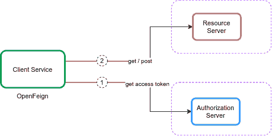
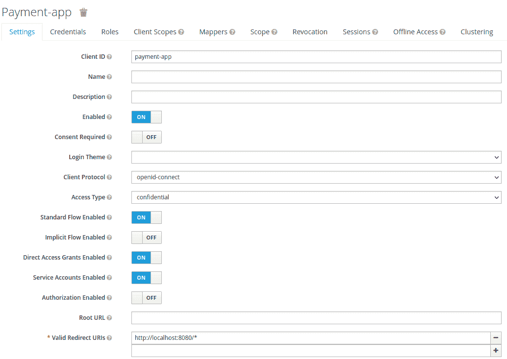

# 向一个假装的客户端提供一个 OAuth2 令牌

> 原文:[https://web . archive . org/web/20220930061024/https://www . bael dung . com/spring-cloud-feign-oauth-token](https://web.archive.org/web/20220930061024/https://www.baeldung.com/spring-cloud-feign-oauth-token)

 

It’s just plain hard to get true, **real-time visibility into a running auth flow.**

Parts of the process can be completely hidden from us; if the complete authorization process requires a redirect from a remote OAuth production server, then every debugging effort must go through the production server.

It’s practically unfeasible to debug this locally. There’s no way to reproduce the exact state and no way to inspect what is actually happening under the hood. Not ideal.

Knowing these types of challenges, we built Lightrun - a real-time production debugging tool - to allow you to understand complicated flows with code-level information. Add logs, take snapshots (virtual breakpoints), and instrument metrics without a remote debugger, without stopping the running service, and, most importantly - **in real-time and without side effects**.

**Learn more with this 5-minute tutorial** focused on debugging these kinds of scenarios using Lightrun:

[>> Debugging Authentication and Authorization Using Lightrun](/web/20220524065125/https://www.baeldung.com/lightrun-n-security)

## 1.概观

OpenFeign 是一个声明式 REST 客户端，我们可以在 T2 Spring Boot T3 应用程序中使用。假设我们有一个使用 OAuth2 保护的 [REST API，我们想使用 OpenFeign 调用它。在这种情况下，我们需要用 OpenFeign 提供一个访问令牌。](/web/20220524065125/https://www.baeldung.com/spring-security-oauth-resource-server)

在本教程中，我们将描述**如何向 OpenFeign 客户端**添加 OAuth2 支持。

## 2.服务对服务认证

服务到服务认证是 API 安全中的一个热门话题。我们可以使用 [mTLS](/web/20220524065125/https://www.baeldung.com/spring-tls-setup) 或 [JWT](/web/20220524065125/https://www.baeldung.com/spring-security-oauth-jwt) 为 REST API 提供认证机制。然而，**oauth 2 协议是保护 API**的实际解决方案。假设我们想使用另一个服务(客户机角色)调用一个安全服务(服务器角色)。在这个场景中，我们使用[客户端凭证](https://web.archive.org/web/20220524065125/https://datatracker.ietf.org/doc/html/rfc6749#section-1.3.4)授权类型。我们通常使用**客户端凭证在两个 API**或没有最终用户的系统之间进行认证。下图显示了该赠款类型的主要参与者:

[](/web/20220524065125/https://www.baeldung.com/wp-content/uploads/2022/02/openfeign-client-credential1.png)

在客户端凭据中，客户端服务使用令牌端点从授权服务器获取访问令牌。然后，它使用访问令牌来访问受资源服务器保护的资源。资源服务器验证访问令牌，如果有效，则为请求提供服务。

### 2.1.授权服务器

让我们设置一个授权服务器来发布访问令牌。现在为了简单起见，我们将使用嵌入在 Spring Boot 应用程序中的 [Keycloak。让我们假设我们使用 GitHub](/web/20220524065125/https://www.baeldung.com/keycloak-embedded-in-spring-boot-app) 上可用的授权服务器项目[。首先，我们在嵌入式 Keycloak 服务器中定义领域`master`中的`payment-app`客户端:](https://web.archive.org/web/20220524065125/https://github.com/Baeldung/spring-security-oauth/tree/master/oauth-resource-server/authorization-server)

[](/web/20220524065125/https://www.baeldung.com/wp-content/uploads/2022/02/openfeign-payment_client1.png)

我们将`Access Type`设置为`credential `，并启用`Service Accounts Enabled`选项。然后，我们将领域细节导出为`feign-realm.json`，并在我们的`application-feign.yml`中设置领域文件:

```
keycloak:
  server:
    contextPath: /auth
    adminUser:
      username: bael-admin
      password: pass
    realmImportFile: feign-realm.json 
```

现在，授权服务器准备好了。最后，我们可以使用`–spring.profiles.active=feign`选项运行应用程序。因为我们在本教程中关注的是 OpenFeign OAuth2 支持，所以我们不需要深入研究它。

### 2.2.资源服务器

**现在我们已经配置了授权服务器，让我们设置资源服务器`.`** 为此，我们将使用 GitHub 上可用的资源服务器项目[。首先，我们添加`Payment`类作为资源:](https://web.archive.org/web/20220524065125/https://github.com/Baeldung/spring-security-oauth/tree/master/oauth-resource-server/resource-server-jwt)

```
public class Payment {

    private String id;
    private double amount;

   // standard getters and setters
} 
```

然后，我们在`PaymentController`类中声明一个 API:

```
@RestController
public class PaymentController {

    @GetMapping("/payments")
    public List<Payment> getPayments() {
        List<Payment> payments = new ArrayList<>();
        for(int i = 1; i < 6; i++){
            Payment payment = new Payment();
            payment.setId(String.valueOf(i));
            payment.setAmount(2);
            payments.add(payment);
        }
        return payments;
    }

}
```

API 返回一个支付列表。此外，我们在我们的`application-feign.yml`文件中配置资源服务器:

```
spring:
  security:
    oauth2:
      resourceserver:
        jwt:
          issuer-uri: http://localhost:8083/auth/realms/master
```

现在，`getPayments()` API 使用 OAuth2 授权服务器是安全的，我们必须为调用这个 API 提供有效的访问令牌:

```
curl --location --request POST 'http://localhost:8083/auth/realms/master/protocol/openid-connect/token' \
  --header 'Content-Type: application/x-www-form-urlencoded' \
  --data-urlencode 'client_id=payment-app' \
  --data-urlencode 'client_secret=863e9de4-33d4-4471-b35e-f8d2434385bb' \
  --data-urlencode 'grant_type=client_credentials'
```

获得访问令牌后，我们将它设置在请求的`Authorization`头中:

```
curl --location --request GET 'http://localhost:8081/resource-server-jwt/payments' \
  --header 'Authorization: Bearer Access_Token' 
```

现在，我们想使用 OpenFeign 来调用安全 API，而不是使用 [cURL](/web/20220524065125/https://www.baeldung.com/curl-rest) 或 [Postman](/web/20220524065125/https://www.baeldung.com/postman-testing-collections) 。

## 3.OpenFeign 客户端

### 3.1.属国

要使用 Spring Cloud OpenFeign 调用安全 API，我们需要将 [`spring-cloud-starter-openfeign`](https://web.archive.org/web/20220524065125/https://search.maven.org/search?q=g:org.springframework.cloud%20AND%20a:spring-cloud-starter-openfeign) 添加到我们的`pom.xml`文件中:

```
<dependency>
    <groupId>org.springframework.cloud</groupId>
    <artifactId>spring-cloud-starter-openfeign</artifactId>
    <version>3.1.0</version>
</dependency>
```

另外，我们需要将 [`spring-cloud-dependencies`](https://web.archive.org/web/20220524065125/https://search.maven.org/search?q=g:org.springframework.cloud%20AND%20a:spring-cloud-dependencies) 添加到`pom.xml`中:

```
<dependency>
    <groupId>org.springframework.cloud</groupId>
    <artifactId>spring-cloud-dependencies</artifactId>
    <version>2021.0.0</version>
    <type>pom</type>
</dependency>
```

### 3.2.配置

首先，我们需要将 [`@EnableFeignClients`](/web/20220524065125/https://www.baeldung.com/spring-cloud-openfeign#client) 添加到我们的主类中:

```
@SpringBootApplication
@EnableFeignClients
public class ExampleApplication {
    public static void main(String[] args) {
        SpringApplication.run(ExampleApplication.class, args);
    }
} 
```

然后，我们定义调用`getPayments()` API 的`PaymentClient`接口。此外，我们需要将`[@FeignClient](/web/20220524065125/https://www.baeldung.com/spring-cloud-openfeign#client)`添加到我们的`PaymentClient`接口中:

```
@FeignClient(
  name = "payment-client", 
  url = "http://localhost:8081/resource-server-jwt", 
  configuration = OAuthFeignConfig.class)
public interface PaymentClient {

    @RequestMapping(value = "/payments", method = RequestMethod.GET)
    List<Payment> getPayments();
} 
```

我们根据资源服务器的地址设置`url`。在这种情况下，`@FeignClient`的主要参数是支持 OpenFeign 的 OAuth2 的`configuration`属性。之后，我们定义了一个`PaymentController`类，并将`PaymentClient`注入其中:

```
@RestController
public class PaymentController {

    private final PaymentClient paymentClient;

    public PaymentController(PaymentClient paymentClient) {
        this.paymentClient = paymentClient;
    }

    @GetMapping("/payments")
    public List<Payment> getPayments() {
        List<Payment> payments = paymentClient.getPayments();
        return payments;
    }
}
```

## 4.OAuth2 支持

### 4.1.属国

要将 OAuth2 支持添加到 Spring Cloud OpenFeign，我们需要将 [`spring-security-oauth2-client`](https://web.archive.org/web/20220524065125/https://search.maven.org/search?q=g:org.springframework.security%20AND%20a:spring-security-oauth2-client) 和 [`spring-boot-starter-security`](https://web.archive.org/web/20220524065125/https://search.maven.org/search?q=g:org.springframework.boot%20AND%20a:spring-boot-starter-security) 添加到我们的`pom.xml`文件中:

```
<dependency>
    <groupId>org.springframework.boot</groupId>
    <artifactId>spring-boot-starter-security</artifactId>
    <version>2.6.1</version>
</dependency>
<dependency>
    <groupId>org.springframework.security</groupId>
    <artifactId>spring-security-oauth2-client</artifactId>
    <version>5.6.0</version>
</dependency>
```

### 4.2.配置

现在，我们想要创建一个配置。**这个想法是获取一个访问令牌并将其添加到 OpenFeign 请求中。** **拦截器可以为每个 HTTP 请求/响应执行这个任务**。添加拦截器是 Feign 提供的一个有用的特性。**我们将使用一个 [`RequestInterceptor`](/web/20220524065125/https://www.baeldung.com/spring-cloud-openfeign#1-implementing-requestinterceptor) ，它通过添加一个授权承载头将 OAuth2 访问令牌注入到 OpenFeign 客户端**的请求中。让我们定义`OAuthFeignConfig`配置类并定义`requestInterceptor()` bean:

```
@Configuration
public class OAuthFeignConfig {

    public static final String CLIENT_REGISTRATION_ID = "keycloak";

    private final OAuth2AuthorizedClientService oAuth2AuthorizedClientService;
    private final ClientRegistrationRepository clientRegistrationRepository;

    public OAuthFeignConfig(OAuth2AuthorizedClientService oAuth2AuthorizedClientService,
      ClientRegistrationRepository clientRegistrationRepository) {
        this.oAuth2AuthorizedClientService = oAuth2AuthorizedClientService;
        this.clientRegistrationRepository = clientRegistrationRepository;
    }

    @Bean
    public RequestInterceptor requestInterceptor() {
        ClientRegistration clientRegistration = clientRegistrationRepository.findByRegistrationId(CLIENT_REGISTRATION_ID);
        OAuthClientCredentialsFeignManager clientCredentialsFeignManager =
          new OAuthClientCredentialsFeignManager(authorizedClientManager(), clientRegistration);
        return requestTemplate -> {
            requestTemplate.header("Authorization", "Bearer " + clientCredentialsFeignManager.getAccessToken());
        };
    }
}
```

在`requestInterceptor()` bean 中，我们使用`ClientRegistration`和`OAuthClientCredentialsFeignManager`类来注册 oauth2 客户端并从授权服务器获取访问令牌。为此，我们需要在我们的`application.properties`文件中定义`oauth2`客户端属性:

```
spring.security.oauth2.client.registration.keycloak.authorization-grant-type=client_credentials
spring.security.oauth2.client.registration.keycloak.client-id=payment-app
spring.security.oauth2.client.registration.keycloak.client-secret=863e9de4-33d4-4471-b35e-f8d2434385bb
spring.security.oauth2.client.provider.keycloak.token-uri=http://localhost:8083/auth/realms/master/protocol/openid-connect/token
```

让我们创建`OAuthClientCredentialsFeignManager`类并定义`getAccessToken()`方法:

```
public String getAccessToken() {
    try {
        OAuth2AuthorizeRequest oAuth2AuthorizeRequest = OAuth2AuthorizeRequest
          .withClientRegistrationId(clientRegistration.getRegistrationId())
          .principal(principal)
          .build();
        OAuth2AuthorizedClient client = manager.authorize(oAuth2AuthorizeRequest);
        if (isNull(client)) {
            throw new IllegalStateException("client credentials flow on " + clientRegistration.getRegistrationId() + " failed, client is null");
        }
        return client.getAccessToken().getTokenValue();
    } catch (Exception exp) {
        logger.error("client credentials error " + exp.getMessage());
    }
    return null;
}
```

我们使用`OAuth2AuthorizeRequest`和`OAuth2AuthorizedClient`类从授权服务器获取访问令牌。**现在，对于每个请求，OpenFeign 拦截器管理 oauth2 客户端并向请求添加访问令牌。**

## 5.试验

为了测试 OpenFeign 客户端，让我们创建`PaymentClientUnitTest`类:

```
@RunWith(SpringRunner.class)
@SpringBootTest
public class PaymentClientUnitTest {

    @Autowired
    private PaymentClient paymentClient;

    @Test
    public void whenGetPayment_thenListPayments() {
        List<Payment> payments = paymentClient.getPayments();
        assertFalse(payments.isEmpty());
    }
} 
```

在这个测试中，我们调用了`getPayments()` API。幕后的`PaymentClient`连接到 OAuth2 客户机，并使用拦截器获得一个访问令牌。

## 6.结论

在本文中，我们设置了调用安全 API 所需的环境。然后，我们通过一个实例配置 OpenFeign 来调用安全 API。为此，我们将拦截器添加并配置为 OpenFeign。拦截器管理 OAuth2 客户机，并将访问令牌添加到请求中。

和往常一样，本教程的完整源代码可以在 GitHub 上找到。此外，在 GitHub 上可以获得资源和授权服务器源代码[。](https://web.archive.org/web/20220524065125/https://github.com/Baeldung/spring-security-oauth/tree/master/oauth-resource-server)