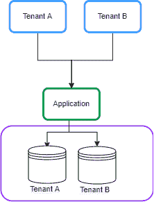
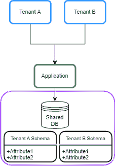
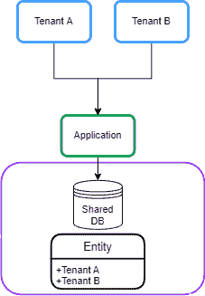
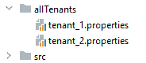
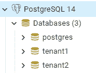
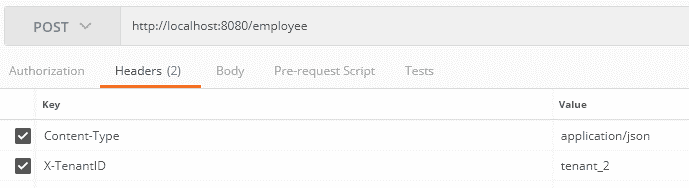
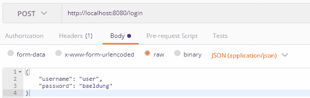
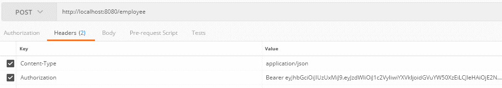

# 具有 Spring 数据的多租户 JPA

> 原文：<https://web.archive.org/web/20220930061024/https://www.baeldung.com/multitenancy-with-spring-data-jpa>

## 1.概观

多租户指的是一种架构，其中一个软件应用程序的单个实例服务于多个租户或客户。

它支持租户之间所需的隔离程度，以便租户使用的数据和资源与其他租户分开。

在本教程中，我们将了解如何使用 Spring Data JPA 在 Spring Boot 应用程序中配置多租户。此外，我们使用 [JWT](/web/20221016180342/https://www.baeldung.com/java-json-web-tokens-jjwt#JWT) 为租户增加安全性。

## 2.多租户模型

多租户系统有三种主要方法:

*   独立数据库
*   共享数据库和独立模式
*   共享数据库和共享模式

### 2.1.独立数据库

在这种方法中，每个租户的数据都保存在单独的数据库实例中，并与其他租户隔离。这也被称为`Database per Tenant`:

[](/web/20221016180342/https://www.baeldung.com/wp-content/uploads/2022/08/database_per_tenant.png)

### 2.2.共享数据库和独立模式

在这种方法中，每个租户的数据都保存在共享数据库的不同模式中。这有时被称为`Schema per Tenant`:

[](/web/20221016180342/https://www.baeldung.com/wp-content/uploads/2022/08/separate_schema.png)

### 2.3.共享数据库和共享模式

在这种方法中，所有租户共享一个数据库，每个表都有一个包含租户标识符的列:

[](/web/20221016180342/https://www.baeldung.com/wp-content/uploads/2022/08/shareddatabase.png)

## 3.Maven 依赖性

让我们从在 Spring Boot 应用程序的`pom.xml`中声明 [`spring-boot-starter-data-jpa`](https://web.archive.org/web/20221016180342/https://search.maven.org/search?q=a:spring-boot-starter-data-jpa) 依赖关系开始:

```
<dependency>
    <groupId>org.springframework.boot</groupId>
    <artifactId>spring-boot-starter-data-jpa</artifactId>
</dependency>
```

此外，我们将使用一个`PostgreSQL`数据库，所以我们也将 [`postgresql`](https://web.archive.org/web/20221016180342/https://search.maven.org/search?q=g:org.postgresql%20%26%20a:postgresql) 依赖项添加到`pom.xml`文件中:

```
<dependency>
    <groupId>org.postgresql</groupId>
    <artifactId>postgresql</artifactId>
    <scope>runtime</scope>
</dependency>
```

独立数据库、共享数据库和独立模式方法在 Spring Boot 应用程序中的配置是相似的。在本教程中，**我们主要关注独立的数据库方法**。

## 4.动态`DataSource`路由

在这一节中，我们将描述`Database per Tenant`模型背后的一般思想。

### 4.1.`AbstractRoutingDataSource`

使用 Spring Data JPA 实现多租户的一般思想是**在运行时基于当前租户标识符路由数据源。**

为此，我们可以使用 [`AbstractRoutingDatasource`](/web/20221016180342/https://www.baeldung.com/spring-abstract-routing-data-source) 作为根据当前租户动态确定实际`DataSource`的方法。

让我们创建一个扩展了`AbstractRoutingDataSource`类的`MultitenantDataSource `类:

```
public class MultitenantDataSource extends AbstractRoutingDataSource {

    @Override
    protected String determineCurrentLookupKey() {
        return TenantContext.getCurrentTenant();
    }
}
```

`AbstractRoutingDataSource`根据查找关键字将`getConnection`呼叫路由到不同目标`DataSources`中的一个。

查找键通常通过一些线程绑定的事务上下文来确定。因此，**我们创建了一个`TenantContext `类来存储每个请求**中的当前租户:

```
public class TenantContext {

    private static final ThreadLocal<String> CURRENT_TENANT = new ThreadLocal<>();

    public static String getCurrentTenant() {
        return CURRENT_TENANT.get();
    }

    public static void setCurrentTenant(String tenant) {
        CURRENT_TENANT.set(tenant);
    }
}
```

我们使用一个 [`ThreadLocal`](/web/20221016180342/https://www.baeldung.com/java-threadlocal) 对象来保存当前请求的租户 ID。此外，我们使用`set`方法存储租户 ID，使用`get()`方法检索它。

### 4.2.为每个请求设置租户 ID

在这个配置设置之后，**当我们执行任何租户操作时，我们需要在创建任何事务之前知道租户 ID**。所以，我们需要在到达控制器端点之前，在 [`Filter`](/web/20221016180342/https://www.baeldung.com/spring-boot-add-filter) 或 [`Interceptor`](/web/20221016180342/https://www.baeldung.com/spring-mvc-handlerinterceptor) 中设置租户 ID。

让我们在`TenantContext`中添加一个用于设置当前租户的`TenantFilter `:

```
@Component
@Order(1)
class TenantFilter implements Filter {

    @Override
    public void doFilter(ServletRequest request, ServletResponse response,
      FilterChain chain) throws IOException, ServletException {

        HttpServletRequest req = (HttpServletRequest) request;
        String tenantName = req.getHeader("X-TenantID");
        TenantContext.setCurrentTenant(tenantName);

        try {
            chain.doFilter(request, response);
        } finally {
            TenantContext.setCurrentTenant("");
        }

    }
}
```

在这个过滤器中，我们从请求头`X-TenantID `中获取租户 ID，并将其设置在`TenantContext`中。我们通过过滤器链传递控制。我们的`finally`块确保当前租户在下一次请求前被重置。这避免了任何跨租户请求污染的风险。

在下一节中，我们将在`Database per Tenant`模型中实现租户和数据源声明。

## 5.数据库方法

在本节中，我们将基于`Database per Tenant`模型实现多租户。

### 5.1.租户声明

在这种方法中，我们有多个数据库，所以我们需要在 Spring Boot 应用程序中声明多个数据源。

我们可以在单独的租户文件中配置`DataSources`。因此，我们在`allTenants`目录下创建`tenant_1.properties `文件，并声明租户的数据源:

```
name=tenant_1
datasource.url=jdbc:postgresql://localhost:5432/tenant1
datasource.username=postgres
datasource.password=123456
datasource.driver-class-name=org.postgresql.Driver
```

此外，我们为另一个租户创建了一个`tenant_2.properties`文件:

```
name=tenant_2
datasource.url=jdbc:postgresql://localhost:5432/tenant2
datasource.username=postgres
datasource.password=123456
datasource.driver-class-name=org.postgresql.Driver
```

我们将为每个租户创建一个文件:

[](/web/20221016180342/https://www.baeldung.com/wp-content/uploads/2022/08/tenants.png)

### 5.2.`DataSource`声明

现在我们需要**读取租户的数据，并使用`DataSourceBuilder`** 类**创建`DataSource`。另外，我们在`AbstractRoutingDataSource`类中设置了`DataSources`。**

让我们为此添加一个`MultitenantConfiguration`类:

```
@Configuration
public class MultitenantConfiguration {

    @Value("${defaultTenant}")
    private String defaultTenant;

    @Bean
    @ConfigurationProperties(prefix = "tenants")
    public DataSource dataSource() {
        File[] files = Paths.get("allTenants").toFile().listFiles();
        Map<Object, Object> resolvedDataSources = new HashMap<>();

        for (File propertyFile : files) {
            Properties tenantProperties = new Properties();
            DataSourceBuilder dataSourceBuilder = DataSourceBuilder.create();

            try {
                tenantProperties.load(new FileInputStream(propertyFile));
                String tenantId = tenantProperties.getProperty("name");

                dataSourceBuilder.driverClassName(tenantProperties.getProperty("datasource.driver-class-name"));
                dataSourceBuilder.username(tenantProperties.getProperty("datasource.username"));
                dataSourceBuilder.password(tenantProperties.getProperty("datasource.password"));
                dataSourceBuilder.url(tenantProperties.getProperty("datasource.url"));
                resolvedDataSources.put(tenantId, dataSourceBuilder.build());
            } catch (IOException exp) {
                throw new RuntimeException("Problem in tenant datasource:" + exp);
            }
        }

        AbstractRoutingDataSource dataSource = new MultitenantDataSource();
        dataSource.setDefaultTargetDataSource(resolvedDataSources.get(defaultTenant));
        dataSource.setTargetDataSources(resolvedDataSources);

        dataSource.afterPropertiesSet();
        return dataSource;
    }

}
```

首先，我们从`allTenants`目录中读取租户的定义，并使用`DataSourceBuilder `类创建`DataSource ` bean。之后，我们需要为`MultitenantDataSource`类设置一个默认数据源和目标数据源，分别使用`setDefaultTargetDataSource`和`setTargetDataSources`连接。我们使用`defaultTenant`属性从`application.properties`文件中设置一个租户的名字作为默认数据源。为了完成数据源的初始化，我们调用了`afterPropertiesSet()`方法。

现在我们的设置已经准备好了。

## 6.试验

### 6.1.为租户创建数据库

首先，我们需要在`PostgreSQL:`中定义两个数据库

[](/web/20221016180342/https://www.baeldung.com/wp-content/uploads/2022/08/tenants-db.png)

之后，我们使用下面的脚本在每个数据库中创建一个`employee`表:

```
create table employee (id int8 generated by default as identity, name varchar(255), primary key (id));
```

### 6.2.样本控制器

让我们创建一个`EmployeeController `类，用于在请求头中的指定租户中创建和保存`Employee`实体:

```
@RestController
@Transactional
public class EmployeeController {

    @Autowired
    private EmployeeRepository employeeRepository;

    @PostMapping(path = "/employee")
    public ResponseEntity<?> createEmployee() {
        Employee newEmployee = new Employee();
        newEmployee.setName("Baeldung");
        employeeRepository.save(newEmployee);
        return ResponseEntity.ok(newEmployee);
    }
} 
```

### 6.3.样品申请

让我们创建一个 post 请求，使用[邮递员](/web/20221016180342/https://www.baeldung.com/postman-testing-collections)在租户 ID `tenant_1`中插入一个`employee`实体:

[](/web/20221016180342/https://www.baeldung.com/wp-content/uploads/2022/08/tenant_1.png)

此外，我们向`tenant_2`发送请求:

[](/web/20221016180342/https://www.baeldung.com/wp-content/uploads/2022/08/tenant2.png)

之后，当我们检查数据库时，我们看到每个请求都保存在相关租户的数据库中。

## 7.安全性

多租户应该在共享环境中保护客户的数据。这意味着每个租户只能访问他们的数据。因此，我们需要为我们的租户增加安全性。让我们构建一个系统，用户必须登录到应用程序并**获得一个 JWT，然后用它来证明访问租赁的权利。**

### 7.1.Maven 依赖性

让我们从在`pom.xml`中添加 [`spring-boot-starter-security`](https://web.archive.org/web/20221016180342/https://search.maven.org/search?q=a:spring-boot-starter-security) 依赖项开始:

```
<dependency>
    <groupId>org.springframework.boot</groupId>
    <artifactId>spring-boot-starter-security</artifactId>
</dependency>
```

此外，我们需要生成并验证 JWT。为此，我们将 [`jjwt`](https://web.archive.org/web/20221016180342/https://search.maven.org/search?q=a:jjwt) 添加到我们的`pom.xml`:

```
<dependency>
    <groupId>io.jsonwebtoken</groupId>
    <artifactId>jjwt</artifactId>
    <version>0.9.1</version>
</dependency>
```

### 7.2.安全配置

首先，我们需要为租户的用户提供身份验证功能。为了简单起见，让我们使用`SecurityConfiguration`类中的内存用户声明:

```
@Override
protected void configure(AuthenticationManagerBuilder auth) throws Exception {
    auth.inMemoryAuthentication()
      .passwordEncoder(passwordEncoder())
      .withUser("user")
      .password(passwordEncoder().encode("baeldung"))
      .roles("tenant_1");

    auth.inMemoryAuthentication()
      .passwordEncoder(passwordEncoder())
      .withUser("admin")
      .password(passwordEncoder().encode("baeldung"))
      .roles("tenant_2");
}
```

我们为两个租户添加了两个用户。此外，我们认为租户是一个角色。根据上面的代码，用户名`user`和`admin`分别可以访问`tenant_1`和`tenant_2`。

现在，我们为用户身份验证创建一个过滤器。让我们添加`LoginFilter`类:

```
public class LoginFilter extends AbstractAuthenticationProcessingFilter {

    public LoginFilter(String url, AuthenticationManager authManager) {
        super(new AntPathRequestMatcher(url));
        setAuthenticationManager(authManager);
    }

    @Override
    public Authentication attemptAuthentication(HttpServletRequest req, HttpServletResponse res)
      throws AuthenticationException, IOException, ServletException {

        AccountCredentials creds = new ObjectMapper().
          readValue(req.getInputStream(), AccountCredentials.class);

        return getAuthenticationManager().authenticate(
          new UsernamePasswordAuthenticationToken(creds.getUsername(),
            creds.getPassword(), Collections.emptyList())
        );
    }
```

`LoginFilter`类扩展了`AbstractAuthenticationProcessingFilter`。`AbstractAuthenticationProcessingFilter` 拦截一个请求，并尝试使用`attemptAuthentication()`方法执行认证。在这个方法中，我们将用户凭证映射到`AccountCredentials` [DTO](/web/20221016180342/https://www.baeldung.com/java-dto-pattern) 类，并根据内存中的身份验证管理器对用户进行身份验证:

```
public class AccountCredentials {

    private String username;
    private String password;

   // getter and setter methods
}
```

### 7.3.JWT

现在我们需要生成 JWT 并添加租户 ID。为了做到这一点，我们重写了`successfulAuthentication()`方法。此方法在成功认证后执行:

```
@Override
protected void successfulAuthentication(HttpServletRequest req, HttpServletResponse res,
  FilterChain chain, Authentication auth) throws IOException, ServletException {

    Collection<? extends GrantedAuthority> authorities = auth.getAuthorities();
    String tenant = "";
    for (GrantedAuthority gauth : authorities) {
        tenant = gauth.getAuthority();
    }

    AuthenticationService.addToken(res, auth.getName(), tenant.substring(5));
}
```

根据上面的代码，我们得到用户的角色，并将其添加到 JWT。为此，我们创建了`AuthenticationService`类和`addToken()`方法:

```
public class AuthenticationService {

    private static final long EXPIRATIONTIME = 864_000_00; // 1 day in milliseconds
    private static final String SIGNINGKEY = "SecretKey";
    private static final String PREFIX = "Bearer";

    public static void addToken(HttpServletResponse res, String username, String tenant) {
        String JwtToken = Jwts.builder().setSubject(username)
          .setAudience(tenant)
          .setExpiration(new Date(System.currentTimeMillis() + EXPIRATIONTIME))
          .signWith(SignatureAlgorithm.HS512, SIGNINGKEY)
          .compact();
        res.addHeader("Authorization", PREFIX + " " + JwtToken);
    }
```

`addToken`方法生成包含租户 ID 的 JWT 作为`audience`声明，并将其添加到响应的`Authorization`头中。

最后，我们将`LoginFilter`添加到`SecurityConfiguration` 类中:

```
@Override
protected void configure(HttpSecurity http) throws Exception {
    http
      .authorizeRequests()
      .antMatchers("/login").permitAll()
      .anyRequest().authenticated()
      .and()
      .sessionManagement()
      .sessionCreationPolicy(SessionCreationPolicy.STATELESS)
      .and()
      .addFilterBefore(new LoginFilter("/login", authenticationManager()),
        UsernamePasswordAuthenticationFilter.class)
      .addFilterBefore(new AuthenticationFilter(),
        UsernamePasswordAuthenticationFilter.class)
      .csrf().disable()
      .headers().frameOptions().disable()
      .and()
      .httpBasic();
}
```

此外，我们添加了`AuthenticationFilter `类，用于在`SecurityContextHolder` 类中设置`Authentication`:

```
public class AuthenticationFilter extends GenericFilterBean {

    @Override
    public void doFilter(ServletRequest req, ServletResponse res, FilterChain chain)
      throws IOException, ServletException {

        Authentication authentication = AuthenticationService.getAuthentication((HttpServletRequest) req);
        SecurityContextHolder.getContext().setAuthentication(authentication);

        chain.doFilter(req, res);
    }
}
```

### 7.4.从 JWT 获取租户 ID

让我们修改`TenantContext`中设置当前租户的`TenantFilter`:

```
String tenant = AuthenticationService.getTenant((HttpServletRequest) req);
TenantContext.setCurrentTenant(tenant);
```

在这种情况下，我们使用来自`AuthenticationService` 类的`getTenant()` 方法从 JWT 获取租户 ID:

```
public static String getTenant(HttpServletRequest req) {
    String token = req.getHeader("Authorization");
    if (token == null) {
        return null;
    }
    String tenant = Jwts.parser()
      .setSigningKey(SIGNINGKEY)
      .parseClaimsJws(token.replace(PREFIX, ""))
      .getBody()
      .getAudience();
    return tenant;
}
```

## 8.安全测试

### 8.1.JWT 一代

让我们为用户名`user`生成 JWT。为此，我们将凭证发布到`/login`端点:

[](/web/20221016180342/https://www.baeldung.com/wp-content/uploads/2022/08/jwt.png)

让我们检查一下令牌:

```
eyJhbGciOiJIUzUxMiJ9.eyJzdWIiOiJ1c2VyIiwiYXVkIjoidGVuYW50XzEiLCJleHAiOjE2NTk2MDk1Njd9.
```

当我们[解码令牌](https://web.archive.org/web/20221016180342/https://jwt.io/)时，我们发现租户 ID 设置为`audience` 声明:

```
{
    alg: "HS512"
}.
{
    sub: "user",
    aud: "tenant_1",
    exp: 1659609567
}.
```

### 8.2.样品申请

让我们创建一个 post 请求，使用生成的令牌插入一个`employee`实体:

[](/web/20221016180342/https://www.baeldung.com/wp-content/uploads/2022/08/tenant_1_jwt.png)

我们在`Authorization`头中设置生成的令牌。租户 ID 已经从令牌中提取出来，并设置在`TenantContext`中。

## 9.结论

在本文中，我们研究了不同的多租户模型。

我们描述了在 Spring Boot 应用程序中使用 Spring Data JPA 为单独的数据库、共享数据库和单独的模式模型添加多租户所需的类。

然后，我们在 PostgreSQL 数据库中设置测试多租户所需的环境。

最后，我们为使用 JWT 的租户增加了安全性。

和往常一样，本教程的完整源代码可以在 GitHub 上的[处获得。](https://web.archive.org/web/20221016180342/https://github.com/eugenp/tutorials/tree/master/persistence-modules/spring-jpa-2)