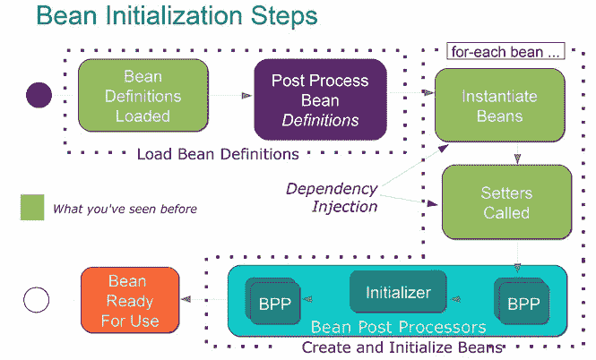

# 顶级 Spring 框架面试问题

> 原文:[https://web . archive . org/web/20220930061024/https://www . bael dung . com/spring-interview-questions](https://web.archive.org/web/20220930061024/https://www.baeldung.com/spring-interview-questions)

[This article is part of a series:](javascript:void(0);)[• Java Collections Interview Questions](/web/20220926181807/https://www.baeldung.com/java-collections-interview-questions)
[• Java Type System Interview Questions](/web/20220926181807/https://www.baeldung.com/java-type-system-interview-questions)
[• Java Concurrency Interview Questions (+ Answers)](/web/20220926181807/https://www.baeldung.com/java-concurrency-interview-questions)
[• Java Class Structure and Initialization Interview Questions](/web/20220926181807/https://www.baeldung.com/java-classes-initialization-questions)
[• Java 8 Interview Questions(+ Answers)](/web/20220926181807/https://www.baeldung.com/java-8-interview-questions)
[• Memory Management in Java Interview Questions (+Answers)](/web/20220926181807/https://www.baeldung.com/java-memory-management-interview-questions)
[• Java Generics Interview Questions (+Answers)](/web/20220926181807/https://www.baeldung.com/java-generics-interview-questions)
[• Java Flow Control Interview Questions (+ Answers)](/web/20220926181807/https://www.baeldung.com/java-flow-control-interview-questions)
[• Java Exceptions Interview Questions (+ Answers)](/web/20220926181807/https://www.baeldung.com/java-exceptions-interview-questions)
[• Java Annotations Interview Questions (+ Answers)](/web/20220926181807/https://www.baeldung.com/java-annotations-interview-questions)
• Top Spring Framework Interview Questions (current article)

**目录**

*   [**1。**概述](#introduction)
*   [**2。**弹簧芯](#spring-core)
*   [**Q1。**什么是 Spring 框架？](#Q1)
*   [**Q2。**使用 Spring 有什么好处？](#Q2)
*   [**Q3。**你知道哪些春天子项目？简单描述一下。](#Q3)
*   [**Q4。**什么是依赖注入？](#Q4)
*   [**Q5。**春天怎么才能注射豆子？](#Q5)
*   **[Q6。](#Q6)** [哪种方式注射豆子最好，为什么？](#Q6)
*   [**Q7。【BeanFactory 和 ApplicationContext 有什么区别？**](#Q7)
*   [**Q8。**什么是春豆？](#Q8)
*   [**Q9。**Spring 框架中默认的 Bean 作用域是什么？](#Q9)
*   **[Q10。](#Q10)** [如何定义比恩的范围？](#Q10)
*   [**Q11。【Singleton Beans 是线程安全的吗？**](#Q11)
*   [**Q12。**春豆的生命周期是什么样子的？](#Q12)
*   [**Q13。**Spring 基于 Java 的配置是什么？](#Q13)
*   [**Q14。**我们可以在一个项目中拥有多个 Spring 配置文件吗？](#Q14)
*   [**Q15。**什么是春安？](#Q15)
*   [**Q16。**什么是 Spring Boot？](#Q16)
*   [**Q17。**说出一些在 Spring 框架中使用的设计模式？](#Q17)
*   [**Q18。**范围原型是如何工作的？](#Q18)

*   [**3。** Spring Web MVC](#spring-web-MVC)
*   [**Q19。**如何在 Spring Bean 中获取 ServletContext 和 ServletConfig 对象？](#Q19)
*   [**Q20。**Spring MVC 中的控制器是什么？](#Q20)
*   [**Q21。**@ request mapping 注释是如何工作的？](#Q21)

*   [**4。**春季数据访问](#spring-data-access)
*   [**Q22。**什么是 Spring Jdbctemplate 类，如何使用？](#Q22)
*   [**Q23。**如何在 Spring 中启用事务，它们有什么好处？](#Q23)
*   [**Q24。**什么是春刀？](#Q24)

*   [**5。** Spring 面向方面编程(AOP)](#spring-aspect-oriented-programming)
*   [**Q25。**什么是面向方面编程？](#Q25)
*   [**Q26。**AOP 中的方面、建议、切入点和连接点是什么？](#Q26)
*   [**Q27。**什么是编织？](#Q27)

*   [**6。**第五春](#spring-5)
*   [**Q28。**什么是反应式编程？](#Q28)
*   [**Q29。**什么是 Spring WebFlux？](#Q29)
*   [**Q30。**什么是单声道和通量类型？](#Q30)
*   [**Q31。**WebClient 和 WebTestClient 有什么用？](#Q31)
*   [**Q32。**使用反应流的缺点是什么？](#Q32)
*   [**Q33。**Spring 5 兼容旧版本的 Java 吗？](#Q33)
*   [**Q34。**Ow Spring 5 如何与 JDK 9 模块化整合？](#Q34)
*   [**Q35。**我们可以在同一个应用程序中同时使用 Web MVC 和 WebFlux 吗？](#Q35)

*   [**7。**结论](#conclusion)

## **1。概述**

在本教程中，我们将探讨一些在求职面试中最常见的与春天有关的问题。

## 延伸阅读:

## [Java 面试问题](/web/20220926181807/https://www.baeldung.com/java-interview-questions)

Learn the answers to common Java interview questions[Read more](/web/20220926181807/https://www.baeldung.com/java-interview-questions) →

## [Java 8 面试问题(+答案)](/web/20220926181807/https://www.baeldung.com/java-8-interview-questions)

A set of popular Java8-related interview questions and of course answers.[Read more](/web/20220926181807/https://www.baeldung.com/java-8-interview-questions) →

## [Java 集合面试问题](/web/20220926181807/https://www.baeldung.com/java-collections-interview-questions)

A set of practical Collections-related Java interview questions[Read more](/web/20220926181807/https://www.baeldung.com/java-collections-interview-questions) →

## 2.弹簧芯

### **Q1。什么是 Spring 框架？**

Spring 是 Java 企业版应用程序开发中使用最广泛的框架。此外，Spring 的核心特性可以用于开发任何 Java 应用程序。

我们使用它的扩展在 Jakarta EE 平台上构建各种 web 应用程序。我们也可以在简单的独立应用程序中使用它的依赖注入条款。

### **Q2。使用 Spring 有什么好处？**

Spring 目标是使 Jakarta EE 开发更容易，所以让我们来看看它的优点:

*   轻量级(Lightweight)——在开发中使用框架会有轻微的开销。
*   **控制反转(IoC)**–Spring 容器负责各种对象的连线依赖，而不是创建或寻找依赖对象。
*   **面向方面编程(AOP)**–Spring 支持 AOP 将业务逻辑与系统服务分离。
*   **IoC 容器**——管理 Spring Bean 生命周期和特定于项目的配置
*   **MVC 框架**–用于创建 web 应用程序或 RESTful web 服务，能够返回 XML/JSON 响应
*   **事务管理**–减少 JDBC 操作、文件上传等方面的样板代码数量。，要么通过使用 Java 注释，要么通过 Spring Bean XML 配置文件
*   **异常处理**–Spring 提供了一个方便的 API，用于将特定于技术的异常转换成未检查的异常。

### **Q3。你知道哪些春天子项目？简单描述一下。**

*   **核心**——提供框架基础部分的关键模块，如 IoC 或 DI
*   **JDBC**–启用 JDBC 抽象层，无需为特定供应商的数据库进行 JDBC 编码
*   ORM 集成为流行的对象关系映射 API 提供集成层，如 JPA、JDO 和 Hibernate
*   **web**–一个面向 Web 的集成模块，提供多部分文件上传、Servlet 监听器和面向 Web 的应用程序上下文功能
*   MVC 框架——一个实现模型视图控制器设计模式的 web 模块
*   AOP 模块–面向方面的编程实现，允许定义干净的方法拦截器和切入点

### **Q4。什么是依赖注入？**

依赖注入是控制反转(IoC)的一个方面，它是一个通用的概念，说明我们不是手动创建我们的对象，而是描述应该如何创建它们。如果需要，IoC 容器将实例化所需的类。

更多详情请看[这里](/web/20220926181807/https://www.baeldung.com/inversion-control-and-dependency-injection-in-spring)。

### **Q5。春天怎么才能注射豆子？**

为了注入 Spring beans，有几个不同的选项:

*   定型剂注射
*   构造函数注入
*   现场注射

可以使用 XML 文件或注释来完成配置。

更多详情，查看[本文](/web/20220926181807/https://www.baeldung.com/inversion-control-and-dependency-injection-in-spring)。

### **Q6。哪种注豆方式最好，为什么？**

推荐的方法是对强制依赖项使用构造函数参数，对可选依赖项使用 setters。这是因为构造函数注入允许向不可变字段注入值，并使测试更容易。

### **Q7。BeanFactory 和 ApplicationContext 有什么区别？**

`BeanFactory`是表示提供和管理 bean 实例的容器的接口。当调用`getBean()`时，默认实现会延迟实例化 beans。

相比之下，`ApplicationContext` 是一个接口，代表一个保存应用程序中所有信息、元数据和 beans 的容器。它还扩展了`BeanFactory`接口，但是默认实现在应用程序启动时急切地实例化 beans。但是，对于单个 beans，这种行为可以被覆盖。

有关所有差异，请参考[文档](https://web.archive.org/web/20220926181807/https://docs.spring.io/spring/docs/current/spring-framework-reference/html/beans.html)。

### **Q8。什么是春豆？**

Spring Beans 是由 Spring IoC 容器初始化的 Java 对象。

### **Q9。Spring 框架中默认的 Bean 作用域是什么？**

默认情况下，Spring Bean 被初始化为一个`singleton`。

### **Q10。如何定义一个 Bean 的作用域？**

为了设置 Spring Bean 的作用域，我们可以在 XML 配置文件中使用`@Scope`注释或“scope”属性。请注意，有五个受支持的范围:

*   **单个**
*   **原型**
*   **请求**
*   **会话**
*   **全球会议**

差异请看[这里](https://web.archive.org/web/20220926181807/https://docs.spring.io/spring/docs/3.0.0.M4/reference/html/ch03s05.html)。

### **Q11。单例 Beans 是线程安全的吗？**

不，singleton beans 不是线程安全的，因为线程安全是关于执行的，而 singleton 是一种专注于创建的设计模式。线程安全性只取决于 bean 实现本身。

### **Q12。春豆的生命周期是什么样的？**

首先，需要基于 Java 或 XML bean 定义实例化一个 Spring bean。可能还需要执行一些初始化，以使其进入可用状态。之后，当不再需要该 bean 时，它将从 IoC 容器中删除。

图像显示了所有初始化方法的整个循环([源](https://web.archive.org/web/20220926181807/http://www.dineshonjava.com/2012/07/bean-lifecycle-and-callbacks.html)):

[](/web/20220926181807/https://www.baeldung.com/wp-content/uploads/2017/06/Spring-Bean-Life-Cycle.jpg)

### **Q13。Spring 基于 Java 的配置是什么？**

这是以类型安全的方式配置基于 Spring 的应用程序的方法之一。这是基于 XML 的配置的替代方案。

另外，要将项目从 XML 迁移到 Java config，请参考本文中的[。](/web/20220926181807/https://www.baeldung.com/spring-xml-vs-java-config)

### **Q14。我们可以在一个项目中有多个 Spring 配置文件吗？**

是的，在大型项目中，推荐使用多种 Spring 配置来增加可维护性和模块化。

我们可以加载多个基于 Java 的配置文件:

```
@Configuration
@Import({MainConfig.class, SchedulerConfig.class})
public class AppConfig {
```

或者，我们可以加载一个包含所有其他配置的 XML 文件:

```
ApplicationContext context = new ClassPathXmlApplicationContext("spring-all.xml");
```

在这个 XML 文件中，我们将有以下内容:

```
<import resource="main.xml"/>
<import resource="scheduler.xml"/>
```

### **Q15。什么是春安？**

Spring Security 是 Spring 框架的一个独立模块，主要关注在 Java 应用程序中提供认证和授权方法。它还处理了大多数常见的安全漏洞，如 CSRF 攻击。

要在 web 应用程序中使用 Spring Security，我们可以从简单的注释`@EnableWebSecurity`开始。

要了解更多信息，我们有一系列与[安全](/web/20220926181807/https://www.baeldung.com/security-spring)相关的文章。

### **Q16。什么是 Spring Boot？**

Spring Boot 是一个项目，它提供了一组预配置的框架来减少样板配置。这样，我们可以用最少的代码创建并运行一个 Spring 应用程序。

### **Q17。说出 Spring 框架中使用的一些设计模式？**

*   **单例模式**–单例范围的 beans
*   **工厂模式**–Bean 工厂类
*   **原型模式**–原型范围的 beans
*   **适配器模式**–Spring Web 和 Spring MVC
*   **代理模式**–Spring 面向方面的编程支持
*   **模板方法模式**–`JdbcTemplate`、`HibernateTemplate`等。
*   **前控制器**–弹簧 MVC `DispatcherServlet`
*   **数据访问对象**-弹簧刀支持
*   **模型视图控制器**–Spring MVC

### **Q18。范围原型是如何工作的？**

Scope `prototype`意味着每次我们调用 Bean 的实例时，Spring 都会创建一个新的实例并返回它。这不同于默认的`singleton`作用域，在默认作用域中，每个 Spring IoC 容器实例化一次单个对象实例。

## **3。Spring Web MVC**

### **Q19。如何在一个 Spring Bean 中获取`ServletContext`和`ServletConfig`对象？**

我们可以通过实现支持 Spring 的接口来做到这一点。完整列表可在[这里](https://web.archive.org/web/20220926181807/http://www.buggybread.com/2015/03/spring-framework-list-of-aware.html)获得。

我们还可以在这些 beans 上使用`@Autowired`注释:

```
@Autowired
ServletContext servletContext;

@Autowired
ServletConfig servletConfig;
```

### **Q20。Spring MVC 中的控制器是什么？**

简单地说，所有由`DispatcherServlet`处理的请求都指向用`@Controller`标注的类。每个控制器类将一个或多个请求映射到方法，这些方法使用提供的输入来处理和执行请求。

退一步说，我们建议看看典型 Spring MVC 架构中的[前端控制器的概念。](/web/20220926181807/https://www.baeldung.com/spring-controllers)

### **Q21。`@RequestMapping`注释是如何工作的？**

`@RequestMapping` 注释用于将 web 请求映射到 Spring 控制器方法。除了简单的用例之外，我们可以用它来映射 HTTP 头，用`@PathVariable,`绑定 URI 的部分，以及使用 URI 参数和`@RequestParam`注释。

更多关于`@RequestMapping`的细节可以从[这里](/web/20220926181807/https://www.baeldung.com/spring-requestmapping)获得。

**更多春季 MVC 问题，请查看我们关于[春季 MVC 面试问题](/web/20220926181807/https://www.baeldung.com/spring-mvc-interview-questions)** 的文章。

## **4。Spring 数据访问**

### **Q22。Spring `JdbcTemplate`类是什么，怎么用？**

Spring JDBC 模板是主要的 API，通过它我们可以访问我们感兴趣的数据库操作逻辑:

*   连接的创建和关闭
*   执行语句和存储过程调用
*   迭代`ResultSet`并返回结果

为了使用它，我们需要定义`DataSource`的简单配置:

```
@Configuration
@ComponentScan("org.baeldung.jdbc")
public class SpringJdbcConfig {
    @Bean
    public DataSource mysqlDataSource() {
        DriverManagerDataSource dataSource = new DriverManagerDataSource();
        dataSource.setDriverClassName("com.mysql.jdbc.Driver");
        dataSource.setUrl("jdbc:mysql://localhost:3306/springjdbc");
        dataSource.setUsername("guest_user");
        dataSource.setPassword("guest_password");

        return dataSource;
    }
}
```

如需进一步解释，请查看[这篇快速文章](/web/20220926181807/https://www.baeldung.com/spring-jdbc-jdbctemplate)。

### **Q23。如何在 Spring 中启用事务，它们有什么好处？**

有两种不同的方式来配置`Transactions`——使用注释或者使用面向方面编程(AOP)——每种方式都有各自的优点。

根据官方文件，使用 Spring 交易的好处如下:

*   跨不同的事务 API(如 JTA、JDBC、Hibernate、JPA 和 JDO)提供一致的编程模型
*   支持声明式事务管理
*   为程序化事务管理提供了比一些复杂的事务 API(如 JTA)更简单的 API
*   与 Spring 的各种数据访问抽象很好地集成

### **Q24。什么是春刀？**

Spring 数据访问对象(DAO)是 Spring 提供的支持，以一种一致和简单的方式与 JDBC、Hibernate 和 JPA 等数据访问技术一起工作。

有一个[完整系列](/web/20220926181807/https://www.baeldung.com/persistence-with-spring-series/)讨论 Spring 中的持久性，提供了一个更深入的视角。

## **5。Spring 面向方面编程**

### **Q25。什么是面向方面编程(AOP)？**

通过在不修改受影响的类的情况下向现有代码添加额外的行为，实现跨多种类型和对象的横切关注点(如事务管理)的模块化。

这里是基于方面的执行时间记录的例子。

### **Q26。AOP 中的方面、建议、切入点和连接点是什么？**

*   `**Aspect**`–实现横切关注点的类，例如事务管理
*   **`Advice`**–当应用程序中达到具有匹配`Pointcut`的特定`JoinPoint`时执行的方法
*   `**Pointcut**`——与`JoinPoint`匹配的一组正则表达式，决定是否需要执行`Advice`
*   `**JoinPoint**`–程序执行过程中的一个点，如方法的执行或异常的处理

### **Q27。什么是编织？**

根据[官方文件](https://web.archive.org/web/20220926181807/https://docs.spring.io/spring/docs/current/spring-framework-reference/html/aop.html) , `weaving`是一个将方面与其他应用类型或对象链接起来以创建建议对象的过程。这可以在编译时、加载时或运行时完成。Spring AOP 和其他纯 Java AOP 框架一样，在运行时执行`weaving`。

## **6。弹簧 5**

### **Q28。什么是反应式编程？**

反应式编程是关于非阻塞的、事件驱动的应用程序，这些应用程序可以通过少量线程进行扩展，反压力是一个关键因素，旨在确保生产者不会淹没消费者。

这些是反应式编程的主要好处:

*   提高多核和多 CPU 硬件上计算资源的利用率
*   通过减少序列化来提高性能

与消息驱动的反应式系统相比，反应式编程通常是事件驱动的。因此，使用反应式编程并不意味着我们在构建一个反应式系统，这是一种架构风格。

然而，如果我们遵循[反应宣言](https://web.archive.org/web/20220926181807/https://www.reactivemanifesto.org/)，反应式编程可能被用作实现反应式系统的手段，这对于理解是非常重要的。

基于此，反应式系统具有四个重要特征:

*   **响应**–系统应及时响应。
*   **弹性**–如果系统面临任何故障，它应该保持响应。
*   **弹性**–反应式系统可以对变化做出反应，并在变化的工作负载下保持响应。
*   **消息驱动**–反应式系统需要依靠异步消息传递在组件之间建立一个边界。

### **Q29。什么是 Spring WebFlux？**

Spring WebFlux 是 Spring 的反应式堆栈 web 框架，是 Spring MVC 的替代方案。

为了实现这种反应式模型和高度可伸缩性，整个堆栈是非阻塞的。查看我们关于 Spring 5 WebFlux 的[教程，了解更多细节。](/web/20220926181807/https://www.baeldung.com/spring-webflux)

### **Q30。什么是单声道和通量类型？**

Spring Framework 5 中的 WebFlux 框架使用[反应器](https://web.archive.org/web/20220926181807/https://projectreactor.io/)作为其异步基础。

这个项目提供了两种核心类型:`Mono`表示单个异步值，而`Flux`表示异步值流。它们都实现了在[反应流](https://web.archive.org/web/20220926181807/http://www.reactive-streams.org/)规范中定义的`Publisher`接口。

`Mono`实现`Publisher`并返回 0 或 1 个元素:

```
public abstract class Mono<T> implements Publisher<T> {...}
```

并且` Flux`实现`Publisher`并返回`N`元素:

```
public abstract class Flux<T> implements Publisher<T> {...}
```

根据定义，这两种类型代表流，所以它们都是懒惰的。这意味着在我们使用`subscribe()`方法消费流之前，不会执行任何操作。这两种类型都是不可变的，因此调用任何方法都将返回一个新的 [`Flux`或`Mono`](/web/20220926181807/https://www.baeldung.com/reactor-core#streams) 实例。

### **Q31。`WebClient`和`WebTestClient`有什么用？**

`[WebClient](/web/20220926181807/https://www.baeldung.com/spring-5-webclient)`是新的 Web 反应式框架中的一个组件，它可以作为一个反应式客户端来执行非阻塞的 HTTP 请求。因为它是反应式客户端，所以它可以用反压处理反应式流，并且可以充分利用 Java 8 lambdas。它还可以处理同步和异步场景。

另一方面，`WebTestClient`是一个类似的类，我们可以在测试中使用。基本上，它是一个围绕着`WebClient.`的薄壳，它可以通过 HTTP 连接连接到任何服务器。它还可以使用模拟请求和响应对象直接绑定到 WebFlux 应用程序，而不需要 HTTP 服务器。

### **Q32。使用反应流的缺点是什么？**

使用反应流有一些主要缺点:

*   对反应式应用程序进行故障排除有点困难，所以一定要查看我们关于调试反应式流的教程以获得一些方便的调试技巧。
*   对反应式数据存储的支持是有限的，因为传统的关系数据存储还没有接受反应式范例。
*   实施时有一个额外的学习曲线。

### **Q33。Spring 5 兼容旧版本的 Java 吗？**

为了利用 Java 8 的特性，Spring 代码库已经被修改了。这意味着旧版本的 Java 无法使用。所以，这个框架至少需要 Java 8。

### **Q34。Spring 5 如何与 JDK 9 模块化集成？**

在 Spring 5 中，一切都被模块化了。这样，我们就不会被迫导入那些可能没有我们想要的功能的 jar。

请查看我们的[Java 9 模块化指南](/web/20220926181807/https://www.baeldung.com/java-9-modularity)，以深入了解这项技术是如何工作的。

让我们看一个例子来理解 Java 9 中新的模块功能，以及如何基于这个概念组织一个 Spring 5 项目。

我们将首先创建一个新类，它包含一个返回`String`“hello world”的方法。我们将把它放在一个新的 Java 项目中— `HelloWorldModule`:

```
package com.hello;
public class HelloWorld {
    public String sayHello(){
        return "HelloWorld";
    }
}
```

然后我们创建一个新模块:

```
module com.hello {
    export com.hello;
}
```

现在让我们创建一个新的 Java 项目`HelloWorldClient`，通过定义一个模块来使用上面的模块:

```
module com.hello.client {
    requires com.hello;
}
```

上述模块现在可用于测试:

```
public class HelloWorldClient {
    public static void main(String[] args){
        HelloWorld helloWorld = new HelloWorld();
        log.info(helloWorld.sayHello());
    }
}
```

### **Q35。我们可以在同一个应用程序中同时使用 Web MVC 和 WebFlux 吗？**

截至目前，Spring Boot 将只允许 Spring MVC 或 Spring WebFlux，因为 Spring Boot 试图根据其类路径中存在的依赖项自动配置上下文。

还有，Spring MVC 不能在 Netty 上运行。此外，MVC 是一个模块化范例，而 WebFlux 是非模块化风格。所以，我们不应该把两者混在一起，因为它们有不同的用途。

## **7。结论**

在这篇内容丰富的文章中，我们探讨了一些关于 Spring 的技术面试中最重要的问题。

我们希望这篇文章能对即将到来的春季面试有所帮助。祝你好运！

**«** Previous[Java Annotations Interview Questions (+ Answers)](/web/20220926181807/https://www.baeldung.com/java-annotations-interview-questions)