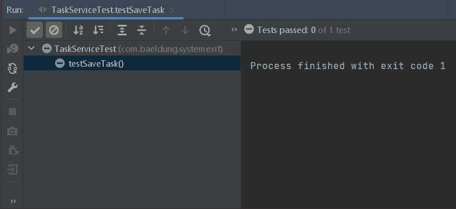

# JUnit–测试调用 System.exit()的方法

> 原文：<https://web.archive.org/web/20220930061024/https://www.baeldung.com/junit-system-exit>

## 1.概观

在某些情况下，可能需要一个方法来调用`System.exit()`并关闭应用程序。例如，如果应用程序应该只运行一次然后退出，或者出现像丢失数据库连接这样的致命错误，就会出现这种情况。

如果一个方法调用 [`System.exit()`](/web/20221107202800/https://www.baeldung.com/java-system-exit) ，那么从单元测试中调用它并做出断言就变得很困难，因为这将导致单元测试退出。

在本教程中，我们将探索如何在使用 [JUnit](/web/20221107202800/https://www.baeldung.com/junit) 时测试调用`System.exit()`的方法。

## 2.项目设置

让我们从创建一个 Java 项目开始。我们将创建一个将任务保存到数据库的服务。如果将任务保存到数据库引发了异常，服务将调用`System.exit()`。

### 2.1.JUnit 和 Mockito 依赖项

让我们添加 [JUnit](https://web.archive.org/web/20221107202800/https://search.maven.org/search?q=g:org.junit.jupiter%20AND%20a:junit-jupiter-api) 和 [Mockito](https://web.archive.org/web/20221107202800/https://search.maven.org/search?q=g:org.mockito%20AND%20a:mockito-core) 依赖项:

[PRE0]

### 2.2.代码设置

我们将从添加名为`Task` : 的实体类开始

[PRE1]

接下来，让我们创建一个负责与数据库交互的[DAO](/web/20221107202800/https://www.baeldung.com/java-dao-pattern):

[PRE2]

对于本文的目的来说，`save()`方法的实现并不重要。

接下来，让我们创建一个调用 DAO 的`TaskService`:

[PRE3]

我们应该注意到，如果`save()`方法抛出异常，应用程序就会退出。

### 2.3.单元测试

让我们试着为上面的`saveTask()`方法写一个单元测试:

[PRE4]

我们模仿了`TaskDAO `在调用`save()`方法时抛出异常。这将导致执行`saveTask()`的`catch`块，它调用`System.exit()`。

**如果我们运行这个测试，我们会发现它在完成之前就存在了**:

## 3.使用安全管理器的解决方法(Java 17 之前)

**我们可以提供我们的[安全管理器](/web/20221107202800/https://www.baeldung.com/java-security-manager)来阻止单元测试退出。**我们的安全管理器将阻止对`System.exit()`的调用，并在调用发生时抛出异常。然后我们可以捕捉抛出的异常来做出断言。默认情况下，Java 不使用安全管理器，并且允许调用所有的`System`方法。

**需要注意的是`SecurityManager`在 Java 17 中已被弃用，如果在 Java 17 或更高版本中使用，将会抛出异常。**

### 3.1.安全经理

让我们看看安全管理器的实现:

[PRE5]

让我们来谈谈这段代码的几个重要行为:

*   方法 **`checkPermission()`需要被覆盖，因为如果`System.exit()`被调用**，安全管理器的默认实现会抛出一个异常。
*   每当我们的代码调用`System.exit()`时，`NoExitSecurityManager `的`checkExit()`方法就会介入并抛出异常。
*   任何其他异常都可能被抛出，而不是抛出`RuntimeException`，只要它是未检查的异常。

### 3.2.修改测试

下一步是修改测试以使用`SecurityManager`实现。我们将**添加`setUp()`和`tearDown()`方法来设置和移除测试运行时的安全管理器** : 

[PRE6]

最后，让**改变测试用例来捕捉`System.exit()`被调用**时会抛出的`RuntimeException`:

[PRE7]

我们使用`catch`块来验证**退出消息的状态是否与 DAO** 设置的退出代码相同。

## 4.系统λ库

另一种编写测试的方法是使用[系统λ库](https://web.archive.org/web/20221107202800/https://github.com/stefanbirkner/system-lambda)。这个库帮助测试调用`System`类方法的代码。我们将探索如何使用这个库来编写我们的测试。

### 4.1.属国

让我们从添加 [`system-lambda`](https://web.archive.org/web/20221107202800/https://search.maven.org/search?q=g:com.github.stefanbirkner%20AND%20a:system-lambda) 依赖关系开始:

[PRE8]

### 4.2.修改测试用例

接下来，让我们修改测试用例。我们将**用库的`catchSystemExit()`方法包装我们的原始测试代码。这个方法将阻止系统退出，而是返回退出代码**。然后我们将断言退出代码:

[PRE9]

## 5.使用 JMockit

**[JMockit](/web/20221107202800/https://www.baeldung.com/jmockit-101)库提供了一种模仿`System`类的方法。我们可以用它来改变`System.exit()`的行为，阻止系统退出。**我们来探讨一下怎么做。

### 5.1.属国

让我们添加 [JMockit](https://web.archive.org/web/20221107202800/https://mvnrepository.com/artifact/org.jmockit/jmockit/1.49) 依赖项:

[PRE10]

除此之外，我们还需要为 JMockit 添加`-javaagent` JVM 初始化参数。为此我们可以使用 [Maven Surefire](/web/20221107202800/https://www.baeldung.com/maven-surefire-plugin) 插件:

[PRE11]

这导致 JMockit 在 JUnit 之前初始化。这样，所有的测试用例都通过 JMockit 运行。如果使用旧版本的 JMockit，则不需要初始化参数。

### 5.2.修改测试

让我们修改测试来模拟`System.exit()` : 

[PRE12]

这将抛出一个异常，我们可以捕捉并断言它，就像前面的安全管理器示例一样。

## 6.结论

在本文中，我们看到了使用 JUnit 测试调用`System.exit()`的代码有多困难。然后，我们探索了一种通过添加安全管理器来解决这个问题的方法。我们还研究了库系统 Lambda 和 JMockit，它们提供了解决这个问题的更简单的方法。

和往常一样，本文中使用的代码示例可以在 GitHub 上找到[。](https://web.archive.org/web/20221107202800/https://github.com/eugenp/tutorials/tree/master/testing-modules/junit-5-advanced)