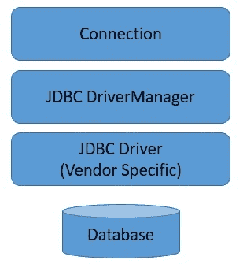
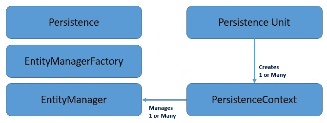
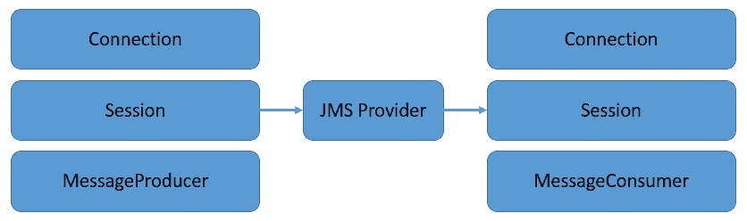
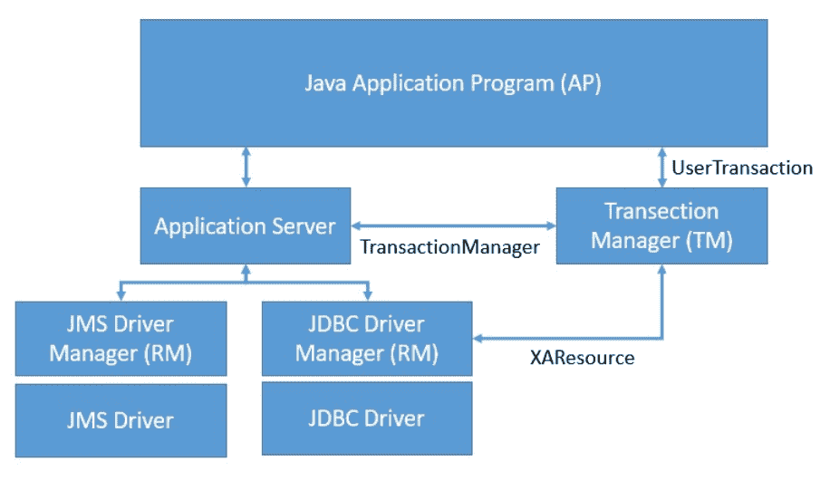
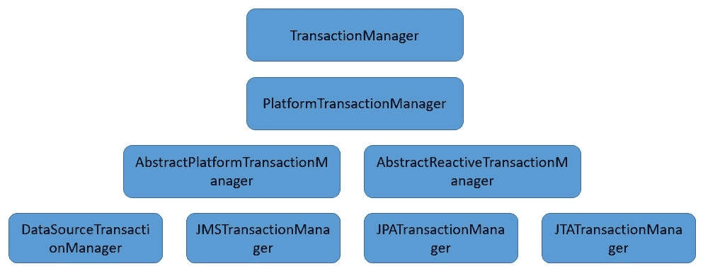

# Java 和 Spring 中的事务介绍

> 原文：<https://web.archive.org/web/20220930061024/https://www.baeldung.com/java-transactions>

## 1.介绍

在本教程中，我们将了解 Java 中事务的含义。因此，我们将了解如何执行资源本地事务和全局事务。这也将允许我们探索在 Java 和 Spring 中管理事务的不同方法。

## 2.什么是交易？

Java 中的事务通常指的是一系列必须成功完成的动作。因此，**如果一个或多个动作失败，所有其他动作必须退出，应用程序的状态保持不变**。这对于确保应用程序状态的完整性不被破坏是必要的。

此外，这些事务可能涉及一个或多个资源，如数据库、消息队列，从而产生在事务下执行操作的不同方式。这些包括对单个资源执行资源本地事务。或者，多个资源可以参与一个全局事务。

## 3.资源本地事务

我们将首先探索如何在处理单个资源的同时使用 Java 中的事务。在这里，我们可能有**个单独的动作，我们用一个像数据库**这样的资源来执行这些动作。但是，我们可能希望它们作为一个统一的整体发生，作为一个不可分割的工作单元。换句话说，我们希望这些操作发生在单个事务中。

在 Java 中，我们有几种方法来访问和操作像数据库这样的资源。因此，我们处理交易的方式也不一样。在这一节中，我们将了解如何在 Java 中的一些常用库中使用事务。

### 3.1.JDBC

[Java 数据库连接(JDBC)](https://web.archive.org/web/20221129004828/https://docs.oracle.com/javase/tutorial/jdbc/overview/index.html) 是**Java 中的 API，定义了如何在 Java 中访问数据库**。不同的数据库供应商提供 JDBC 驱动程序，以独立于供应商的方式连接到数据库。因此，我们从驱动程序中检索一个`Connection` 来对数据库执行不同的操作:

JDBC 为我们提供了在事务下执行语句的选项。`Connection` 的**默认行为是自动提交**。澄清一下，这意味着每一条语句都被视为一个事务，并在执行后自动提交。

但是，如果我们希望在单个事务中捆绑多个语句，这也是可以实现的:

[PRE0]

这里，我们禁用了`Connection`的自动提交模式。因此，我们可以**手动定义交易边界并执行`commit` 或`rollback`T5。JDBC 还允许我们设置一个`Savepoint` ,它为我们提供了对回滚量的更多控制。**

### 3.2.作业的装配区（JobPackArea）

[Java Persistence API (JPA)](https://web.archive.org/web/20221129004828/https://docs.oracle.com/javaee/6/tutorial/doc/bnbpz.html) 是 Java 中的一个规范，可用于**在面向对象的领域模型和关系数据库系统之间架起桥梁**。因此，第三方可以提供几种 JPA 实现，比如 Hibernate、EclipseLink 和 iBatis。

在 JPA 中，我们可以将常规类定义为一个为它们提供持久身份的`Entity` 。 **`EntityManager` 类提供了在持久化上下文**中处理多个实体的必要接口。持久性上下文可以被认为是一级缓存，在这里管理实体:

JPA 架构

这里的持久性上下文可以有两种类型，事务范围的或扩展范围的。事务范围的持久性上下文被绑定到单个事务。而扩展范围的持久化上下文可以跨越多个事务。持久性上下文的默认范围是事务范围。

让我们看看如何创建一个`EntityManager` 并手动定义一个事务边界:

[PRE1]

这里，我们在事务范围的持久性上下文中从`EntityManagerFactory`创建一个`EntityManager`。然后我们用`begin`、`commit,` 和`rollback` 方法定义事务边界。

### 3.3.（同 JavaMessageService）Java 消息服务

[Java 消息服务(JMS)](https://web.archive.org/web/20221129004828/https://docs.oracle.com/javaee/6/tutorial/doc/bncdq.html) 是 Java 中的一个规范，**允许应用程序使用消息**进行异步通信。API 允许我们创建、发送、接收和读取队列或主题中的消息。有几种符合 JMS 规范的消息服务，包括 OpenMQ 和 ActiveMQ。

JMS API 支持在单个事务中捆绑多个发送或接收操作。然而，根据基于消息的集成架构的本质，**消息的生产和消费不能是同一个事务**的一部分。事务的范围保持在客户端和 JMS 提供者之间:

 
JMS 允许我们从特定于供应商的`ConnectionFactory`获得的`Connection` 中创建一个`Session` 。我们有一个**选项来创建一个`Session` 事务或不事务**。对于非事务`Session` s `,`，我们也可以进一步定义一个合适的确认模式。

让我们看看如何创建一个 transactioned`Session` 来在一个事务下发送多条消息:

[PRE2]

这里，我们为主题类型的`Destination` 创建一个`MessageProducer`。我们从之前创建的`Session`中获得了`Destination` 。我们进一步使用`Session` 来定义使用方法`commit` 和`rollback`的事务边界。

## 4.全球交易

正如我们看到的，资源本地事务允许我们作为一个统一的整体在单个资源内执行多个操作。但是，我们经常处理跨越多个资源的操作。例如，在两个不同的数据库或一个数据库和一个消息队列中的操作。在这里，资源范围内的本地事务支持对我们来说是不够的。

在这些场景中，我们需要的是一个全局机制来划分跨越多个参与资源的事务。这通常被称为分布式事务，已经提出了一些规范来有效地处理它们。

XA 规范就是这样一种规范，它定义了一个事务管理器来控制跨多个资源的事务。Java 通过组件 JTA 和 JTS 对符合 XA 规范的分布式事务提供了相当成熟的支持。

### 4.1.JTA

[Java 事务 API (JTA)](https://web.archive.org/web/20221129004828/https://www.oracle.com/technetwork/java/javaee/jta/index.html) 是在 Java 社区进程下开发的 Java 企业版 API。它**使 Java 应用程序和应用服务器能够跨 XA 资源执行分布式事务**。JTA 是围绕 XA 架构建模的，利用两阶段提交。

JTA 规定了分布式事务中事务管理器和其他方之间的标准 Java 接口:

让我们了解一下上面强调的一些关键接口:

*   允许应用服务器划分和控制事务的接口
*   这个接口允许应用程序明确地划分和控制事务
*   `XAResource` **`:`** 该接口的目的是允许事务管理器与符合 XA 的资源管理器一起工作

### 4.2.JTS

[Java 事务服务(JTS)](https://web.archive.org/web/20221129004828/https://download.oracle.com/otndocs/jcp/7309-jts-1.0-spec-oth-JSpec/) 是**的一个规范，用于构建映射到 OMG OTS 规范**的事务管理器。JTS 使用标准 CORBA ORB/TS 接口和因特网 ORB 间协议(IIOP)在 JTS 事务管理器之间传播事务上下文。

在高层次上，它支持 Java 事务 API (JTA)。JTS 事务管理器为分布式事务中涉及的各方提供事务服务:

JTS 为应用程序提供的服务在很大程度上是透明的，因此我们甚至不会在应用程序架构中注意到它们。JTS 是围绕从应用程序中抽象出所有事务语义的应用服务器构建的。

## 5.JTA 交易管理

现在是时候了解我们如何使用 JTA 管理分布式事务了。分布式事务不是简单的解决方案，因此也有成本问题。此外，**我们有多种选择可以将 JTA 纳入我们的申请**。因此，我们的选择必须着眼于整个应用程序架构和期望。

### 5.1.应用服务器中的 JTA

正如我们前面所看到的，JTA 架构依靠应用服务器来促进大量与事务相关的操作。它依赖服务器提供的关键服务之一是通过 JNDI 的命名服务。这是 XA 资源(如数据源)绑定和检索的地方。

除此之外，我们还可以选择如何在应用程序中管理事务边界。这在 Java 应用服务器中产生了两种类型的事务:

*   **容器管理的事务**:顾名思义，**这里的事务边界是由应用服务器**设置的。这简化了企业 Java Beans (EJB)的开发，因为它不包括与事务划分相关的语句，而仅仅依赖于容器来完成。然而，这并没有为应用程序提供足够的灵活性。
*   **Bean 管理的事务**:与容器管理的事务相反，在 Bean 管理的事务**中，EJB 包含明确的语句来定义事务界限**。这为标记事务边界的应用程序提供了精确的控制，尽管代价是更加复杂。

在应用服务器环境中执行事务的一个主要缺点是**应用变得与服务器**紧密耦合。这涉及到应用程序的可测试性、可管理性和可移植性。这在微服务架构中更为深刻，因为微服务架构更强调开发与服务器无关的应用程序。

### 5.2.JTA 独立

我们在上一节中讨论的问题为创建不依赖于应用服务器的分布式事务**解决方案提供了巨大的动力。在这方面，我们有几种选择，比如使用 Spring 的事务支持，或者使用 Atomikos 之类的事务管理器。**

让我们看看如何使用 Atomikos 这样的事务管理器来促进带有数据库和消息队列的分布式事务。分布式事务的一个关键方面是**用事务监视器**登记和删除参与的资源。Atomikos 会帮我们处理的。我们所要做的就是使用 Atomikos 提供的抽象:

[PRE3]

这里，我们创建了一个`AtomikosDataSourceBean`的实例，并注册了特定于供应商的`XADataSource`。从现在开始，我们可以像使用任何其他`DataSource` 一样继续使用它，并获得分布式事务的好处。

类似地，我们**有一个消息队列**的抽象，它负责自动向事务监视器注册特定于供应商的 XA 资源:

[PRE4]

这里，我们创建了一个`AtomikosConnectionFactoryBean` 的实例，并注册了来自支持 XA 的 JMS 供应商的`XAConnectionFactory` 。在这之后，我们可以继续把这个作为常规的`ConnectionFactory`。

现在，Atomikos 为我们提供了拼图的最后一块拼图，一个`UserTransaction`的实例:

[PRE5]

现在，我们准备创建一个跨数据库和消息队列的分布式事务应用程序:

[PRE6]

这里，我们使用类`UserTransaction` 中的**方法`begin` 和`commit` 来划分事务边界**。这包括在数据库中保存记录以及向消息队列发布消息。

## 6.Spring 中的事务支持

我们已经看到,**处理事务是一项相当复杂的任务，包括许多样板代码**和配置。此外，每个资源都有自己处理本地事务的方式。在 Java 中，JTA 将我们从这些变化中抽象出来，但是进一步带来了特定于提供商的细节和应用服务器的复杂性。

Spring 平台**为我们提供了一种更干净的处理事务的方式，包括 Java 中的资源本地和全局事务**。这与 Spring 的其他优势一起，为使用 Spring 处理事务提供了一个令人信服的案例。此外，用 Spring 配置和切换事务管理器非常容易，它可以是服务器提供的，也可以是独立的。

Spring 通过用事务代码为方法创建一个代理，为我们提供了这种**无缝抽象。代理在`TransactionManager` :

的帮助下代表代码管理事务状态，这里的中心接口是`PlatformTransactionManager` ，它有许多不同的实现。它提供了对 JDBC(数据源)、JMS、JPA、JTA 和许多其他资源的抽象。**

### 6.1.配置

让我们看看如何配置 **Spring 来使用 Atomikos 作为事务管理器，并为 JPA 和 JMS** 提供事务支持。我们将从定义 JTA 类型的`PlatformTransactionManager`开始:

[PRE7]

这里，我们向`JTATransactionManager`提供了`UserTransaction`和`TransactionManager` 的实例。这些实例是由 Atomikos 这样的事务管理器库提供的:

[PRE8]

这里的类`UserTransactionImp` 和`UserTransactionManager`是由 Atomikos 提供的。

进一步，我们需要定义`JmsTemplete`哪个核心类允许 Spring 中的同步 JMS 访问:

[PRE9]

这里，`ConnectionFactory` 是由 Atomikos 提供的，它为其提供的`Connection` 启用分布式事务:

[PRE10]

因此，如我们所见，这里我们用`AtomikosConnectionFactoryBean`包装了特定于 JMS 提供者的`XAConnectionFactory` 。

接下来，我们需要定义一个负责在 Spring 中创建 JPA `EntityManagerFactory` bean 的`AbstractEntityManagerFactoryBean` :

[PRE11]

和以前一样，我们在这里的`LocalContainerEntityManagerFactoryBean` 中设置的`DataSource` 是由启用了分布式事务的 Atomikos 提供的:

[PRE12]

这里，我们再次将特定于提供者的`XADataSource` 包装在`AtomikosDataSourceBean`中。

### 6.2.事务管理

看完了上一节中的所有配置，我们一定会感到不知所措！我们甚至会质疑使用 Spring 到底有什么好处。但是请记住，所有这些配置**使我们能够从大多数特定于提供者的样板文件**中抽象出来，我们实际的应用程序代码根本不需要知道这一点。

所以，现在我们准备探索如何在 Spring 中使用事务，我们打算在 Spring 中更新数据库和发布消息。Spring 为我们提供了两种方法来实现这一点，并有各自的优点可供选择。让我们了解如何利用它们:

*   **声明性支持**

在 Spring 中使用事务最简单的方法是声明性支持。这里，我们有**一个方便的注释，可以应用于方法甚至类**。这只是为我们的代码启用了全局事务:

[PRE13]

上面的简单代码足以在 JTA 事务中允许数据库中的保存操作和消息队列中的发布操作。

*   **方案支持**

虽然声明性支持非常优雅和简单，但它并没有为我们提供更精确地控制事务边界的好处。因此，如果我们确实需要实现这一点，Spring 提供了编程支持来划分事务边界:

[PRE14]

因此，正如我们看到的，我们必须用可用的`PlatformTransactionManager`创建一个`TransactionTemplate` 。然后我们可以使用`TransactionTemplete` 来处理一个全局事务中的一系列语句。

## 7.事后思考

正如我们已经看到的，处理事务，尤其是那些跨越多个资源的事务是复杂的。此外，**事务本身就是阻塞的，这对应用的延迟和吞吐量**是有害的。此外，用分布式事务测试和维护代码并不容易，尤其是当事务依赖于底层应用服务器时。所以，总而言之，如果可以的话，最好是完全避免交易！

但这远非事实。简而言之，在现实世界的应用中，我们确实经常有合法的交易需求。虽然有可能在没有事务的情况下重新考虑应用程序架构，但这并不总是可能的。因此，在 Java 中处理事务时，我们必须采用某些最佳实践，以使我们的应用程序更好:

*   我们应该采取的基本转变之一是**使用独立的事务管理器，而不是由应用服务器**提供的事务管理器。仅此一点就可以大大简化我们的应用程序。此外，它非常适合云原生微服务架构。
*   此外，**像 Spring 这样的抽象层可以帮助我们控制像 JPA 或 JTA 提供者这样的提供者的直接影响。因此，这可以使我们在提供商之间切换，而不会对我们的业务逻辑产生太大影响。此外，它从我们这里拿走了管理事务状态的低级职责。**
*   最后，我们应该**小心选择代码**中的事务边界。因为事务是阻塞的，所以最好尽可能限制事务边界。如果有必要的话，我们应该更喜欢对事务进行编程式控制，而不是声明式控制。

## 8.结论

总而言之，在本教程中，我们讨论了 Java 环境中的事务。我们讨论了 Java 对不同资源的单个资源本地事务的支持。我们还介绍了用 Java 实现全局事务的方法。

此外，我们通过不同的方式来管理 Java 中的全局事务。此外，我们了解了 Spring 如何让我们更容易地使用 Java 中的事务。

最后，我们回顾了在 Java 中处理事务时的一些最佳实践。