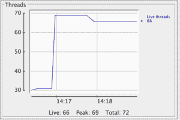
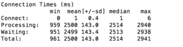
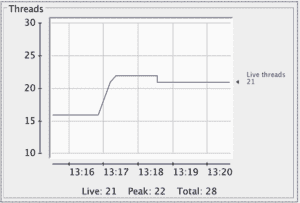
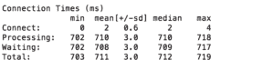

# Spring MVC 异步 vs Spring WebFlux

> 原文：<https://web.archive.org/web/20220930061024/https://www.baeldung.com/spring-mvc-async-vs-webflux>

## 1.介绍

在本教程中，我们将探索 Spring MVC 中的`@Async`注释，然后熟悉 Spring WebFlux。我们的目标是更好地理解这两者之间的区别。

## 2.实施场景

这里，我们想选择一个场景来展示我们如何用这些 API 实现一个简单的 web 应用程序。此外，我们特别感兴趣的是在每种情况下看到更多关于线程管理和阻塞或非阻塞 I/O 的信息。

让我们选择一个具有一个返回字符串结果的端点的 web 应用程序。这里的要点是请求会经过一个`Filter`有一个 200ms 的小延迟，然后`Controller`需要 500ms 计算并返回结果。

接下来，我们将使用 [Apache ab](https://web.archive.org/web/20221025153926/https://httpd.apache.org/docs/2.4/programs/ab.html) 在两个端点上模拟一个负载，并使用 [JConsole](https://web.archive.org/web/20221025153926/https://docs.oracle.com/en/java/javase/11/management/using-jconsole.html) 监控我们的应用程序行为。

值得一提的是，在本文中，**我们的目标不是这两个 API 之间的基准，只是一个小的负载测试，以便我们可以跟踪线程管理**。

## 3.Spring MVC 异步

Spring 3.0 引入了`@Async`注释。`@Async`的目标是允许应用程序在一个单独的线程上运行重载任务。同样，如果有兴趣，呼叫者可以等待结果。因此返回类型不能是`void`，可以是 [`Future`](/web/20221025153926/https://www.baeldung.com/java-future) 、 [`CompletableFuture`](/web/20221025153926/https://www.baeldung.com/java-completablefuture) 或`ListenableFuture`中的任意一个。

此外， [Spring 3.2](https://web.archive.org/web/20221025153926/https://docs.spring.io/spring/docs/3.2.x/spring-framework-reference/html/new-in-3.2.html) 引入了`org.springframework.web.context.request.async`包，与 [Servlet 3.0](https://web.archive.org/web/20221025153926/https://download.oracle.com/otndocs/jcp/servlet-3.0-fr-oth-JSpec/) 一起，将异步流程的乐趣带到了 web 层。因此，从 Spring 3.2 开始，`@Async`可以在标注为`@Controller`或`@RestController`的类中使用。

当客户机发起一个请求时，它会遍历过滤器链中所有匹配的过滤器，直到它到达`DispatcherServlet`实例。

然后，servlet 负责请求的异步分派。它通过调用`AsyncWebRequest#startAsync,` 将请求标记为开始，将请求处理转移到`WebSyncManager`的实例，并在不提交响应的情况下完成其作业。过滤器链也以相反的方向遍历到根。

`WebAsyncManager`在其关联的`ExecutorService`中提交请求处理作业。每当结果准备好了，它就通知`DispatcherServlet`将响应返回给客户端。

## 4.Spring 异步实现

让我们通过编写我们的应用程序类`AsyncVsWebFluxApp`来开始实现。H `ere, @EnableAsync`为我们的 Spring Boot 应用启用异步的魔力在于:

```
@SpringBootApplication
@EnableAsync
public class AsyncVsWebFluxApp {
    public static void main(String[] args) {
        SpringApplication.run(AsyncVsWebFluxApp.class, args);
    }
}
```

然后我们有`AsyncFilter`，它实现了`javax.servlet.Filter.` 别忘了在 `doFilter`方法中模拟延迟:

```
@Component
public class AsyncFilter implements Filter {
    ...
    @Override
    public void doFilter(ServletRequest servletRequest, ServletResponse servletResponse, FilterChain filterChain)
      throws IOException, ServletException {
        // sleep for 200ms 
        filterChain.doFilter(servletRequest, servletResponse);
    }
}
```

最后，我们用“`/async_result`”端点开发我们的`AsyncController`:

```
@RestController
public class AsyncController {
    @GetMapping("/async_result")
    @Async
    public CompletableFuture getResultAsyc(HttpServletRequest request) {
        // sleep for 500 ms
        return CompletableFuture.completedFuture("Result is ready!");
    }
}
```

因为`getResultAsync`上面的`@Async`，这个方法在应用程序默认的 [`ExecutorService`](/web/20221025153926/https://www.baeldung.com/java-executor-service-tutorial) 上的单独线程中执行。然而，[可以为我们的方法](/web/20221025153926/https://www.baeldung.com/spring-async)设置一个特定的`ExecutorService`。

考试时间！让我们运行应用程序，安装 Apache ab 或任何工具来模拟负载。然后，我们可以通过“async_result”端点发送大量并发请求。我们可以执行 JConsole 并将其附加到我们的 java 应用程序来监控该过程:

```
ab -n 1600 -c 40 localhost:8080/async_result
```

[](/web/20221025153926/https://www.baeldung.com/wp-content/uploads/2020/08/Async-jconsol.png) [](/web/20221025153926/https://www.baeldung.com/wp-content/uploads/2020/08/Async-ab.png)

## 5.弹簧网流量

Spring 5.0 引入了 [WebFlux，以非阻塞的方式支持反应式 web](https://web.archive.org/web/20221025153926/https://docs.spring.io/spring/docs/current/spring-framework-reference/web-reactive.html) 。WebFlux 基于 reactor API，是[反应流](https://web.archive.org/web/20221025153926/https://www.reactive-streams.org/)的另一个令人敬畏的实现。

**Spring WebFlux 通过其非阻塞 I/O 支持反应式背压和 [Servlet 3.1+](https://web.archive.org/web/20221025153926/https://blogs.oracle.com/arungupta/whats-new-in-servlet-31-java-ee-7-moving-forward) ，因此，它可以在 Netty、Undertow、Jetty、Tomcat 或任何 Servlet 3.1+兼容的服务器上运行。**

尽管并非所有的服务器都使用相同的线程管理和并发控制模型，但只要它们支持非阻塞 I/O 和反应性反压力，Spring WebFlux 就能很好地工作。

Spring WebFlux 允许我们使用`Mono, Flux,`及其丰富的操作符集以声明的方式分解逻辑。此外，除了它的`@Controller`注释端点，我们还可以有功能端点，尽管我们现在也可以在 [Spring MVC](/web/20221025153926/https://www.baeldung.com/spring-mvc-functional-controllers) 中使用这些端点。

## 6.Spring WebFlux 实现

对于 [WebFlux 实现](/web/20221025153926/https://www.baeldung.com/spring-webflux)，我们走与 async 相同的道路。首先，让我们创建`AsyncVsWebFluxApp`:

```
@SpringBootApplication
public class AsyncVsWebFluxApp {
    public static void main(String[] args) {
        SpringApplication.run(AsyncVsWebFluxApp.class, args);
    }
}
```

然后让我们编写我们的`WebFluxFilter`，它实现了`WebFilter.`，我们将生成一个有意的延迟，然后将请求传递给过滤器链:

```
@Component
public class WebFluxFilter implements org.springframework.web.server.WebFilter {

    @Override
    public Mono filter(ServerWebExchange serverWebExchange, WebFilterChain webFilterChain) {
        return Mono
          .delay(Duration.ofMillis(200))
          .then(
            webFilterChain.filter(serverWebExchange)
          );
    }
}
```

最后，我们有了我们的`WebFluxController`。它公开了一个名为`“/flux_result”`的端点，并返回一个`Mono<String>`作为响应:

```
@RestController
public class WebFluxController {

    @GetMapping("/flux_result")
    public Mono getResult(ServerHttpRequest request) {
       return Mono.defer(() -> Mono.just("Result is ready!"))
         .delaySubscription(Duration.ofMillis(500));
    }
}
```

对于测试，我们采用了与异步示例应用程序相同的方法。以下是:的示例结果

```
ab -n 1600 -c 40 localhost:8080/flux_result
```

[](/web/20221025153926/https://www.baeldung.com/wp-content/uploads/2020/08/WebFlux-jconsole.png)[](/web/20221025153926/https://www.baeldung.com/wp-content/uploads/2020/08/WebFlux-ab.png)

## 7.有什么区别？

Spring Async 支持 Servlet 3.0 规范，但是 Spring WebFlux 支持 Servlet 3.1+。它带来了许多不同之处:

*   Spring 异步 I/O 模型在与客户端通信期间被阻塞。这可能会导致慢速客户端的性能问题。另一方面，Spring WebFlux 提供了一个非阻塞的 I/O 模型。
*   读取请求体或请求部分在 Spring Async 中是阻塞的，而在 Spring WebFlux 中是非阻塞的。
*   在 Spring Async 中，`Filter` s 和`Servlet` s 是同步工作的，但是 Spring WebFlux 支持完全异步通信。
*   Spring WebFlux 与比 Spring Async 更广泛的 Web/应用服务器兼容，比如 Netty 和 Undertow。

此外，Spring WebFlux 支持反应性反压力，因此与 Spring MVC Async 和 Spring MVC 相比，我们可以更好地控制如何对快速生产者做出反应。

由于背后的 Reactor API，Spring Flux 也向函数式编码风格和声明式 API 分解进行了切实的转变。

所有这些项目会引导我们使用 Spring WebFlux 吗？嗯， **Spring Async 甚至 Spring MVC 可能是很多项目的正确答案，这取决于期望的负载可伸缩性或者系统的可用性**。

关于可伸缩性，Spring Async 比同步 Spring MVC 实现给了我们更好的结果。Spring WebFlux，由于其反应性，为我们提供了弹性和更高的可用性。

## 8.结论

在本文中，我们了解了更多关于 Spring Async 和 Spring WebFlux 的知识，然后我们通过一个基本的负载测试对它们进行了理论和实践上的比较。

和往常一样，[异步样本](https://web.archive.org/web/20221025153926/https://github.com/eugenp/tutorials/tree/master/spring-boot-modules/spring-boot-mvc-3)和 [WebFlux 样本](https://web.archive.org/web/20221025153926/https://github.com/eugenp/tutorials/tree/master/spring-5-webflux)的完整代码可以通过 GitHub 获得。