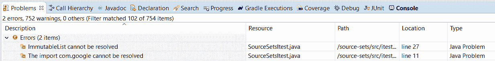

# 梯度源集

> 原文：<https://web.archive.org/web/20220930061024/https://www.baeldung.com/gradle-source-sets>

## 1.概观

源集为我们在 [Gradle](/web/20221129003028/https://www.baeldung.com/gradle) 项目中构建源代码提供了一种强大的方法。

在这个快速教程中，我们将看到如何使用它们。

## 2.默认源集

在进入默认值之前，让我们先解释一下什么是源集。顾名思义，**源集代表源文件**的逻辑分组。

我们将讨论 Java 项目的配置，但是这些概念也适用于其他 Gradle 项目类型。

### 2.1.默认项目布局

让我们从一个简单的项目结构开始:

```
source-sets 
  ├── src 
  │    ├── main 
  │    │    └── java 
  │    │        ├── SourceSetsMain.java
  │    │        └── SourceSetsObject.java
  │    └── test 
  │         └── java 
  │             └── SourceSetsTest.java
  └── build.gradle 
```

现在让我们来看看`build.gradle`:

```
apply plugin : "java"
description = "Source Sets example"
test {
    testLogging {
        events "passed", "skipped", "failed"
    }
}
dependencies {   
    implementation('org.apache.httpcomponents:httpclient:4.5.12')
    testImplementation('junit:junit:4.12')
}
```

Java 插件假设 **`src/main/java` 和`src/test/java`为默认源目录** `. `

让我们设计一个简单的实用程序任务:

```
task printSourceSetInformation(){
    doLast{
        sourceSets.each { srcSet ->
            println "["+srcSet.name+"]"
            print "-->Source directories: "+srcSet.allJava.srcDirs+"\n"
            print "-->Output directories: "+srcSet.output.classesDirs.files+"\n"
            println ""
        }
    }
}
```

我们在这里只打印了几个源集属性。我们可以随时查看完整的 JavaDoc 以获取更多信息。

让我们运行它，看看我们得到了什么:

```
$ ./gradlew printSourceSetInformation

> Task :source-sets:printSourceSetInformation
[main]
-->Source directories: [.../source-sets/src/main/java]
-->Output directories: [.../source-sets/build/classes/java/main]

[test]
-->Source directories: [.../source-sets/src/test/java]
-->Output directories: [.../source-sets/build/classes/java/test] 
```

注意**我们有两个默认的源集合:`main` 和`test`** 。

### 2.2.默认配置

Java 插件也自动为我们创建一些默认的[配置](https://web.archive.org/web/20221129003028/https://docs.gradle.org/current/dsl/org.gradle.api.artifacts.Configuration.html)。

它们遵循一个特殊的命名约定:`<sourceSetName><configurationName>`。


我们用它们来声明`build.gradle`中的依赖关系:

```
dependencies { 
    implementation('org.apache.httpcomponents:httpclient:4.5.12') 
    testImplementation('junit:junit:4.12') 
}
```

注意，我们指定了`implementation`而不是`mainImplementation`。这是命名约定的一个例外。

**默认情况下，`testImplementation` 配置扩展`implementation`并继承其所有依赖项和输出**。

让我们改进我们的助手任务，看看这是怎么回事:

```
task printSourceSetInformation(){

    doLast{
        sourceSets.each { srcSet ->
            println "["+srcSet.name+"]"
            print "-->Source directories: "+srcSet.allJava.srcDirs+"\n"
            print "-->Output directories: "+srcSet.output.classesDirs.files+"\n"
            print "-->Compile classpath:\n"
            srcSet.compileClasspath.files.each { 
                print "  "+it.path+"\n"
            }
            println ""
        }
    }
}
```

让我们来看看输出:

```
[main]
// same output as before
-->Compile classpath:
  .../httpclient-4.5.12.jar
  .../httpcore-4.4.13.jar
  .../commons-logging-1.2.jar
  .../commons-codec-1.11.jar

[test]
// same output as before
-->Compile classpath:
  .../source-sets/build/classes/java/main
  .../source-sets/build/resources/main
  .../httpclient-4.5.12.jar
  .../junit-4.12.jar
  .../httpcore-4.4.13.jar
  .../commons-logging-1.2.jar
  .../commons-codec-1.11.jar
  .../hamcrest-core-1.3.jar
```

`test`源集在其编译类路径中包含了`main`的输出，还包含了它的依赖项。

接下来，让我们创建我们的单元测试:

```
public class SourceSetsTest {

    @Test
    public void whenRun_ThenSuccess() {

        SourceSetsObject underTest = new SourceSetsObject("lorem","ipsum");

        assertThat(underTest.getUser(), is("lorem"));
        assertThat(underTest.getPassword(), is("ipsum"));
    }
}
```

这里我们测试一个简单的 POJO，它存储两个值。我们可以直接使用它，因为**的 `main`输出在我们的`test`类路径**中。

接下来，让我们从 Gradle 运行这个:

```
./gradlew clean test

> Task :source-sets:test

com.baeldung.test.SourceSetsTest > whenRunThenSuccess PASSED 
```

## 3.自定义源集

到目前为止，我们已经看到了一些合理的违约。然而，在实践中，我们经常需要定制的源集，尤其是对于集成测试。

这是因为我们可能希望特定的测试库只存在于集成测试类路径中。我们也可能希望独立于单元测试来执行它们。

### 3.1.定义自定义来源集

让我们为集成测试创建一个单独的源目录:

```
source-sets 
  ├── src 
  │    └── main 
  │         ├── java 
  │         │    ├── SourceSetsMain.java
  │         │    └── SourceSetsObject.java
  │         ├── test 
  │         │    └── SourceSetsTest.java
  │         └── itest 
  │              └── SourceSetsITest.java
  └── build.gradle 
```

接下来，让我们使用`sourceSets`构造在我们的`build.gradle` 中对其进行**配置:**

```
sourceSets {
    itest {
        java {
        }
    }
}
dependencies {
    implementation('org.apache.httpcomponents:httpclient:4.5.12')
    testImplementation('junit:junit:4.12')
}
// other declarations omitted 
```

注意，我们没有指定任何自定义目录。这是因为我们的文件夹与新源集的名称(`itest`)相匹配。

我们可以**定制`srcDirs`属性**包含哪些目录:

```
sourceSets{
    itest {
        java {
            srcDirs("src/itest")
        }
    }
}
```

还记得我们一开始的助手任务吗？让我们重新运行它，看看它打印什么:

```
$ ./gradlew printSourceSetInformation

> Task :source-sets:printSourceSetInformation
[itest]
-->Source directories: [.../source-sets/src/itest/java]
-->Output directories: [.../source-sets/build/classes/java/itest]
-->Compile classpath:
  .../source-sets/build/classes/java/main
  .../source-sets/build/resources/main

[main]
 // same output as before

[test]
 // same output as before
```

### 3.2.分配特定于源集的相关性

还记得默认配置吗？我们现在也获得了一些`itest`源集的配置。

**让我们使用`itestImplementation`来分配一个新的依赖关系** :

```
dependencies {
    implementation('org.apache.httpcomponents:httpclient:4.5.12')
    testImplementation('junit:junit:4.12')
    itestImplementation('com.google.guava:guava:29.0-jre')
}
```

这个只适用于集成测试。

让我们修改之前的测试，并将其添加为集成测试:

```
public class SourceSetsItest {

    @Test
    public void givenImmutableList_whenRun_ThenSuccess() {

        SourceSetsObject underTest = new SourceSetsObject("lorem", "ipsum");
        List someStrings = ImmutableList.of("Baeldung", "is", "cool");

        assertThat(underTest.getUser(), is("lorem"));
        assertThat(underTest.getPassword(), is("ipsum"));
        assertThat(someStrings.size(), is(3));
    }
}
```

为了能够**运行它**，我们需要**定义一个使用编译输出**的定制测试任务:

```
// source sets declarations

// dependencies declarations 

task itest(type: Test) {
    description = "Run integration tests"
    group = "verification"
    testClassesDirs = sourceSets.itest.output.classesDirs
    classpath = sourceSets.itest.runtimeClasspath
}
```

**这些声明在[配置阶段](https://web.archive.org/web/20221129003028/https://docs.gradle.org/current/userguide/build_lifecycle.html)T3 进行评估。因此，**他们的顺序很重要**。**

例如，在声明之前，我们不能引用任务体中的`itest`源集。

让我们看看运行测试会发生什么:

```
$ ./gradlew clean itest

// some compilation issues

FAILURE: Build failed with an exception.

* What went wrong:
Execution failed for task ':source-sets:compileItestJava'.
> Compilation failed; see the compiler error output for details.
```

与之前的运行不同，这次我们得到了一个编译错误。发生了什么事？

这个新的源集创建了一个独立的配置。

换句话说， **`itestImplementation`没有继承`JUnit`的依赖关系，也没有得到`main`** 的输出。

让我们在 Gradle 配置中解决这个问题:

```
sourceSets{
    itest {
        compileClasspath += sourceSets.main.output
        runtimeClasspath += sourceSets.main.output
        java {
        }
    }
}

// dependencies declaration
configurations {
    itestImplementation.extendsFrom(testImplementation)
    itestRuntimeOnly.extendsFrom(testRuntimeOnly)
}
```

现在让我们重新运行我们的集成测试:

```
$ ./gradlew clean itest

> Task :source-sets:itest

com.baeldung.itest.SourceSetsItest > givenImmutableList_whenRun_ThenSuccess PASSED
```

测试通过。

### 3.3.Eclipse IDE 处理

到目前为止，我们已经了解了如何使用 Gradle 直接处理源集。然而，大多数时候，我们将使用 IDE(比如 Eclipse)。

当我们导入项目时，我们会遇到一些编译问题:

[](/web/20221129003028/https://www.baeldung.com/wp-content/uploads/2020/08/compilation-issue-eclipse.png)

然而，如果我们从 Gradle 运行集成测试，我们没有得到错误:

```
$ ./gradlew clean itest

> Task :source-sets:itest

com.baeldung.itest.SourceSetsItest > givenImmutableList_whenRun_ThenSuccess PASSED
```

发生了什么事？在这种情况下，`guava` 依赖属于`itestImplementation`。

不幸的是，**Eclipse Buildship Gradle 插件不能很好地处理这些定制配置**。

让我们在`build.gradle` 中解决这个问题:

```
apply plugin: "eclipse"

// previous declarations

eclipse {
    classpath {
        plusConfigurations+=[configurations.itestCompileClasspath] 
    } 
} 
```

让我们解释一下我们在这里做了什么。我们将配置附加到 Eclipse 类路径中。

如果我们刷新项目，编译问题就没有了。

然而，**这种方法**有一个缺点:IDE 不区分配置。

这意味着**我们可以很容易地在我们的`test `源**中导入`guava `(这是我们特别想避免的)。

## 4.结论

在本教程中，我们涵盖了梯度源集的基础知识。

然后我们解释了定制源集是如何工作的，以及如何在 Eclipse 中使用它们。

像往常一样，我们可以在 GitHub 上找到完整的源代码[。](https://web.archive.org/web/20221129003028/https://github.com/eugenp/tutorials/tree/master/gradle-modules/gradle-5/source-sets)