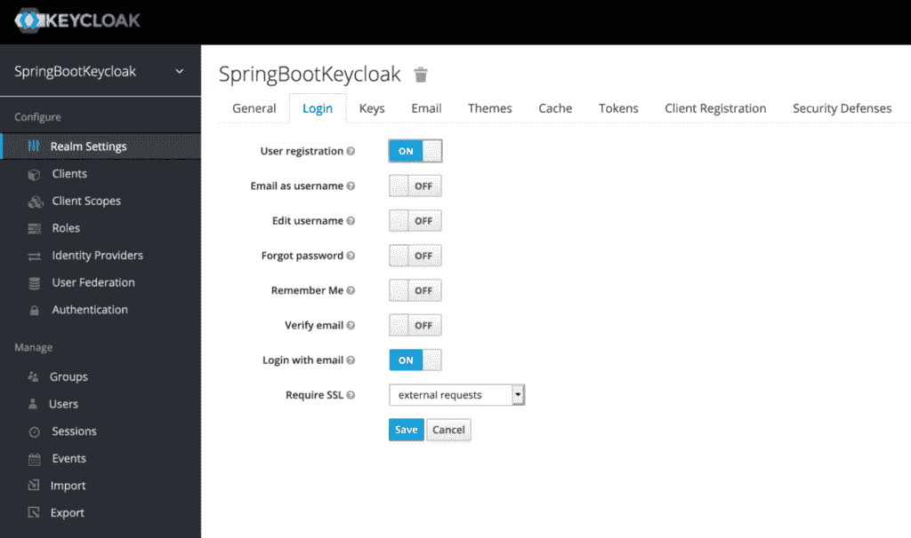
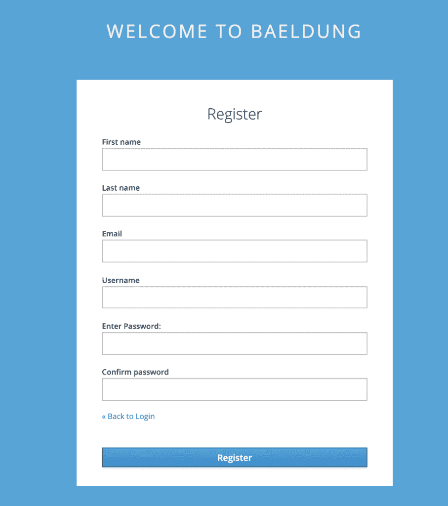
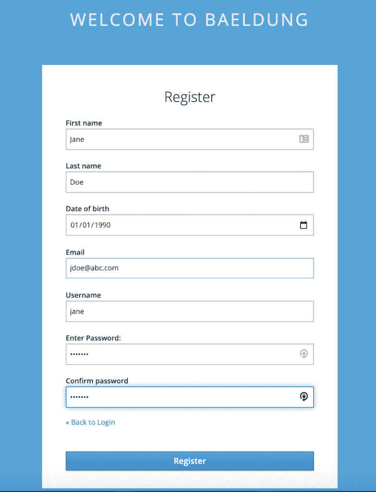
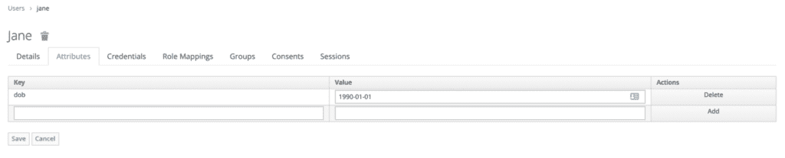
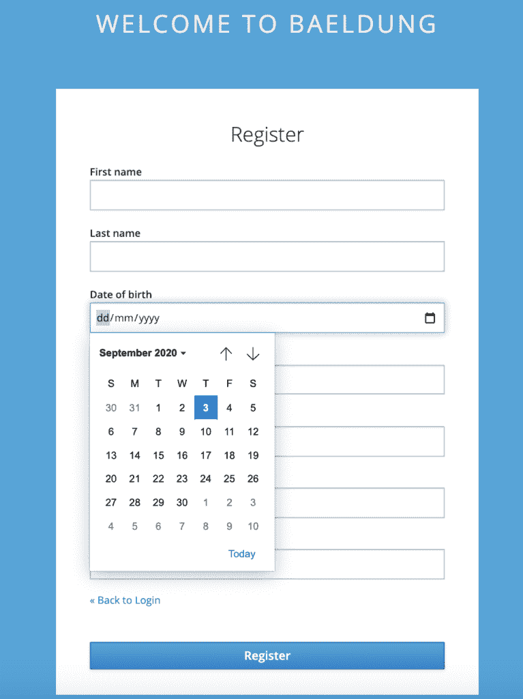

# Keycloak 用户自助注册

> 原文:[https://web . archive . org/web/20220930061024/https://www . bael dung . com/key cloak-user-registration](https://web.archive.org/web/20220930061024/https://www.baeldung.com/keycloak-user-registration)

## 1.概观

我们可以使用 [Keycloak](https://web.archive.org/web/20221208143856/https://www.keycloak.org/) 作为第三方授权服务器来管理我们的网络或移动应用程序的用户。

虽然管理员可以添加用户，但 Keycloak 也允许用户自己注册。此外，除了名字、姓氏和电子邮件等默认属性之外，我们还可以根据应用程序的需要添加额外的用户属性。

在本教程中，我们将看到如何在 Keycloak 上启用自注册，并在用户注册页面上添加自定义字段。

我们正在[的基础上定制登录页面](/web/20221208143856/https://www.baeldung.com/keycloak-custom-login-page)，所以在初始设置时先浏览一下会很有帮助。

## 2.独立服务器

首先，我们将看到一个独立的 Keycloak 服务器的用户自注册。

### 2.1.启用用户注册

**最初，我们需要启用 Keycloak 来允许用户注册**。为此，我们首先需要从 Keycloak 发行版的`bin`文件夹中运行这个命令来启动服务器:

```
./standalone.sh -Djboss.socket.binding.port-offset=100
```

然后我们需要去[管理控制台](https://web.archive.org/web/20221208143856/http://localhost:8180/auth/admin)，输入`initial1` / `zaq1!QAZ` 凭证。

接下来，在`Realm Settings`页面的`Login`选项卡中，我们将切换`User registration`按钮:

[](/web/20221208143856/https://www.baeldung.com/wp-content/uploads/2020/09/user_registration-1536x909-1.png)

仅此而已！我们只需点击`Save`，自助注册就会启用。

所以现在**我们会在[登录页面](https://web.archive.org/web/20221208143856/http://localhost:8180/auth/realms/SpringBootKeycloak/protocol/openid-connect/auth?response_type=code&client_id=login-app&scope=openid&redirect_uri=http://localhost:8081/)** 上得到一个名为`Register`的链接:

[](/web/20221208143856/https://www.baeldung.com/wp-content/uploads/2020/09/login_with_registerlink.png)

同样，回想一下这个页面看起来与 Keycloak 的默认登录页面不同，因为我们扩展了我们之前做的定制。

注册链接将我们带到`Register`页面:

[](/web/20221208143856/https://www.baeldung.com/wp-content/uploads/2020/09/registration_page.png)

我们可以看到，**默认页面包含了一个 Keycloak 用户的基本属性**。

在下一节中，我们将看到如何为我们的选择添加额外的属性。

### 2.2.添加自定义用户属性

继续我们的[自定义主题](/web/20221208143856/https://www.baeldung.com/spring-keycloak-custom-themes)，让我们将现有模板`base/login/register.ftl`复制到我们的`custom/login`文件夹中。

我们现在将尝试为`Date of birth`添加一个新字段`dob`。为此，我们需要修改上面的`register.ftl`，并添加以下内容:

```
<div class="form-group">
    <div class="${properties.kcLabelWrapperClass!}">
        <label for="user.attributes.dob" class="${properties.kcLabelClass!}">
          Date of birth</label>
    </div>

    <div class="${properties.kcInputWrapperClass!}">
        <input type="date" class="${properties.kcInputClass!}" 
          id="user.attributes.dob" name="user.attributes.dob" 
          value="${(register.formData['user.attributes.dob']!'')}"/>
    </div>
</div>
```

现在**当我们在这个页面注册一个新用户时，我们可以输入它的`Date of birth`以及**:

[](/web/20221208143856/https://www.baeldung.com/wp-content/uploads/2020/09/JaneDoe.png)

为了验证，让我们打开管理控制台上的`Users`页面，并查找`Jane`:

[](/web/20221208143856/https://www.baeldung.com/wp-content/uploads/2020/09/Jane_DOB-1536x310-1.png)

接下来，让我们去`Jane`的`Attributes` 看看`DOB`:

[](/web/20221208143856/https://www.baeldung.com/wp-content/uploads/2020/09/Jane_DOB-1-1536x310-1.png)

显而易见，这里显示的出生日期与我们在自我登记表上输入的日期相同。

## 3.嵌入式服务器

现在让我们看看如何为嵌入在 Spring Boot 应用程序中的 Keycloak 服务器[添加自定义属性。](/web/20221208143856/https://www.baeldung.com/keycloak-embedded-in-spring-boot-app)

与独立服务器的第一步相同，我们需要在开始时启用用户注册。

我们可以通过在我们的领域定义文件 [`baeldung-realm.json`](/web/20221208143856/https://www.baeldung.com/keycloak-embedded-in-spring-boot-app#keycloak-config) 中将`registrationAllowed` 设置为`true`来做到这一点:

```
"registrationAllowed" : true,
```

之后，我们需要**把`Date of birth`加到`register.ftl`上，和之前**做的完全一样。

接下来，让我们将这个文件复制到我们的`src/main/resources/themes/custom/login`目录中。

现在启动服务器，我们的[登录页面](https://web.archive.org/web/20221208143856/http://localhost:8083/auth/realms/baeldung/protocol/openid-connect/auth?response_type=code&client_id=jwtClient&scope=openid&redirect_uri=http://localhost:8084/)带有注册链接。这是带有自定义字段`Date of birth`的自助注册页面:

[](/web/20221208143856/https://www.baeldung.com/wp-content/uploads/2020/09/Embedded_register.png)

重要的是要记住，通过嵌入式服务器的自助注册页面添加的**用户是暂时的**。

因为我们没有将该用户添加到预配置文件中，所以它在服务器重启时不可用。然而，在开发阶段，当我们只检查设计和功能时，这是很方便的。

为了进行测试，在重启服务器之前，我们可以从[管理控制台](https://web.archive.org/web/20221208143856/http://localhost:8083/auth/admin/master/console/)验证用户是否添加了`DOB`作为自定义属性。我们还可以尝试使用新用户的凭证登录。

## 4.结论

在本教程中，**我们学习了如何在 Keycloak** 中启用用户自注册。我们还看到了如何在注册为新用户时添加定制属性。

我们查看了如何为独立实例和嵌入式实例实现这一点的示例。

和往常一样，源代码可以在 GitHub 上获得。对于独立服务器，它在[教程 GitHub](https://web.archive.org/web/20221208143856/https://github.com/eugenp/tutorials/tree/master/spring-boot-modules/spring-boot-keycloak) 上，对于嵌入式实例，它在 [OAuth GitHub](https://web.archive.org/web/20221208143856/https://github.com/Baeldung/spring-security-oauth/tree/master/oauth-jwt) 上。