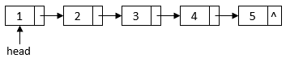
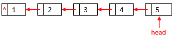

# 在 Java 中反转链表

> 原文:[https://web . archive . org/web/20220930061024/https://www . bael dung . com/Java-reverse-linked-list](https://web.archive.org/web/20220930061024/https://www.baeldung.com/java-reverse-linked-list)

## **1。简介**

在本教程中，我们将用 Java 实现[两个链表反转算法](/web/20221101010756/https://www.baeldung.com/cs/reverse-linked-list)。

## **2。**链表数据结构****

链表是一种线性数据结构，其中每个元素中的指针决定顺序。**链表的每个元素都包含一个存储列表数据的数据字段和一个指向序列中下一个元素的指针字段。**同样，我们可以使用一个`head`指针指向一个链表的开始元素:

[](/web/20221101010756/https://www.baeldung.com/wp-content/uploads/2020/09/linkedlist.png)

我们反转链表后，`head`会指向原链表的最后一个元素，每个元素的指针都会指向原链表的前一个元素:

[](/web/20221101010756/https://www.baeldung.com/wp-content/uploads/2020/09/reversedlinkedlist1.png)

在 Java 中，我们有一个`[LinkedList](/web/20221101010756/https://www.baeldung.com/java-linkedlist)` 类来提供`List`和`Deque`接口的双向链表实现。然而，在本教程中，我们将使用一个通用的单链表数据结构。

让我们首先用一个`ListNode`类来表示一个链表的元素:

```
public class ListNode {

    private int data;
    private ListNode next;

    ListNode(int data) {
        this.data = data;
        this.next = null;
    }

   // standard getters and setters
}
```

`ListNode `类有两个字段:

*   表示元素数据的整数值
*   指向下一个元素的指针/引用

一个链表可以包含多个`ListNode`对象。例如，我们可以用一个循环来构造上面的样本链表:

```
ListNode constructLinkedList() {
    ListNode head = null;
    ListNode tail = null;
    for (int i = 1; i <= 5; i++) {
        ListNode node = new ListNode(i);
        if (head == null) {
            head = node;
        } else {
            tail.setNext(node);
        }
        tail = node;
    }
    return head;
}
```

## **3。**迭代算法实现****

让我们用 Java 实现[迭代算法](/web/20221101010756/https://www.baeldung.com/cs/reverse-linked-list#iterative):

```
ListNode reverseList(ListNode head) {
    ListNode previous = null;
    ListNode current = head;
    while (current != null) {
        ListNode nextElement = current.getNext();
        current.setNext(previous);
        previous = current;
        current = nextElement;
    }
    return previous;
}
```

在这个迭代算法中，我们用两个`ListNode`变量`previous`和`current`来表示链表中两个相邻的元素。对于每次迭代，我们颠倒这两个元素，然后转移到下两个元素。

最后，`current` 指针将是`null,`，`previous`指针将是旧链表的最后一个元素。所以，`previous `也是反向链表的新头指针，我们从方法中返回。

我们可以用一个简单的单元测试来验证这个迭代实现:

```
@Test
public void givenLinkedList_whenIterativeReverse_thenOutputCorrectResult() {
    ListNode head = constructLinkedList();
    ListNode node = head;
    for (int i = 1; i <= 5; i++) {
        assertNotNull(node);
        assertEquals(i, node.getData());
        node = node.getNext();
    }

    LinkedListReversal reversal = new LinkedListReversal();
    node = reversal.reverseList(head);

    for (int i = 5; i >= 1; i--) {
        assertNotNull(node);
        assertEquals(i, node.getData());
        node = node.getNext();
    }
}
```

在这个单元测试中，我们首先构建一个包含五个节点的样本链表。此外，我们验证链表中的每个节点都包含正确的数据值。然后，我们调用迭代函数来反转链表。最后，我们检查反向链表以确保数据如预期的那样被反向。

## **4。递归**算法实现****

现在，让我们用 Java 实现[递归算法](/web/20221101010756/https://www.baeldung.com/cs/reverse-linked-list#recursive):

```
ListNode reverseListRecursive(ListNode head) {
    if (head == null) {
        return null;
    }
    if (head.getNext() == null) {
        return head;
    }
    ListNode node = reverseListRecursive(head.getNext());
    head.getNext().setNext(head);
    head.setNext(null);
    return node;
}
```

在`reverseListRecursive` 函数中，我们递归地访问链表中的每个元素，直到到达最后一个。这最后一个元素将成为反向链表的新头部。此外，我们将被访问的元素附加到部分反向链表的末尾。

类似地，我们可以用一个简单的单元测试来验证这个递归实现:

```
@Test
public void givenLinkedList_whenRecursiveReverse_thenOutputCorrectResult() {
    ListNode head = constructLinkedList();
    ListNode node = head;
    for (int i = 1; i <= 5; i++) {
        assertNotNull(node);
        assertEquals(i, node.getData());
        node = node.getNext();
    }

    LinkedListReversal reversal = new LinkedListReversal();
    node = reversal.reverseListRecursive(head);

    for (int i = 5; i >= 1; i--) {
        assertNotNull(node);
        assertEquals(i, node.getData());
        node = node.getNext();
    }
}
```

## **5。结论**

在本教程中，我们实现了两个算法来反转一个链表。和往常一样，这篇文章的源代码可以在 GitHub 的[上找到。](https://web.archive.org/web/20221101010756/https://github.com/eugenp/tutorials/tree/master/algorithms-modules/algorithms-miscellaneous-6)