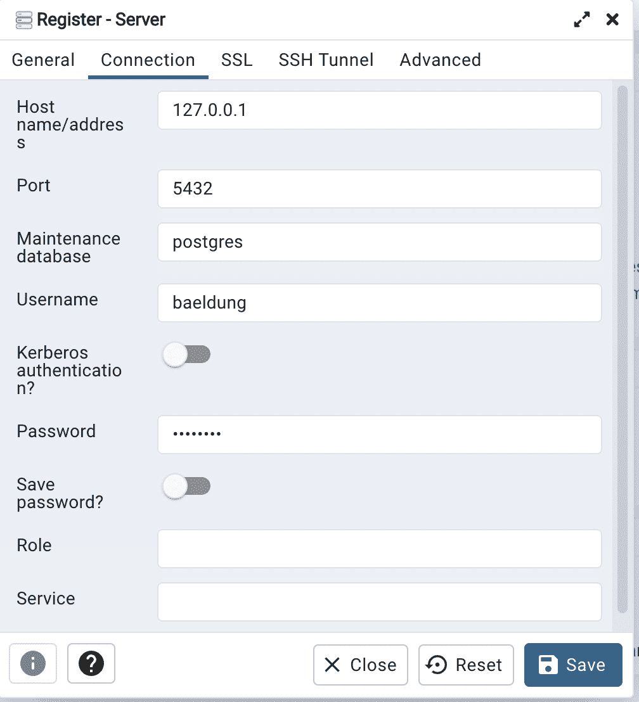

# 带有 Docker 设置的 PostgreSQL

> 原文：<https://web.archive.org/web/20220930061024/https://www.baeldung.com/ops/postgresql-docker-setup>

## 1.概观

在本教程中，我们将学习用 [Docker](/web/20221014083849/https://www.baeldung.com/ops/docker-guide) 安装 [PostgreSQL](https://web.archive.org/web/20221014083849/https://www.postgresql.org/) 。通常，我们使用公共 Docker 映像运行 Docker 容器。类似地，我们可以从 Docker Hub 获取 PostgreSQL 数据库服务器的预配置 Docker 映像。在这里，我们还将演示如何在 Docker 上安装、配置和运行 PostgreSQL。

首先，我们将使用 [PostgreSQL 公共映像](https://web.archive.org/web/20221014083849/https://hub.docker.com/_/postgres)运行带有 PostgreSQL 数据库的 Docker 容器。稍后，我们将创建一个定制的 Docker 文件，在 Docker 容器中安装 PostgreSQL 服务器。我们还将学习使用 Docker 容器备份和恢复数据库。

让我们深入研究使用 PostgreSQL 数据库运行 Docker 容器。

## 2.了解 PostgreSQL 数据库

在我们继续运行 PostgreSQL 数据库的 Docker 容器之前，让我们先了解一下 PostgreSQL 数据库。PostgreSQL 是一个类似于 MySQL 的开源 RDMS。它是一个面向对象的数据库，但我们可以处理结构化和非结构化数据。

PostgreSQL 数据库引擎运行在各种平台上，包括 Windows、Mac OS X 和 Linux。它还提供高级数据类型和性能优化功能，以存储和扩展复杂的数据库工作负载。

## 3.使用公共映像设置 PostgreSQL

要使用 Docker 运行 PostgreSQL，我们首先需要提取在 [Docker Hub](https://web.archive.org/web/20221014083849/https://hub.docker.com/_/postgres) 上可用的`postgres`公共图像:

[PRE0]

在上面的命令中，我们拉出了`postgres`最新的稳定图像。我们还可以使用下面的命令提取特定版本的`postgres`图像:

[PRE1]

现在，我们将使用下面的命令运行使用`postgres:latest`图像的 Docker 容器:

[PRE2]

上面的命令使用环境变量`POSTGRES_USER`和`POSTGRES_PASSWORD`为 PostgreSQL 数据库设置`username`和`password`。默认情况下，PostgreSQL 数据库运行在`5432`端口上。我们使用`docker run`命令中的`“-p 5432:5432”`暴露了主机上的`5432`端口。
为了备份数据，我们还将`/var/lib/postgresql/data`目录挂载到`postgres`容器的主机的`/data`目录中。

`psql` 是一个命令行实用程序，用于交互式访问 PostgreSQL 数据库。现在让我们使用`psql`来连接数据库:

[PRE3]

为了从所有数据库中获取列表，我们将使用命令`\l `:

[PRE4]

在上面的输出中，我们可以获得 PostgreSQL 服务器上所有数据库的详细信息。

## 4.使用定制的 Dockerfile 文件设置 PostgreSQL

我们还可以通过创建定制的 docker 文件来设置 PostgreSQL 数据库服务器。在这里，我们将创建一个 Dockerfile 文件，其中包含使用 CentOS 作为基本映像安装`Postgres`所需的所有命令:

[PRE5]

在上面的 docker 文件中，我们使用`startUpScript.sh`在成功安装后启动 PostgreSQL 数据库服务器。让我们看看`startUpScript.sh`文件:

[PRE6]

在`startUpScript.sh`中，我们首先初始化 PostgreSQL 数据库，然后创建一个虚拟数据库`baeldung`。

## 5.在对接器上安装`pgAdmin`

到目前为止，PostgreSQL 服务器是活动的，运行在`5432`端口上。现在，我们将安装 [pgAdmin](https://web.archive.org/web/20221014083849/https://www.pgadmin.org/) ，这是一个基于 web 的用户界面工具，用于管理 PostgreSQL 数据库和服务。 **pgAdmin 可用于在 PostgreSQL 数据库上运行 SQL 查询**。

要从 UI 中执行所有查询，我们可以使用 pgAdmin，为此，我们需要使用以下命令提取 [pgAdmin](https://web.archive.org/web/20221014083849/https://hub.docker.com/r/dpage/pgadmin4/) 图像:

[PRE7]

为了演示，让我们使用下面的命令运行容器:

[PRE8]

在上面的命令中，我们将`PGADMIN_DEFAULT_EMAIL`和`PGADMIN_DEFAULT_PASSWORD`作为环境变量提供给了`pgadmin-baeldung`容器:

我们可以使用 pgAdmin GUI 轻松访问 PostgreSQL 数据库。为了访问数据库，我们必须使用 pgAdmin 建立到 Postgres 服务器的连接。我们可以通过登录 pgAdmin 来实现这一点。

## 6.备份和恢复数据

在本节中，我们将学习使用 Docker 命令备份和恢复 PostgreSQL 中的数据。

首先，为了备份数据，让我们创建一个虚拟数据库`baeldung`和一个表`baeldungauthor.`

[PRE9]

创建表格的命令如下:

[PRE10]

让我们列出数据库中创建的表:

[PRE11]

现在使用下面的命令获取表`baeldungauthor`的模式细节:

[PRE12]

到目前为止，我们已经创建了一个数据库和一个表。让我们研究一下为 Docker 容器备份数据库的命令:

[PRE13]

这里，在上面的命令中，我们使用了`pg_dumpall`来备份`baeldung`数据库。这是一个用于备份数据库的标准 PostgreSQL 工具。在命令中，我们提供了 DB 服务器的用户名来访问权限。

现在让我们来看看恢复数据库的命令:

[PRE14]

这里，简而言之，我们使用`psql`命令恢复了`baeldung`数据库的所有表。

## 7.结论

在本文中，我们学习了使用 Docker 容器安装 PostgreSQL 数据库。我们研究了拉取、设置和运行 Postgres 的 Docker 容器的每个步骤。此外，我们探索了访问 PostgreSQL 数据库服务器的两种方法。首先，我们研究了 pgAdmin 如何访问 Docker 容器上运行的 PostgreSQL 数据库服务器。稍后，我们使用`psql`在 PostgreSQL 中对数据库执行查询。

总之，我们使用 Docker Hub 上的 Postgres 公共映像运行了带有 PostgreSQL 数据库的 Docker 容器。我们还创建了定制的 Docker 文件，以便在 Docker 容器中安装 PostgreSQL 服务器。

最后，我们研究了用 Docker 容器备份和恢复 PostgreSQL 数据库中的数据。