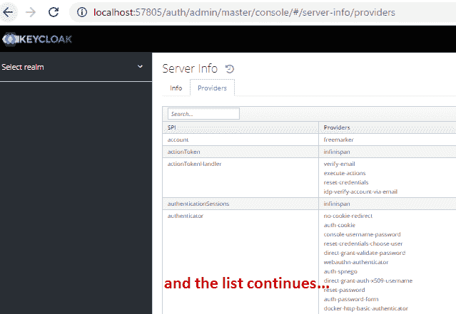
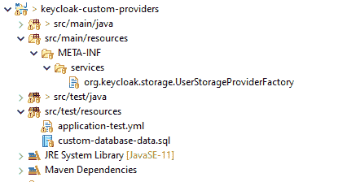
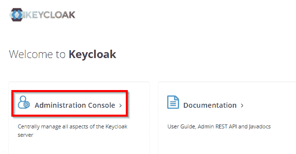
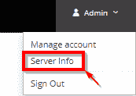
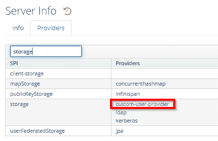
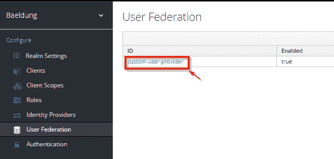
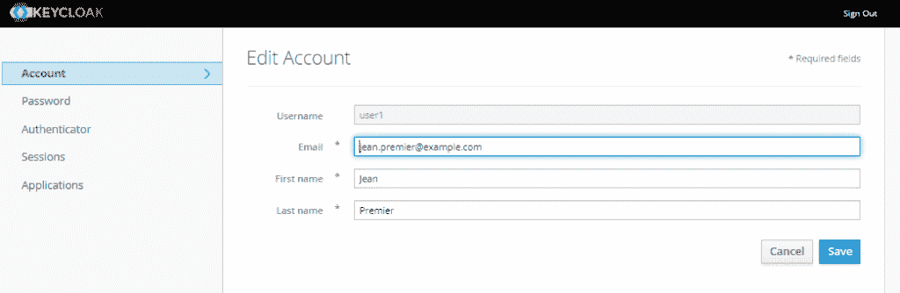

# 将自定义用户提供程序与 Keycloak 一起使用

> 原文:[https://web . archive . org/web/20220930061024/https://www . bael dung . com/Java-key cloak-custom-user-providers](https://web.archive.org/web/20220930061024/https://www.baeldung.com/java-keycloak-custom-user-providers)

## 1.介绍

在本教程中，我们将展示如何向一个流行的开源身份管理解决方案 [Keycloak](/web/20220702084456/https://www.baeldung.com/spring-boot-keycloak) 添加一个自定义提供程序，这样我们就可以将其用于现有的和/或非标准的用户存储。

## 2.带有 Keycloak 的自定义提供程序概述

Keycloak 提供了一系列现成的基于标准的集成，这些集成基于 SAML、OpenID Connect 和 [OAuth2](/web/20220702084456/https://www.baeldung.com/spring-security-oauth) 等协议。**虽然这个内置功能相当强大，但有时还不够**。一个常见的需求是将这些系统中的用户集成到 Keycloak 中，尤其是在涉及遗留系统的时候。**为了适应这种和类似的集成场景，Keycloak 支持定制提供者的概念。**

自定义提供程序在 Keycloak 的架构中起着关键作用。对于每个主要功能，比如登录流、身份验证、授权，都有一个相应的服务提供者接口。这种方法允许我们为这些服务中的任何一个插入定制的实现，然后 Keycloak 会像使用自己的服务一样使用它。

### 2.1.自定义提供程序部署和发现

**最简单的形式是，定制提供者只是一个包含一个或多个服务实现的标准 jar 文件。**在启动时，Keycloak 将扫描它的类路径，并使用标准的 [`java.util.ServiceLoader`机制](/web/20220702084456/https://www.baeldung.com/java-spi)挑选所有可用的提供者。这意味着我们所要做的就是在 jar 的`META-INF/services`文件夹中创建一个以我们想要提供的特定服务接口命名的文件，并将我们实现的完全限定名放入其中。

但是，我们能给 Keycloak 添加什么样的服务呢？如果我们转到 Keycloak 管理控制台上的`server info`页面，我们会看到很多这样的页面:

[](/web/20220702084456/https://www.baeldung.com/wp-content/uploads/2021/01/keycloak_server_info_providers-1.png)

在这张图片中，左边的列对应于一个给定的服务提供者接口(简称 SPI)，右边的列显示了该特定 SPI 的可用提供者。

### 2.2.可用 SPI

Keycloak 的主要文档列出了以下 SPI:

*   `org.keycloak.authentication.AuthenticatorFactory`:定义认证用户或客户端应用程序所需的动作和交互流
*   `org.keycloak.authentication.actiontoken.ActionTokenHandlerFactory`:允许我们创建自定义动作，当到达`**/auth/realms/master/login-actions/action-token**`端点时，Keycloak 将执行这些动作。例如，这种机制是标准密码重置流程的基础。包括在电子邮件中的链接包括这样的动作令牌
*   `org.keycloak.events.EventListenerProviderFactory`:创建一个监听 Keycloak 事件的提供程序。 [`EventType` Javadoc 页面](https://web.archive.org/web/20220702084456/https://www.keycloak.org/docs-api/11.0/javadocs/org/keycloak/events/EventType.html)包含一个提供者可以处理的可用事件定制列表。使用这个 SPI 的典型用途是创建一个审计数据库
*   `org.keycloak.adapters.saml.RoleMappingsProvider`:将从外部身份提供者接收的 SAML 角色映射到 Keycloak 的角色。这种映射非常灵活，允许我们在给定领域的上下文中重命名、删除和/或添加角色
*   `org.keycloak.storage.UserStorageProviderFactory`:允许 Keycloak 访问自定义用户存储
*   允许我们使用自定义的金库来存储特定领域的秘密。这些信息包括加密密钥、数据库凭证等。

现在，这个列表并没有涵盖所有可用的 SPI:它们只是记录最完整的，并且在实践中，最有可能需要定制。

## 3.自定义提供程序实现

正如我们在本文的介绍中提到的，我们的提供者示例将允许我们使用带有只读自定义用户存储库的 Keycloak。例如，在我们的例子中，这个用户存储库只是一个带有几个属性的常规 SQL 表:

```
create table if not exists users(
    username varchar(64) not null primary key,
    password varchar(64) not null,
    email varchar(128),
    firstName varchar(128) not null,
    lastName varchar(128) not null,
    birthDate DATE not null
); 
```

为了支持这个定制用户存储，我们必须实现`UserStorageProviderFactory` SPI 并将其部署到现有的 Keycloak 实例中。

这里的一个关键点是只读部分。我们的意思是，用户将能够使用他们的凭证登录到 Keycloak，但不能更改自定义存储中的任何信息，包括他们的密码。然而，这不是一个 Keycloak 限制，因为它实际上支持双向更新。内置 LDAP 提供程序是支持此功能的提供程序的一个很好的例子。

### 3.1.项目设置

我们的定制提供者项目只是一个创建 jar 文件的常规 Maven 项目。为了避免我们的提供者进入常规的 Keycloak 实例的耗时的编译-部署-重启循环，我们将使用一个好的技巧:将 Keycloak 作为测试时依赖嵌入到我们的项目中。

**我们已经介绍过[如何在 SpringBoot 应用](/web/20220702084456/https://www.baeldung.com/keycloak-embedded-in-spring-boot-app)中嵌入 Keycloack，所以我们在这里就不再赘述了**。通过采用这种技术，我们将获得更快的启动时间和热重新加载能力，提供更流畅的开发人员体验。这里，我们将重用示例 SpringBoot 应用程序直接从我们的自定义提供程序运行我们的测试，因此我们将把它作为测试依赖项添加进来:

```
<dependency>
    <groupId>org.keycloak</groupId>
    <artifactId>keycloak-core</artifactId>
    <version>12.0.2</version>
</dependency>

<dependency>
    <groupId>org.keycloak</groupId>
    <artifactId>keycloak-server-spi</artifactId>
    <version>12.0.2</version>
</dependency>

<dependency>
    <groupId>com.baeldung</groupId>
    <artifactId>oauth-authorization-server</artifactId>
    <version>0.1.0-SNAPSHOT</version>
    <scope>test</scope>
</dependency> 
```

我们对 [`keycloak-core`](https://web.archive.org/web/20220702084456/https://search.maven.org/search?q=g:org.keycloak%20AND%20a:keycloak-core) 和 [`keycloak-server-spi`](https://web.archive.org/web/20220702084456/https://search.maven.org/search?q=g:org.keycloak%20AND%20a:keycloak-server-spi) 键盘锁依赖使用的是最新的 11 系列版本。

然而，`oauth-authorization-server`依赖项必须从 [Baeldung 的 Spring Security OAuth 库](https://web.archive.org/web/20220702084456/https://github.com/Baeldung/spring-security-oauth/tree/master/oauth-rest/oauth-authorization-server)本地构建。

### 3.2.`UserStorageProviderFactory`实施

让我们通过创建`UserStorageProviderFactory`实现来启动我们的提供者，并让 Keycloak 发现它。

这个接口包含 11 个方法，但是我们只需要实现其中的两个:

*   `getId()`:返回这个提供者的唯一标识符，Keycloak 将在它的管理页面上显示这个标识符。
*   `create()`:返回实际的提供者实现。

**Keycloak 为每个事务调用`create()`方法，传递一个`KeycloakSession`和一个`ComponentModel`作为参数**。这里，事务意味着需要访问用户存储的任何操作。主要的例子是登录流:在某个时刻，Keycloak 将调用给定领域的每个已配置的用户存储来验证凭证。因此，我们应该避免在这一点上做任何昂贵的初始化动作，因为`create()`方法一直被调用。

也就是说，实现相当简单:

```
public class CustomUserStorageProviderFactory
  implements UserStorageProviderFactory<CustomUserStorageProvider> {
    @Override
    public String getId() {
        return "custom-user-provider";
    }

    @Override
    public CustomUserStorageProvider create(KeycloakSession ksession, ComponentModel model) {
        return new CustomUserStorageProvider(ksession,model);
    }
}
```

我们选择了`“custom-user-provider”`作为我们的提供者 id，我们的`create()`实现简单地返回了我们的`UserStorageProvider `实现的一个新实例。现在，我们不能忘记创建一个服务定义文件，并将其添加到我们的项目中。这个文件应该被命名为`org.keycloak.storage.UserStorageProviderFactory`，并放在我们最后一个 jar 的`META-INF/services` 文件夹中。

由于我们使用的是标准的 Maven 项目，这意味着我们将把它添加到`src/main/resources/META-INF/services`文件夹中:

[](/web/20220702084456/https://www.baeldung.com/wp-content/uploads/2021/01/keycloak_server_info_providers-pic2.png)

该文件的内容只是 SPI 实现的全限定名称:

```
# SPI class implementation
com.baeldung.auth.provider.user.CustomUserStorageProviderFactory
```

### 3.3.`UserStorageProvider`实施

乍一看， `UserStorageProvider`的实现并不像我们预期的那样。它只包含几个回调方法，没有一个与实际用户相关。原因是 Keycloak 希望我们的提供者也能实现其他支持特定用户管理方面的混合接口。

可用接口[的完整列表可以在 Keycloak 的文档](https://web.archive.org/web/20220702084456/https://www.keycloak.org/docs/11.0/server_development/index.html#provider-capability-interfaces)中找到，在那里它们被称为`Provider Capabilities. ` **对于一个简单的只读提供者，我们需要实现的唯一接口是`UserLookupProvider`。它只提供查找功能，这意味着 Keycloak 会在需要时自动将用户导入其内部数据库。但是，原始用户的密码不会用于身份验证。为此，我们还需要实施`CredentialInputValidator`。**

最后，一个常见的需求是能够在 Keycloak 的管理界面中显示我们的自定义存储中的现有用户。这要求我们实现另一个接口:`UserQueryProvider`。这一个添加了一些查询方法，充当我们的存储的 DAO。

因此，考虑到这些需求，我们的实现应该是这样的:

```
public class CustomUserStorageProvider implements UserStorageProvider, 
  UserLookupProvider,
  CredentialInputValidator, 
  UserQueryProvider {

    // ... private members omitted

    public CustomUserStorageProvider(KeycloakSession ksession, ComponentModel model) {
      this.ksession = ksession;
      this.model = model;
    }

    // ... implementation methods for each supported capability
}
```

注意，我们正在保存传递给构造函数的值。稍后我们将看到它们如何在我们的实现中发挥重要作用。

### 3.4.`UserLookupProvider`实施

Keycloak 使用这个接口中的方法来恢复一个给定了`id`、用户名或电子邮件的`UserModel`实例。在这种情况下，id 是该用户的唯一标识符，格式如下:“f:'【T2]':'`external_id`

*   f:'只是一个固定的前缀，表示这是一个联邦用户
*   `unique_id`是用户的 key cloak id
*   `external_id`是给定用户存储使用的用户标识符。在我们的例子中，这将是`username`列的值

让我们继续实现这个接口的方法，从`getUserByUsername()`开始:

```
@Override
public UserModel getUserByUsername(String username, RealmModel realm) {
    try ( Connection c = DbUtil.getConnection(this.model)) {
        PreparedStatement st = c.prepareStatement(
          "select " +
          "  username, firstName, lastName, email, birthDate " + 
          "from users " + 
          "where username = ?");
        st.setString(1, username);
        st.execute();
        ResultSet rs = st.getResultSet();
        if ( rs.next()) {
            return mapUser(realm,rs);
        }
        else {
            return null;
        }
    }
    catch(SQLException ex) {
        throw new RuntimeException("Database error:" + ex.getMessage(),ex);
    }
} 
```

正如所料，这是一个简单的数据库查询，使用提供的`username`来查找它的信息。有两个有趣的地方需要解释一下:`DbUtil.getConnection()`和`mapUser()`。

`DbUtil`是一个助手类，它从我们在构造函数中获取的`ComponentModel`中包含的信息返回一个 JDBC `Connection`。我们稍后将介绍它的细节。

**至于`mapUser()`，它的工作是将包含用户数据的数据库记录映射到一个`UserModel`实例。**一个`UserModel`代表一个用户实体，如 Keycloak 所见，并且有方法读取其属性。我们在这里实现了这个接口，它扩展了 Keycloak 提供的`AbstractUserAdapter` 类。我们还在实现中添加了一个`Builder`内部类，因此`mapUser()` 可以轻松创建`UserModel` 实例:

```
private UserModel mapUser(RealmModel realm, ResultSet rs) throws SQLException {
    CustomUser user = new CustomUser.Builder(ksession, realm, model, rs.getString("username"))
      .email(rs.getString("email"))
      .firstName(rs.getString("firstName"))
      .lastName(rs.getString("lastName"))
      .birthDate(rs.getDate("birthDate"))
      .build();
    return user;
} 
```

类似地，其他方法基本上遵循上述相同的模式，所以我们不会详细讨论它们。请参考提供者的代码并检查所有的`getUserByXXX`和`searchForUser`方法。

### 3.5.得到一个`Connection`

现在，让我们来看看`DbUtil.getConnection()`方法:

```
public class DbUtil {

    public static Connection getConnection(ComponentModel config) throws SQLException{
        String driverClass = config.get(CONFIG_KEY_JDBC_DRIVER);
        try {
            Class.forName(driverClass);
        }
        catch(ClassNotFoundException nfe) {
           // ... error handling omitted
        }

        return DriverManager.getConnection(
          config.get(CONFIG_KEY_JDBC_URL),
          config.get(CONFIG_KEY_DB_USERNAME),
          config.get(CONFIG_KEY_DB_PASSWORD));
    }
}
```

我们可以看到`ComponentModel` 是所有需要创建的参数所在的位置。但是，Keycloak 如何知道我们的定制提供者需要哪些参数呢？要回答这个问题，我们需要回到`CustomUserStorageProviderFactory.`

### 3.6.配置元数据

**`CustomUserStorageProviderFactory`，`UserStorageProviderFactory`的基本契约包含允许 Keycloak 查询配置属性元数据的方法，同样重要的是，验证赋值**。在我们的例子中，我们将定义一些建立 JDBC 连接所需的配置参数。因为这个元数据是静态的，我们将在构造函数中创建它，`getConfigProperties() `将简单地返回它。

```
public class CustomUserStorageProviderFactory
  implements UserStorageProviderFactory<CustomUserStorageProvider> {
    protected final List<ProviderConfigProperty> configMetadata;

    public CustomUserStorageProviderFactory() {
        configMetadata = ProviderConfigurationBuilder.create()
          .property()
            .name(CONFIG_KEY_JDBC_DRIVER)
            .label("JDBC Driver Class")
            .type(ProviderConfigProperty.STRING_TYPE)
            .defaultValue("org.h2.Driver")
            .helpText("Fully qualified class name of the JDBC driver")
            .add()
          // ... repeat this for every property (omitted)
          .build();
    }
    // ... other methods omitted

    @Override
    public List<ProviderConfigProperty> getConfigProperties() {
        return configMetadata;
    }

    @Override
    public void validateConfiguration(KeycloakSession session, RealmModel realm, ComponentModel config)
      throws ComponentValidationException {
       try (Connection c = DbUtil.getConnection(config)) {
           c.createStatement().execute(config.get(CONFIG_KEY_VALIDATION_QUERY));
       }
       catch(Exception ex) {
           throw new ComponentValidationException("Unable to validate database connection",ex);
       }
    }
} 
```

**在`validateConfiguration()`中，当我们提供的被添加到一个领域**时，我们将得到验证参数所需的一切。在我们的例子中，我们使用这些信息建立数据库连接并执行验证查询。如果出错，我们只需抛出一个`ComponentValidationException`，通知 Keycloak 参数无效。

**此外，尽管这里没有显示，我们也可以使用`onCreated()`方法来附加逻辑，每次管理员将我们的提供者添加到领域**时，都会执行该逻辑。这允许我们执行一次初始化时逻辑来准备我们的存储以供使用，这对于某些场景可能是必要的。例如，我们可以使用这个方法来修改我们的数据库，并添加一个列来记录给定用户是否已经使用了 Keycloak。

### 3.7.`CredentialInputValidator` 实施

**该接口包含验证用户凭证的方法**。因为 Keycloak 支持不同类型的凭证(密码、OTP 令牌、X.509 证书等。)，我们的提供者必须告知它是否支持`supportsCredentialType()` `and`中的给定类型，它是在`isConfiguredFor()`中的给定领域的上下文中为它配置的。

在我们的例子中，我们只支持密码，因为它们不需要任何额外的配置，我们可以将后一种方法委托给前一种方法:

```
@Override
public boolean supportsCredentialType(String credentialType) {
    return PasswordCredentialModel.TYPE.endsWith(credentialType);
}

@Override
public boolean isConfiguredFor(RealmModel realm, UserModel user, String credentialType) {
    return supportsCredentialType(credentialType);
} 
```

实际的密码验证发生在`isValid() `方法中:

```
@Override
public boolean isValid(RealmModel realm, UserModel user, CredentialInput credentialInput) {
    if(!this.supportsCredentialType(credentialInput.getType())) {
        return false;
    }
    StorageId sid = new StorageId(user.getId());
    String username = sid.getExternalId();

    try (Connection c = DbUtil.getConnection(this.model)) {
        PreparedStatement st = c.prepareStatement("select password from users where username = ?");
        st.setString(1, username);
        st.execute();
        ResultSet rs = st.getResultSet();
        if ( rs.next()) {
            String pwd = rs.getString(1);
            return pwd.equals(credentialInput.getChallengeResponse());
        }
        else {
            return false;
        }
    }
    catch(SQLException ex) {
        throw new RuntimeException("Database error:" + ex.getMessage(),ex);
    }
} 
```

这里有几点值得讨论。首先，注意我们是如何使用从 Keycloak 的 id 初始化的`StorageId `对象从`UserModel, `中提取外部 id 的。**我们可以利用这个 id 具有众所周知的格式这一事实，从那里提取用户名，但是为了安全起见，最好将这些知识封装在 Keycloak 提供的类中。**

接下来，是实际的密码验证。对于我们简单的、当然非常不安全的数据库，密码检查是微不足道的:只需将数据库值与用户提供的值进行比较，就可以通过`getChallengeResponse()`获得了，然后我们就完成了。当然，真实世界的提供者可能需要更多的步骤，比如从数据库中生成基于散列的密码和 salt 值，并比较散列。

最后，用户存储通常有一些与密码相关的生命周期:最长期限、阻止和/或不活动状态等等。无论如何，当实现一个提供者时，`isValid()`方法是添加这个逻辑的地方。

### 3.8.`UserQueryProvider`实施

`UserQueryProvider`功能接口告诉 Keycloak，我们的提供商可以在其商店中搜索用户。**这很方便，因为通过支持这一功能，我们将能够在管理控制台中看到用户。**

这个接口的方法有`getUsersCount(),` 获取商店的用户总数，还有几个`getXXX()`和`searchXXX()` 方法。这个查询接口不仅支持查找用户，还支持查找组，这一点我们这次不讨论。

由于这些方法的实现非常相似，让我们只看其中的一种，`searchForUser()`:

```
@Override
public List<UserModel> searchForUser(String search, RealmModel realm, int firstResult, int maxResults) {
    try (Connection c = DbUtil.getConnection(this.model)) {
        PreparedStatement st = c.prepareStatement(
          "select " + 
          "  username, firstName, lastName, email, birthDate " +
          "from users " + 
          "where username like ? + 
          "order by username limit ? offset ?");
        st.setString(1, search);
        st.setInt(2, maxResults);
        st.setInt(3, firstResult);
        st.execute();
        ResultSet rs = st.getResultSet();
        List<UserModel> users = new ArrayList<>();
        while(rs.next()) {
            users.add(mapUser(realm,rs));
        }
        return users;
    }
    catch(SQLException ex) {
        throw new RuntimeException("Database error:" + ex.getMessage(),ex);
    }
} 
```

正如我们所看到的，这里没有什么特别的:只是普通的 JDBC 代码。一个值得一提的实现注意事项:`UserQueryProvider`方法通常有分页和非分页两种版本。因为用户存储可能有大量记录，所以非分页版本应该简单地委托给分页版本，使用合理的默认值。更好的是，我们可以添加一个配置参数来定义什么是“合理的默认”。

## 4.测试

现在我们已经实现了我们的提供者，是时候使用嵌入式 Keycloak 实例在本地测试它了。该项目的代码包含一个实时测试类，我们用它来引导 Keycloak 和自定义用户数据库，然后在睡觉前一个小时在控制台上打印访问 URL。

使用这种设置，我们只需在浏览器中打开打印的 URL，就可以验证我们的自定义提供程序是否正常工作:

[](/web/20220702084456/https://www.baeldung.com/wp-content/uploads/2021/01/keycloak_server_info_providers-pic3.png)

为了访问管理控制台，我们将使用管理员凭证，这可以通过查看 `application-test.yml`文件来获得。登录后，让我们导航到“服务器信息”页面:

[](/web/20220702084456/https://www.baeldung.com/wp-content/uploads/2021/01/keycloak_server_info_providers-pic4.png)

在“Providers”选项卡上，我们可以看到我们的自定义提供商与其他内置存储提供商一起显示:

[](/web/20220702084456/https://www.baeldung.com/wp-content/uploads/2021/01/keycloak_server_info_providers-pic5.png)

我们还可以检查 Baeldung 领域是否已经在使用这个提供者。为此，我们可以在左上角的下拉菜单中选择它，然后导航到`User Federation`页面:

[](/web/20220702084456/https://www.baeldung.com/wp-content/uploads/2021/01/keycloak_server_info_providers-pic6-1.png)

接下来，让我们测试这个领域的实际登录。我们将使用该领域的帐户管理页面，用户可以在其中管理其数据。我们的现场测试将在进入睡眠之前打印这个 URL，所以我们可以从控制台复制它并粘贴到浏览器的地址栏中。

测试数据包含三个用户:用户 1、用户 2 和用户 3。它们的密码都是一样的:“changeit”。成功登录后，我们将看到帐户管理页面显示导入的用户数据:

[](/web/20220702084456/https://www.baeldung.com/wp-content/uploads/2021/01/keycloak_server_info_providers-pic7-1.png)

然而，如果我们试图修改任何数据，我们会得到一个错误。这是意料之中的，因为我们的提供者是只读的，所以 Keycloak 不允许修改它。目前，我们将保持原样，因为支持双向同步超出了本文的范围。

## 5.结论

在本文中，我们展示了如何为 Keycloak 创建一个定制的提供者，使用用户存储提供者作为一个具体的例子。这些例子的完整源代码可以在 GitHub 上找到[。](https://web.archive.org/web/20220702084456/https://github.com/Baeldung/spring-security-oauth/tree/master/oauth-rest/keycloak-custom-providers)