# 具有 MQTT、NiFi 和 InfluxDB 的物联网数据管道

> 原文：<https://web.archive.org/web/20220930061024/https://www.baeldung.com/iot-data-pipeline-mqtt-nifi>

## 1.介绍

在本教程中，我们将了解为物联网应用创建数据管道时的要求。

在这个过程中，我们将了解物联网架构的特征，并了解如何利用不同的工具，如 MQTT broker、NiFi 和 InfluxDB，为物联网应用程序构建高度可扩展的数据管道。

## 2.物联网及其架构

首先，让我们浏览一些基本概念，了解物联网应用的一般架构。

### 2.1.IoT 是什么？

**物联网(IoT)泛指物理对象**的网络，被称为“物”。例如，事物可以包括任何东西，从普通的家用物品，如灯泡，到复杂的工业设备。通过这个网络，我们可以将各种传感器和致动器连接到互联网，以交换数据:

[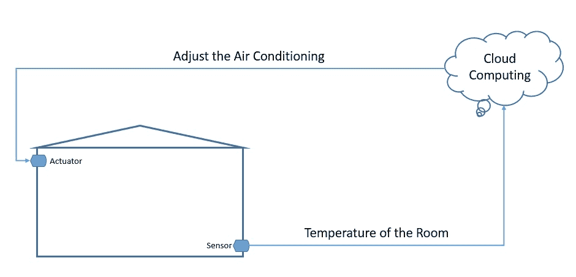](/web/20221014122027/https://www.baeldung.com/wp-content/uploads/2021/02/IoT-Home-Automation-1.jpg)

现在，我们**可以在非常不同的环境中部署东西**——例如，环境可以是我们的家或者非常不同的东西，比如移动的货运卡车。然而，我们真的不能对这些东西可用的电源和网络的质量做出任何假设。因此，这给物联网应用带来了独特的要求。

### 2.2.物联网架构简介

典型的物联网架构通常分为四个不同的层。让我们了解数据实际上是如何流经这些层的:

[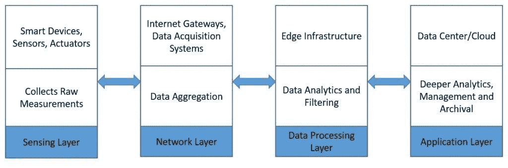](/web/20221014122027/https://www.baeldung.com/wp-content/uploads/2021/02/IoT-Architecture-Layers.jpg)

首先，**传感层主要由从环境中收集测量值**的传感器组成。然后，网络层帮助汇总原始数据，并通过互联网发送出去进行处理。此外，数据处理层过滤原始数据并生成早期分析。最后，**应用层采用强大的数据处理能力**来执行更深入的数据分析和管理。

## 3.MQTT、NiFi 和 InfluxDB 简介

现在，让我们来看看目前物联网设置中广泛使用的一些产品。这些都提供了一些独特的功能，使它们适合物联网应用程序的数据要求。

### 3.1.MQTT

[消息队列遥测传输(MQTT)](https://web.archive.org/web/20221014122027/https://mqtt.org/) 是**一个轻量级的发布-订阅网络协议**。它现在是一个[绿洲](https://web.archive.org/web/20221014122027/https://www.oasis-open.org/committees/tc_home.php?wg_abbrev=mqtt)和 [ISO 标准](https://web.archive.org/web/20221014122027/https://www.iso.org/standard/69466.html)。IBM 最初开发它是为了在设备之间传输消息。MQTT 适用于内存、网络带宽和电源稀缺的受限环境。

MQTT **遵循客户机-服务器模型**，其中不同的组件可以充当客户机并通过 TCP 连接到服务器。我们知道这个服务器是一个 MQTT 代理。客户端可以将消息发布到一个称为主题的地址。他们还可以订阅某个主题，并接收发布到该主题的所有消息。

在典型的物联网设置中，传感器可以向 MQTT 代理发布温度等测量值，上游数据处理系统可以订阅这些主题来接收数据:

[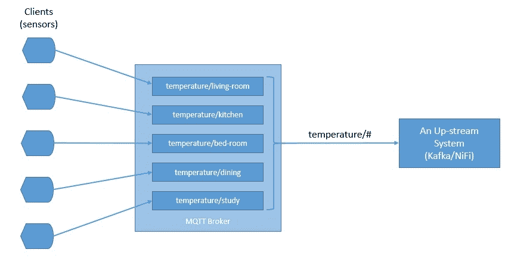](/web/20221014122027/https://www.baeldung.com/wp-content/uploads/2021/02/MQTT-Architecture.jpg)

正如我们所看到的，MQTT 中的主题是分层的。通过使用通配符，系统可以很容易地订阅整个主题层次结构。

MQTT **支持三个级别的服务质量(QoS)** 。这些是“最多递送一次”、“至少递送一次”和“恰好递送一次”。QoS 定义了客户端和服务器之间的协议级别。每个客户端都可以选择适合其环境的服务级别。

客户端还可以请求代理在发布消息时保存消息。在某些设置中，MQTT 代理可能需要来自客户机的用户名和密码认证，以便进行连接。此外，为了保密，TCP 连接可以用 SSL/TLS 加密。

有几个 **MQTT 代理实现和客户端库**可供使用——例如 [HiveMQ](https://web.archive.org/web/20221014122027/https://www.hivemq.com/) 、 [Mosquitto](https://web.archive.org/web/20221014122027/https://mosquitto.org/) 和 [Paho MQTT](https://web.archive.org/web/20221014122027/https://www.eclipse.org/paho/) 。在本教程的例子中，我们将使用 Mosquitto。Mosquitto 是 Eclipse Foundation 的一部分，我们可以很容易地将它安装在像 Raspberry Pi 或 Arduino 这样的板上。

### 3.2 .阿帕奇尼菲

[Apache NiFi](https://web.archive.org/web/20221014122027/https://nifi.apache.org/) 最初由 NSA 开发为 NiagaraFiles。它**促进了系统**之间数据流的自动化和管理，并基于[基于流程的编程模型](https://web.archive.org/web/20221014122027/https://en.wikipedia.org/wiki/Flow-based_programming)，该模型将应用程序定义为一个黑盒进程网络。

让我们先过一遍一些基本概念。在 NiFi 中穿过系统的**对象被称为流文件**。流文件处理器实际上执行有用的工作，如路由、转换和流文件的中介。流文件处理器通过连接进行连接。

流程组是一种将组件组合在一起的机制，用于在 NiFi 中组织数据流。进程组可以通过输入端口接收数据，并通过输出端口发送数据。远程进程组(RPG)提供了一种向 NiFi 的远程实例发送数据或从其接收数据的机制。

现在，有了这些知识，我们来看看 NiFi 架构:

[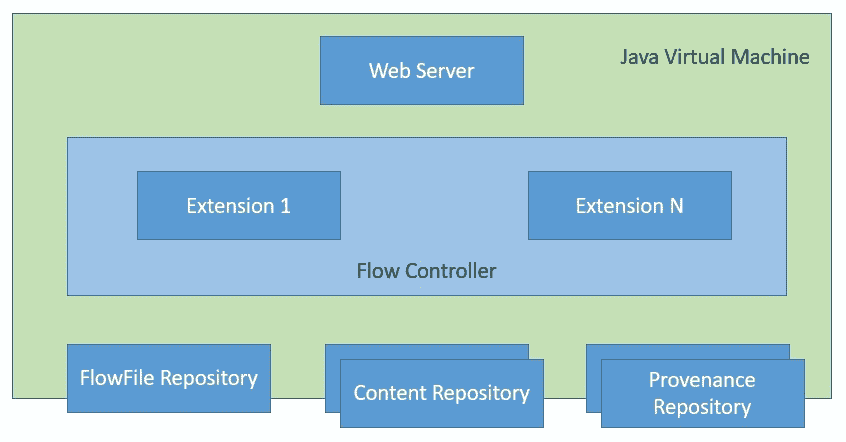](/web/20221014122027/https://www.baeldung.com/wp-content/uploads/2021/02/NiFi-Architecture.jpg)

NiFi 是一个基于 Java 的程序，它在一个 JVM 中运行多个组件。Web 服务器是托管命令和控制 API 的组件。流量控制器是 NiFi 的核心组件，它管理扩展接收资源的时间表。扩展允许 NiFi 可扩展并支持与不同系统的集成。

NiFi 跟踪流文件存储库中的流文件的状态。流文件的实际内容字节位于内容存储库中。最后，与流文件相关的起源事件数据驻留在起源储存库中。

由于在数据源收集数据可能需要较小的占用空间和较低的资源消耗，NiFi 有一个名为 [MiNiFi](https://web.archive.org/web/20221014122027/https://nifi.apache.org/minifi/index.html) 的子项目。 **MiNiFi 为 NiFi** 提供了一种互补的数据收集方法，并通过站点到站点(S2S)协议轻松与 NiFi 集成:

[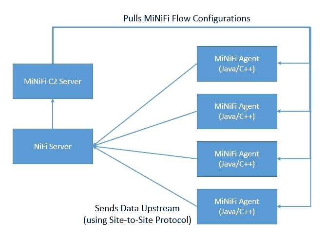](/web/20221014122027/https://www.baeldung.com/wp-content/uploads/2021/02/NiFi-MiNiFi-C2.jpg)

此外，它还支持通过 [MiNiFi 命令和控制(C2)](https://web.archive.org/web/20221014122027/https://github.com/apache/nifi-minifi/tree/master/minifi-c2) 协议对代理进行集中管理。此外，它通过生成完整的保管信息链来帮助建立数据来源。

### 3.3.InfluxDB

[InfluxDB](https://web.archive.org/web/20221014122027/https://www.influxdata.com/) 是**用 Go** 编写的时序数据库，由 [InfluxData](https://web.archive.org/web/20221014122027/https://www.influxdata.com/) 开发。它旨在快速、高可用性地存储和检索时序数据。这尤其适合处理应用指标、物联网传感器数据和实时分析。

首先，InfluxDB 中的数据是按时间序列组织的。一个时间序列可以包含零个或多个点。**一个点代表一个数据记录，它有四个组成部分**——度量、标签集、字段集和时间戳:

[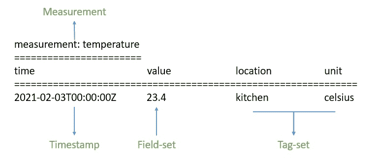](/web/20221014122027/https://www.baeldung.com/wp-content/uploads/2021/02/InfluxDB-Point.jpg)

首先，**时间戳显示了与特定点**相关联的 UTC 日期和时间。字段集由一个或多个字段-键和字段-值对组成。他们用一个点的标签捕获实际数据。类似地，标记集由标记键和标记值对组成，但它们是可选的。它们基本上充当一个点的元数据，并且可以被索引以获得更快的查询响应。

度量充当标签集、字段集和时间戳的容器。此外，InfluxDB 中的每个点都可以有一个与之关联的保留策略。保留策略描述了 InfluxDB 将数据保留多长时间，以及它将通过复制创建多少个副本。

最后，**数据库充当用户、保留策略、连续查询和时序数据的逻辑容器**。我们可以将 InfluxDB 中的数据库理解为与传统的关系数据库有些类似。

此外，InfluxDB 是 InfluxData 平台的一部分，该平台提供了几个其他产品来有效地处理时间序列数据。InfluxData 现在提供开源平台 InfluxDB OSS 2.0 和商业产品 InfluxDB Cloud:

[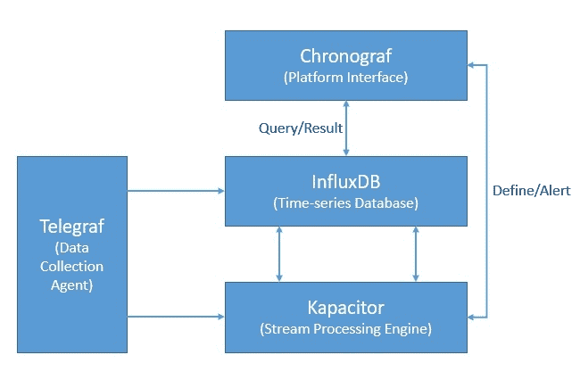](/web/20221014122027/https://www.baeldung.com/wp-content/uploads/2021/02/InfluxDB-Platform-2.jpg)

除了 InfluxDB，该平台还包括 [Chronograf](https://web.archive.org/web/20221014122027/https://www.influxdata.com/time-series-platform/chronograf/) ，它为 InfluxData 平台提供了一个完整的接口。此外，它还包括 [Telegraf](https://web.archive.org/web/20221014122027/https://www.influxdata.com/time-series-platform/telegraf/) ，一个收集和报告指标和事件的代理。最后，还有 [Kapacitor](https://web.archive.org/web/20221014122027/https://www.influxdata.com/time-series-platform/kapacitor/) ，一个实时流数据处理引擎。

## 4.物联网数据管道实践

现在，我们已经覆盖了足够多的领域，可以一起使用这些产品来为我们的物联网应用创建数据管道。在本教程中，我们将**假设我们从多个城市的多个观测站**收集空气质量相关的测量数据。例如，测量值包括地面臭氧、一氧化碳、二氧化硫、二氧化氮和气溶胶。

### 4.1.建立基础设施

首先，我们假设城市中的每个气象站都配备了所有的传感设备。此外，这些**传感器连接到类似 Raspberry Pi 的电路板，以收集模拟数据并将其数字化**。电路板连接到无线网络，向上游发送原始测量值:

[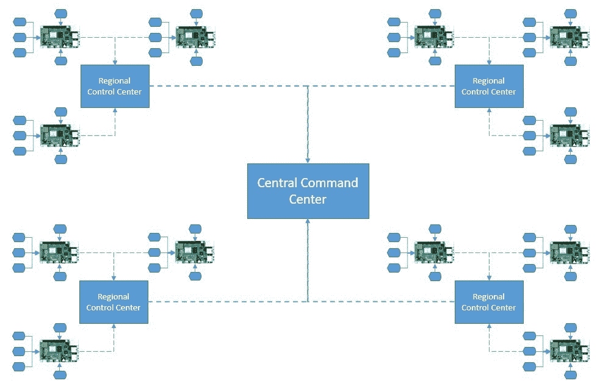](/web/20221014122027/https://www.baeldung.com/wp-content/uploads/2021/02/IoT-Infrastructure-Set-up.jpg)

区域控制站从一个城市的所有气象站收集数据。我们可以将这些数据聚合并输入到一些本地分析引擎中，以获得更快的洞察力。来自所有区域控制中心的过滤数据被发送到一个中央指挥中心，该中心主要位于云中。

### 4.2.创建物联网架构

现在，我们准备为简单的空气质量应用设计物联网架构。我们将在这里使用 MQTT 代理、MiNiFi Java 代理、NiFi 和 InfluxDB:

[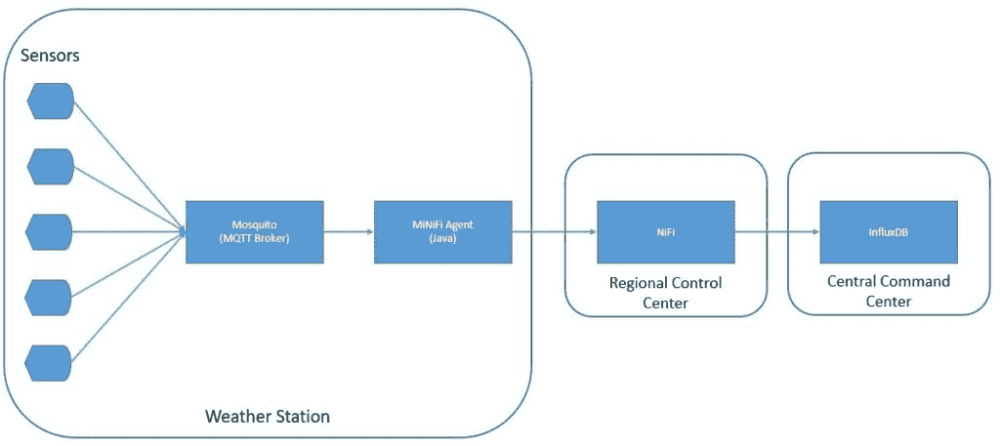](/web/20221014122027/https://www.baeldung.com/wp-content/uploads/2021/02/IoT-Architecture.jpg)

正如我们所看到的，我们正在气象站网站上使用 Mosquitto MQTT 代理和 MiNiFi Java 代理。在区域控制中心，我们使用 NiFi 服务器来聚合和路由数据。最后，我们使用 InfluxDB 在命令中心级别存储度量。

### 4.3.执行安装

在 Raspberry Pi 这样的板上安装 Mosquitto MQTT broker 和 MiNiFi Java 代理相当容易。然而，**对于本教程，我们将把它们安装在本地机器**上。

Eclipse Mosquito 的[官方下载页面提供了几个平台的二进制文件。安装后，从安装目录启动 Mosquitto 非常简单:](https://web.archive.org/web/20221014122027/https://mosquitto.org/download/)

[PRE0]

此外， [NiFi 二进制文件也可以从其官方网站下载](https://web.archive.org/web/20221014122027/https://nifi.apache.org/download.html)。我们必须将下载的档案文件解压到一个合适的目录中。由于 MiNiFi 将使用站点到站点协议连接到 NiFi，**我们必须在<NIFI _ HOME>/conf/NiFi . properties 中指定站点到站点输入套接字端口**:

[PRE1]

然后，我们可以开始 NiFi:

[PRE2]

类似地， [Java 或 C++ MiNiFi 代理和工具包二进制文件](https://web.archive.org/web/20221014122027/https://nifi.apache.org/minifi/download.html)可以从官方网站下载。同样，我们必须将档案解压缩到一个合适的目录中。

默认情况下，MiNiFi**配备了一组非常少的处理器**。因为我们将使用 MQTT 中的数据，所以我们必须将 MQTT 处理器复制到< MINIFI_HOME > /lib 目录中。这些被打包成 NiFi 存档(NAR)文件，可以位于< NIFI_HOME > /lib 目录下:

[PRE3]

然后，我们可以启动 MiNiFi 代理:

[PRE4]

最后，我们可以从其官方网站下载 InfluxDB 的开源版本。和以前一样，我们可以提取归档文件，并使用一个简单的命令启动 InfluxDB:

[PRE5]

我们应该保留所有其他配置，包括端口，作为本教程的默认配置。我们本地机器上的安装和设置到此结束。

### 4.4.定义 NiFi 数据流

现在，我们准备定义我们的数据流。NiFi **提供了一个易于使用的界面来创建和监控数据流**。这可以通过 URL http://localhost:8080/nifi 访问。

首先，我们将定义将在 NiFi 服务器上运行的主要数据流:

[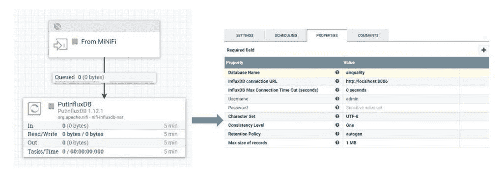](/web/20221014122027/https://www.baeldung.com/wp-content/uploads/2021/02/NiFi-Main-Data-Flow-Combined.jpg)

在这里，我们可以看到，我们已经定义了一个输入端口，它将从 MiNiFi 代理接收数据。它还通过连接向负责将数据存储在 InfluxDB 中的 [`PutInfluxDB`处理器](https://web.archive.org/web/20221014122027/https://nifi.apache.org/docs/nifi-docs/components/org.apache.nifi/nifi-influxdb-nar/1.6.0/org.apache.nifi.processors.influxdb.PutInfluxDB/)发送数据。在这个处理器的配置中，我们已经定义了 InfluxDB 的连接 URL 和我们要将数据发送到的数据库名称。

### 4.5.定义 MiNiFi 数据流

接下来，我们将定义将在 MiNiFi 代理上运行的数据流。我们将使用与 NiFi 相同的用户界面，**导出数据流作为模板，在 MiNiFi 代理**中进行配置。让我们为 MiNiFi 代理定义数据流:

[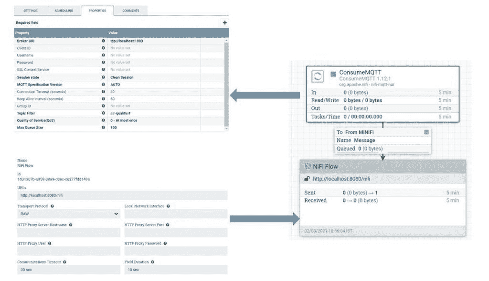](/web/20221014122027/https://www.baeldung.com/wp-content/uploads/2021/02/NiFi-MiNiFi-Data-Flow-Combined.jpg)

这里，我们定义了负责从 MQTT 代理获取数据的 [`ConsumeMQTT`处理器](https://web.archive.org/web/20221014122027/https://nifi.apache.org/docs/nifi-docs/components/org.apache.nifi/nifi-mqtt-nar/1.5.0/org.apache.nifi.processors.mqtt.ConsumeMQTT/)。我们已经在属性中提供了代理 URI 和主题过滤器。我们从层次结构`air-quality`下定义的所有主题中提取数据。

我们还定义了一个远程进程组，并将其连接到 ConcumeMQTT 处理器。**远程进程组负责通过站点到站点协议将数据推送到 NiFi** 。

我们可以将该数据流保存为模板，并将其下载为 XML 文件。我们把这个文件命名为`config.xml`。现在，我们可以使用[转换器工具包](https://web.archive.org/web/20221014122027/https://nifi.apache.org/minifi/minifi-toolkit.html)将这个模板从 XML 转换成 YAML，MiNiFi 代理使用它:

[PRE6]

这将为我们提供`config.yml`文件，我们必须在其中手动添加 NiFi 服务器的主机和端口:

[PRE7]

我们现在可以将这个文件放在目录 <minifi_home>/conf 中，替换可能已经存在的文件。在此之后，我们必须重新启动 MiNiFi 代理。</minifi_home>

在这里，我们做了大量的手工工作来创建数据流并在 MiNiFi 代理中配置它。这对于现实生活中可能有数百个代理出现在远程位置的情况是不切实际的。然而，正如我们前面所看到的，**我们可以通过使用 MiNiFi C2 服务器**来自动化这个过程。但是这不在本教程的讨论范围之内。

### 4.6.测试数据管道

最后，我们准备测试我们的数据管道！由于我们没有使用真实传感器的自由，我们将创建一个小的模拟。我们将**使用一个小的 Java 程序**生成传感器数据:

[PRE8]

这里，我们使用 [Eclipse Paho Java 客户端](https://web.archive.org/web/20221014122027/https://www.eclipse.org/paho/index.php?page=clients/java/index.php)生成消息给 MQTT 代理。我们可以添加任意数量的传感器来创建我们的模拟:

[PRE9]

如果一切正常，我们将能够在 InfluxDB 数据库中查询我们的数据:

[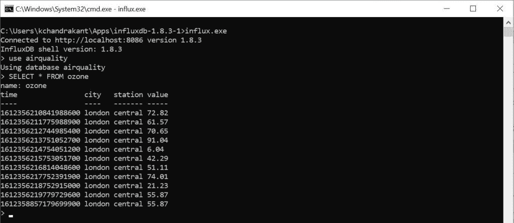](/web/20221014122027/https://www.baeldung.com/wp-content/uploads/2021/02/InfluxDB-Query-Result.jpg)

例如，我们可以在数据库“空气质量”中看到属于测量“臭氧”的所有点。

## 5.结论

总而言之，我们在本教程中介绍了一个基本的物联网用例。我们还了解了如何使用 MQTT、NiFi 和 InfluxDB 等工具来构建可伸缩的数据管道。当然，这并没有涵盖物联网应用的全部范围，扩展数据分析管道的可能性是无限的。

此外，我们在本教程中选择的例子仅用于演示目的。物联网应用程序的实际基础设施和架构可能非常多样和复杂。此外，我们可以通过将可操作的见解作为命令向后推送来完成反馈循环。