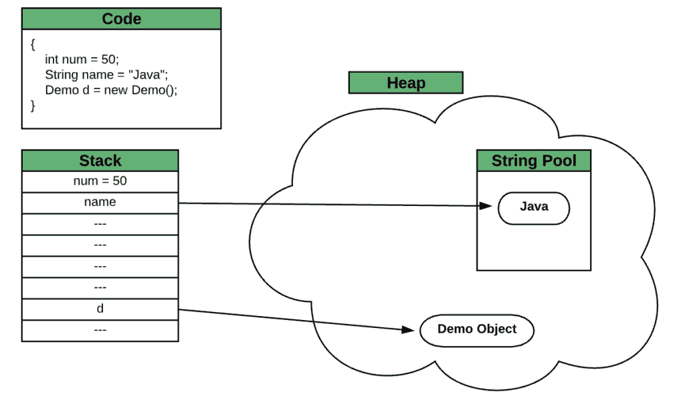

# Java 的字符串常量池住在哪里，堆还是栈？

> 原文：<https://web.archive.org/web/20220930061024/https://www.baeldung.com/java-string-constant-pool-heap-stack>

## 1.介绍

每当我们声明一个变量或创建一个对象时，它都存储在内存中。在高层，Java 将内存分为两块: [stack 和 heap](/web/20221208143832/https://www.baeldung.com/java-stack-heap) 。**两种存储器都存储特定类型的数据，并具有不同的存储和访问模式。**

在本教程中，我们将查看不同的参数，并了解哪个区域最适合存储`String`常量池。

## 2.字符串常量池

`String` [恒池](/web/20221208143832/https://www.baeldung.com/jvm-constant-pool)是一个特殊的内存区域。**当我们声明一个`String`字面值时， [JVM](/web/20221208143832/https://www.baeldung.com/jvm-parameters) 在池中创建对象，并将它的引用存储在堆栈中。在内存中创建每个`String`对象之前，JVM 执行一些步骤来减少内存开销。**

字符串常量池在其实现中使用了一个 [`Hashmap`](/web/20221208143832/https://www.baeldung.com/java-hashmap) 。`Hashmap` 的每个桶包含一个具有相同散列码的`String`列表。在 Java 的早期版本中，池的存储区域是固定大小的，经常会导致`“[Could not reserve enough space for object heap](/web/20221208143832/https://www.baeldung.com/java-heap-memory-error)” `错误。

**当系统加载类时，`String`所有类的文字进入应用级池。**这是因为不同类的相等的`String`文字必须是相同的`Object`。在这些情况下，池中的数据应该对每个类都可用，而没有任何依赖性。

通常，堆栈存储的是短期数据。它包括本地原始变量、堆对象的引用和执行中的方法。堆允许动态内存分配，在运行时存储 Java 对象和 JRE 类。

堆允许全局访问，并且堆中的数据存储在应用程序的生存期内对所有线程都可用，而堆栈上的数据存储具有私有范围，只有所有者线程可以访问它们。

堆栈将数据存储在连续的内存块中，并允许随机访问。如果一个类需要从池中随机选择一个`String`,由于堆栈的后进先出(LIFO)规则，它可能不可用。相比之下，堆动态分配内存，并允许我们以任何方式访问数据。

假设我们有一个由不同类型的变量组成的代码片段。堆栈将存储`int` 文本的值以及`String` 和演示对象`.`的引用。任何对象的值都将存储在堆中，所有`String`文本都将放入堆内的池中:

一旦线程完成执行，就释放在堆栈上创建的变量。相反，[垃圾收集器](/web/20221208143832/https://www.baeldung.com/jvm-garbage-collectors)回收堆中的资源。类似地，垃圾收集器从池中收集未引用的项。

**池的默认大小在不同的平台上可能会有所不同。**无论如何，还是比可用的栈大小大很多。在 JDK 7 之前，该池是 permgen 空间的一部分，从 JDK 7 到现在，它是主堆内存的一部分。

## 3.结论

在这篇短文中，我们了解了`String`常量池的存储区域。堆栈和堆在存储和访问数据方面有不同的特征。从内存分配到它的访问和可用性，堆是最适合存储字符串常量池的区域。

实际上，池从来就不是堆栈内存的一部分。