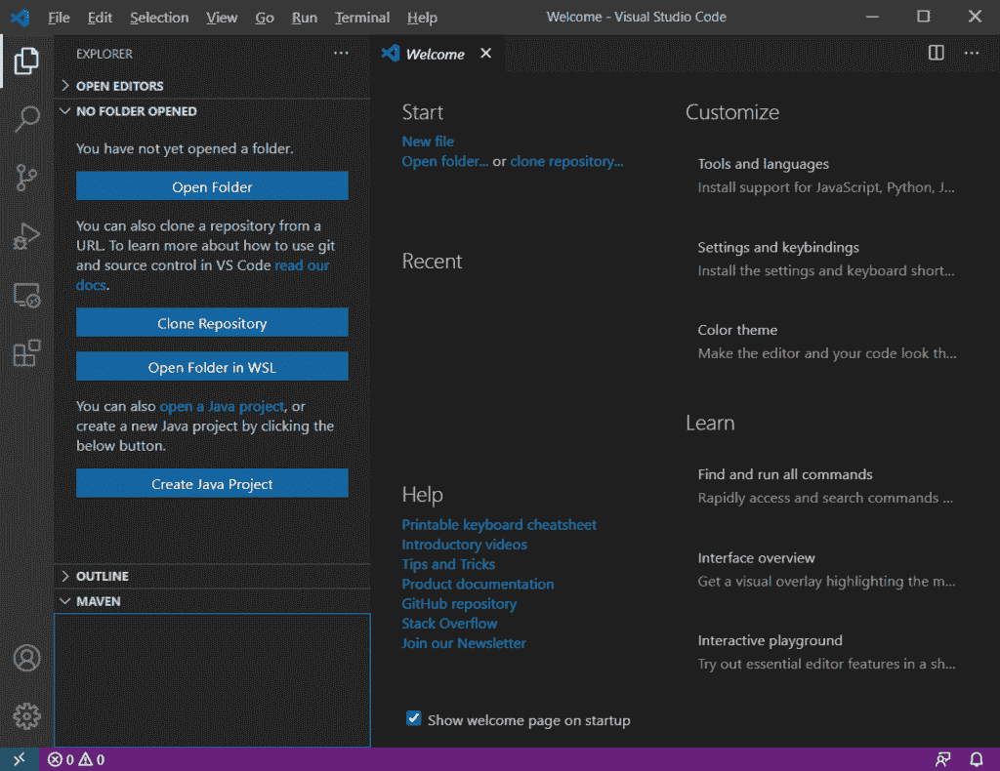
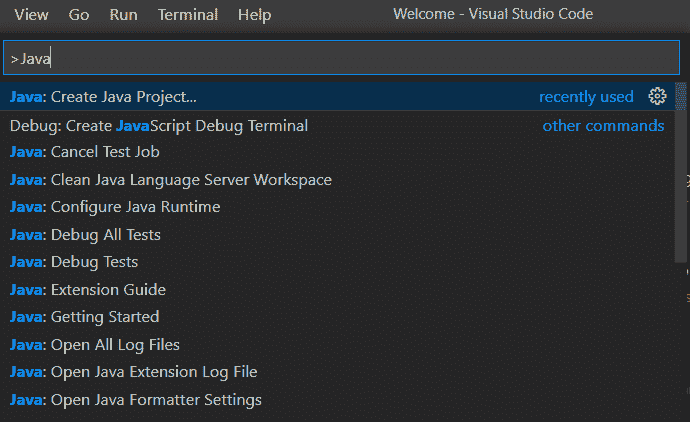
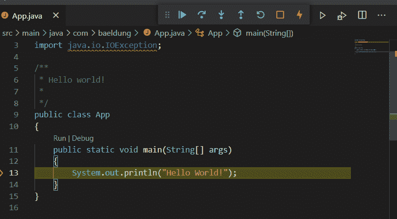
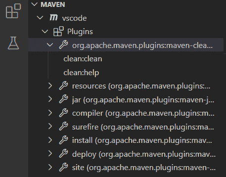
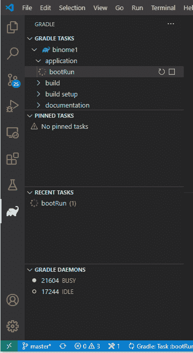

# 如何用 Java 使用 Visual Studio 代码？

> 原文：<https://web.archive.org/web/20220930061024/https://www.baeldung.com/java-visual-studio-code>

## 1.概观

在本文中，我们将学习如何用 Java 配置 Visual Studio 代码，以及如何使用这种语言的基本特性。

然后，我们将看到 Maven 和 Gradle 的集成，并总结这个编辑器的优点和缺点。

## 2.Java 的 Visual Studio 代码设置

微软改进了很多开发者的体验来配置他们的 Java 编辑器。**我们可以下载 Java 的[编码包，它是一组基本的扩展](https://web.archive.org/web/20220628052234/https://code.visualstudio.com/docs/languages/java#_install-visual-studio-code-for-java)**(相当于 Eclipse 的 JDT)。

即使我们还没有安装任何东西，这个可执行包也会检查缺失的软件并为我们安装它们:

*   Visual Studio 代码
*   Java 开发工具包(JDK)
*   Java 扩展包，包括:
    *   Red Hat 对 Java 的语言支持:导航、编写、重构和读取 Java 文件
    *   微软的 Java 调试器:启动/附加、断点、求值、显示调用堆栈
    *   微软的 Maven for Java:从原型生成项目，运行 Maven 目标
    *   Java 测试运行程序，由微软开发:运行 Junit，TestNG
    *   微软 Java 项目经理:显示项目视图，创建新项目，导出 jar
    *   Microsoft visual Studio intelli code:高级自动完成功能

如果我们已经安装了 Visual Studio 代码，我们只需要从侧边栏的 Extensions 按钮安装 Java 扩展包。现在，我们可以看到左边的`Create Java Project`按钮和`Maven`视图:

我们还可以通过`View > Command Palette`菜单浏览 Java 特性:

接下来，我们将学习如何使用这些扩展中包含的特性。

## 3.使用基本 Java 项目

### 3.1.创建或打开一个 Java 项目

如果我们想要创建一个新的 Java 项目，**，我们将在`Command Palette` 菜单**中找到 `Java:` `Create Java Project`命令，这将打开一个顶部菜单，在那里我们可以选择我们的项目类型:

*   `No build tools`创建一个带有`src`和`lib` 目录的空白项目
*   让我们从一个大的图书馆收藏中挑选一个原型，我们将在后面的章节中看到
*   `Spring Boot, Quarkus,`和`MicroProfile` 要求我们安装它们各自的扩展来创建一个项目

**如果我们需要打开一个已有的项目，Visual Studio 代码会在右下角显示一个小的弹出窗口，将文件夹导入为 Java 项目**。如果我们错过了它，我们可以打开任何 Java 源文件再次显示它。

### 3.2.运行并调试项目

要运行项目，我们只需按下`F5`(调试)或`Ctrl-F5`(运行)。我们也可以使用`main`方法上面的`Run|Debug`快捷方式来进行单元测试:

我们还可以在窗口顶部看到调试工具栏，以停止、重新运行或继续执行。
然后，底部的`Terminal`视图将显示输出日志。

### 3.3.管理 Java 包和导入

我们将注意到的第一个痛点是 **Visual Studio 代码没有提供创建类或包**的专用特性。

为了创建我们的包的整个目录结构，我们必须首先创建一个 Java 文件，并在顶部声明所需的包。之后，Visual Studio 代码会显示一个错误:我们只需将鼠标滑过它，就可以显示`Quick Fix`链接。如果目录结构不存在，该链接将创建适当的目录结构。

**然而，包管理的工作方式与其他 Java IDE** 类似:只需按下`Ctrl+Space`，它会建议，例如，选择一个现有的类并动态导入它。我们还可以使用`quick fix`弹出菜单来添加缺失的导入或删除未使用的导入。

### 3.4.代码导航和自动完成

**要知道最有用的快捷方式是`Ctrl+P`打开一个文件和`Ctrl+T`打开一个类或接口**。与其他 Java IDEs 类似，我们可以通过`Ctrl+click`导航到方法调用或类实现。侧边栏中还有`Outline view`，它帮助我们浏览大文件。

自动完成也像在其他 ide 中一样工作:我们只需按下`Ctrl+space`来显示选项。例如，**我们可以看到一个接口的可能实现或者一个类的可用方法和属性，包括它们的 Javadoc** 。如果我们在像`while`、`for`、`if`、`switch`或`try`这样的语句后按下`Ctrl+space`，自动完成也可以生成一个代码片段。

然而，我们**不能为方法参数**生成 Javadoc。

### 3.5.编译错误和警告

我们首先会看到带下划线的代码的编译错误。未使用的变量是灰色的，我们也可以从`View > Problems`菜单显示错误和警告的完整列表。两人都提出了基本问题的快速解决方案。

## 4.Maven 和 Gradle 集成

### 4.1.专家

**如果我们选择创建一个新的 Maven 项目，`Command Palette`提供了大量的 [Maven 原型](/web/20220628052234/https://www.baeldung.com/maven-archetype)** `.` 一旦我们选择了一个，系统会提示我们选择目标文件夹，然后**配置在交互式终端中进行，而不是像其他 Java IDEs 那样在图形向导中进行**。

将首先显示 Java 导入弹出窗口，然后开始 Maven 配置。扩展将使用在我们的`PATH`变量中定义的全局 Maven 客户端。然而，如果在我们的项目中配置了 [Maven 包装器](/web/20220628052234/https://www.baeldung.com/maven-wrapper)，一个弹出窗口将让我们选择是否应该使用包装器而不是全局 Maven 客户端。

然后，从 Maven 侧视图，我们将看到可以启动的 Maven 插件和目标:

如果没有，我们需要检查以下位置的错误:

*   从`View > Problems` 菜单，其中包含了每一个与`pom.xml`文件相关的问题和 JDK 兼容性问题
*   从`View > Output`菜单中，从右下方的列表中选择`Maven For Java`来显示 Maven 客户端和包装器问题

### 4.2\. Gradle

**为了和 Gradle 一起工作，我们必须从`Extensions`面板**上安装`Gradle Extension Pack`。只有在配置了 [Gradle Wrapper](/web/20220628052234/https://www.baeldung.com/gradle-wrapper) 的情况下，这个扩展才能管理项目。

打开 Gradle 项目后，我们会在底部看到状态栏，显示下载和安装进度。我们通过单击此栏来检查是否发生了任何错误。我们还可以显示`Output`视图，并从中选择`Gradle Tasks`选项。

**然后，我们将能够在侧边栏中看到 Gradle `elephant`图标，它显示专用的 Gradle 面板来控制任务**:

如果这个图标没有显示，我们必须检查我们的 Gradle 项目是否在子目录中。在这种情况下，我们必须启用`gradle.nestedProjects`设置来发现它。

## 5.优点和缺点

首先，我们不得不承认这个轻量级编辑器提供的功能比它的同行要少:**没有向导，Maven 和 Gradle 的集成不是很得心应手，基本的功能都没有，比如管理包和依赖关系的工具**。Visual Studio 代码不是为 Java 设计的，这一点我们很容易注意到，尤其是如果我们熟悉其他 Java IDEs 的话。

然而，错误检测和自动完成等核心功能非常完整，因为它们使用的是 Eclipse JDT [语言服务器](https://web.archive.org/web/20220628052234/https://github.com/eclipse/eclipse.jdt.ls)。而且，**Visual Studio 代码的流行来源于其快速的启动速度，有限的资源使用，以及更好的用户体验**。

## 6.结论

在本文中，我们学习了如何为 Java 配置 Visual Studio 代码，该语言支持的特性，以及它的优点和缺点。

总之，如果我们已经熟悉了 Visual Studio 代码，那么开始学习 Java 会是一个不错的编辑器。但是，如果我们已经是高级 Java IDE 用户，并且满足于与他们一起工作，我们可能会失望地失去一些我们认为理所当然的舒适。