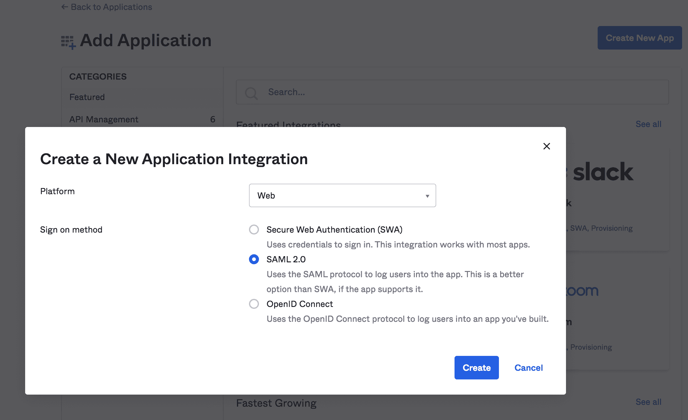
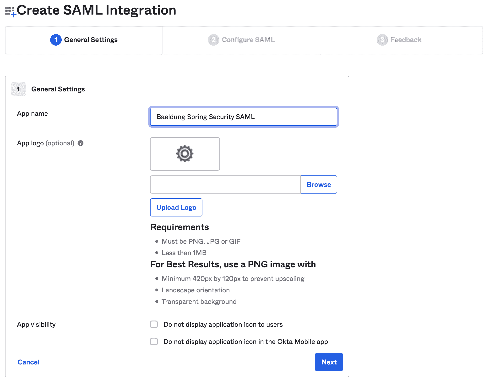
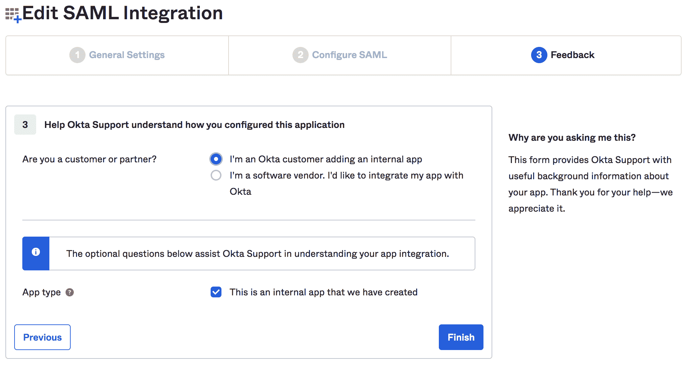
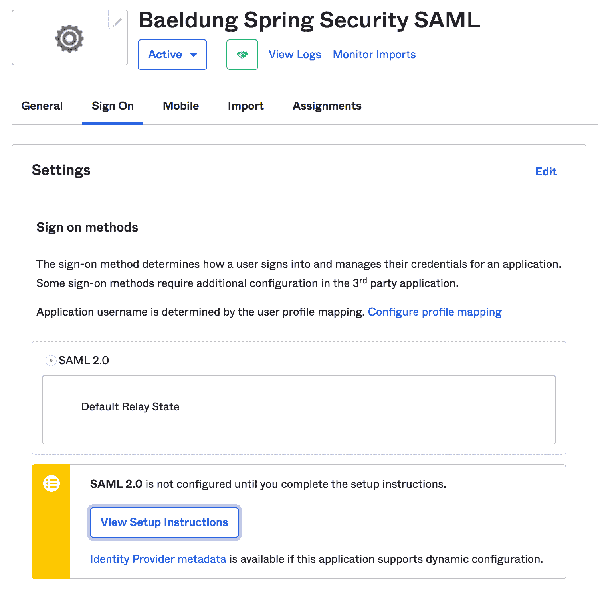
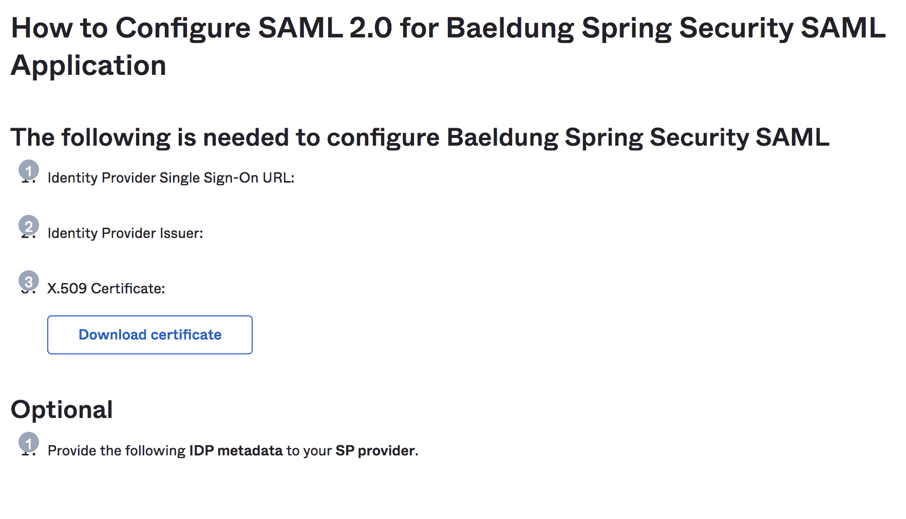
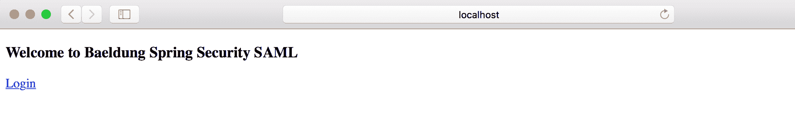
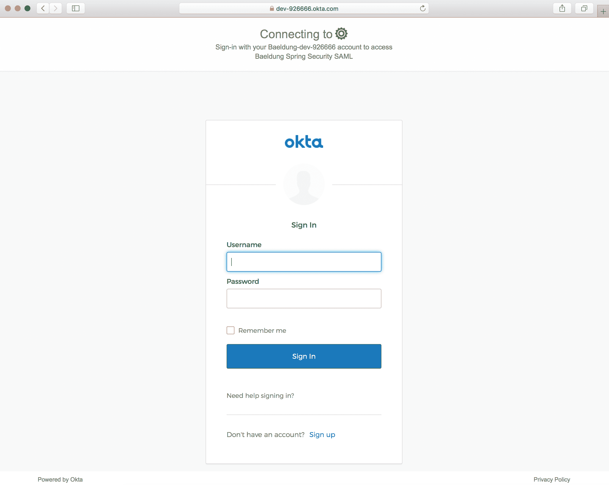
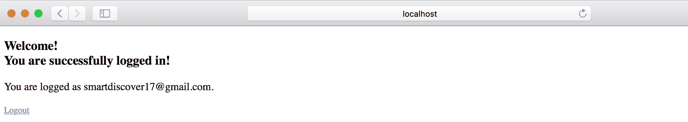

# Spring 安全的 SAML 指南

> 原文：<https://web.archive.org/web/20220930061024/https://www.baeldung.com/spring-security-saml>

## 1.概观

在本教程中，我们将使用 [Okta 作为身份提供者(IdP)](/web/20220630005925/https://www.baeldung.com/spring-security-okta) 来探索 [Spring Security SAML](https://web.archive.org/web/20220630005925/https://spring.io/projects/spring-security-saml) 。

## 2.什么是 SAML？

**安全断言标记语言( [SAML](/web/20220630005925/https://www.baeldung.com/cs/saml-introduction) )是一种开放标准，允许 IdP 安全地将用户的认证和授权细节发送给服务提供商(SP)** 。它使用基于 XML 的消息在 IdP 和 SP 之间进行通信。

换句话说，当用户试图访问服务时，他需要使用 IdP 登录。登录后，**IdP 将带有 XML 格式的授权和认证细节的 SAML 属性发送给 SP。**

除了提供安全的身份验证传输机制， **SAML 还促进了单点登录(SSO)** ，允许用户登录一次，然后使用相同的凭证登录其他服务提供商。

## 3.安装教程

首先，作为前提条件，我们应该[建立一个 Okta 开发者账号](/web/20220630005925/https://www.baeldung.com/spring-security-okta#developerAccountSignUp)。

### 3.1.创建新应用程序

然后，我们将创建一个新的支持 SAML 2.0 的 Web 应用程序集成:

接下来，我们将填写应用名称和应用徽标等一般信息:

### 3.2.编辑 SAML 集成

在这一步中，我们将提供 SAML 设置，如 SSO URL 和受众 URI:

最后，我们可以提供关于我们整合的反馈:

### 3.3.查看安装说明

完成后，我们可以查看 Spring Boot 应用程序的设置说明:

注意:我们应该复制像 IdP 发行者 URL 和 IdP 元数据 XML 这样的指令，这些指令将在 Spring 安全配置中进一步用到:

## 4.Spring Boot 设置

除了通常的 Maven 依赖项，如 [`spring-boot-starter-web`](https://web.archive.org/web/20220630005925/https://search.maven.org/search?q=g:org.springframework.boot%20a:spring-boot-starter-web) 和`[spring-boot-starter-security](https://web.archive.org/web/20220630005925/https://search.maven.org/search?q=g:org.springframework.boot%20a:spring-boot-starter-security),`，我们将需要`[spring-security-saml2-core](https://web.archive.org/web/20220630005925/https://search.maven.org/search?q=g:org.springframework.security.extensions%20a:spring-security-saml2-core)`依赖项:

[PRE0]

另外，确保**添加 [`Shibboleth`库](https://web.archive.org/web/20220630005925/https://build.shibboleth.net/nexus/content/repositories/releases/)来下载`spring-security-saml2-core` 依赖项所需的最新`opensaml` jar** :

[PRE1]

或者，我们可以在 Gradle 项目中设置依赖关系:

[PRE2]

## 5.Spring 安全配置

现在我们已经准备好了 Okta SAML 设置和 Spring Boot 项目，让我们从 SAML 2.0 与 Okta 集成所需的 Spring 安全配置开始。

### 5.1.SAML 入口点

首先，我们将创建一个 [`SAMLEntryPoint`](https://web.archive.org/web/20220630005925/https://docs.spring.io/spring-security-saml/docs/current/api/org/springframework/security/saml/SAMLEntryPoint.html) 类的 bean，它将作为 SAML 认证的入口点:

[PRE3]

这里，`WebSSOProfileOptions` bean 允许我们设置从 SP 发送到 IdP 的请求的参数，请求用户验证。

### 5.2.登录和注销

接下来，让我们为我们的 SAML URIs 创建一些过滤器，比如/ `discovery,` / `login`和/ `logout`:

[PRE4]

然后，我们将添加一些相应的过滤器和处理程序:

[PRE5]

到目前为止，我们已经配置了身份验证的入口点(`samlEntryPoint`)和一些过滤器链。所以，让我们深入探究一下它们的细节。

当用户第一次尝试登录时，`samlEntryPoint` 将处理输入请求。然后，`samlDiscovery` bean(如果启用的话)将发现要联系的 IdP 以进行身份验证。

接下来，当用户登录时，**IdP 将 SAML 响应重定向到`/saml/sso` URI 进行处理**，相应的`samlWebSSOProcessingFilter`将对关联的 auth token 进行认证。

成功后，`successRedirectHandler`会将用户重定向到默认的目标 URL ( `/home`)。否则，`authenticationFailureHandler`会将用户重定向到`/error` URL。

最后，让我们为单个和全局注销添加注销处理程序:

[PRE6]

### 5.3.元数据处理

现在，我们将向 SP 提供 IdP 元数据 XML。这将有助于让我们的 IdP 知道用户登录后应该重定向到哪个 SP 端点。

因此，我们将配置 [`MetadataGenerator`](https://web.archive.org/web/20220630005925/https://docs.spring.io/spring-security-saml/docs/current/api/org/springframework/security/saml/metadata/MetadataGenerator.html) bean，使 Spring SAML 能够处理元数据:

[PRE7]

`MetadataGenerator` bean 需要 [`KeyManager`](https://web.archive.org/web/20220630005925/https://docs.spring.io/spring-security-saml/docs/current/api/org/springframework/security/saml/key/KeyManager.html) 的实例来加密 SP 和 IdP 之间的交换:

[PRE8]

这里，我们必须为`KeyManager` bean 创建并提供一个密钥库。我们可以使用 JRE 命令创建自签名密钥和密钥库:

[PRE9]

### 5.4.`MetadataManager`

然后，我们将使用 [`ExtendedMetadataDelegate`](https://web.archive.org/web/20220630005925/https://docs.spring.io/spring-security-saml/docs/current/api/org/springframework/security/saml/metadata/ExtendedMetadataDelegate.html) 实例将 IdP 元数据配置到我们的 Spring Boot 应用程序中:

[PRE10]

这里，我们解析了包含 IdP 元数据 XML 的`sso.xml`文件中的元数据，它是在查看设置说明时从 Okta 开发人员帐户复制的。

类似地，`defaultIdp`变量包含 IdP 发行者 URL，从 Okta 开发人员帐户复制而来。

### 5.5.XML 解析

对于 XML 解析，我们可以使用 [`StaticBasicParserPool`](https://web.archive.org/web/20220630005925/https://javadoc.io/doc/org.opensaml/xmltooling/latest/org/opensaml/xml/parse/StaticBasicParserPool.html) 类的一个实例:

[PRE11]

### 5.6.SAML 处理器

然后，我们需要一个处理器来解析 HTTP 请求中的 SAML 消息:

[PRE12]

这里，我们在 Okta 开发人员帐户中使用了 POST 和 Redirect 绑定。

### 5.7.`SAMLAuthenticationProvider`实施

最后，我们需要一个定制的 [`SAMLAuthenticationProvider`](https://web.archive.org/web/20220630005925/https://docs.spring.io/spring-security-saml/docs/current/api/org/springframework/security/saml/SAMLAuthenticationProvider.html) 类的实现来检查 [`ExpiringUsernameAuthenticationToken`](https://web.archive.org/web/20220630005925/https://docs.spring.io/spring-security-saml/docs/current/api/org/springframework/security/providers/ExpiringUsernameAuthenticationToken.html) 类的实例并设置获得的权限:

[PRE13]

此外，我们应该将`CustomSAMLAuthenticationProvider`配置为`SecurityConfig` 类中的 bean:

[PRE14]

### 5.8.`SecurityConfig`

最后，我们将使用已经讨论过的`samlEntryPoint`和`samlFilter`来配置基本的 HTTP 安全性:

[PRE15]

瞧啊。我们完成了 Spring Security SAML 配置，它允许用户登录到 IdP，然后从 IdP 接收 XML 格式的用户身份验证细节。最后，它验证用户令牌以允许访问我们的 web 应用程序。

## 6.`HomeController`

既然我们的 Spring Security SAML 配置已经准备好了，Okta 开发人员帐户设置也准备好了，我们可以设置一个简单的控制器来提供一个登录页面和主页。

### 6.1.索引和授权映射

首先，让我们添加到默认目标 URI ` (/)`和/ `auth` URI 的映射:

[PRE16]

然后，我们将添加一个简单的`index.html`，允许用户使用`login`链接重定向 Okta SAML 认证:

[PRE17]

现在，我们准备运行我们的 Spring Boot 应用程序，并在 [http://localhost:8080/](https://web.archive.org/web/20220630005925/http://localhost:8080/) 访问它:

 
当点击`Login`链接时，将打开一个 Okta 登录页面:

### 6.2.主页

接下来，让我们添加到`/home` URI 的映射，以便在成功通过身份验证时重定向用户:

[PRE18]

此外，我们将添加`home.html`来显示登录的用户和注销链接:

[PRE19]

成功登录后，我们应该会看到主页:

## 7.结论

在本教程中，我们讨论了 Spring Security SAML 与 Okta 的集成。

首先，我们用 SAML 2.0 web 集成设置了一个 Okta 开发者账户。然后，我们用必需的 Maven 依赖项创建了一个 Spring Boot 项目。

接下来，我们完成了 Spring Security SAML 所需的所有**设置，如`samlEntryPoint`、`samlFilter`、元数据处理和 SAML 处理器**。

最后，我们创建了一个控制器和几个像`index`和`home`这样的页面来测试 SAML 与 Okta 的集成。

和往常一样，源代码可以在 GitHub 的[上找到。](https://web.archive.org/web/20220630005925/https://github.com/eugenp/tutorials/tree/master/spring-security-modules/spring-security-saml)