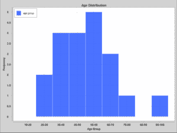

# 带有 Apache Commons 频率的直方图

> 原文：<https://web.archive.org/web/20220930061024/https://www.baeldung.com/apache-commons-frequency>

## 1.概观

在本教程中，我们将看看如何在 Apache Commons [Frequency](https://web.archive.org/web/20220627172802/https://commons.apache.org/proper/commons-math/userguide/stat.html#a1.3_Frequency_distributions) 类的帮助下在直方图上显示数据。

`Frequency `类是这篇[文章](/web/20220627172802/https://www.baeldung.com/apache-commons-math)中探索的 Apache Commons 数学库的一部分。

直方图是由相互连接的条形组成的图表，显示数据集中某个范围的数据出现的次数。它不同于条形图，因为它用于显示连续的定量变量的分布，而条形图用于显示分类数据。

## 2.项目相关性

在本文中，我们将使用一个具有以下依赖项的 Maven 项目:

```
<dependency>
    <groupId>org.apache.commons</groupId>
    <artifactId>commons-math3</artifactId>
    <version>3.6.1</version>
</dependency>
<dependency>
    <groupId>org.knowm.xchart</groupId>
    <artifactId>xchart</artifactId>
    <version>3.5.2</version>
</dependency>
```

`commons-math3`库包含了`Frequency `类，我们将使用它来确定数据集中变量的出现。`xchart`库是我们将用来在 GUI 中显示直方图的库。

最新版本的 [commons-math3](https://web.archive.org/web/20220627172802/https://search.maven.org/classic/#search%7Cga%7C1%7Ca%3A%22commons-math3%22%20g%3A%22org.apache.commons%22) 和 [xchart](https://web.archive.org/web/20220627172802/https://search.maven.org/classic/#search%7Cga%7C1%7Ca%3A%22xchart%22%20g%3A%22org.knowm.xchart%22) 可以在 Maven Central 上找到。

## 3.计算变量的频率

在本教程中，我们将使用一个包含特定学校学生年龄的数据集。我们希望看到不同年龄组的频率，并在直方图上观察它们的分布。

让我们用一个`List `集合来表示数据集，并用它来填充`Frequency `类的一个实例:

```
List<Integer> datasetList = Arrays.asList(
  36, 25, 38, 46, 55, 68, 
  72, 55, 36, 38, 67, 45, 22, 
  48, 91, 46, 52, 61, 58, 55);
Frequency frequency = new Frequency();
datasetList.forEach(d -> frequency.addValue(Double.parseDouble(d.toString())));
```

**现在我们已经填充了`Frequency `类的实例，我们将获得 bin 中每个年龄的计数，并对其求和，这样我们就可以获得特定年龄组中年龄的总频率**:

```
datasetList.stream()
  .map(d -> Double.parseDouble(d.toString()))
  .distinct()
  .forEach(observation -> {
      long observationFrequency = frequency.getCount(observation);
      int upperBoundary = (observation > classWidth)
        ? Math.multiplyExact( (int) Math.ceil(observation / classWidth), classWidth)
        : classWidth;
      int lowerBoundary = (upperBoundary > classWidth)
        ? Math.subtractExact(upperBoundary, classWidth)
        : 0;
      String bin = lowerBoundary + "-" + upperBoundary;

      updateDistributionMap(lowerBoundary, bin, observationFrequency);
  });
```

从上面的片段中，我们首先使用`Frequency`类的`getCount()`来确定`observation` 的频率。**该方法返回** `**observation**. `出现的总次数

使用当前的`observation,`,我们通过计算出它相对于类宽度的上下边界来动态地确定它所属的组——类宽度是 10 `.`

上下边界连接在一起形成一个 bin，使用`updateDistributionMap()`与`observationFrequency`一起存储在`distributionMap`中。

如果`bin`已经存在，我们更新频率，否则我们将它作为关键字添加，并将当前`observation`的频率设置为它的值。请注意，我们跟踪已处理的观察结果，以避免重复。

`Frequency`类也有确定数据集中变量的百分比和累积百分比的方法。

## 4.绘制直方图

既然我们已经将原始数据集处理成年龄组及其各自频率的地图，我们可以使用`xchart`库在直方图中显示数据:

```
CategoryChart chart = new CategoryChartBuilder().width(800).height(600)
  .title("Age Distribution")
  .xAxisTitle("Age Group")
  .yAxisTitle("Frequency")
  .build();

chart.getStyler().setLegendPosition(Styler.LegendPosition.InsideNW);
chart.getStyler().setAvailableSpaceFill(0.99);
chart.getStyler().setOverlapped(true);

List yData = new ArrayList();
yData.addAll(distributionMap.values());
List xData = Arrays.asList(distributionMap.keySet().toArray());
chart.addSeries("age group", xData, yData);

new SwingWrapper<>(chart).displayChart();
```

我们使用 chart builder 创建了一个`CategoryChart`实例，然后配置它并用 x 和 y 轴的数据填充它。

最后，我们使用`SwingWrapper:`在 GUI 中显示图表

[](/web/20220627172802/https://www.baeldung.com/wp-content/uploads/2018/06/22112_xchart_histogram.png)

从上面的直方图中，我们可以看到没有 80-90 岁的学生，而 50-60 岁的学生占大多数。这极有可能是博士生或博士后。

我们也可以说直方图呈正态分布。

## 5.结论

在本文中，我们已经了解了如何利用 Apache `commons-math3`库的`Frequency `类的能力。

图书馆里还有统计、几何、遗传算法等其他有趣的课程。它的文档可以在这里找到。

完整的源代码可以从 Github 的[处获得。](https://web.archive.org/web/20220627172802/https://github.com/eugenp/tutorials/tree/master/libraries-apache-commons)