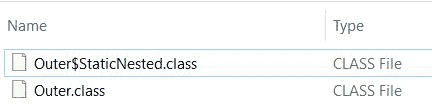
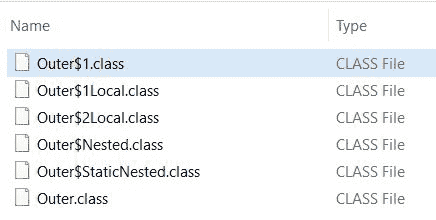

# Java 类文件命名约定

> 原文：<https://web.archive.org/web/20220930061024/https://www.baeldung.com/java-class-file-naming>

## 1.概观

编译 Java 类时，会创建一个同名的类文件。但是，在嵌套类或嵌套接口的情况下，它创建一个类文件，其名称结合了内部和外部类名，包括一个美元符号。

在本文中，我们将看到所有这些场景。

## 2.细节

在 Java 中，我们可以在一个类中编写一个类。内部编写的类称为嵌套类，保存嵌套类的类称为外部类。嵌套类的范围受其封闭类的范围限制。

类似地，我们可以在另一个接口或类中声明一个接口。这样的接口称为嵌套接口。

我们可以使用嵌套类和接口对只在一个地方使用的实体进行逻辑分组。这不仅使我们的代码更具可读性和可维护性，而且还增加了封装性。

在接下来的几节中，我们将详细讨论其中的每一项。我们还会看看枚举。

## 3.嵌套类

嵌套类是在另一个类或接口中声明的类。任何时候我们需要一个单独的类，但仍然希望这个类作为另一个类的一部分，嵌套类是实现这一点的最佳方式。

当我们编译一个 Java 文件时，它为封闭类创建一个`.class`文件，并为所有嵌套类创建单独的类文件。为封闭类生成的类文件将与 Java 类同名。

**对于嵌套类，** **编译器使用不同的命名约定——**`**OuterClassName$NestedClassName.class**`

首先，让我们创建一个简单的 Java 类:

```
public class Outer {

// variables and methods...
}
```

When we compile the `Outer` class, the compiler will create an `Outer.class` file.In the next subsections, we'll add nested classes in the `Outer` class and see how class files are named.

### 3.1.静态嵌套类

顾名思义，声明为`static`的嵌套类称为静态嵌套类。在 Java 中，只允许嵌套类为`static.`

静态嵌套类可以有静态和非静态的字段和方法。它们被绑定到外部类，而不是特定的实例。因此，我们不需要外部类的实例来访问它们。

让我们在我们的`Outer`类中声明一个静态嵌套类:

```
public class Outer {
    static class StaticNested {
        public String message() {
            return "This is a static Nested Class";
        }
    }
}
```

当我们编译我们的`Outer` 类`,`时，编译器创建两个类文件，一个用于`Outer` ，另一个用于`StaticNested`:

[](/web/20221006054941/https://www.baeldung.com/wp-content/uploads/2021/03/staticnested.jpg)

### 3.2.非静态嵌套类

非静态嵌套类——也称为*内部类*——与封闭类的实例相关联，它们可以访问外部类的所有变量和方法。

外部类只能具有公共或默认访问权限，而内部类可以是私有的、公共的、受保护的或具有默认访问权限。但是，它们不能包含任何静态成员。此外，我们需要创建一个外部类的实例来访问内部类。

让我们给我们的`Outer` 类再添加一个嵌套类:

```
public class Outer {
    class Nested {
        public String message() {
            return "This is a non-static Nested Class";
        }
    }
}
```

它又生成了一个类文件:

[](/web/20221006054941/https://www.baeldung.com/wp-content/uploads/2021/03/nonstaticnested.jpg)

### 3.3.本地课程

局部类，也称为内部类，是在一个块中定义的，块是平衡括号之间的一组语句。例如，它们可以在方法体、`for`循环或`if`子句中。就像局部变量一样，局部类的范围被限制在块内。编译时，局部类显示为带有自动生成数字的美元符号。

**为本地类生成的类文件使用了一个命名约定—**`**OuterClassName$1LocalClassName.class**`

让我们在方法中声明一个局部类:

```
public String message() {
    class Local {
        private String message() {
            return "This is a Local Class within a method";
        }
    }
    Local local = new Local();
    return local.message();
} 
```

编译器为我们的`Local`类创建了一个单独的类文件:

[](/web/20221006054941/https://www.baeldung.com/wp-content/uploads/2021/03/localclass.jpg)

类似地，我们可以在一个`if`子句中声明一个局部类:

```
public String message(String name) {
    if (StringUtils.isEmpty(name)) {
        class Local {
            private String message() {
                return "This is a Local class within if clause";
            }
        }
        Local local = new Local();
        return local.message();
    } else
        return "Welcome to " + name;
}
```

尽管我们正在创建另一个同名的本地类，编译器并没有抱怨。它又创建了一个类文件，并用增加的数字命名它:

[](/web/20221006054941/https://www.baeldung.com/wp-content/uploads/2021/03/localclassinifclause.jpg)

### 3.4.匿名内部类

顾名思义，匿名类是没有名字的内部类。编译器在美元符号后使用自动生成的数字来命名类文件。

我们需要在单个表达式中同时声明和实例化匿名类。它们通常扩展一个现有的类或实现一个接口。

让我们看一个简单的例子:

```
public String greet() {
    Outer anonymous = new Outer() {
        @Override
        public String greet() {
            return "Running Anonymous Class...";
        }
    };
    return anonymous.greet();
}
```

这里，我们通过扩展`Outer`类创建了一个匿名类，编译器又添加了一个类文件:

[](/web/20221006054941/https://www.baeldung.com/wp-content/uploads/2021/03/anonymousclass.jpg)

类似地，我们可以用匿名类实现一个接口。

这里，我们正在创建一个界面:

```
interface HelloWorld {
    public String greet(String name);
}
```

现在，让我们创建一个匿名类:

```
public String greet(String name) {
    HelloWorld helloWorld = new HelloWorld() {
        @Override
        public String greet(String name) {
            return "Welcome to "+name;
        }
    };
    return helloWorld.greet(name);
}
```

让我们观察一下修改后的类文件列表:

[](/web/20221006054941/https://www.baeldung.com/wp-content/uploads/2021/03/anonymous2class.jpg)

正如我们看到的，为接口`HelloWorld`生成了一个类文件，为名为`Outer$2`的匿名类生成了另一个类文件。

### 3.5.接口内的内部类

我们已经看到一个类在另一个类中，而且，我们可以在一个接口中声明一个类。如果类的功能与接口功能紧密相关，我们可以在接口内部声明它。当我们想要编写接口方法的默认实现时，我们可以使用这个内部类。

让我们在我们的`HelloWorld`接口中声明一个内部类:

```
interface HelloWorld {
    public String greet(String name);
    class InnerClass implements HelloWorld {
        @Override
        public String message(String name) {
            return "Inner class within an interface";
        }
    }
}
```

编译器又生成了一个类文件:

[](/web/20221006054941/https://www.baeldung.com/wp-content/uploads/2021/03/innerclass.jpg)

## 4.嵌套接口

嵌套接口，也称为内部接口，是在一个类或另一个接口中声明的。使用嵌套接口的主要目的是通过对相关接口进行分组来解析名称空间。

我们不能直接访问嵌套接口。只能使用外部类或外部接口来访问它们。比如`Map`接口里面的`Entry`接口是嵌套的，可以作为`Map`访问。`Entry`。

让我们看看如何创建嵌套接口。

### 4.1.接口内部的接口

在接口内部声明的接口是隐式公共的。

让我们在`HelloWorld`接口中声明我们的接口:

```
interface HelloWorld {
    public String greet(String name);

    interface HelloSomeone{
        public String greet(String name);
    }
}
```

这将为嵌套接口创建一个名为`HelloWorld$HelloSomeone`的新类文件。

### 4.2.类内部的接口

在类内部声明的接口可以使用任何访问修饰符。

让我们在我们的`Outer` 类中声明一个接口:

```
public class Outer {
     interface HelloOuter {
        public String hello(String name);
    }
}
```

它将生成一个名为`OuterClass$StaticNestedClass`的新类文件

## 5.枚举

Java 5 中引入了[枚举](/web/20221006054941/https://www.baeldung.com/a-guide-to-java-enums)。它是一种包含一组固定常数的数据类型，这些常数是那个`enum`的实例。

`enum`声明定义了一个被称为 e *num* 类型(也称为枚举数据类型)的*类*。我们可以在`enum`中添加很多东西，比如构造函数、方法、变量和一个叫做特定于常量的类体。

当我们创建一个`enum`时，我们创建了一个新的类，并且我们隐式地扩展了`Enum`类。`Enum`不能继承其他任何类或者不能被扩展。但是，它可以实现一个接口。

我们可以将一个`enum`声明为一个独立的类，在它自己的源文件中，或者另一个类成员中。让我们看看创建一个`enum`的所有方法。

### 5.1.作为类枚举

首先，让我们创建一个简单的`enum`:

```
enum Level {
    LOW, MEDIUM, HIGH;
}
```

编译时，编译器将为我们的枚举创建一个名为`Level`的类文件。

### 5.2.类中的枚举

现在，让我们在我们的`Outer` 类中声明一个嵌套的`enum`:

```
public class Outer {
    enum Color{ 
        RED, GREEN, BLUE; 
    }
}
```

编译器将为我们的嵌套枚举创建一个名为`Outer$Color`的单独的类文件。

### 5.3.接口中的枚举

类似地，我们可以在一个接口中声明一个`enum`:

```
interface HelloWorld {
    enum DIRECTIONS {
        NORTH, SOUTH, EAST, WEST;
    }
}
```

当`HelloWorld`接口被编译时，编译器将增加一个名为`HelloWorld$Directon.`的类文件

### 5.4.枚举中的枚举

我们可以在另一个`enum`中声明一个`enum`:

```
enum Foods {
    DRINKS, EATS;
    enum DRINKS {
        APPLE_JUICE, COLA;
    }
    enum EATS {
        POTATO, RICE;
    }
}
```

最后，让我们看看生成的类文件:

[](/web/20221006054941/https://www.baeldung.com/wp-content/uploads/2021/03/Nestedenum.jpg)

编译器为每个`enum`类型创建一个单独的类文件。

## 6.结论

在本文中，我们看到了用于 Java 类文件的不同命名约定。我们在单个 Java 文件中添加了类、接口和枚举，并观察了编译器如何为它们中的每一个创建单独的类文件。

和往常一样，本文的代码示例可以在 GitHub 的[上找到。](https://web.archive.org/web/20221006054941/https://github.com/eugenp/tutorials/tree/master/core-java-modules/core-java-lang-oop-types)