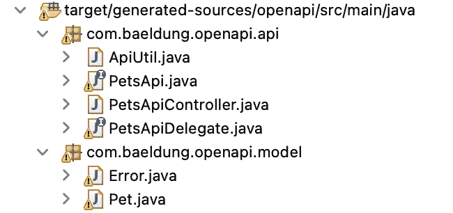

# 使用 Open API 生成器实现 OpenAPI 服务器

> 原文：<https://web.archive.org/web/20220930061024/https://www.baeldung.com/java-openapi-generator-server>

## 1.概观

顾名思义， [OpenAPI 生成器](https://web.archive.org/web/20221022125227/https://github.com/OpenAPITools/openapi-generator)根据 [OpenAPI](/web/20221022125227/https://www.baeldung.com/spring-rest-openapi-documentation) 规范生成代码。它可以为客户端库、服务器存根、文档和配置创建代码。

它支持各种语言和框架。值得注意的是，它支持 C++、C#、Java、PHP、Python、Ruby、Scala——几乎所有广泛使用的语言。

在本教程中，我们将学习如何通过 Maven 插件使用 OpenAPI Generator 实现一个基于 Spring 的服务器存根。

使用生成器的其他方式是通过其 [CLI](https://web.archive.org/web/20221022125227/https://openapi-generator.tech/docs/installation/) 或[在线工具](https://web.archive.org/web/20221022125227/http://api.openapi-generator.tech/index.html)。

## 2.YAML 文件

首先，我们需要一个指定 API 的 YAML 文件。我们将把它作为我们的生成器的输入来生成一个服务器存根。

这是我们`petstore.yml`的一个片段:

[PRE0]

## 3.Maven 依赖性

### 3.1.OpenAPI 生成器插件

接下来，让我们为生成器插件添加 [Maven 依赖关系](https://web.archive.org/web/20221022125227/https://search.maven.org/search?q=a:openapi-generator-maven-plugin%20AND%20g:%20org.openapitools):

[PRE1]

如我们所见，我们将 YAML 文件作为`inputSpec`传入。之后，由于我们需要一个基于 Spring 的服务器，我们使用了`generatorName`作为`spring`。

然后`apiPackage`指定 API 将被生成到的包名。

接下来，我们有生成器放置数据模型的`modelPackage` 。

通过将`delegatePattern`设置为`true`，我们要求创建一个接口，该接口可以作为定制的 [`@Service`](/web/20221022125227/https://www.baeldung.com/spring-bean-annotations#service) 类来实现。

重要的是，无论我们使用 CLI、Maven/Gradle 插件还是在线生成选项，OpenAPI 生成器的 **[选项都是相同的。](https://web.archive.org/web/20221022125227/https://openapi-generator.tech/docs/generators/spring/)**

### 3.2.Maven 依赖性

由于我们将生成一个 Spring 服务器，**我们还需要它的依赖项( [Spring Boot 启动网站](https://web.archive.org/web/20221022125227/https://search.maven.org/search?q=a:spring-boot-starter-web%20AND%20g:org.springframework.boot)和 [Spring 数据 JPA](https://web.archive.org/web/20221022125227/https://search.maven.org/search?q=a:spring-data-jpa%20AND%20g:org.springframework.data) )，这样生成的代码就能按预期编译和运行**:

[PRE2]

除了上面的 Spring 依赖项，我们还需要 [`jackson-databind`](https://web.archive.org/web/20221022125227/https://search.maven.org/search?q=a:jackson-databind-nullable) 和`[swagger2](https://web.archive.org/web/20221022125227/https://search.maven.org/search?q=a:springfox-swagger2)`依赖项，这样我们生成的代码才能成功编译:

[PRE3]

## 4.代码生成

要生成服务器存根，我们只需运行以下命令:

[PRE4]

结果，我们得到了以下结果:

现在我们来看看代码，从`apiPackage`的内容开始。

首先，**我们得到一个名为`PetsApi`** 的 API 接口，它包含了 YAML 规范中定义的所有请求映射。

以下是片段:

[PRE5]

其次，由于我们使用了委托模式，OpenAPI 还为我们生成了一个名为`PetsApiDelegate`的委托者接口。

特别是，在这个接口中声明的**方法返回默认情况下没有实现的 HTTP 状态 501**:

[PRE6]

在那之后，我们看到**有一个`PetsApiController`类简单地连接了委托人**:

[PRE7]

在`modelPackage`中，基于我们的 YAML 输入中定义的`schemas`，生成了一对被称为`Error`和`Pet`的**数据模型 POJOs。**

让我们来看看其中的一个——`Pet`:

[PRE8]

## 5.测试服务器

现在，要使服务器存根发挥服务器的功能，只需添加一个委托者接口的实现。

为了简单起见，我们不在这里这样做，而是只测试存根。

此外，在此之前，我们需要一个弹簧:

[PRE9]

### 5.1.使用`curl`进行测试

启动应用程序后，我们只需运行命令:

[PRE10]

这是预期的结果:

[PRE11]

### 5.2.集成测试

或者，我们可以编写一个简单的[集成测试](/web/20221022125227/https://www.baeldung.com/spring-boot-testing#integration-testing-with-springboottest)来实现相同的功能:

[PRE12]

## 6.结论

在本文中，**我们看到了如何使用 OpenAPI 生成器的 Maven 插件从 YAML 规范生成基于 Spring 的服务器存根。**

下一步，我们还可以用它来[生成一个客户端](/web/20221022125227/https://www.baeldung.com/spring-boot-rest-client-swagger-codegen#generate-rest-client-with-openapi-generator)。

和往常一样，源代码可以在 GitHub 上的[处获得。](https://web.archive.org/web/20221022125227/https://github.com/eugenp/tutorials/tree/master/spring-boot-modules/spring-boot-libraries-2)