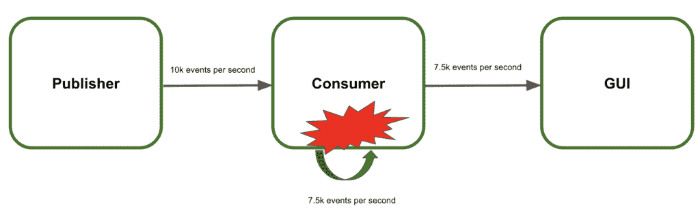
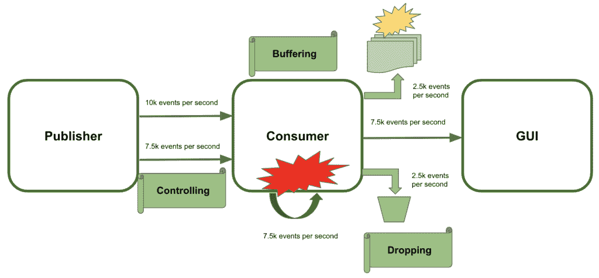
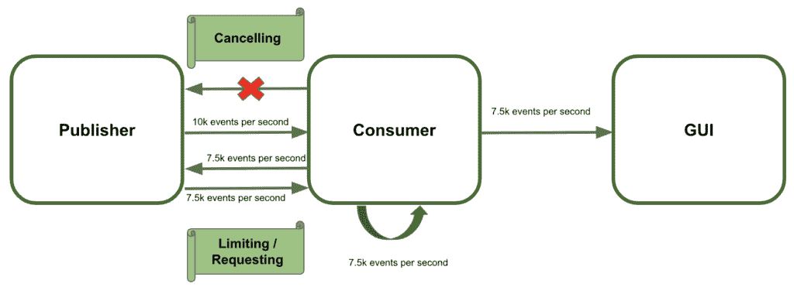
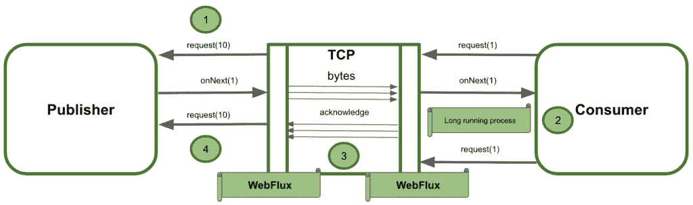

# 弹簧流量中的背压机制

> 原文：<https://web.archive.org/web/20220930061024/https://www.baeldung.com/spring-webflux-backpressure>

## 1.介绍

Spring WebFlux 为 web 应用提供反应式编程。[反应式设计](/web/20220714042345/https://www.baeldung.com/java-reactive-systems)的异步和非阻塞特性提高了性能和内存使用率。 [Project Reactor](https://web.archive.org/web/20220714042345/https://projectreactor.io/) 提供了高效管理数据流的能力。

然而，背压是这类应用中的常见问题。在本教程中，我们将解释它是什么，以及如何在 Spring WebFlux 中应用背压机制来减轻它。

## 2.反应流中的背压

由于反应式编程的非阻塞特性，服务器不会一次发送完整的流。它可以在数据可用时立即并发推送数据。因此，客户端等待接收和处理事件的时间更少。但是，还有一些问题需要克服。

**软件系统中的背压是流量通信过载的能力**。换句话说，信息的发布者用他们无法处理的数据淹没了消费者。

最终，人们也用这个术语作为控制和处理它的机制。它是系统为控制下游力量而采取的保护行动。

### 2.1.什么是背压？

**在反应流中，** **背压也定义了如何调节流元素的传输**。换句话说，控制接收者可以消费多少元素。

让我们用一个例子来清楚地描述它是什么:

*   该系统包含三个服务:发布者、消费者和图形用户界面(GUI)
*   发布者每秒向消费者发送 10000 个事件
*   消费者处理它们并将结果发送到 GUI
*   GUI 向用户显示结果
*   消费者每秒只能处理 7500 个事件

[](/web/20220714042345/https://www.baeldung.com/wp-content/uploads/2021/04/Screenshot-2021-02-18-at-13.10.26-1024x313-1.png)

**在这种速度下，消费者无法管理事件(** **【背压】)**。因此，系统会崩溃，用户看不到结果。

### 2.2.使用背压防止系统故障

这里的建议是应用某种背压策略来防止系统故障。目标是有效管理收到的额外事件:

*   **控制** **发送的数据流将是第一选项**。基本上，出版商需要放慢事件的节奏。因此，消费者不会超载。不幸的是，这并不总是可能的，我们需要找到其他可用的选择
*   **缓冲多余的数据量是第二种选择**。使用这种方法，消费者临时存储剩余的事件，直到它能够处理它们。这里的主要缺点是解除缓冲区的绑定，导致内存崩溃
*   **丢弃失去联系的额外事件**。即使这种解决方案远非理想，使用这种技术系统也不会崩溃

[](/web/20220714042345/https://www.baeldung.com/wp-content/uploads/2021/04/Screenshot-2021-02-18-at-16.48.38-1024x476-1.png)

### 2.3.控制背压

我们将重点控制发布者发出的事件。基本上，有三个策略可以遵循:

*   **仅在用户请求时发送新事件**。这是一种拉策略，用于根据发射器的请求收集元素
*   **限制客户端** **接收的事件数量**。作为有限推送策略，发布者一次只能向客户端发送最大数量的项目
*   **当消费者无法处理更多事件时** **取消数据流**。在这种情况下，接收器可以在任何给定时间中止传输，并在稍后再次订阅该流

[](/web/20220714042345/https://www.baeldung.com/wp-content/uploads/2021/04/Screenshot-2021-02-25-at-16.51.46-1024x380-1.png)

## 3.处理 Spring WebFlux 中的背压

**[Spring WebFlux](/web/20220714042345/https://www.baeldung.com/spring-webflux) 提供异步无阻塞的反应流**。负责 Spring WebFlux 内部背压的是[项目反应堆](https://web.archive.org/web/20220714042345/https://projectreactor.io/docs/core/release/reference/#reactive.backpressure)。它在内部使用[通量功能](https://web.archive.org/web/20220714042345/https://projectreactor.io/docs/core/release/reference/#_on_backpressure_and_ways_to_reshape_requests)来应用机制来控制发射器产生的事件。

WebFlux 使用 TCP 流量控制来调节背压(以字节为单位)。但是它不处理消费者可以接收的逻辑元素。让我们看看在引擎盖下发生的交互流程:

*   WebFlux 框架负责将事件转换为字节，以便通过 TCP 传输/接收它们
*   可能发生的情况是，消费者在请求下一个逻辑元素之前启动了一个长时间运行的作业
*   当接收方处理事件时，WebFlux 将字节排入队列而不进行确认，因为不需要新的事件
*   由于 TCP 协议的性质，如果有新的事件，发布者将继续向网络发送它们

[](/web/20220714042345/https://www.baeldung.com/wp-content/uploads/2021/04/Screenshot-2021-03-19-at-16.40.30-1024x304-1.png)

总之，上图显示了消费者和发布者对逻辑元素的需求可能是不同的。Spring WebFlux 并没有理想地管理作为一个整体系统交互的服务之间的反压力。它独立地与消费者处理它，然后以同样的方式与发布者处理它。但是它没有考虑到两个服务之间的逻辑需求。

因此， **Spring WebFlux 不像我们预期的那样处理背压**。让我们在下一节看看如何在 Spring WebFlux 中实现背压机制！

## 4.用 Spring WebFlux 实现背压机制

我们将使用 [`Flux`实现](https://web.archive.org/web/20220714042345/https://projectreactor.io/docs/core/release/api/reactor/core/publisher/Flux.html)来处理接收到的事件的控制。因此，我们将在读取和写入端公开带有背压支持的请求和响应主体。然后，生产者会放慢或停止，直到消费者的能力释放出来。我们来看看怎么做！

### 4.1.属国

为了实现这些例子，我们将简单地将 [Spring WebFlux starter](https://web.archive.org/web/20220714042345/https://search.maven.org/search?q=a:spring-boot-starter-webflux) 和 [Reactor test](https://web.archive.org/web/20220714042345/https://search.maven.org/search?q=a:reactor-test) 依赖项添加到我们的`pom.xml`:

```
<dependency>
    <groupId>org.springframework.boot</groupId>
    <artifactId>spring-boot-starter-webflux</artifactId>
</dependency>

<dependency>
    <groupId>io.projectreactor</groupId>
    <artifactId>reactor-test</artifactId>
    <scope>test</scope>
</dependency>
```

### 4.2.请求

**第一个选项是** **让消费者控制它可以处理的事件**。因此，发布者一直等到接收者请求新事件。总之，客户端订阅了`Flux` ，然后根据它的需求处理事件:

```
@Test
public void whenRequestingChunks10_thenMessagesAreReceived() {
    Flux request = Flux.range(1, 50);

    request.subscribe(
      System.out::println,
      err -> err.printStackTrace(),
      () -> System.out.println("All 50 items have been successfully processed!!!"),
      subscription -> {
          for (int i = 0; i < 5; i++) {
              System.out.println("Requesting the next 10 elements!!!");
              subscription.request(10);
          }
      }
    );

    StepVerifier.create(request)
      .expectSubscription()
      .thenRequest(10)
      .expectNext(1, 2, 3, 4, 5, 6, 7, 8, 9, 10)
      .thenRequest(10)
      .expectNext(11, 12, 13, 14, 15, 16, 17, 18, 19, 20)
      .thenRequest(10)
      .expectNext(21, 22, 23, 24, 25, 26, 27 , 28, 29 ,30)
      .thenRequest(10)
      .expectNext(31, 32, 33, 34, 35, 36, 37 , 38, 39 ,40)
      .thenRequest(10)
      .expectNext(41, 42, 43, 44, 45, 46, 47 , 48, 49 ,50)
      .verifyComplete();
```

使用这种方法，发射器永远不会淹没接收器。换句话说，客户机在控制之下处理它需要的事件。

我们将使用`StepVerifier`测试关于背压的生产者行为。只有在调用`thenRequest(n)`时，我们才会期待接下来的 n 个项目。

### 4.3.限制

第二个选项是使用 Project Reactor 中的`limitRange()`操作符。**允许设置一次预取的项目数量**。一个有趣的特性是**即使当订阅者请求更多的事件来处理**时，这个限制仍然适用。发射器将事件分成块，避免每个请求消耗超过限制:

```
@Test
public void whenLimitRateSet_thenSplitIntoChunks() throws InterruptedException {
    Flux<Integer> limit = Flux.range(1, 25);

    limit.limitRate(10);
    limit.subscribe(
      value -> System.out.println(value),
      err -> err.printStackTrace(),
      () -> System.out.println("Finished!!"),
      subscription -> subscription.request(15)
    );

    StepVerifier.create(limit)
      .expectSubscription()
      .thenRequest(15)
      .expectNext(1, 2, 3, 4, 5, 6, 7, 8, 9, 10)
      .expectNext(11, 12, 13, 14, 15)
      .thenRequest(10)
      .expectNext(16, 17, 18, 19, 20, 21, 22, 23, 24, 25)
      .verifyComplete();
}
```

### 4.4.取消

最后，**消费者可以随时取消要接收的事件**。对于这个例子，我们将使用另一种方法。Project Reactor 允许实现我们自己的`Subscriber`或扩展`BaseSubscriber`。因此，让我们看看接收器如何在任何时候中止新事件的接收，从而覆盖上述类:

```
@Test
public void whenCancel_thenSubscriptionFinished() {
    Flux<Integer> cancel = Flux.range(1, 10).log();

    cancel.subscribe(new BaseSubscriber<Integer>() {
        @Override
        protected void hookOnNext(Integer value) {
            request(3);
            System.out.println(value);
            cancel();
        }
    });

    StepVerifier.create(cancel)
      .expectNext(1, 2, 3)
      .thenCancel()
      .verify();
}
```

## 5.结论

在本教程中，我们展示了什么是反应式编程中的反压力以及如何避免它。Spring WebFlux 通过 Project Reactor 支持背压。因此，当发布者用太多的事件淹没消费者时，它可以提供可用性、健壮性和稳定性。总之，它可以防止由于高需求而导致的系统故障。

和往常一样，代码可以在 GitHub 的[上获得。](https://web.archive.org/web/20220714042345/https://github.com/eugenp/tutorials/tree/master/spring-5-reactive-modules/spring-5-reactive-2)