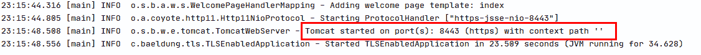

# 春季 TLS 设置

> 原文：<https://web.archive.org/web/20220930061024/https://www.baeldung.com/spring-tls-setup>

## 1.概观

安全通信在现代应用中起着重要的作用。客户端和服务器之间通过普通 HTTP 的通信是不安全的。对于生产就绪的应用程序，我们应该在应用程序中通过 TLS(传输层安全性)协议启用 HTTPS。在本教程中，我们将讨论如何在 Spring Boot 应用程序中启用 TLS 技术。

## 2.TLS 协议

TLS 为客户端和服务器之间传输的数据提供保护，是 HTTPS 协议的重要组成部分。**安全套接字层(SSL)和 TLS 经常互换使用，但[它们不是同一个](/web/20220626193019/https://www.baeldung.com/cs/ssl-vs-tls)。事实上，TLS 是 SSL 的继承者。** TLS 可以单向实施，也可以双向实施。

### 2.1.单向 TLS

在单向 TLS 中，只有客户端验证服务器，以确保它从受信任的服务器接收数据。为了实现单向 TLS，服务器与客户端共享其公共证书。

### 2.2.双向 TLS

在双向 TLS 或双向 TLS (mTLS)中，客户端和服务器都相互进行身份验证，以确保通信双方都是可信的。为了实现 mTLS，双方彼此共享他们的公共证书。

## 3.在 Spring Boot 配置 TLS

### 3.1.生成密钥对

为了启用 TLS，我们需要创建一个公共/私有[密钥对](/web/20220626193019/https://www.baeldung.com/java-digital-signature#getting_keypair)。为此，我们使用`[keytool](/web/20220626193019/https://www.baeldung.com/keytool-intro)`。`keytool`命令带有默认的 Java 发行版。让我们使用`keytool`生成一个密钥对，并将其存储在`keystore.p12`文件中:

[PRE0]

`keystore`文件可以是不同的[格式](/web/20220626193019/https://www.baeldung.com/spring-boot-https-self-signed-certificate#generating-a-self-signed-certificate)。两种最流行的格式是 Java 密钥库(JKS)和 PKCS#12。JKS 是 Java 特有的，而 PKCS#12 是一种行业标准格式，属于在[公钥加密标准](https://web.archive.org/web/20220626193019/https://tools.ietf.org/html/rfc3447) (PKCS)下定义的标准家族。

### 3.2.在 Spring 中配置 TLS

让我们从配置单向 TLS 开始。我们在`application.properties`文件中配置 TLS 相关属性:

[PRE1]

在配置 SSL 协议时，我们将使用 TLS，并告诉服务器使用 TLS 1.2:

[PRE2]

为了验证一切正常，我们只需运行 Spring Boot 应用程序:

### 3.3.在 Spring 中配置 mTLS

为了启用 mTLS，我们使用带有`need`值的`client-auth`属性:

[PRE3]

当我们使用`need`值时，客户端认证是必需的并且是强制性的。这意味着客户端和服务器必须共享它们的公共证书。为了在 Spring Boot 应用程序中存储客户端的证书，我们使用了`truststore`文件，并在`application.properties`文件中对其进行了配置:

[PRE4]

到`truststore`的位置的路径是一个文件，该文件包含机器信任的用于 SSL 服务器认证的证书授权列表。`truststore`密码是访问`truststore`文件的密码。

## 4.在 Tomcat 中配置 TLS

默认情况下，启动 Tomcat 时使用没有任何 TLS 功能的 HTTP 协议。为了在 Tomcat 中启用 TLS，我们配置了`server.xml`文件:

[PRE5]

为了启用 mTLS，我们将设置`clientAuth=”true”`。

## 5.调用 HTTPS API

为了调用 REST API，我们将使用 [`curl`](/web/20220626193019/https://www.baeldung.com/curl-rest) 工具:

[PRE6]

由于我们没有指定`https`，它将输出一个错误:

[PRE7]

这个问题通过使用`https`协议来解决:

[PRE8]

然而，这给了我们另一个错误:

[PRE9]

当我们使用自签名证书时会发生这种情况。要解决这个问题，我们必须在客户端请求中使用服务器证书。首先，我们将从服务器`keystore`文件中复制服务器证书`baeldung.cer`。然后我们将使用`curl`请求中的服务器证书和`–cacert`选项:

[PRE10]

## 6.结论

为了确保在客户机和服务器之间传输的数据的安全性，TLS 可以单向实现，也可以双向实现。在本文中，我们将在`application.properties`文件和 Tomcat 配置文件中描述如何在 Spring Boot 应用程序中配置 TLS。像往常一样，本教程中使用的所有代码示例都可以在 GitHub 上获得[。](https://web.archive.org/web/20220626193019/https://github.com/eugenp/tutorials/tree/master/spring-security-modules/spring-security-web-boot-3)