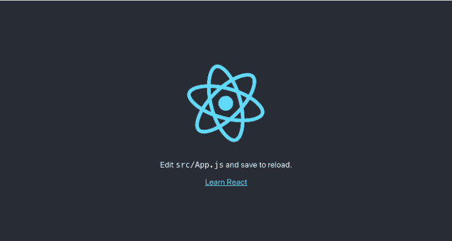

# React 和 Spring Boot 的 CRUD 应用程序

> 原文：<https://web.archive.org/web/20220930061024/https://www.baeldung.com/spring-boot-react-crud>

## 1.介绍

在本教程中，我们将学习如何创建一个能够创建、检索、更新和删除(CRUD)客户端数据的应用程序。该应用将由一个简单的 [Spring Boot RESTful API](/web/20220827170201/https://www.baeldung.com/rest-with-spring-series) 和一个用 [React JavaScript 库](https://web.archive.org/web/20220827170201/https://reactjs.org/)实现的用户界面(UI)组成。

## 2.Spring Boot

### 2.1.Maven 依赖性

让我们从添加一些依赖项到我们的`pom.xml`文件开始:

```
<dependencies>
    <dependency>
        <groupId>org.springframework.boot</groupId>
        <artifactId>spring-boot-starter-web</artifactId>
        <version>2.4.4</version>
    </dependency>

    <dependency>
        <groupId>org.springframework.boot</groupId>
        <artifactId>spring-boot-starter-data-jpa</artifactId>
        <version>2.4.4</version>
    </dependency>

    <dependency>
        <groupId>org.springframework.boot</groupId>
        <artifactId>spring-boot-starter-test</artifactId>
        <version>2.4.4</version>
        <scope>test</scope>
    </dependency>

    <dependency>
        <groupId>com.h2database</groupId>
        <artifactId>h2</artifactId>
        <version>1.4.200</version>
        <scope>runtime</scope>
    </dependency>
</dependencies>
```

这里我们添加了 web、测试和 JPA 持久性启动器，以及 H2 依赖项，因为应用程序将有一个 H2 内存数据库。

### 2.2.创建模型

接下来，让我们创建我们的*客户端*实体类，用`name` 和`email` 属性来表示我们的数据模型:

```
@Entity
@Table(name = "client")
public class Client {

    @Id
    @GeneratedValue
    private Long id;

    private String name;
    private String email;

    // getter, setters, contructors
}
```

### 2.3.创建存储库

然后我们将创建从`JpaRepository`扩展而来的`ClientRepository`类**，以提供 JPA CRUD 功能**:

```
public interface ClientRepository extends JpaRepository<Client, Long> {
}
```

### 2.4.创建静止控制器

最后，让我们通过创建一个控制器来与`ClientRepository`交互，从而公开一个 **REST API:**

```
@RestController
@RequestMapping("/clients")
public class ClientsController {

    private final ClientRepository clientRepository;

    public ClientsController(ClientRepository clientRepository) {
        this.clientRepository = clientRepository;
    }

    @GetMapping
    public List<Client> getClients() {
        return clientRepository.findAll();
    }

    @GetMapping("/{id}")
    public Client getClient(@PathVariable Long id) {
        return clientRepository.findById(id).orElseThrow(RuntimeException::new);
    }

    @PostMapping
    public ResponseEntity createClient(@RequestBody Client client) throws URISyntaxException {
        Client savedClient = clientRepository.save(client);
        return ResponseEntity.created(new URI("/clients/" + savedClient.getId())).body(savedClient);
    }

    @PutMapping("/{id}")
    public ResponseEntity updateClient(@PathVariable Long id, @RequestBody Client client) {
        Client currentClient = clientRepository.findById(id).orElseThrow(RuntimeException::new);
        currentClient.setName(client.getName());
        currentClient.setEmail(client.getEmail());
        currentClient = clientRepository.save(client);

        return ResponseEntity.ok(currentClient);
    }

    @DeleteMapping("/{id}")
    public ResponseEntity deleteClient(@PathVariable Long id) {
        clientRepository.deleteById(id);
        return ResponseEntity.ok().build();
    }
}
```

### 2.5.启动我们的 API

完成后，我们现在准备开始我们的 Spring Boot API。我们可以使用`spring-boot-maven-plugin`来做到这一点:

```
mvn spring-boot:run
```

然后，我们将能够通过访问[http://localhost:8080/clients](https://web.archive.org/web/20220827170201/http://localhost:8080/clients)获得我们的客户列表。

### 2.6。创建客户端

此外，我们可以使用 [Postman](/web/20220827170201/https://www.baeldung.com/postman-testing-collections) 创建一些客户端:

```
curl -X POST http://localhost:8080/clients -d '{"name": "John Doe", "email": "[[email protected]](/web/20220827170201/https://www.baeldung.com/cdn-cgi/l/email-protection)"}'
```

## 3.反应

React 是一个用于创建用户界面的 JavaScript 库。使用 React 需要安装 [Node.js](https://web.archive.org/web/20220827170201/https://nodejs.org/) 。我们可以在 Node.js 下载页面找到安装说明[。](https://web.archive.org/web/20220827170201/https://nodejs.org/en/download)

### 3.1.创建 React 用户界面

[创建 React App](https://web.archive.org/web/20220827170201/https://reactjs.org/docs/create-a-new-react-app.html) 是一个命令实用程序，**为我们**生成 React 项目。让我们运行以下命令，在 Spring Boot 应用程序基本目录中创建我们的`frontend`应用程序:

```
npx create-react-app frontend
```

app 创建过程完成后，我们将在`frontend`目录中安装[引导](https://web.archive.org/web/20220827170201/https://getbootstrap.com/)、[反应路由器](https://web.archive.org/web/20220827170201/https://reactrouter.com/)和[反应陷阱](https://web.archive.org/web/20220827170201/https://reactstrap.github.io/):

```
npm install --save [[email protected]](/web/20220827170201/https://www.baeldung.com/cdn-cgi/l/email-protection) [[email protected]](/web/20220827170201/https://www.baeldung.com/cdn-cgi/l/email-protection) [[email protected]](/web/20220827170201/https://www.baeldung.com/cdn-cgi/l/email-protection) [[email protected]](/web/20220827170201/https://www.baeldung.com/cdn-cgi/l/email-protection)
```

我们将使用 Bootstrap 的 CSS 和 reactstrap 的组件来创建一个更好看的 UI，并使用 React 路由器组件来处理应用程序的导航。

让我们在`app/src/index.js`中添加 Bootstrap 的 CSS 文件作为导入:

```
import 'bootstrap/dist/css/bootstrap.min.css';
```

### 3.2.启动我们的 React 用户界面

现在我们准备开始我们的`frontend`应用程序:

```
npm start
```

当在我们的浏览器中访问 [http://localhost:3000](https://web.archive.org/web/20220827170201/http://localhost:3000/) 时，我们应该看到 React 示例页面:

[](/web/20220827170201/https://www.baeldung.com/wp-content/uploads/2021/04/react.png)

### 3.3.调用我们的 Spring Boot API

调用我们的 Spring Boot API 需要设置 React 应用程序的 `package.json`文件，以便在调用 API 时配置代理。

为此，我们将在`package.json`中包含 API 的 URL:

```
...
"proxy": "http://localhost:8080",
...
```

接下来，让我们编辑`frontend/src/App.js`，以便它调用我们的 API 来显示具有`name`和`email`属性的客户端列表:

```
class App extends Component {
  state = {
    clients: []
  };

  async componentDidMount() {
    const response = await fetch('/clients');
    const body = await response.json();
    this.setState({clients: body});
  }

  render() {
    const {clients} = this.state;
    return (
        <div className="App">
          <header className="App-header">
            
            <div className="App-intro">
              <h2>Clients</h2>
              {clients.map(client =>
                  <div key={client.id}>
                    {client.name} ({client.email})
                  </div>
              )}
            </div>
          </header>
        </div>
    );
  }
}
export default App; 
```

在`componentDidMount` 函数中，**我们获取我们的客户端 API** ，并在`clients` 变量中设置响应体。在我们的`render` 函数中，我们返回在 API 中找到的客户端列表的 HTML。

我们将看到我们客户的页面，看起来像这样:

[](/web/20220827170201/https://www.baeldung.com/wp-content/uploads/2021/04/react2.png)

注意:确保 Spring Boot 应用程序正在运行，以便用户界面能够调用 API。

### 3.4.创建一个`ClientList`组件

我们现在可以改进我们的 UI，使用我们的 API 向`list`、`edit`、`delete`和`create clients` 显示一个**更复杂的组件。稍后，我们将看到如何使用这个组件和来自`App`组件的`remove`客户端列表。**

让我们在`frontend/src/ClientList.js`中创建一个文件:

```
import React, { Component } from 'react';
import { Button, ButtonGroup, Container, Table } from 'reactstrap';
import AppNavbar from './AppNavbar';
import { Link } from 'react-router-dom';

class ClientList extends Component {

    constructor(props) {
        super(props);
        this.state = {clients: []};
        this.remove = this.remove.bind(this);
    }

    componentDidMount() {
        fetch('/clients')
            .then(response => response.json())
            .then(data => this.setState({clients: data}));
    }
}
export default ClientList;
```

与在`App.js`中一样，`componentDidMount `函数正在调用我们的 API 来加载我们的客户端列表。

当我们想要删除一个客户端时，我们还将包含`remove`函数来处理对 API 的`DELETE`调用。此外，我们将创建`render`函数，该函数将呈现带有`Edit`、`Delete`和`Add Client`动作的 HTML:

```
async remove(id) {
    await fetch(`/clients/${id}`, {
        method: 'DELETE',
        headers: {
            'Accept': 'application/json',
            'Content-Type': 'application/json'
        }
    }).then(() => {
        let updatedClients = [...this.state.clients].filter(i => i.id !== id);
        this.setState({clients: updatedClients});
    });
}

render() {
    const {clients, isLoading} = this.state;

    if (isLoading) {
        return <p>Loading...</p>;
    }

    const clientList = clients.map(client => {
        return <tr key={client.id}>
            <td style={{whiteSpace: 'nowrap'}}>{client.name}</td>
            <td>{client.email}</td>
            <td>
                <ButtonGroup>
                    <Button size="sm" color="primary" tag={Link} to={"/clients/" + client.id}>Edit</Button>
                    <Button size="sm" color="danger" onClick={() => this.remove(client.id)}>Delete</Button>
                </ButtonGroup>
            </td>
        </tr>
    });

    return (
        <div>
            <AppNavbar/>
            <Container fluid>
                <div className="float-right">
                    <Button color="success" tag={Link} to="/clients/new">Add Client</Button>
                </div>
                <h3>Clients</h3>
                <Table className="mt-4">
                    <thead>
                    <tr>
                        <th width="30%">Name</th>
                        <th width="30%">Email</th>
                        <th width="40%">Actions</th>
                    </tr>
                    </thead>
                    <tbody>
                    {clientList}
                    </tbody>
                </Table>
            </Container>
        </div>
    );
}
```

### 3.5.创建一个`ClientEdit`组件

组件`ClientEdit `将负责**创建和编辑我们的客户端**。

让我们在`frontend/src/ClientEdit.js`中创建一个文件:

```
import React, { Component } from 'react';
import { Link, withRouter } from 'react-router-dom';
import { Button, Container, Form, FormGroup, Input, Label } from 'reactstrap';
import AppNavbar from './AppNavbar';

class ClientEdit extends Component {

    emptyItem = {
        name: '',
        email: ''
    };

    constructor(props) {
        super(props);
        this.state = {
            item: this.emptyItem
        };
        this.handleChange = this.handleChange.bind(this);
        this.handleSubmit = this.handleSubmit.bind(this);
    }
}
export default withRouter(ClientEdit);
```

让我们添加`componentDidMount`函数来检查我们是在处理创建还是编辑特性；在编辑的情况下，它将从 API 中获取我们的客户端:

```
async componentDidMount() {
    if (this.props.match.params.id !== 'new') {
        const client = await (await fetch(`/clients/${this.props.match.params.id}`)).json();
        this.setState({item: client});
    }
}
```

然后在`handleChange` 函数中，我们将更新组件状态项属性，该属性将在提交表单时使用:

```
handleChange(event) {
    const target = event.target;
    const value = target.value;
    const name = target.name;
    let item = {...this.state.item};
    item[name] = value;
    this.setState({item});
}
```

在`handeSubmit`中，我们将调用我们的 API，根据我们调用的特性将请求发送给`PUT`或`POST`方法。为此，我们可以检查`id`属性是否被填充:

```
async handleSubmit(event) {
    event.preventDefault();
    const {item} = this.state;

    await fetch('/clients' + (item.id ? '/' + item.id : ''), {
        method: (item.id) ? 'PUT' : 'POST',
        headers: {
            'Accept': 'application/json',
            'Content-Type': 'application/json'
        },
        body: JSON.stringify(item),
    });
    this.props.history.push('/clients');
}
```

最后但同样重要的是，我们的`render`函数将处理我们的表单:

```
render() {
    const {item} = this.state;
    const title = <h2>{item.id ? 'Edit Client' : 'Add Client'}</h2>;

    return <div>
        <AppNavbar/>
        <Container>
            {title}
            <Form onSubmit={this.handleSubmit}>
                <FormGroup>
                    <Label for="name">Name</Label>
                    <Input type="text" name="name" id="name" value={item.name || ''}
                           onChange={this.handleChange} autoComplete="name"/>
                </FormGroup>
                <FormGroup>
                    <Label for="email">Email</Label>
                    <Input type="text" name="email" id="email" value={item.email || ''}
                           onChange={this.handleChange} autoComplete="email"/>
                </FormGroup>
                <FormGroup>
                    <Button color="primary" type="submit">Save</Button>{' '}
                    <Button color="secondary" tag={Link} to="/clients">Cancel</Button>
                </FormGroup>
            </Form>
        </Container>
    </div>
}
```

**注意:我们还有一个`Link`，当点击`Cancel`按钮时，它的路线配置为返回`/clients`。**

### 3.6.创建一个`AppNavbar`组件

**为了让我们的应用程序** **具有更好的导航性**，让我们在`frontend/src/AppNavbar.js`中创建一个文件:

```
import React, {Component} from 'react';
import {Navbar, NavbarBrand} from 'reactstrap';
import {Link} from 'react-router-dom';

export default class AppNavbar extends Component {
    constructor(props) {
        super(props);
        this.state = {isOpen: false};
        this.toggle = this.toggle.bind(this);
    }

    toggle() {
        this.setState({
            isOpen: !this.state.isOpen
        });
    }

    render() {
        return <Navbar color="dark" dark expand="md">
            <NavbarBrand tag={Link} to="/">Home</NavbarBrand>
        </Navbar>;
    }
}
```

在`render `函数中，**我们将使用`react-router-dom`功能创建一个** `**Link** `来路由到我们的应用程序`Home`页面。

### 3.7.创建我们的`Home`组件

这个组件将是我们的应用程序`Home` 页面，并且有一个按钮指向我们之前创建的`ClientList`组件。

让我们在`frontend/src/Home.js`中创建一个文件:

```
import React, { Component } from 'react';
import './App.css';
import AppNavbar from './AppNavbar';
import { Link } from 'react-router-dom';
import { Button, Container } from 'reactstrap';

class Home extends Component {
    render() {
        return (
            <div>
                <AppNavbar/>
                <Container fluid>
                    <Button color="link"><Link to="/clients">Clients</Link></Button>
                </Container>
            </div>
        );
    }
}
export default Home;
```

**注意:在这个组件中，我们还有一个从`react-router-dom`到`/clients`的`Link` 。此路由将在下一步中配置。**

### 3.8.使用 React 路由器

现在我们将使用 [React 路由器](https://web.archive.org/web/20220827170201/https://reactrouter.com/)在我们的组件之间导航。

让我们改变一下我们的`App.js`:

```
import React, { Component } from 'react';
import './App.css';
import Home from './Home';
import { BrowserRouter as Router, Route, Switch } from 'react-router-dom';
import ClientList from './ClientList';
import ClientEdit from "./ClientEdit";

class App extends Component {
  render() {
    return (
        <Router>
          <Switch>
            <Route path='/' exact={true} component={Home}/>
            <Route path='/clients' exact={true} component={ClientList}/>
            <Route path='/clients/:id' component={ClientEdit}/>
          </Switch>
        </Router>
    )
  }
}

export default App;
```

正如我们所看到的，我们已经为我们创建的每个组件定义了应用程序路由。

当访问 [localhost:3000](https://web.archive.org/web/20220827170201/http://localhost:3000/) 时，我们现在有了带有`Clients` 链接的`Home`页面:

[](/web/20220827170201/https://www.baeldung.com/wp-content/uploads/2021/04/react-homepng.png)

点击`Clients`链接，我们现在有了我们的客户列表，以及`Edit`、`Remove`和`Add Client`功能:

[](/web/20220827170201/https://www.baeldung.com/wp-content/uploads/2021/04/react-clients.png)

## 4.建筑和包装

为了用 Maven 构建和打包我们的 React 应用程序，我们将使用`[frontend-maven-plugin](https://web.archive.org/web/20220827170201/https://github.com/eirslett/frontend-maven-plugin)`。

这个插件将负责将我们的`frontend`应用程序打包并复制到我们的 Spring Boot API 构建文件夹中:

```
<properties>
    ...
    <frontend-maven-plugin.version>1.6</frontend-maven-plugin.version>
    <node.version>v14.8.0</node.version>
    <yarn.version>v1.12.1</yarn.version>
    ...
</properties>
...
<build>
    <plugins>
        <plugin>
            <groupId>org.apache.maven.plugins</groupId>
            <artifactId>maven-resources-plugin</artifactId>
            <version>3.1.0</version>
            <executions>
                ...
            </executions>
        </plugin>
        <plugin>
            <groupId>com.github.eirslett</groupId>
            <artifactId>frontend-maven-plugin</artifactId>
            <version>${frontend-maven-plugin.version}</version>
            <configuration>
                ...
            </configuration>
            <executions>
                ...
            </executions>
        </plugin>
        ...
    </plugins>
</build>
```

让我们仔细看看我们的 [`maven-resources-plugin`](https://web.archive.org/web/20220827170201/https://maven.apache.org/plugins/maven-resources-plugin/) ，它负责将我们的`frontend`源复制到应用`target`文件夹:

```
...
<plugin>
    <groupId>org.apache.maven.plugins</groupId>
    <artifactId>maven-resources-plugin</artifactId>
    <version>3.1.0</version>
    <executions>
        <execution>
            <id>copy-resources</id>
            <phase>process-classes</phase>
            <goals>
                <goal>copy-resources</goal>
            </goals>
            <configuration>
                <outputDirectory>${basedir}/target/classes/static</outputDirectory>
                <resources>
                    <resource>
                        <directory>frontend/build</directory>
                    </resource>
                </resources>
            </configuration>
        </execution>
    </executions>
</plugin>
...
```

我们的`front-end-maven-plugin `将负责安装`Node.js`和[纱线](https://web.archive.org/web/20220827170201/https://yarnpkg.com/)，然后构建和测试我们的`frontend`应用程序:

```
...
<plugin>
    <groupId>com.github.eirslett</groupId>
    <artifactId>frontend-maven-plugin</artifactId>
    <version>${frontend-maven-plugin.version}</version>
    <configuration>
        <workingDirectory>frontend</workingDirectory>
    </configuration>
    <executions>
        <execution>
            <id>install node</id>
            <goals>
                <goal>install-node-and-yarn</goal>
            </goals>
            <configuration>
                <nodeVersion>${node.version}</nodeVersion>
                <yarnVersion>${yarn.version}</yarnVersion>
            </configuration>
        </execution>
        <execution>
            <id>yarn install</id>
            <goals>
                <goal>yarn</goal>
            </goals>
            <phase>generate-resources</phase>
        </execution>
        <execution>
            <id>yarn test</id>
            <goals>
                <goal>yarn</goal>
            </goals>
            <phase>test</phase>
            <configuration>
                <arguments>test</arguments>
                <environmentVariables>
                    <CI>true</CI>
                </environmentVariables>
            </configuration>
        </execution>
        <execution>
            <id>yarn build</id>
            <goals>
                <goal>yarn</goal>
            </goals>
            <phase>compile</phase>
            <configuration>
                <arguments>build</arguments>
            </configuration>
        </execution>
    </executions>
</plugin>
...
```

**注意:要指定不同的 Node.js 版本，我们可以简单地编辑我们的`pom.xml`中的`node.version`属性。**

## 5.运行我们的 Spring Boot React CRUD 应用

最后，通过添加插件，我们可以运行以下命令来访问我们的应用程序:

```
mvn spring-boot:run
```

**我们的 React 应用程序将完全集成到我们的 API** 中，位于[http://localhost:8080/](https://web.archive.org/web/20220827170201/http://localhost:8080/)URL。

## 6.结论

在本文中，我们研究了如何使用 Spring Boot 和 React 创建 CRUD 应用程序。为此，我们首先创建了一些 REST API 端点来与数据库进行交互。然后我们创建了一些 React 组件来使用我们的 API 读取和写入数据。我们还学习了如何将我们的 Spring Boot 应用程序和我们的 React UI 打包成一个应用程序包。

GitHub 上的[提供了我们应用程序的源代码。](https://web.archive.org/web/20220827170201/https://github.com/eugenp/tutorials/tree/master/spring-boot-modules/spring-boot-react)