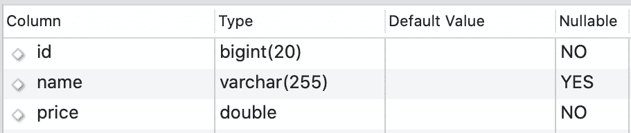
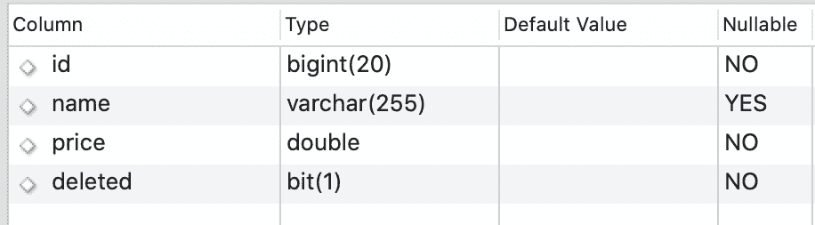

# 如何用 Spring JPA 实现软删除

> 原文：<https://web.archive.org/web/20220930061024/https://www.baeldung.com/spring-jpa-soft-delete>

## 1.介绍

在与数据库交互时，从表中物理删除数据是一种常见的需求。但是有时业务要求不要从数据库中永久删除数据。这些要求，例如，对数据历史跟踪或审计的需要，也与证明人的完整性有关。

我们可以隐藏数据，使其无法从应用程序前端访问，而不是物理删除数据。

在本教程中，我们将学习软删除以及如何用 [Spring JPA](/web/20221122090503/https://www.baeldung.com/the-persistence-layer-with-spring-and-jpa) 实现这一技术。

## 2.什么是软删除？

**软删除执行更新过程，将一些数据标记为已删除，而不是将其从数据库的表中物理删除。**实现软删除的一个常用方法是添加一个字段来指示数据是否已被删除。

例如，假设我们有一个产品表，其结构如下: 

现在让我们看一下从表中物理删除记录时将运行的 SQL 命令:

[PRE0]

该 SQL 命令将从数据库的表中永久删除带有`id=1`的产品。

现在让我们实现上面描述的软删除机制: 

注意，我们添加了一个名为`deleted.` 的新字段，该字段将包含值`0`或`1`。

值`1`将指示数据已被删除，而 `0`将指示数据未被删除。我们应该将`0`设置为默认值，对于每个数据删除过程，我们不运行 SQL delete 命令，而是运行下面的 SQL update 命令:

[PRE1]

使用这个 SQL 命令，我们实际上并没有删除该行，只是将它标记为已删除。因此，当我们要执行一个读查询时，我们只需要那些没有被删除的行，我们应该只在我们的 SQL 查询中添加一个过滤器:

[PRE2]

## 3.如何在 Spring JPA 中实现软删除

有了 Spring JPA，软删除的实现变得容易多了。为此，我们只需要一些 JPA 注释。

正如我们所知，我们通常只在 JPA 中使用几个 SQL 命令。它将在后台创建和执行大多数 SQL 查询。

现在让我们在 Spring JPA 中使用与上面相同的表示例实现软删除。

### 3.1.实体类

最重要的部分是创建实体类。

让我们创建一个`Product`实体类:

[PRE3]

正如我们所看到的，我们添加了一个`deleted`属性，默认值设置为`FALSE`。

下一步是覆盖 JPA 存储库中的`delete`命令。

默认情况下，JPA 存储库中的 delete 命令将运行 SQL delete 查询，所以让我们首先向我们的实体类添加一些注释:

[PRE4]

**我们使用`@SQLDelete`注释来覆盖删除命令。**每次我们执行删除命令时，我们实际上都让**将它转换成 SQL 更新命令，将删除的字段值更改为 true** ，而不是永久删除数据。

**另一方面，`@Where`注释会在我们读取产品数据时添加一个过滤器。**因此，根据上面的代码示例，值为`deleted = true`的产品数据不会包含在结果中。

### 3.2.贮藏室ˌ仓库

repository 类中没有特殊的变化，我们可以像在 Spring Boot 应用程序中编写普通的 repository 类一样编写它:

[PRE5]

### 3.3.服务

同样对于服务类，还没有什么特别的。我们可以从库中调用我们想要的函数。

在这个例子中，让我们调用三个存储库函数来创建一个记录，然后执行一个软删除:

[PRE6]

## 4.如何获取删除的数据？

通过使用`@Where`注释，我们不能获得被删除的产品数据，以防我们仍然希望被删除的数据是可访问的。例如，具有管理员级别的用户具有完全访问权限，可以查看已“删除”的数据。

**为了实现这一点，我们不应该使用`@Where`注释** **，而是使用两种不同的注释， `@FilterDef,`和`@Filter`** 。有了这些注释，我们可以根据需要动态添加条件:

[PRE7]

这里的`@FilterDef`注释定义了@ `Filter`注释将使用的基本要求。此外，我们还需要更改`ProductService`服务类中的`findAll()`函数来处理动态参数或过滤器:

[PRE8]

这里我们添加了参数`isDeleted`,我们将把它添加到对象`Filter`,影响读取`Product`实体的过程。

## 5.结论

使用 Spring JPA 很容易实现软删除技术。我们需要做的是定义一个字段来存储一行是否被删除。然后，我们必须在那个特定的实体类上使用`@SQLDelete`注释来覆盖删除命令。

如果我们想要更多的控制，我们可以使用`@FilterDef`和`@Filter`注释，这样我们就可以确定查询结果是否应该包括删除的数据。

本文中的所有代码都可以在 GitHub 上的[处获得。](https://web.archive.org/web/20221122090503/https://github.com/eugenp/tutorials/tree/master/persistence-modules/spring-data-jpa-crud)