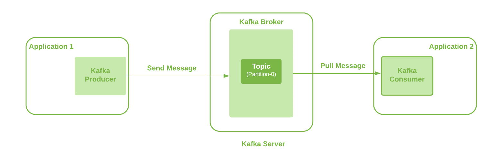

# 用 Kafka 发送大型邮件

> 原文:[https://web . archive . org/web/20220930061024/https://www . bael dung . com/Java-Kafka-send-large-message](https://web.archive.org/web/20220930061024/https://www.baeldung.com/java-kafka-send-large-message)

## 1.概观

[Apache Kafka](https://web.archive.org/web/20221216114021/https://kafka.apache.org/) 是一个强大的、开源的、分布式的、容错的事件流平台。但是，当我们使用 Kafka 发送大于配置的大小限制的消息时，它会给出一个错误。

我们在之前的教程中展示了如何使用 Spring 和 Kafka。在本教程中，我们将看看如何用 Kafka 发送大量信息。

## 2.问题陈述

**Kafka 配置限制了允许发送的信息大小。**默认情况下，该限制为 1MB。然而，如果有发送大消息的需求，我们需要根据我们的需求调整这些配置。

**对于本教程，我们使用的是 Kafka v 2.5。**在跳到配置之前，让我们先来看看我们的 Kafka 设置。

## 3.设置

在这里，我们将使用带有单个代理的基本 Kafka 设置。此外，producer 应用程序可以通过使用 Kafka 客户端将消息发送到 Kafka Broker。此外，我们使用单分区主题:

[](/web/20221216114021/https://www.baeldung.com/wp-content/uploads/2021/07/kafka-setup.png)

我们可以在这里观察到多个互动点，像卡夫卡生产者、卡夫卡经纪人、话题、卡夫卡消费者。因此，**所有这些都需要配置更新，以便能够从一端向另一端发送大型消息**。

让我们详细研究一下发送 20MB 大消息的这些配置。

## 3.卡夫卡生产者配置

这是我们信息的第一个来源。我们使用 Spring Kafka 将消息从我们的应用程序发送到 Kafka 服务器。

因此，首先需要更新**属性“`max.request.size`”**。关于这个生产者配置的更多细节可以在 [Kafka 文档](https://web.archive.org/web/20221216114021/https://kafka.apache.org/documentation/#producerconfigs_max.request.size)中找到。这在 Kafka 客户端库中作为常量`ProducerConfig.MAX_REQUEST_SIZE_CONFIG`提供，它是 Spring Kafka 依赖项的一部分。

让我们将这个值配置为`20971520`字节:

```
public ProducerFactory<String, String> producerFactory() {
    Map<String, Object> configProps = new HashMap<>();
    configProps.put(ProducerConfig.BOOTSTRAP_SERVERS_CONFIG, bootstrapAddress);
    configProps.put(ProducerConfig.KEY_SERIALIZER_CLASS_CONFIG, StringSerializer.class);
    configProps.put(ProducerConfig.VALUE_SERIALIZER_CLASS_CONFIG, StringSerializer.class);
    configProps.put(ProducerConfig.MAX_REQUEST_SIZE_CONFIG, "20971520");

    return new DefaultKafkaProducerFactory<>(configProps);
}
```

## 4.卡夫卡主题结构

我们的消息生成应用程序根据定义的主题向 Kafka Broker 发送消息。因此，下一个需求是配置所使用的 Kafka 主题。这意味着我们需要**更新默认值为 1MB 的“`max.message.bytes`”属性**。

这保存了压缩后 Kafka 的最大记录批量的值(如果启用了压缩)。更多细节可在 [Kafka 文档](https://web.archive.org/web/20221216114021/https://kafka.apache.org/25/documentation.html#max.message.bytes)中找到。

让我们在创建主题时使用 CLI 命令手动配置该属性:

```
./kafka-topics.sh --bootstrap-server localhost:9092 --create --topic longMessage --partitions 1 \
--replication-factor 1 --config max.message.bytes=20971520 
```

或者，我们可以通过 Kafka 客户端配置该属性:

```
public NewTopic topic() {
    NewTopic newTopic = new NewTopic(longMsgTopicName, 1, (short) 1);
    Map<String, String> configs = new HashMap<>();
    configs.put("max.message.bytes", "20971520");
    newTopic.configs(configs);
    return newTopic;
}
```

至少，我们需要配置这两个属性。

## 5.Kafka 代理配置

可选的配置属性“`message.max.bytes`”可用于允许`Broker`上的所有主题接受大小大于 1MB 的消息。

这保存了 Kafka 在压缩后允许的最大记录批量的值(如果启用了压缩)。更多细节可在 [Kafka 文档](https://web.archive.org/web/20221216114021/https://kafka.apache.org/25/documentation.html#message.max.bytes)中找到。

让我们将这个属性添加到 Kafka Broker 的"`server.properties”`配置文件中:

```
message.max.bytes=20971520
```

此外，“`message.max.bytes”` ”和“`max.message.bytes`”中的最大值将是所使用的有效值。

## 6.消费者配置

让我们看看 Kafka 消费者可以使用的配置设置。虽然这些更改对于使用大型消息不是强制性的，但是避免它们会对使用者应用程序的性能产生影响。因此，有这些配置也很好:

*   `max.partition.fetch.bytes`:这个属性限制了消费者可以从主题的分区中获取的字节数。更多细节见[卡夫卡文献](https://web.archive.org/web/20221216114021/https://kafka.apache.org/documentation/#consumerconfigs_max.partition.fetch.bytes)。这是 Kafka 客户端库中一个名为`ConsumerConfig.MAX_PARTITION_FETCH_BYTES_CONFIG` 的常量
*   `fetch.max.bytes`:该属性限制了消费者可以从 Kafka 服务器本身获取的字节数。Kafka 用户也可以监听多个分区。更多细节见[卡夫卡文献](https://web.archive.org/web/20221216114021/https://kafka.apache.org/documentation/#consumerconfigs_fetch.max.bytes)。这是 Kafka 客户端库中的常量`ConsumerConfig.FETCH_MAX_BYTES_CONFIG `

因此，为了配置我们的消费者，我们需要创建一个`KafkaConsumerFactory`。请记住，我们总是需要使用比`Topic/Broker`配置更高的值:

```
public ConsumerFactory<String, String> consumerFactory(String groupId) {
    Map<String, Object> props = new HashMap<>();
    props.put(ConsumerConfig.BOOTSTRAP_SERVERS_CONFIG, bootstrapAddress);
    props.put(ConsumerConfig.GROUP_ID_CONFIG, groupId);
    props.put(ConsumerConfig.KEY_DESERIALIZER_CLASS_CONFIG, StringDeserializer.class);
    props.put(ConsumerConfig.VALUE_DESERIALIZER_CLASS_CONFIG, StringDeserializer.class);
    props.put(ConsumerConfig.MAX_PARTITION_FETCH_BYTES_CONFIG, "20971520");
    props.put(ConsumerConfig.FETCH_MAX_BYTES_CONFIG, "20971520");
    return new DefaultKafkaConsumerFactory<>(props);
}
```

这里我们为两个属性使用了相同的配置值 20971520 字节，因为我们使用了一个分区`Topic`。然而，当我们让消费者监听多个分区时，`FETCH_MAX_BYTES_CONFIG `的值应该比`MAX_PARTITION_FETCH_BYTES_CONFIG.`高，`FETCH_MAX_BYTES_CONFIG `表示可以从多个分区获取的消息大小。另一方面，配置`MAX_PARTITION_FETCH_BYTES_CONFIG `表示从单个分区获取消息的大小。

## 7.可供选择的事物

我们看到了 Kafka producer、Topic、Broker 和 Kafka consumer 中的不同配置如何被更新以发送大型消息。然而，我们通常应该避免使用 Kafka 发送大型消息。大型消息的处理会消耗生产者和消费者更多的 CPU 和内存。因此最终在某种程度上限制了它们对其他任务的处理能力。此外，这会给最终用户带来明显的高延迟。

让我们看看其他可能的选择:

1.  Kafka producer 提供了一个压缩消息的特性。此外，它支持不同的压缩类型，我们可以使用`compression.type`属性来配置。
2.  我们可以将大消息存储在共享存储位置的文件中，并通过 Kafka message 发送该位置。这可能是一个更快的选择，并且具有最小的处理开销。
3.  另一种选择是在生产者端将大消息分成 1KB 大小的小消息。之后，我们可以使用分区键将所有这些消息发送到单个分区，以确保正确的顺序。因此，稍后，在消费者端，我们可以从较小的消息中重建较大的消息。

如果以上选项都不符合我们的要求，我们可以采用前面讨论过的配置。

## 8.结论

在本文中，我们讨论了发送大于 1MB 的大消息所需的不同 Kafka 配置。

我们讨论了生产者、主题、代理和消费者端的配置需求。然而，其中一些是强制性配置，而一些是可选的。此外，消费者配置是可选的，但有助于避免负面的性能影响。

最后，我们还讨论了发送大消息的其他可能选项。

与往常一样，代码示例是 GitHub 上可用的 [。](https://web.archive.org/web/20221216114021/https://github.com/eugenp/tutorials/tree/master/spring-kafka)