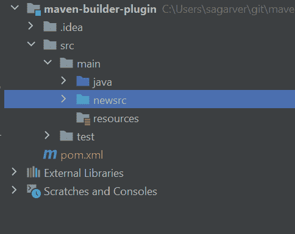
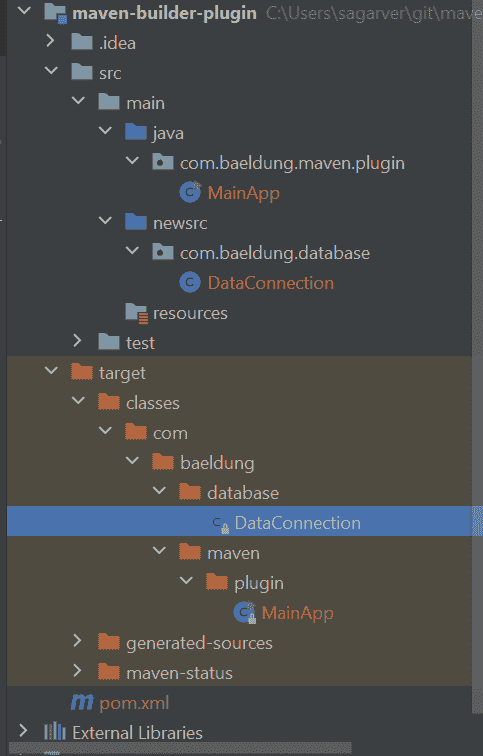

# Maven 中的附加源目录

> 原文：<https://web.archive.org/web/20220930061024/https://www.baeldung.com/maven-add-src-directories>

## 1.概观

在本教程中，我们将解释如何在基于 Maven 的 Java 项目中添加多个源目录。

## 2.额外的源目录

假设我们需要在`src/main`中添加一个 `/newsrc`源目录:

[](/web/20220626083300/https://www.baeldung.com/wp-content/uploads/2021/07/mavenProject-1.png)

首先，让我们在`src/main/newsrc/`文件夹中创建一个简单的 Java 类文件`DataConnection.java`:

```
public class DataConnection {

    public static String temp() {
        return "secondary source directory";
    }
}
```

之后，让我们在`src/main/java`目录中创建另一个类文件，该文件使用我们在另一个文件夹中创建的`DataConnection`类:

```
public class MainApp {
    public static void main(String args[]){
        System.out.println(DataConnection.temp());
    }
}
```

在我们尝试编译 Maven 项目之前，让我们快速看一下项目的结构:

[](/web/20220626083300/https://www.baeldung.com/wp-content/uploads/2021/07/mavenProjectWithSubDir-1.png)

现在，**如果我们试图编译它，我们会得到一个编译错误**:

```
[ERROR] BuilderHelper/src/main/java/com/baeldung/maven/plugin/MainApp.java:[3,29] package com.baeldung.database does not exist
[ERROR] BuilderHelper/src/main/java/com/baeldung/database/MainApp.java:[9,28] cannot find symbol
[ERROR] symbol: variable DataConnection
[ERROR] location: class com.baeldung.MainApp
```

我们可以理解错误消息的根本原因——我们已经在一般项目目录配置之外定义了`DataConnection`类。

**Maven 默认只支持一个源文件夹**。为了配置多个源目录，**我们需要使用一个名为`build-helper-maven-plugin`** 的 Maven 插件。

## 3.用`build-helper-maven-plugin`添加源目录

为了解决上面的错误，我们将使用`build-helper-maven-plugin`添加一个源目录。这个插件帮助我们用最少的配置实现我们的目标。

由于在`src/main`文件夹旁边有一个兄弟目录，我们现在将**添加第二个源目录**:

```
 <build>
        <plugins>
            <plugin>
                <groupId>org.codehaus.mojo</groupId>
                <artifactId>build-helper-maven-plugin</artifactId>
                <version>3.2.0</version>
                <executions>
                    <execution>
                        <id>add-source</id>
                        <phase>generate-sources</phase>
                        <goals>
                            <goal>add-source</goal>
                        </goals>
                        <configuration>
                            <sources>
                                <source>src/main/newsrc/</source>
                            </sources>
                        </configuration>
                    </execution>
                </executions>
            </plugin>
        </plugins>
    </build> 
```

这里，我们在`generate-sources`阶段运行`add-source`目标。此外，我们在一个`configuration.sources.source`标签中指定了源目录。

我们知道，在编译之前，Maven 的默认生命周期包含几个阶段:`validate`、`initialize`、`generate-sources`、`process-sources`、`generate-resources`、`process-resources`和`compile`。因此，在这里，我们在 Maven 编译源代码之前添加了一个新的源目录。

现在，我们将编译项目，然后构建成功。此后，**当我们检查目标文件夹时，我们会看到插件从两个源目录生成类**:

[](/web/20220626083300/https://www.baeldung.com/wp-content/uploads/2021/07/mavenProjectWithSubDirWithTarget-1.png)

我们可以在 [Maven Central](https://web.archive.org/web/20220626083300/https://search.maven.org/classic/#search%7Cga%7C1%7Cg%3A%22org.codehaus.mojo%22%20a%3A%22build-helper-maven-plugin%22) 上找到这个插件的最新版本。**在我们的例子中，我们只添加了一个源目录，但是插件允许我们添加任意多的目录**。

## 4.结论

在本教程中，我们学习了如何使用 [`build-helper-maven-plugin`](https://web.archive.org/web/20220626083300/https://www.mojohaus.org/build-helper-maven-plugin/usage.html) 添加多个源目录。

与往常一样，GitHub 上的[提供了示例的完整源代码。](https://web.archive.org/web/20220626083300/https://github.com/eugenp/tutorials/tree/master/maven-modules/maven-builder-plugin)