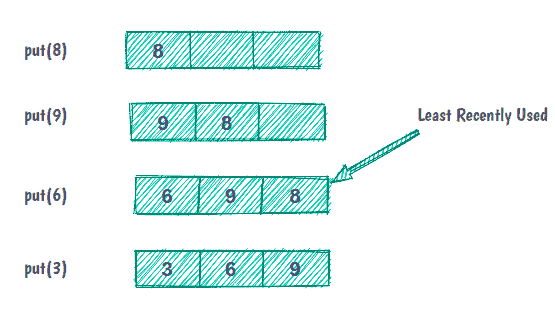
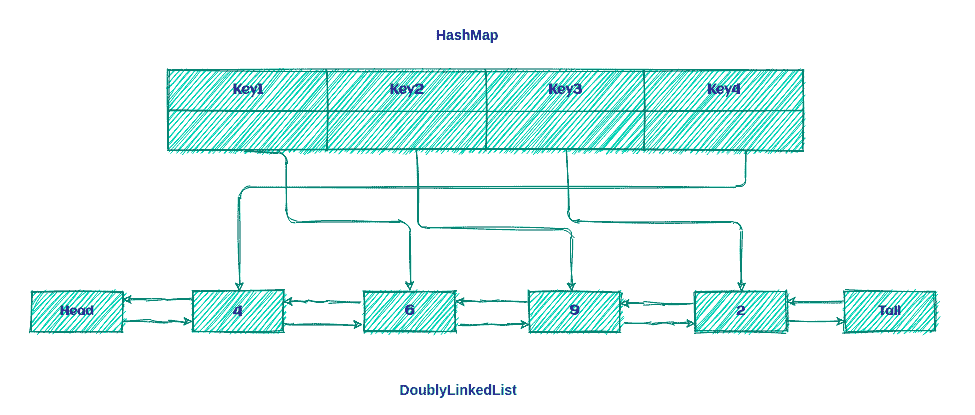

# 如何用 Java 实现 LRU 缓存

> 原文：<https://web.archive.org/web/20220930061024/https://www.baeldung.com/java-lru-cache>

## 1.概观

在本教程中，我们将学习 LRU [缓存](https://web.archive.org/web/20221110094032/https://en.wikipedia.org/wiki/Cache_(computing))，并看看 Java 中的实现。

## 2.LRU 高速缓存

最近最少使用(LRU)缓存是一种缓存回收算法，它按照使用顺序组织元素。在 LRU，顾名思义，最长时间没有使用的元素将被从缓存中清除。

例如，如果我们有一个容量为三项的缓存:

[](/web/20221110094032/https://www.baeldung.com/wp-content/uploads/2021/07/Screenshot-from-2021-07-03-14-30-34-1.png)

最初，缓存是空的，我们将元素 8 放入缓存。元素 9 和 6 像以前一样被缓存。但是现在，缓存容量已满，为了放置下一个元素，我们必须清除缓存中最近最少使用的元素。

在我们用 Java 实现 LRU 缓存之前，最好了解一下缓存的一些方面:

*   所有操作都应该按照 O(1)的顺序运行
*   高速缓存的大小有限
*   所有缓存操作都必须支持并发性
*   如果缓存已满，添加新项目必须调用 LRU 策略

### 2.1.LRU 缓存的结构

现在，让我们考虑一个有助于我们设计缓存的问题。

我们如何设计一种数据结构，能够在固定时间内进行读取、排序(临时排序)和删除元素等操作？

似乎要找到这个问题的答案，我们需要深入思考关于 LRU 缓存及其功能的说法:

*   在实践中，LRU 缓存是一种`[Queue](/web/20221110094032/https://www.baeldung.com/java-queue) —`如果一个元素被重新访问，它会转到驱逐顺序的末尾
*   该队列将具有特定的容量，因为缓存具有有限的大小。每当引入新元素时，它都被添加到队列的最前面。当驱逐发生时，它发生在队列的尾部。
*   命中缓存中的数据必须在恒定的时间内完成，这在`Queue`中是不可能的！但是，用 Java 的 [`HashMap`](/web/20221110094032/https://www.baeldung.com/java-hashmap) 数据结构是可能的
*   移除最近最少使用的元素必须在固定时间内完成，这意味着对于`Queue`的实现，我们将使用`[DoublyLinkedList](https://web.archive.org/web/20221110094032/https://en.wikipedia.org/wiki/Doubly_linked_list)`而不是`[SingleLinkedList](/web/20221110094032/https://www.baeldung.com/java-linkedlist)`或数组

**所以，LRU 缓存只不过是如下所示的`DoublyLinkedList`和`HashMap`的组合:**

[](/web/20221110094032/https://www.baeldung.com/wp-content/uploads/2021/07/Screenshot-from-2021-07-09-02-10-25-1.png)

这个想法是将键保留在`Map`上，以便快速访问`Queue`中的数据。

### 2.2.LRU 算法

LRU 算法非常简单！如果关键字出现在`HashMap,` 中，则是缓存命中；否则，就是缓存未命中。

发生缓存未命中后，我们将遵循两个步骤:

1.  在列表前面添加新元素。
2.  在`HashMap`中添加一个新条目，并参考列表的标题。

我们将在缓存命中后执行两个步骤:

1.  移除 hit 元素并将其添加到列表前面。
2.  用列表前面的新引用更新`HashMap`。

现在，是时候看看我们如何用 Java 实现 LRU 缓存了！

## 3.用 Java 实现

首先，我们将定义我们的`Cache`接口:

```
public interface Cache<K, V> {
    boolean set(K key, V value);
    Optional<V> get(K key);
    int size();
    boolean isEmpty();
    void clear();
}
```

现在，我们将定义代表我们缓存的`LRUCache`类:

```
public class LRUCache<K, V> implements Cache<K, V> {
    private int size;
    private Map<K, LinkedListNode<CacheElement<K,V>>> linkedListNodeMap;
    private DoublyLinkedList<CacheElement<K,V>> doublyLinkedList;

    public LRUCache(int size) {
        this.size = size;
        this.linkedListNodeMap = new HashMap<>(maxSize);
        this.doublyLinkedList = new DoublyLinkedList<>();
    }
   // rest of the implementation
}
```

我们可以创建一个特定大小的`LRUCache `实例。在这个实现中，我们使用`HashMap`集合来存储对`LinkedListNode`的所有引用。

现在，我们来讨论一下`LRUCache`的操作。

### 3.1.Put 操作

第一种是`put`方法:

```
public boolean put(K key, V value) {
    CacheElement<K, V> item = new CacheElement<K, V>(key, value);
    LinkedListNode<CacheElement<K, V>> newNode;
    if (this.linkedListNodeMap.containsKey(key)) {
        LinkedListNode<CacheElement<K, V>> node = this.linkedListNodeMap.get(key);
        newNode = doublyLinkedList.updateAndMoveToFront(node, item);
    } else {
        if (this.size() >= this.size) {
            this.evictElement();
        }
        newNode = this.doublyLinkedList.add(item);
    }
    if(newNode.isEmpty()) {
        return false;
    }
    this.linkedListNodeMap.put(key, newNode);
    return true;
 }
```

首先，我们在存储所有键/引用的`linkedListNodeMap`中找到键。如果该键存在，则发生了缓存命中，它准备从`DoublyLinkedList`中检索`CacheElement` 并将其移动到前面的*。*

之后，我们用一个新的引用更新`linkedListNodeMap`,并把它移到列表的前面:

```
public LinkedListNode<T> updateAndMoveToFront(LinkedListNode<T> node, T newValue) {
    if (node.isEmpty() || (this != (node.getListReference()))) {
        return dummyNode;
    }
    detach(node);
    add(newValue);
    return head;
}
```

首先，我们检查节点是否为空。此外，节点的引用必须与列表相同。之后，我们从列表中删除节点，并将节点添加到列表中。

但是如果这个键不存在，就会发生缓存未命中，我们必须把一个新的键放入`linkedListNodeMap`。在我们这样做之前，我们检查列表大小。如果列表已满，我们必须从列表中`evict`最近最少使用的元素。

### 3.2.获取操作

让我们来看看我们的`get`操作:

```
public Optional<V> get(K key) {
   LinkedListNode<CacheElement<K, V>> linkedListNode = this.linkedListNodeMap.get(key);
   if(linkedListNode != null && !linkedListNode.isEmpty()) {
       linkedListNodeMap.put(key, this.doublyLinkedList.moveToFront(linkedListNode));
       return Optional.of(linkedListNode.getElement().getValue());
   }
   return Optional.empty();
 }
```

正如我们在上面看到的，这个操作很简单。首先，我们从`linkedListNodeMap`中获取节点，然后检查它是否不为空。

其余的操作与之前相同，只有一个不同之处是关于`moveToFront`方法:

```
public LinkedListNode<T> moveToFront(LinkedListNode<T> node) {
    return node.isEmpty() ? dummyNode : updateAndMoveToFront(node, node.getElement());
}
```

现在，让我们创建一些测试来验证我们的缓存工作正常:

```
@Test
public void addSomeDataToCache_WhenGetData_ThenIsEqualWithCacheElement(){
    LRUCache<String,String> lruCache = new LRUCache<>(3);
    lruCache.put("1","test1");
    lruCache.put("2","test2");
    lruCache.put("3","test3");
    assertEquals("test1",lruCache.get("1").get());
    assertEquals("test2",lruCache.get("2").get());
    assertEquals("test3",lruCache.get("3").get());
} 
```

现在，让我们测试驱逐策略:

```
@Test
public void addDataToCacheToTheNumberOfSize_WhenAddOneMoreData_ThenLeastRecentlyDataWillEvict(){
    LRUCache<String,String> lruCache = new LRUCache<>(3);
    lruCache.put("1","test1");
    lruCache.put("2","test2");
    lruCache.put("3","test3");
    lruCache.put("4","test4");
    assertFalse(lruCache.get("1").isPresent());
 }
```

## 4.处理并发性

到目前为止，我们假设我们的缓存只是在单线程环境中使用。

为了使这个容器线程安全，我们需要同步所有的公共方法。让我们在前面的实现中添加一个 [`ReentrantReadWriteLock`](/web/20221110094032/https://www.baeldung.com/java-thread-safety#reentrant-locks) 和 [`ConcurrentHashMap`](/web/20221110094032/https://www.baeldung.com/java-concurrent-map) :

```
public class LRUCache<K, V> implements Cache<K, V> {
    private int size;
    private final Map<K, LinkedListNode<CacheElement<K,V>>> linkedListNodeMap;
    private final DoublyLinkedList<CacheElement<K,V>> doublyLinkedList;
    private final ReentrantReadWriteLock lock = new ReentrantReadWriteLock();

    public LRUCache(int size) {
        this.size = size;
        this.linkedListNodeMap = new ConcurrentHashMap<>(size);
        this.doublyLinkedList = new DoublyLinkedList<>();
    }
// ...
}
```

**我们更喜欢使用可重入的读/写锁，而不是像 [`synchronized`](/web/20221110094032/https://www.baeldung.com/java-thread-safety#synchronized-statements) 那样声明方法，因为这样我们可以更灵活地决定何时在读和写时使用锁。**

### 4.1.`writeLock`

现在，让我们在我们的`put`方法中添加对`writeLock`的调用:

```
public boolean put(K key, V value) {
  this.lock.writeLock().lock();
   try {
       //..
   } finally {
       this.lock.writeLock().unlock();
   }
}
```

当我们在资源上使用`writeLock`时，只有持有锁的线程可以写入或读取资源。因此，所有其他试图读取或写入资源的线程都必须等待，直到当前锁持有者释放它。

**这对于防止[僵局](/web/20221110094032/https://www.baeldung.com/cs/os-deadlock)非常重要。如果`try`块中的任何操作失败，我们仍然在方法结束时用`finally`块退出函数之前释放锁。**

需要`writeLock`的另一个操作是`evictElement`，我们在`put`方法中使用了它:

```
private boolean evictElement() {
    this.lock.writeLock().lock();
    try {
        //...
    } finally {
        this.lock.writeLock().unlock();
    }
}
```

### 4.2.`readLock`

现在是时候给`get`方法添加一个`readLock`调用了:

```
public Optional<V> get(K key) {
    this.lock.readLock().lock();
    try {
        //...
    } finally {
        this.lock.readLock().unlock();
    }
} 
```

这似乎正是我们用`put`方法所做的。唯一的区别是我们使用了一个`readLock`而不是`writeLock`。因此，读锁和写锁之间的这种区别允许我们在缓存未被更新时并行读取缓存。

现在，让我们在并发环境中测试我们的缓存:

```
@Test
public void runMultiThreadTask_WhenPutDataInConcurrentToCache_ThenNoDataLost() throws Exception {
    final int size = 50;
    final ExecutorService executorService = Executors.newFixedThreadPool(5);
    Cache<Integer, String> cache = new LRUCache<>(size);
    CountDownLatch countDownLatch = new CountDownLatch(size);
    try {
        IntStream.range(0, size).<Runnable>mapToObj(key -> () -> {
            cache.put(key, "value" + key);
            countDownLatch.countDown();
       }).forEach(executorService::submit);
       countDownLatch.await();
    } finally {
        executorService.shutdown();
    }
    assertEquals(cache.size(), size);
    IntStream.range(0, size).forEach(i -> assertEquals("value" + i,cache.get(i).get()));
}
```

## 5.结论

在本教程中，我们了解了什么是 LRU 缓存，包括一些最常见的功能。然后，我们看到了用 Java 实现 LRU 缓存的一种方法，并探索了一些最常见的操作。

最后，我们讨论了使用锁机制的实际并发性。

像往常一样，本文中使用的所有例子都可以在 GitHub 上找到[。](https://web.archive.org/web/20221110094032/https://github.com/eugenp/tutorials/tree/master/data-structures)