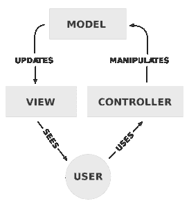
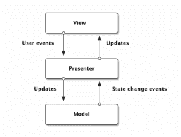

# MVC 和 MVP 模式的区别

> 原文：<https://web.archive.org/web/20220930061024/https://www.baeldung.com/mvc-vs-mvp-pattern>

## **1。概述**

在本教程中，我们将学习[模型视图控制器](/web/20220625082434/https://www.baeldung.com/spring-mvc)和模型视图呈现模式。我们还将讨论它们之间的差异。

## **2。设计模式和架构模式**

### **2.1。建筑模式**

架构模式是软件架构中常见问题的通用的、可重用的解决方案。这些对代码库有广泛的影响。

例如，这些水平或垂直地影响软件。水平地，我们指的是如何在一个层内构建代码。相反，垂直意味着从外层到内层以及从内层到外层的请求处理方式。

一些比较常见的架构模式有 **MVC** 、 **MVP** 和 **MVVM** 。

### **2.2。设计模式**

[设计模式](/web/20220625082434/https://www.baeldung.com/creational-design-patterns)通常与代码级共性相关联。它们为细化和构建更小的子系统提供了各种方案。

此外，设计模式是中等规模的策略，它充实了实体及其关系的一些结构和行为。一些常用的设计模式是 [singleton](/web/20220625082434/https://www.baeldung.com/java-singleton) 、 [factory](/web/20220625082434/https://www.baeldung.com/creational-design-patterns#factory-method) 和 [builder](/web/20220625082434/https://www.baeldung.com/java-builder-pattern-freebuilder) 模式。

设计模式和架构模式在范围上有所不同。它们更加本地化，对代码库的影响更小。相反，它们只影响代码库的特定部分。在下一节中，我们将讨论为什么使用这些模式。

## **3。为什么选择 MVC 和 MVP 模式**

使用这些模式背后的主要思想是业务层和 UI 层之间的关注点 **的**分离。这些模式为我们提供了易于测试的特性。它们还隐藏数据访问。****

我们可以说，通过隔离主要组件，它们更能适应变化。然而，最大的缺点是增加了复杂性和学习曲线。

## **4。MVC 模式**

在 MVC 模式中，基于三个独立的关注点，特性被分成三个部分。首先，**视图负责渲染 UI 元素**。其次，**控制器响应 UI 动作**。并且**模型处理业务行为和状态管理**。

在大多数实现中，所有三个组件可以直接相互交互。然而，在一些实施方式中，控制器负责确定显示哪个视图。

下图显示了 MVC 控制流:

该模型代表了整个业务逻辑层。视图表示从模型中获取的数据。此外，它还处理表示逻辑。最后，控制器处理控制流逻辑并更新模型。

MVC **没有指定视图和模型应该如何在内部构建**。通常，视图层在单个类中实现。

然而，在这种情况下，**会出现几个问题**:

*   视图和模型是紧密耦合的。因此，视图的特性需求很容易渗透到模型中，污染业务逻辑层
*   视图是单一的，通常与 UI 框架紧密耦合。因此，对视图进行单元测试变得很困难

## **5。MVP 模式**

MVP 模式是一种基于 MVC 模式概念的 UI 表示模式。然而，它没有具体说明如何构建整个系统。它只规定了如何构建视图。

这种模式通常将职责划分到四个组件中。首先**视图负责呈现 UI 元素**。第二，视图接口用于松散地耦合展示者和它的视图。

最后，**presenter 与视图和模型交互，模型负责业务行为和状态管理**。

在一些实现中，展示者与服务(控制器)层交互以检索/保持模型。视图接口和服务层通常用于为演示者和模型编写单元测试。

下图显示了 MVP 控制流程:

该模型与 MVC 中的模型相同，包含业务逻辑。视图是显示数据的被动界面。它将用户操作发送给演示者。

演示者坐在模型和视图之间。它触发业务逻辑并使视图能够更新。它从模型中接收数据，并在视图中显示这些数据。这使得测试演示者更加容易。

尽管如此，MVP 还是有一些问题:

*   控制器经常被省略。由于缺少控制器，控制流也必须由演示者来处理。这使得演示者负责两个问题:更新模型和演示模型
*   我们不能利用数据绑定。如果 UI 框架可以绑定，我们应该利用它来简化表示器

## **6。MVC 和 MVP 实现**

我们将通过一个简单的例子来理解这些模式。我们有一个产品需要展示和更新。这些动作在 MVC 和 MVP 中的处理是不同的。

### 6.1.视图类

我们有一个简单的视图类来输出产品细节。MVP 和 MVC 视图类是相似的:

[PRE0]

### 6.2.MVP 模型和演示者类别

现在让我们为 MVP 定义一个只负责业务逻辑的`Product`类:

[PRE1]

MVP 中的 presenter 类从模型中获取数据，并将其传递给视图:

[PRE2]

### 6.3.MVC 模型类

对于 MVC，不同之处在于**视图将从 model 类而不是 MVP** 中的 presenter 类获取数据。

我们可以为 MVC 定义一个模型类:

[PRE3]

**注意 *showProduct()*** **方法**。这个方法处理从模型到视图的数据传递。在 MVP 中，这是在 presenter 类中完成的，在 MVC 中，这是在 model 类中完成的。

## **7。MVC 和 MVP 的比较**

MVC 和 MVP 之间没有太多的区别。这两种模式都侧重于在多个组件之间分离责任，因此，促进了 UI(视图)与业务层(模型)的松散耦合。

主要区别在于模式是如何实现的，以及在一些高级场景中是如何实现的。让我们来看看**的一些主要区别**:

*   耦合:视图和模型在 MVC 中是紧密耦合的，但是在 MVP 中是松散耦合的
*   通信:在 MVP 中，视图-表示者和表示者-模型之间的通信通过一个接口进行。然而，在 MVC 中，控制器和视图层属于同一活动/片段
*   用户输入:**在 MVC 中，u** **ser 输入由** **控制器**处理，该控制器指示模型进行进一步的操作。但是**在 MVP 中，** **用户输入由视图**处理 **，指示演示者调用适当的函数**
*   关系类型:控制器和视图之间存在**多对一** **关系** **。一个控制器可以根据 MVC 中所需的操作选择不同的视图。另一方面，在 MVP 中，presenter 和视图是一对一的关系，一个 presenter 类一次管理一个视图**
*   主要组件:在 MVC 中，控制器负责。它创建适当的视图，并根据用户的请求与模型进行交互。相反，在 MVP 中，视图说了算。视图调用 presenter 上的方法，它进一步指导模型
*   单元测试:由于紧密耦合，MVC 对单元测试的支持有限。另一方面，单元测试在 MVP 中得到很好的支持

## **8。为什么 MVP 比 MVC 有优势**

MVP 比 MVC 略胜一筹，因为它可以将我们的应用程序分解成模块。因此，我们可以避免不断地创建视图。换句话说，MVP 有助于使我们的视图可重用。

## **9。结论**

在本教程中，我们已经看到了 MVC 和 MVP 架构模式以及它们之间的比较。

GitHub 上的[提供了示例代码。](https://web.archive.org/web/20220625082434/https://github.com/eugenp/tutorials/tree/master/patterns/design-patterns-architectural)