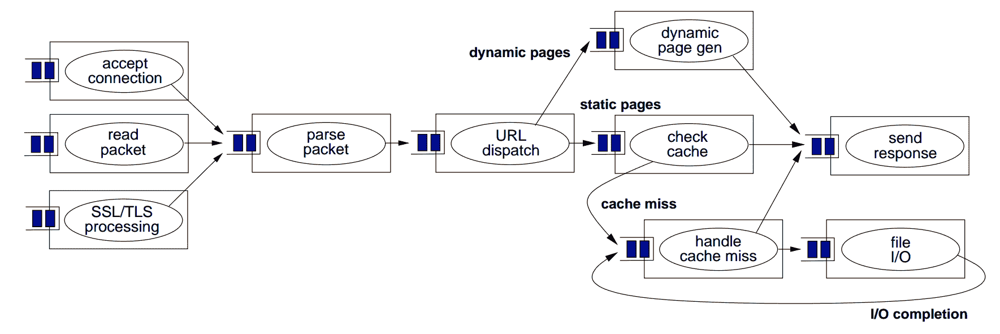
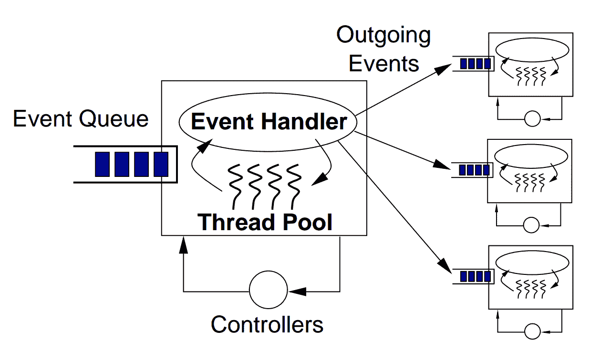
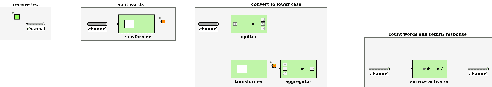

# SEDA 与春天集成和阿帕奇骆驼

> 原文：<https://web.archive.org/web/20220930061024/https://www.baeldung.com/spring-apache-camel-seda-integration>

## 1.介绍

SEDA(Staged Event-Driven Architecture)是 Matt Welsh 在他的博士论文中提出的一种建筑风格。它的主要优点是可伸缩性、对高并发流量的支持和可维护性。

在本教程中，我们将使用 SEDA 通过两个独立的实现来计算句子中的独特单词: [Spring Integration](/web/20221001122150/https://www.baeldung.com/spring-integration) 和 [Apache Camel](/web/20221001122150/https://www.baeldung.com/apache-camel-intro) 。

## 2.SEDA

**SEDA 解决了几个特定于在线服务的非功能性需求**:

1.  高并发性:架构必须支持尽可能多的并发请求。
2.  **动态内容**:软件系统必须经常支持复杂的业务用例，需要许多步骤来处理用户请求并生成响应。
3.  **负载的健壮性**:在线服务的用户流量是不可预测的，架构需要优雅地处理流量的变化。

为了解决这些需求， **SEDA 将复杂的服务分解成事件驱动的阶段**。这些阶段与队列间接相连，因此可以完全相互分离。此外，每个阶段都有一个扩展机制来处理其传入的负载:

[](/web/20221001122150/https://www.baeldung.com/wp-content/uploads/2022/09/SEDA-architecture-overall.png)

Matt Welsh 论文中的上图描述了用 SEDA 实现的 web 服务器的整体结构。每个矩形代表一个传入 HTTP 请求的单个处理阶段。这些阶段可以独立地使用它们传入队列中的任务，执行一些处理或 I/O 工作，然后将消息传递给下一个队列。

### 2.1.成分

为了更好地理解 SEDA 的组成部分，让我们看看 Matt Welsh 论文中的图表是如何显示单个阶段的内部工作的:

[](/web/20221001122150/https://www.baeldung.com/wp-content/uploads/2022/09/SEDA-stage.png)

正如我们所看到的，每个 SEDA 阶段都有以下组件:

*   **事件:** **事件是一种数据结构，包含舞台执行其处理**所需的任何数据。例如，对于 HTTP web 服务器，事件可能包含用户数据——如主体、头和请求参数——以及基础设施数据，如用户的 IP、请求时间戳等。
*   **事件队列**:它保存阶段的传入事件。
*   **事件处理程序** : **事件处理程序是舞台的程序逻辑。**这可能是一个简单的路由阶段，将数据从其事件队列转发到其他相关事件队列，或者是一个以某种方式处理数据的更复杂的阶段。事件处理程序可以单独读取事件，也可以成批读取事件——当批处理有性能优势时，例如用一个查询更新多个数据库记录，后者很有用。
*   **传出事件**:基于业务用例和流的整体结构，每个阶段可以向零个或多个事件队列发送新事件。**创建和发送外发消息是在事件处理程序方法中完成的。**
*   **线程池**:线程是一种众所周知的并发机制。**在 SEDA，线程是本地化的，为每个阶段定制。**换句话说，每个阶段维护一个线程池。因此，与每个请求一个线程的模型不同，在 SEDA 下，每个用户请求由几个线程处理。这个模型允许我们根据其复杂性独立地调整每个阶段。
*   **控制器**:SEDA 控制器是管理资源消耗的任何机制，比如线程池大小、事件队列大小、调度等等。**控制器负责 SEDA** 的弹性行为。一个简单的控制器可以管理每个线程池中活动线程的数量。更复杂的控制器可以实现复杂的性能调整算法，在运行时监控整个应用程序并调整各种参数。此外，控制器将性能调整逻辑从业务逻辑中分离出来。关注点的分离使得维护我们的代码更加容易。

通过将所有这些组件放在一起，SEDA 提供了一个强大的解决方案来处理高和波动的交通负荷。

## 3.样本问题

在接下来的几节中，我们将创建两个使用 SEDA 解决相同问题的实现。

我们的示例问题很简单:**计算每个单词在给定的字符串**中不区分大小写出现了多少次。

让我们将一个单词定义为一个没有空格的字符序列，我们将忽略其他复杂因素，如标点符号。我们的输出将是一个映射，其中包含作为键的单词和作为值的计数。例如，给定输入“`My name is Hesam`”，输出将是:

```
{
  "my": 1,
  "name": 1,
  "is": 1,
  "hesam": 1
}
```

### 3.1.让问题适应 SEDA

让我们根据 SEDA 阶段来看我们的问题。**由于可扩展性是 SEDA 的核心目标，通常最好是设计专注于特定操作的小阶段，尤其是当我们有 I/O 密集型任务时**。此外，拥有小阶段有助于我们更好地调整每个阶段的规模。

为了解决字数问题，我们可以实施一个包含以下阶段的解决方案:

[](/web/20221001122150/https://www.baeldung.com/wp-content/uploads/2022/09/word-count-with-seda-high-level-design.png)

现在我们已经有了阶段设计，让我们在接下来的部分中使用两种不同的企业集成技术来实现它。在此表中，我们可以预览 SEDA 将如何出现在我们的实现中:

| SEDA 组件 | 弹簧集成 | 阿帕奇骆驼 |
| 

```
Event
```

 | `org.springframework.messaging.Message` | `org.apache.camel.Exchange` |
| 

```
Event Queue
```

 | `org.springframework.integration.channel` | 由 URI 字符串定义的端点 |
| 

```
Event Handler
```

 | 功能接口的实例 | Camel 处理器、Camel 实用程序类和 |
| 

```
Thread Pool
```

 | `TaskExecutor`的弹簧抽象 | SEDA 端点中的开箱即用支持 |

## 4.使用 Spring 集成的解决方案

对于我们的第一个实现，我们将使用 Spring 集成。 **Spring Integration 构建于 Spring 模型之上，支持流行的企业集成模式**。

Spring 集成有三个主要组件:

1.  消息是包含报头和主体的数据结构。
2.  通道将消息从一个端点传送到另一个端点。Spring Integration 有两种渠道:
    *   点对点:只有一个端点可以使用该通道中的消息。
    *   发布-订阅:多个端点可以使用该通道中的消息。
3.  端点将消息路由到执行某些业务逻辑的应用程序组件。Spring 集成中有各种各样的端点，比如转换器、路由器、服务激活器和过滤器。

让我们看一下 Spring 集成解决方案的概况:

[](/web/20221001122150/https://www.baeldung.com/wp-content/uploads/2022/09/1_word-count-EIP-diagram-1.png)

### 4.1.属国

让我们从添加 [Spring Integration、](https://web.archive.org/web/20221001122150/https://search.maven.org/artifact/org.springframework.boot/spring-boot-starter-integration) [Spring Boot 测试](https://web.archive.org/web/20221001122150/https://search.maven.org/artifact/org.springframework.boot/spring-boot-starter-test)和 [Spring Integration Test](https://web.archive.org/web/20221001122150/https://search.maven.org/artifact/org.springframework.integration/spring-integration-test) 的依赖项开始:

```
<dependencies>
    <dependency>
	<groupId>org.springframework.boot</groupId>
	<artifactId>spring-boot-starter-integration</artifactId>
    </dependency>
    <dependency>
	<groupId>org.springframework.boot</groupId>
	<artifactId>spring-boot-starter-test</artifactId>
	<scope>test</scope>
    </dependency>
    <dependency>
	<groupId>org.springframework.integration</groupId>
	<artifactId>spring-integration-test</artifactId>
	<scope>test</scope>
    </dependency>
</dependencies>
```

### 4.2.消息网关

**[消息传递网关](https://web.archive.org/web/20221001122150/https://www.enterpriseintegrationpatterns.com/MessagingGateway.html)是一个代理，它隐藏了向集成流发送消息的复杂性。**让我们为春季集成流程设置一个:

```
@MessagingGateway
public interface IncomingGateway {
    @Gateway(requestChannel = "receiveTextChannel", replyChannel = "returnResponseChannel")
    public Map<String, Long> countWords(String input);
}
```

稍后，我们将能够使用这个网关方法来测试我们的整个流程:

```
incomingGateway.countWords("My name is Hesam");
```

Spring 将`“My name is Hesam”` 输入包装在`org.springframework.messaging.Message` 的一个实例中，并将其传递给`receiveTextChannel`，稍后从`returnResponseChannel`给我们最终结果。

### 4.3.消息渠道

在这一节中，我们将看看如何设置网关的初始消息通道`receiveTextChannel`。

**在 SEDA 下，通道需要通过相关的线程池**进行扩展，所以让我们从创建一个线程池开始:

```
@Bean("receiveTextChannelThreadPool")
TaskExecutor receiveTextChannelThreadPool() {
    ThreadPoolTaskExecutor executor = new ThreadPoolTaskExecutor();
    executor.setCorePoolSize(1);
    executor.setMaxPoolSize(5);
    executor.setThreadNamePrefix("receive-text-channel-thread-pool");
    executor.initialize();
    return executor;
}
```

接下来，我们将使用线程池来创建通道:

```
@Bean(name = "receiveTextChannel")
MessageChannel getReceiveTextChannel() {
    return MessageChannels.executor("receive-text", receiveTextChannelThreadPool)
      .get();
}
```

是一个 Spring 集成类，帮助我们创建各种类型的通道。这里，我们使用`executor()`方法创建一个`ExecutorChannel`，它是一个由线程池管理的通道。

我们的其他通道和线程池的设置方式与上面相同。

### 4.4.接收文本阶段

随着我们的渠道的建立，我们可以开始实施我们的阶段。让我们创建我们的初始阶段:

```
@Bean
IntegrationFlow receiveText() {
    return IntegrationFlows.from(receiveTextChannel)
      .channel(splitWordsChannel)
      .get();
}
```

**`IntegrationFlows`是一个流畅的 Spring 集成 API，用于创建`IntegrationFlow`对象，代表我们流程的各个阶段。**`from()`方法配置我们阶段的传入通道，`channel()`配置传出通道。

在这个例子中，我们的 stage 将网关的输入消息传递给`splitWordsChannel`。在生产应用程序中，这个阶段可能更复杂，I/O 更密集，从持久队列或通过网络读取消息。

### 4.5.分裂词阶段

我们的下一个阶段只有一个责任:将我们的输入`String`分解成句子中各个单词的`String`数组:

```
@Bean
IntegrationFlow splitWords() {
    return IntegrationFlows.from(splitWordsChannel)
      .transform(splitWordsFunction)
      .channel(toLowerCaseChannel)
      .get();
}
```

除了我们以前使用过的`from()`和`channel()`调用，这里我们还使用了`transform()`，它将提供的`Function`应用到我们的输入消息。我们的`splitWordsFunction` 实现很简单:

```
final Function<String, String[]> splitWordsFunction = sentence -> sentence.split(" ");
```

### 4.6.转换为小写阶段

这个阶段将我们的`String`数组中的每个单词转换成小写:

```
@Bean
IntegrationFlow toLowerCase() {
    return IntegrationFlows.from(toLowerCaseChannel)
      .split()
      .transform(toLowerCase)
      .aggregate(aggregatorSpec -> aggregatorSpec.releaseStrategy(listSizeReached)
        .outputProcessor(buildMessageWithListPayload))
      .channel(countWordsChannel)
      .get();
}
```

我们在这里使用的第一个新的`IntegrationFlows`方法是`split()`。**`split()`方法使用[拆分器模式](https://web.archive.org/web/20221001122150/https://www.enterpriseintegrationpatterns.com/Sequencer.html)将输入消息的每个元素作为单独的消息发送给`toLowerCase`。**

我们看到的下一个新方法是`aggregate()`，它实现了聚合器模式。**[聚合器模式](https://web.archive.org/web/20221001122150/https://www.enterpriseintegrationpatterns.com/Aggregator.html)有两个基本参数:**

1.  **发布策略，决定何时将消息合并成一条消息**
2.  **处理器，决定如何将消息组合成一条消息**

我们的发布策略函数使用了`listSizeReached`，它告诉聚合器在收集完输入数组的所有元素后开始聚合:

```
final ReleaseStrategy listSizeReached = r -> r.size() == r.getSequenceSize();
```

然后， `buildMessageWithListPayload`处理器将我们小写的结果打包成一个`List`:

```
final MessageGroupProcessor buildMessageWithListPayload = messageGroup ->
  MessageBuilder.withPayload(messageGroup.streamMessages()
      .map(Message::getPayload)
      .toList())
    .build();
```

### 4.7.字数统计阶段

我们的最后阶段将我们的单词计数打包到一个`Map`中，其中的键是来自原始输入的单词，值是每个单词出现的次数:

```
@Bean
IntegrationFlow countWords() {
    return IntegrationFlows.from(countWordsChannel)
      .transform(convertArrayListToCountMap)
      .channel(returnResponseChannel)
      .get();
}
```

这里，我们使用我们的`convertArrayListToCountMap` 函数将我们的计数打包成一个`Map`:

```
final Function<List<String>, Map<String, Long>> convertArrayListToCountMap = list -> list.stream()
  .collect(Collectors.groupingBy(Function.identity(), Collectors.counting()));
```

### 4.8.测试我们的流程

我们可以向网关方法传递一条初始消息来测试我们的流:

```
public class SpringIntegrationSedaIntegrationTest {
    @Autowired
    TestGateway testGateway;

    @Test
    void givenTextWithCapitalAndSmallCaseAndWithoutDuplicateWords_whenCallingCountWordOnGateway_thenWordCountReturnedAsMap() {
        Map<String, Long> actual = testGateway.countWords("My name is Hesam");
        Map<String, Long> expected = new HashMap<>();
        expected.put("my", 1L);
        expected.put("name", 1L);
        expected.put("is", 1L);
        expected.put("hesam", 1L);

        assertEquals(expected, actual);
    }
}
```

 `## 5.阿帕奇骆驼解决方案

Apache Camel 是一个流行且强大的开源集成框架。它基于四个主要概念:

1.  Camel 上下文:Camel 运行时将不同的部分粘在一起。
2.  路由:路由决定了消息应该如何处理以及下一步应该去哪里。
3.  处理器:这些是各种企业集成模式的现成实现。
4.  组件:组件是通过 JMS、HTTP、文件 IO 等集成外部系统的扩展点。

Apache Camel 有一个专用于 SEDA 功能的组件，使得构建 SEDA 应用程序变得简单。

### 5.1.属国

让我们为 [Apache Camel](https://web.archive.org/web/20221001122150/https://mvnrepository.com/artifact/org.apache.camel/camel-core) 和 [Apache Camel 测试](https://web.archive.org/web/20221001122150/https://mvnrepository.com/artifact/org.apache.camel/camel-test-junit5)添加所需的 Maven 依赖项:

```
<dependencies>
    <dependency>
        <groupId>org.apache.camel</groupId>
        <artifactId>camel-core</artifactId>
        <version>3.18.0</version>
    </dependency>
    <dependency>
        <groupId>org.apache.camel</groupId>
        <artifactId>camel-test-junit5</artifactId>
        <version>3.18.0</version>
        <scope>test</scope>
    </dependency>
</dependencies>
```

### 5.2.定义 SEDA 端点

首先，我们需要定义端点。端点是用 URI 字符串定义的组件。SEDA 端点必须以“`seda:[endpointName]`”开头:

```
static final String receiveTextUri = "seda:receiveText?concurrentConsumers=5";
static final String splitWordsUri = "seda:splitWords?concurrentConsumers=5";
static final String toLowerCaseUri = "seda:toLowerCase?concurrentConsumers=5";
static final String countWordsUri = "seda:countWords?concurrentConsumers=5";
static final String returnResponse = "mock:result";
```

正如我们所看到的，**每个端点被配置成有五个并发消费者。**这相当于每个端点最多有 5 个线程。

为了测试起见，`returnResponse` 是一个模拟端点。

### 5.3.延伸`RouteBuilder`

接下来，让我们定义一个扩展 Apache Camel 的`RouteBuilder`并覆盖其 configure()方法的类。此类连接所有 SEDA 端点:

```
public class WordCountRoute extends RouteBuilder {
    @Override
    public void configure() throws Exception {
    }
} 
```

在接下来的部分中，我们将使用从`RouteBuilder`继承的方便方法，通过向这个`configure()`方法添加行来定义我们的阶段。

### 5.4.接收文本阶段

此阶段接收来自 SEDA 端点的消息，并将它们路由到下一阶段，而不进行任何处理:

```
from(receiveTextUri).to(splitWordsUri);
```

这里，我们使用继承的`from()`方法来指定传入端点，使用`to()`来设置传出端点。

### 5.5.分裂词阶段

让我们实现将输入文本分割成单个单词的阶段:

```
from(splitWordsUri)
  .transform(ExpressionBuilder.bodyExpression(s -> s.toString().split(" ")))
  .to(toLowerCaseUri);
```

`transform()`方法将我们的`Function`应用于我们的输入消息，将其拆分成一个数组。

### 5.6.转换为小写阶段

我们的下一个任务是将输入中的每个单词转换成小写。因为我们需要对消息中的每个`String`应用我们的转换函数，而不是数组本身，所以我们将使用`split()`方法来分割输入消息进行处理，并在稍后将结果聚合回一个`ArrayList`:

```
from(toLowerCaseUri)
  .split(body(), new ArrayListAggregationStrategy())
  .transform(ExpressionBuilder.bodyExpression(body -> body.toString().toLowerCase()))
  .end()
  .to(countWordsUri);
```

`end()`方法标志着拆分过程的结束。一旦列表中的每一项都被转换，Apache Camel 就会应用我们指定的聚合策略`ArrayListAggregationStrategy` 。

`ArrayListAggregationStrategy`扩展了 Apache Camel 的`AbstractListAggregationStrategy`来定义消息的哪一部分应该被聚合。在这种情况下，消息正文是新的小写单词:

```
class ArrayListAggregationStrategy extends AbstractListAggregationStrategy<String> {
    @Override
    public String getValue(Exchange exchange) {
        return exchange.getIn()
          .getBody(String.class);
    }
}
```

### 5.7.字数统计阶段

最后一个阶段使用转换器将数组转换为单词到字数的映射:

```
from(countWordsUri)
  .transform(ExpressionBuilder.bodyExpression(List.class, body -> body.stream()
    .collect(Collectors.groupingBy(Function.identity(), Collectors.counting()))))
  .to(returnResponse);
```

### 5.8.测试我们的路线

让我们测试一下我们的路线:

```
public class ApacheCamelSedaIntegrationTest extends CamelTestSupport {
    @Test
    public void givenTextWithCapitalAndSmallCaseAndWithoutDuplicateWords_whenSendingTextToInputUri_thenWordCountReturnedAsMap()
      throws InterruptedException {
        Map<String, Long> expected = new HashMap<>();
        expected.put("my", 1L);
        expected.put("name", 1L);
        expected.put("is", 1L);
        expected.put("hesam", 1L);
        getMockEndpoint(WordCountRoute.returnResponse).expectedBodiesReceived(expected);
        template.sendBody(WordCountRoute.receiveTextUri, "My name is Hesam");

        assertMockEndpointsSatisfied();
    }

    @Override
    protected RoutesBuilder createRouteBuilder() throws Exception {
        RoutesBuilder wordCountRoute = new WordCountRoute();
        return wordCountRoute;
    }
}
```

超类提供了许多字段和方法来帮助我们测试我们的流程。我们使用`getMockEndpoint()`和`expectedBodiesReceived()`来设置我们的预期结果，使用`template.sendBody()`向我们的模拟端点提交测试数据。最后，我们使用`assertMockEndpointsSatisfied()` 来测试我们的预期是否与实际结果相匹配。

## 6.结论

在本文中，我们了解了 SEDA 及其组件和用例。之后，我们探索了如何使用 SEDA 来解决同样的问题，首先使用 Spring Integration，然后使用 Apache Camel。

与往常一样，GitHub 上的[提供了示例的源代码。](https://web.archive.org/web/20221001122150/https://github.com/eugenp/tutorials/tree/master/patterns-modules/design-patterns-architectural)`