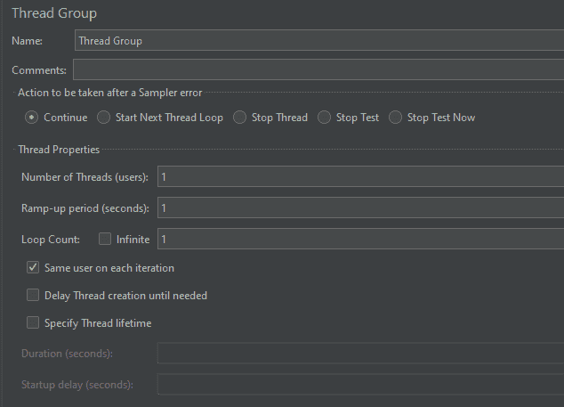
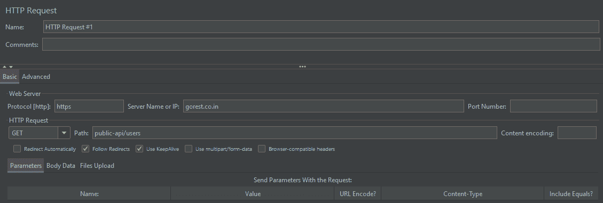
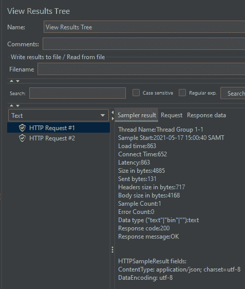
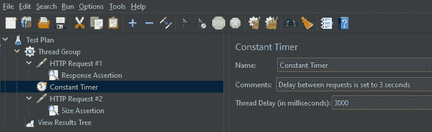
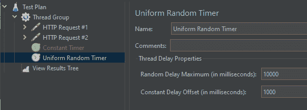
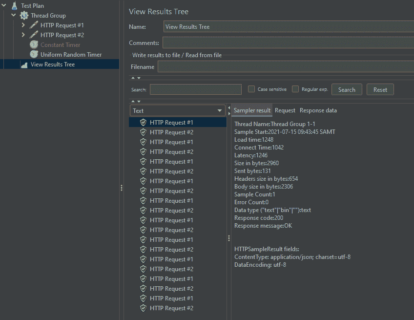

# 在 Apache JMeter 中的请求之间插入延迟

> 原文:[https://web . archive . org/web/20220930061024/https://www . bael dung . com/jmeter-delays-between-requests](https://web.archive.org/web/20220930061024/https://www.baeldung.com/jmeter-delays-between-requests)

## 1.概观

当我们使用 Apache JMeter 进行测试时，我们可能希望在请求之间添加一个延迟，以便更好地模拟我们的用户行为。

在本教程中，我们将创建一个简单的测试计划。我们将查看用于调优生成的工作负载的可用参数，然后配置计时器来添加延迟。

## 2.用例

有时我们可能希望在请求之间添加延迟:

*   避免在给定时间内发送过多请求而导致的错误
*   模拟真实的用户动作，所执行的动作有自然的间隙
*   调整每分钟的请求数量，以便更好地控制工作负载配置

## 3.使用延迟

首先，我们需要定义装载模式。这里我们可以有不同的目标:

*   查看系统在不断增长的工作负载下的表现，找出性能极限
*   检查应用在峰值负载后如何恢复

有两个 JMeter 选项用于模拟这些用例:

*   线程组–有多少并行用户
*   定时器–每个用户请求之间的延迟

## 4.测试计划

### 4.1.基本计划

让我们用一个线程组创建一个基本的测试计划。我们将设置并行请求的数量、上升周期以及执行测试的次数。我们应该注意到**JMeter 符号中的一个线程意味着一个并发用户。**

[](/web/20220926194856/https://www.baeldung.com/wp-content/uploads/2021/08/thread-group.png)

我们可以使用`ramp-up period`来增加工作量。这里我们需要设置从 1 个线程开始到达定义的`Number of Threads`的周期。

为了创建更复杂的加载配置文件，我们还可以指定线程生存期。这个设置意味着两件事:

*   `Startup delay`–JMeter 等待多少时间来启动一个线程
*   它运行了多长时间

`Loop Count`也是一个有用的设置，用于指定指定 HTTP 请求的重复次数。

### 4.2.添加请求

接下来，我们将添加两个 HTTP 请求。我们将在`https://gorest.co.in/`使用在线 REST API 来测试我们的脚本。HTTP 请求设置在用户界面中配置:

[](/web/20220926194856/https://www.baeldung.com/wp-content/uploads/2021/08/http-request-settings.png)

让我们也添加两个断言，只是为了检查请求是否返回一些数据。

我们需要检查我们的测试是否没有错误。出于这个原因，让我们添加`View Results Tree`元素，然后运行我们的测试计划。

运行第一个请求的结果显示在`View Results Tree`面板中。

[](/web/20220926194856/https://www.baeldung.com/wp-content/uploads/2021/08/run-results-1-e1621249469601.png)

让我们看看第二个请求的`Sampler result`输出。在这里，`Sample Start`是`2021-05-17 15:00:40`，与第一个请求的时间相同。这意味着默认情况下，我们在请求之间没有任何延迟。

```
Thread Name:Thread Group 1-1
Sample Start:2021-05-17 15:00:40 SAMT
```

记住这一点，让我们看看如何增加请求之间的差距。

## 5.添加计时器

### 5.1.常数计时器

要添加计时器元素，我们需要右键单击`Thread Group`元素并选择`Add, Timer, Constant Timer`。

[](/web/20220926194856/https://www.baeldung.com/wp-content/uploads/2021/08/Adding-timer-e1621250184753.png)

这里，我们在线程组中添加了一个`Thread Delay`为三秒的`Constant Timer`。这个定时器在每个请求之间增加一个延迟。

现在，让我们重新运行我们的测试计划，并检查`View Results Tree.`,我们应该看到请求在我们在 timer 元素中设置的延迟下运行。

```
Thread Name:Thread Group 1-1
Sample Start:2021-05-17 15:18:17 SAMT
```

我们可以看到，下一个 HTTP 请求是在第一个请求之后三秒钟运行的。

```
Thread Name:Thread Group 1-1
Sample Start:2021-05-17 15:18:20 SAMT
```

### 5.2.常数定时器的替代方案

作为`Constant Timer`的替代，我们可以使用`Uniform Random Timer`。这种类型的定时器可以像常量定时器一样添加。

在下拉菜单中，就在`Constant Timer`之后。

正如我们从定时器名称中看到的，当我们希望这个延迟在某个指定的范围内变化时，我们应该使用它。让我们将这个计时器添加到我们的示例中，看看它是如何工作的:

[](/web/20220926194856/https://www.baeldung.com/wp-content/uploads/2021/08/uniform-timer.png)

`Constant Delay Offset`为每个延迟添加一个永久部分。`Random Delay Maximum`帮助我们定义一个额外的随机部分，它将被添加到恒定延迟偏移中。这些设置允许我们提供一个随机因子，而不会使延迟变得太小。

让我们运行这个测试，看看查看结果树元素:

[](/web/20220926194856/https://www.baeldung.com/wp-content/uploads/2021/08/uniform-timer-results.png)

如果我们仔细观察一下样本起始点，我们会发现随机延迟是根据定义的定时器参数添加的。

```
Thread Name:Thread Group 1-1
Sample Start:2021-07-15 09:43:45 SAMT

Thread Name:Thread Group 1-1
Sample Start:2021-07-15 09:43:49 SAMT

Thread Name:Thread Group 1-1
Sample Start:2021-07-15 09:43:55 SAMT
```

在这里，我们已经看到了几个定时器选项，尽管还有其他可用的定时器配置。

## 6.结论

在本教程中，我们看到了如何在 Apache JMeter 中的两个请求之间插入一个自定义延迟，并使用线程组设置为创建的工作负载模型增加更多的灵活性。