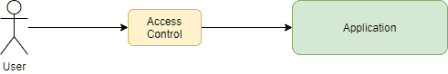
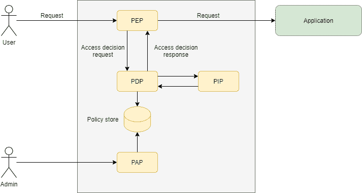
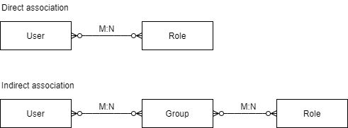
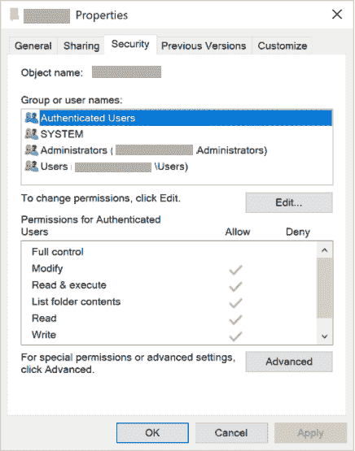

# 访问控制模型

> 原文:[https://web . archive . org/web/20220930061024/https://www . bael dung . com/Java-access-control-models](https://web.archive.org/web/20220930061024/https://www.baeldung.com/java-access-control-models)

## 1.介绍

在本文中，我们将探索不同的访问控制模型，以及如何在实践中实现它们。

## 2.什么是访问控制模型？

对于应用程序，尤其是基于 web 的应用程序，一个常见的要求是，只有满足一组给定的条件，也称为`policy,`，才能执行某些操作。好了，这是一个非常通用的要求，让我们举几个例子:

*   互联网论坛:只有会员可以发布新消息或回复现有消息
*   电子商务网站:普通用户只能看到自己的订单
*   银行后台:客户经理可以管理自己客户的投资组合。除了这些投资组合之外，他/她还可以在他/她暂时不在(例如，休假)时管理另一个客户经理的客户的投资组合，并且前者作为其对等方。
*   数字钱包:从用户所在时区的 20:00 到 08:00，支付金额限制在 500 美元以内

对于给定的应用程序，我们将采用的`Access Control Model`将负责评估传入的请求，并做出决定:请求可以继续，也可以不继续。在后一种情况下，结果通常是返回给用户的错误消息。

[](/web/20220625080741/https://www.baeldung.com/wp-content/uploads/2021/09/access-control-models-fig0.png)

显然，在授权给定的请求时，每个例子都需要不同的方法。

## 3.访问控制模型类型

从前面的示例中，我们可以看到，要做出允许/拒绝决定，我们需要考虑与请求相关的不同方面:

*   与请求相关联的标识。请注意，即使匿名访问在这里也有某种形式的身份
*   请求所针对的对象/资源
*   对这些对象/资源执行的操作
*   关于请求的上下文信息。一天中的时间、时区和使用的身份验证方法都是这种上下文信息的示例

我们可以将访问控制模型分为三种类型:

*   基于角色的访问控制(RBAC)
*   访问控制列表(ACL)
*   基于属性的访问控制(ABAC)

不管其类型如何，我们通常可以在模型中识别以下实体:

*   `PEP, or Policy Enforcement Point`:拦截请求，根据`PDP`返回的结果决定是否继续
*   `PDP, or Policy Decision Point`:使用策略评估请求以产生访问决策
*   `PIP, or Policy Information Point`:存储和/或协调对 PDP 用来做出访问决定的信息的访问。
*   `PAP, or Policy Administration Point:`管理与访问决策相关的策略和其他操作方面。

下图显示了这些实体之间的逻辑关系:

[](/web/20220625080741/https://www.baeldung.com/wp-content/uploads/2021/09/access-control-models-fig1.png)

**值得注意的是，尽管被描述为自治实体，但在实践中，我们会发现一些甚至所有的模型元素都嵌入在应用程序本身中**。

此外，该模型没有解决如何建立用户身份的问题。然而，在决定是否允许一项请求进行时，可以考虑这一方面。

现在，让我们看看如何将这个通用架构应用到上面的每个模型中。

## 4.基于角色的访问控制

在此模型中，PDP 决策流程包括两个步骤:

*   首先，它恢复与传入请求的身份相关联的角色。
*   接下来，它尝试将这些角色与请求策略相匹配

**这个模型的一个具体实现在 Java EE 规范中以`@HttpConstraint`注释及其 XML 等价物**的形式出现。这是注释应用于 servlet 时的典型用法:

```
@WebServlet(name="rbac", urlPatterns = {"/protected"})
@DeclareRoles("USER")
@ServletSecurity(
  @HttpConstraint(rolesAllowed = "USER")
)
public class RBACController  extends HttpServlet {
    protected void doGet(HttpServletRequest req, HttpServletResponse resp) throws ServletException, IOException {
        resp.getWriter().println("Hello, USER");
    }
} 
```

对于 Tomcat 服务器，我们可以将之前描述的访问控制模型实体标识如下:

*   PEP:安全性`Valve`检查目标 servlet 中是否存在该注释，并调用关联的`Realm`来恢复与当前请求关联的身份
*   PDP:决定对给定请求应用哪些限制的`Realm`实现
*   PIP:由特定的`Realm`实现使用的任何后端，它存储与安全相关的信息。对于 RBAC 模型，关键信息是用户的角色集，通常从 LDAP 存储库中检索。
*   策略存储:在这种情况下，注释就是存储本身
*   PAP: Tomcat 不支持动态策略变更，所以没有必要。然而，通过一些想象，我们可以用任何用于添加注释和/或编辑应用程序的 WEB-INF/web.xml 文件的工具来识别它。

其他安全框架(例如 Spring Security)以类似的方式工作。这里的关键点是，即使一个特定的框架不完全符合我们的通用模型，它的实体仍然存在，即使有些伪装。

### 4.1.角色定义

角色到底是由什么构成的？**实际上，角色只是用户在特定应用程序中可以执行的一组命名的相关操作**。根据应用的要求，可以根据需要粗略或精细地定义它们。

不管它们的粒度级别如何，定义它们都是一个很好的实践，因此每一个都映射到一组不相交的功能。这样，我们可以通过添加/删除角色来轻松管理用户配置文件，而不用担心副作用。

至于用户和角色之间的关联，我们可以使用直接或间接的方法。在前一种情况下，我们将角色直接分配给用户。在后者中，有一个中间实体，通常是用户组，我们向其分配角色:

[](/web/20220625080741/https://www.baeldung.com/wp-content/uploads/2021/09/access-control-models-fig2.png)

在这个关联中使用组作为中介实体的好处是，我们可以很容易地一次将角色重新分配给许多用户。在大型组织中，这一点非常重要，因为人们会不断地从一个区域转移到另一个区域。

类似地，间接模型也允许我们轻松地更改现有的角色定义，通常是在重构应用程序之后。

## 5.访问控制列表

基于 ACL 的安全控制允许我们定义对单个域对象的访问限制。这与 RBAC 形成对比，那里的限制通常适用于所有类别的物品。在上面的论坛示例中，我们可以使用仅限 RBAC 的方法来定义可以阅读和创建新帖子。

然而，如果我们决定创建一个新的功能，让用户可以编辑自己的帖子，单靠 RBAC 是不够的。在这种情况下，决策引擎不仅需要考虑谁，还需要考虑哪个帖子是编辑操作的目标。

对于这个简单的例子，我们可以只向数据库添加一个`author`列，并使用它来允许或拒绝对编辑操作的访问。但是如果我们想要支持协作编辑呢？在这种情况下，我们需要存储可以编辑帖子的所有人的列表 ACL。

处理 ACL 会带来一些实际问题:

*   我们将 ACL 存储在哪里？
*   在检索大型对象集合时，如何高效地应用 ACL 限制？

Spring Security ACL 库是 ACL 库的一个很好的例子。它使用专用的数据库模式和缓存来实现 ACL，并与 Spring Security 紧密集成。这是一个简短的例子，改编自[我们关于这个库的文章](/web/20220625080741/https://www.baeldung.com/spring-security-acl)，展示了如何在对象级实现访问控制:

```
@PreAuthorize("hasPermission(#postMessage, 'WRITE')")
PostMessage save(@Param("noticeMessage")PostMessage postMessage); 
```

ACL 的另一个很好的例子是 Windows 用来保护对象的权限系统。每一个`[Securable Object](https://web.archive.org/web/20220625080741/https://docs.microsoft.com/en-us/windows/win32/secauthz/securable-objects)`(例如，文件、目录、进程等等)都有一个`[Security Descriptor](https://web.archive.org/web/20220625080741/https://docs.microsoft.com/en-us/windows/win32/secauthz/security-descriptors)`与之关联，它包含一个单个用户/组以及相关权限的列表:

[](/web/20220625080741/https://www.baeldung.com/wp-content/uploads/2021/09/access-control-models-fig3.png)

Windows ACLs 非常强大(或者很复杂，这取决于我们向谁提问)，允许管理员向单个用户和/或组分配权限。此外，各个条目为每个可能的操作定义了允许/拒绝权限。

## 6.基于属性的访问控制

**基于属性的控制模型允许访问决策不仅基于身份、动作和目标对象，还基于与请求相关的上下文信息**。

XACML 标准可能是这种模型最著名的例子，它使用 XML 文档来描述访问策略。这就是我们如何使用该标准来描述数字钱包取款规则:

```
<Policy  
  PolicyId="urn:baeldung:atm:WithdrawalPolicy"
  Version="1.0" 
  RuleCombiningAlgId="urn:oasis:names:tc:xacml:1.0:rule-combining-algorithm:deny-overrides">
    <Target/>
    <Rule RuleId="urn:oasis:names:tc:baeldung:WithDrawalPolicy:Rule1" Effect="Deny">
        <Target>
            <AnyOf>
                <AllOf>
... match rule for the withdrawal action omitted
                </AllOf>
            </AnyOf>
        </Target>
        <Condition>
... time-of-day and amount conditions definitions omitted
        </Condition>
    </Rule>
</Policy>
```

完整的规则定义可在[在线](https://web.archive.org/web/20220625080741/https://github.com/eugenp/tutorials/tree/master/libraries-security/src/test/resources/xacml4j)获得。

尽管它很冗长，但不难猜出它的大致结构。**一个策略包含一个或多个规则，这些规则在评估时会产生一个`Effect`:允许或拒绝**。

每个规则都包含目标，这些目标使用请求的属性定义一个逻辑表达式。可选地，规则还可以包含一个或多个定义其适用性的`Condition`元素。

在运行时，基于 XACML 的访问控制 PEP 创建一个`RequestContext`实例，并将其提交给 PDP 进行评估。然后，引擎评估所有适用的规则，并返回访问决策。

此`RequestContext`中呈现的信息类型是该模型区别于之前模型的主要方面。例如，在我们的数字钱包应用程序中，为授权取款而构建的请求上下文的 XML 表示:

```
<Request 

    CombinedDecision="true"
    ReturnPolicyIdList="false">

    <Attributes Category="urn:oasis:names:tc:xacml:3.0:attribute-category:action">
... action attributes omitted
    </Attributes>
    <Attributes Category="urn:oasis:names:tc:xacml:3.0:attribute-category:environment">
... environment attributes (e.g., current time) omitted
    </Attributes>
    <Attributes Category="urn:baeldung:atm:withdrawal">
... withdrawal attributes omitted 
    </Attributes>
</Request>
```

当我们在 21:00 向 XAML 规则评估引擎提交[该请求](https://web.archive.org/web/20220625080741/https://github.com/eugenp/tutorials/blob/master/libraries-security/src/test/resources/xacml4j/Request.xml)时，预期结果将是拒绝该取款，因为它超过了夜间交易的最大允许金额。

ABAC 模式的主要优势在于其灵活性。我们可以简单地通过改变策略来定义，更重要的是，修改复杂的规则。根据实施情况，我们甚至可以实时完成。

### 6.1.XACML4J

[XACML4J](https://web.archive.org/web/20220625080741/https://github.com/xacml4j-opensource/xacml4j) 是 Java 的 XACML 3.0 标准的开源实现。它提供了 ABAC 模型所需的评估引擎和相关实体的实现。它的核心 API 是`PolicyDecisionPoint`接口，毫不奇怪，它实现了 PDP 逻辑。

一旦我们建立了 PDP，使用它需要两个步骤。首先，我们创建并填充一个`RequestContext`,其中包含关于我们想要评估的请求的信息:

```
... attribute categories creation omitted
RequestContext request = RequestContext.builder()
  .attributes(actionCategory,environmentCategory,atmTxCategory)
  .build(); 
```

这里，每个`xxxCategory`参数包含一组相关`Category`的属性。[完整代码](https://web.archive.org/web/20220625080741/https://github.com/eugenp/tutorials/blob/master/libraries-security/src/test/java/com/baeldung/xacml4j/NightlyWithdrawalPolicyUnitTest.java)使用可用的构建器创建一个测试请求，在 21:00 提取 1200.00 美元。或者，我们也可以直接从任何兼容 [JAXB](/web/20220625080741/https://www.baeldung.com/jaxb) 的源代码中创建一个`RequestContext`对象。

接下来，我们将这个对象传递给`PolicyDecisionPoint` 服务的`decide()`方法进行评估:

```
ResponseContext response = pdp.decide(request);
assertTrue(response.getDecision() == Decision.DENY); 
```

返回的`ResponseContext`包含一个带有策略评估结果的`Decision`对象。此外，它还可以向 PEP 返回诊断信息和附加义务和/或建议。义务和建议本身就是一个话题，这里就不赘述了。这个来自 Axiomatic 的[教程展示了我们如何使用这个特性在一个典型的记录应用系统中实现监管控制。](https://web.archive.org/web/20220625080741/https://www.axiomatics.com/you-are-not-obliged-to-follow-my-advice-obligations-and-advice-in-xacml/)

### 6.2.没有 XACML 的 ABAC

XACML 的复杂性通常使它对大多数应用程序来说是多余的。然而，我们仍然可以在我们的应用程序中使用底层模型。毕竟，我们总是可以实现一个为特定用例定制的更简单的版本，也许只是外部化一些参数，对吗？

嗯，任何经验丰富的开发人员都知道这是如何结束的…

任何 ABAC 实现的一个棘手的方面是如何从请求的有效载荷中提取属性。在处理请求之前插入定制逻辑的标准方法，如 servlet 过滤器或 JAX-RS 拦截器只能访问原始有效负载数据。

由于现代应用程序倾向于使用 JSON 或类似的表示，PEP 必须在提取任何有效载荷属性之前对其进行解码。这意味着对 CPU 和内存使用的潜在冲击，尤其是对于大型有效负载。

在这种情况下，更好的方法是使用 AOP 来实现 PEP。在这种情况下，方面处理程序代码可以访问有效负载的解码版本。

## 7.结论

在本文中，我们描述了不同的访问控制模型，以及应用程序如何使用它们来实施访问规则。

像往常一样，例子的完整源代码可以在 GitHub 上找到[。](https://web.archive.org/web/20220625080741/https://github.com/eugenp/tutorials/tree/master/kubernetes/k8s-admission-controller)