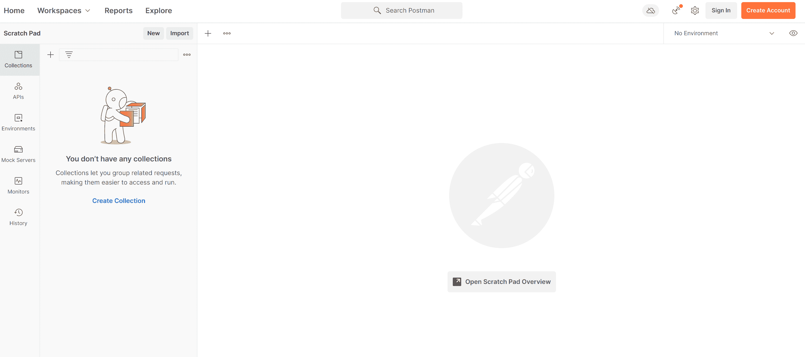
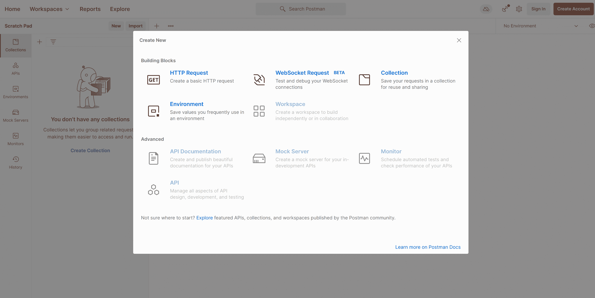
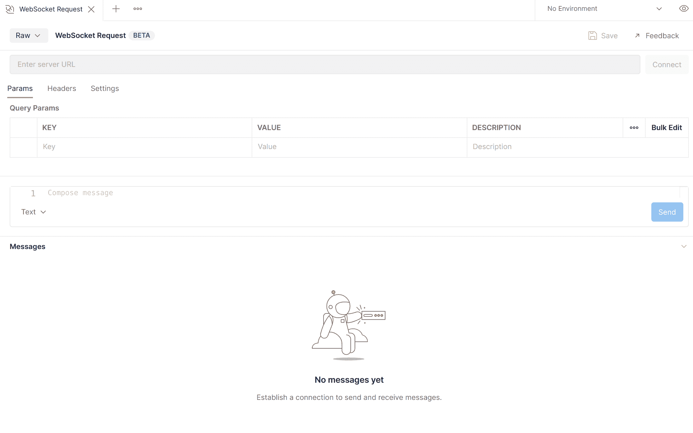
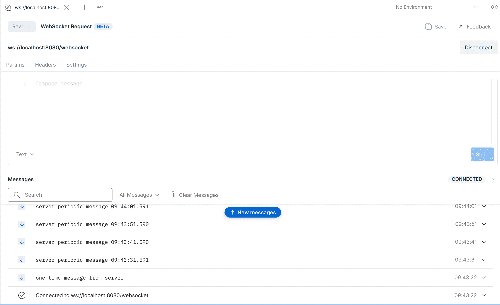
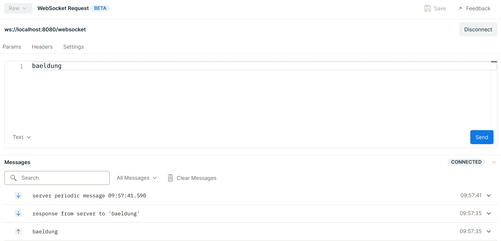

# 用 Postman 测试 WebSocket APIs

> 原文：<https://web.archive.org/web/20220930061024/https://www.baeldung.com/postman-websocket-apis>

## 1.概观

在本文中，我们将使用 [WebSocket](/web/20221129021915/https://www.baeldung.com/websockets-spring) 创建一个应用程序，并使用 Postman 测试它。

## 2.Java 网络套接字

WebSocket 是 web 浏览器和服务器之间的双向、全双工、持久连接。一旦建立了 WebSocket 连接，该连接将保持打开状态，直到客户端或服务器决定关闭该连接。

WebSocket 协议是让我们的应用程序处理实时消息的方法之一。最常见的替代方法是长轮询和服务器发送的事件。这些解决方案各有优缺点。

在 Spring 中使用 WebSockets 的一种方式是使用 STOMP 子协议。然而，在本文中，我们将使用原始的 WebSockets，因为到今天为止，Postman 中还没有 STOMP 支持。

## 3.邮递员设置

[Postman](/web/20221129021915/https://www.baeldung.com/postman-testing-collections) 是一个构建和使用 API 的 API 平台。在使用 Postman 时，我们不需要仅仅为了测试而编写一个 HTTP 客户端基础设施代码。相反，我们创建称为集合的测试套件，并让 Postman 与我们的 API 进行交互。

## 4.使用 WebSocket 的应用程序

我们将构建一个简单的应用程序。我们的应用程序的工作流程将是:

*   服务器向客户端发送一次性消息
*   它定期向客户端发送消息
*   从客户端接收到消息后，它会记录这些消息并将其发送回客户端
*   客户端向服务器发送不定期的消息
*   客户端从服务器接收消息并记录它们

工作流程图如下:

[](/web/20221129021915/https://www.baeldung.com/wp-content/uploads/2021/09/p1.svg)

## 5.弹簧腹板插座

我们的服务器由两部分组成。 **Spring WebSocket 事件处理程序和 Spring WebSocket 配置**。我们将在下面分别讨论它们:

### 5.1.Spring WebSocket 配置

我们可以通过添加`@EnableWebSocket`注释在 Spring 服务器中启用 WebSocket 支持。

**在相同的配置中，我们还将为 WebSocket 端点注册实现的 WebSocket 处理程序:**

```
@Configuration
@EnableWebSocket
public class ServerWebSocketConfig implements WebSocketConfigurer {

    @Override
    public void registerWebSocketHandlers(WebSocketHandlerRegistry registry) {
        registry.addHandler(webSocketHandler(), "/websocket");
    }

    @Bean
    public WebSocketHandler webSocketHandler() {
        return new ServerWebSocketHandler();
    }
}
```

### 5.2.Spring WebSocket 处理程序

WebSocket 处理程序类扩展了`TextWebSocketHandler`。**这个处理程序使用`handleTextMessage`回调方法从客户端**接收消息。`sendMessage`方法将消息发送回客户端:

```
@Override
public void handleTextMessage(WebSocketSession session, TextMessage message) throws Exception {
    String request = message.getPayload();
    logger.info("Server received: {}", request);

    String response = String.format("response from server to '%s'", HtmlUtils.htmlEscape(request));
    logger.info("Server sends: {}", response);
    session.sendMessage(new TextMessage(response));
}
```

`@Scheduled`方法使用相同的`sendMessage`方法向活动客户端广播定期消息:

```
@Scheduled(fixedRate = 10000)
void sendPeriodicMessages() throws IOException {
    for (WebSocketSession session : sessions) {
        if (session.isOpen()) {
            String broadcast = "server periodic message " + LocalTime.now();
            logger.info("Server sends: {}", broadcast);
            session.sendMessage(new TextMessage(broadcast));
        }
    }
}
```

我们的测试终点将是:

```
ws://localhost:8080/websocket
```

## 6.邮递员测试

现在我们的端点已经准备好了，我们可以用 Postman 测试它。**要测试 WebSocket，必须有 v8.5.0 或更高版本**。

在用 Postman `,` 开始这个过程之前，我们将运行我们的服务器`.` 现在让我们继续`.`

首先，启动邮递员应用程序。一旦开始，我们就可以继续。

从用户界面加载后，选择“新建”:

[](/web/20221129021915/https://www.baeldung.com/wp-content/uploads/2021/09/postman_ws1.png)

将打开一个新的弹出窗口。**从** **那里选择 WebSocket 请求:**

[](/web/20221129021915/https://www.baeldung.com/wp-content/uploads/2021/09/postman_ws2.png)

**我们将** **测试一个原始的 WebSocket 请求**。屏幕应该是这样的:

[](/web/20221129021915/https://www.baeldung.com/wp-content/uploads/2021/09/postman_ws3.png)

现在让我们添加我们的`URL.` ,按下连接按钮并测试连接:

[](/web/20221129021915/https://www.baeldung.com/wp-content/uploads/2021/09/postman_ws_4.png)

因此，连接工作正常。正如我们从控制台看到的，我们正在从服务器获得响应。让我们现在尝试发送消息，服务器将会回应:

[](/web/20221129021915/https://www.baeldung.com/wp-content/uploads/2021/09/postman_ws5.png)

测试完成后，我们只需单击 disconnect 按钮即可断开连接。

## 7.结论

在本文中，我们创建了一个简单的应用程序来测试与 WebSocket 的连接，并使用 Postman 进行了测试。

最后，相关代码可以在 GitHub 的[上找到。](https://web.archive.org/web/20221129021915/https://github.com/eugenp/tutorials/tree/master/spring-websockets)