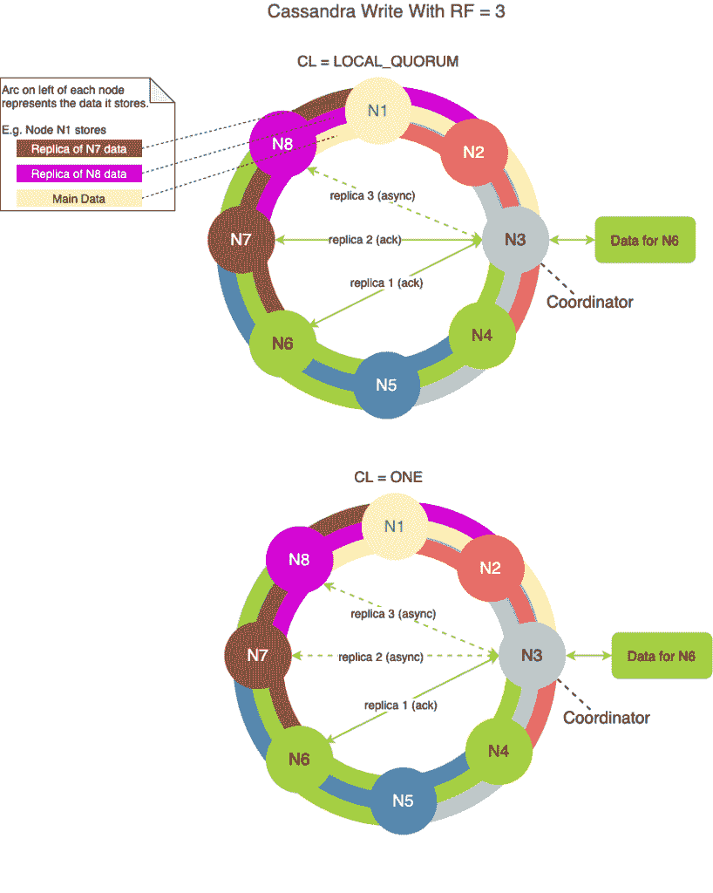
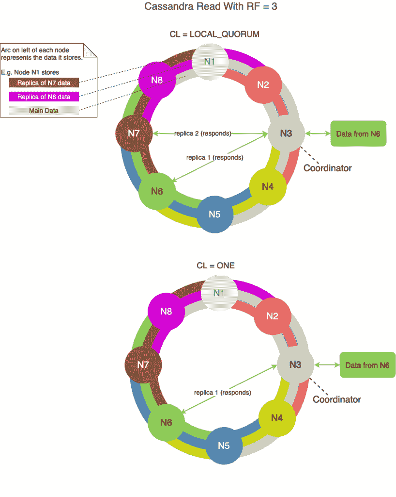

# Cassandra 中的一致性级别

> 原文：<https://web.archive.org/web/20220930061024/https://www.baeldung.com/cassandra-consistency-levels>

## 1.概观

Apache Cassandra 是一个开源、NoSQL、高可用性和可伸缩的分布式数据库。为了实现高可用性，Cassandra 依赖于跨集群的数据复制。

在本教程中，我们将了解 Cassandra 如何为我们提供控制来管理数据的一致性，同时复制数据以实现高可用性。

## 延伸阅读:

## [使用 Cassandra、Astra 和 Stargate 构建仪表板](/web/20220529020201/https://www.baeldung.com/cassandra-astra-stargate-dashboard)

了解如何使用 DataStax Astra(一种由 Apache Cassandra 和 Stargate APIs 支持的数据库即服务)构建仪表板。[阅读更多](/web/20220529020201/https://www.baeldung.com/cassandra-astra-stargate-dashboard) →

## [用 Cassandra、Astra、REST&graph QL——记录状态更新](/web/20220529020201/https://www.baeldung.com/cassandra-astra-rest-dashboard-updates)

用 Cassandra 存储时序数据的例子。[阅读更多信息](/web/20220529020201/https://www.baeldung.com/cassandra-astra-rest-dashboard-updates) →

## [用卡珊德拉、阿斯特拉和 CQL 构建一个仪表板——绘制事件数据](/web/20220529020201/https://www.baeldung.com/cassandra-astra-rest-dashboard-map)

了解如何根据存储在阿斯特拉数据库中的数据在交互式地图上显示事件。[阅读更多](/web/20220529020201/https://www.baeldung.com/cassandra-astra-rest-dashboard-map) →

## 2.数据复制

**数据复制是指在多个节点中存储每一行的副本。**数据复制的原因是为了保证可靠性和容错性。因此，如果任何节点由于任何原因出现故障，复制策略会确保相同的数据在其他节点上可用。

**[复制因子(`RF` )](https://web.archive.org/web/20220529020201/https://docs.apigee.com/private-cloud/v4.17.09/about-cassandra-replication-factor-and-consistency-level) 指定集群中有多少节点将存储副本。**

有两种可用的复制策略:

**`SimpleStrategy`用于单个数据中心和一个机架拓扑。**首先，Cassandra 使用划分器逻辑来确定放置行的节点。然后，它将额外的副本顺时针放置在环中的下一个节点上。

**`NetworkTopologyStrategy`一般用于多个数据中心和多个机架。**此外，它允许您为每个数据中心指定不同的复制因子。在数据中心内，它将副本分配到不同的机架，以最大限度地提高可用性。

## 3.一致性水平

**一致性表示一行数据的所有副本的最新程度和同步程度。**随着分布式系统中数据的复制，实现数据一致性是一项非常复杂的任务。

比起一致性，卡珊德拉更喜欢可用性。它没有针对一致性进行优化。相反，它为您提供了根据您的用例调整一致性的灵活性。在大多数用例中，Cassandra 依赖于最终的一致性。

让我们看一下数据读写期间的一致性级别影响。

## 4.写入时的一致性级别(CL)

**对于写操作，一致性级别指定在协调器成功向客户端报告之前，必须有多少复制副本节点进行确认。**更重要的是，进行确认的节点数量(对于给定的一致性级别)和存储副本的节点数量(对于给定的 RF)大部分是不同的。

例如，在一致性级别为 1 且 RF = 3 的情况下，即使只有一个副本节点对成功的写操作进行确认，Cassandra 也会在后台将数据异步复制到另外两个节点。

让我们来看一些可用于成功执行写操作的一致性级别选项。

一致性级别`ONE` 意味着它只需要来自一个副本节点的确认。因为只有一个副本需要确认，所以在这种情况下写操作是最快的。

一致性级别`QUORUM` 意味着它需要来自所有数据中心中 51%或大多数副本节点的确认。

`LOCAL_QUORUM` 的一致性级别意味着它需要来自 51%或大多数副本节点的确认，这些副本节点就在与协调器相同的数据中心内。因此，它避免了数据中心间通信的延迟。

`ALL` 的一致性级别意味着它需要来自所有副本节点的确认。因为所有副本节点都需要确认，所以在这种情况下，写操作是最慢的。此外，如果其中一个复制副本节点在写操作期间关闭，它将失败，可用性也会受到影响。因此，最佳实践是不要在生产部署中使用此选项。

我们可以[为每个写查询或在全局查询级别配置一致性级别](https://web.archive.org/web/20220529020201/https://docs.datastax.com/en/cassandra-oss/3.x/cassandra/dml/dmlConfigConsistency.html)。

下图显示了几个写时`CL`的例子:

## 5.读取时的一致性级别(CL)

**对于读取操作，一致性级别指定了在协调器成功地将数据发送回客户端之前，必须有多少复制节点以最新的一致数据进行响应。**

让我们看一下 Cassandra 成功返回数据的读操作的一致性级别选项。

一致性级别`ONE` 意味着只有一个副本节点返回数据。在这种情况下，数据检索速度最快。

一致性级别`QUORUM` 意味着所有数据中心中有 51%或大多数副本节点响应。然后协调器将数据返回给客户机。在多个数据中心的情况下，数据中心间通信的延迟会导致读取速度变慢。

`LOCAL_QUORUM` 的一致性级别意味着 51%或大多数副本节点位于同一数据中心内。当协调器响应时，协调器将数据返回给客户机。因此，它避免了数据中心间通信的延迟。

`ALL` 的一致性级别意味着所有副本节点都响应，然后协调器将数据返回给客户端。由于所有副本节点都需要确认，因此在这种情况下，读取操作是最慢的。此外，如果其中一个副本节点在读取操作期间关闭，它将失败，可用性也会受到影响。最佳实践是不要在生产部署中使用此选项。

我们可以[为每个写查询或在全局查询级别配置一致性级别](https://web.archive.org/web/20220529020201/https://docs.datastax.com/en/cassandra-oss/3.x/cassandra/dml/dmlConfigConsistency.html)。

下图显示了几个读取时的`CL`示例:

## 6.强一致性

**强一致性意味着无论最近一次写入和后续读取之间相隔多长时间，您都将最新写入的数据读入集群。**

我们在前面的章节中看到了如何为写入和读取指定所需的一致性级别(`CL`)。

如果`W + R > RF`，其中`R`–读取`CL`副本数，`W`–写入`CL`副本数，`RF`–复制因子，则可以实现强一致性。

在这种情况下，您可以获得很强的一致性，因为所有客户端读取总是获取最近写入的数据。

让我们看几个强一致性级别的示例:

### 6.1.写 CL =法定人数，读 CL =法定人数

如果`RF` = 3、`W = QUORUM`或`LOCAL_QUORUM,` 、T3 或`LOCAL_QUORUM`，则`W (2) + R (2) > RF (3)`

在这种情况下，写操作确保两个副本具有最新的数据。则读取操作还确保只有在至少两个副本以一致的最新数据响应时才成功接收数据。

### 6.2.写 CL = ALL，读 CL = ONE

如果`RF` = 3，`W = ALL` `,` `R = ONE`，那么`W (3) + R (1) > RF (3)`

在这种情况下，一旦协调器将数据写入所有副本，写操作就成功了。然后，从这些副本中的一个读取数据就足够了，以确保我们读取的是最新写入的数据。

但是正如我们之前了解到的，`ALL`的 write CL 是不容错的，可用性受到影响。

## 7.结论

在本文中，我们研究了 Cassandra 中的数据复制。我们还了解了数据写入和读取时可用的不同一致性级别选项。此外，我们还看了几个例子来实现高度的一致性。