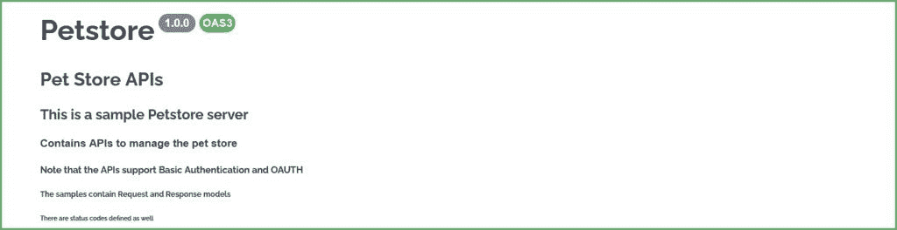
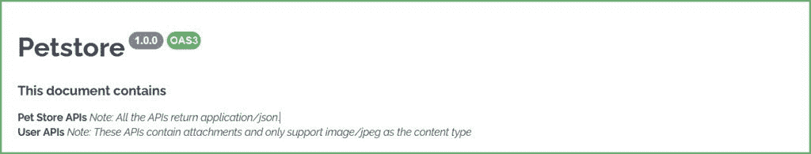
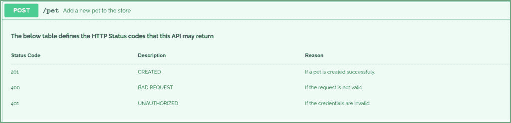
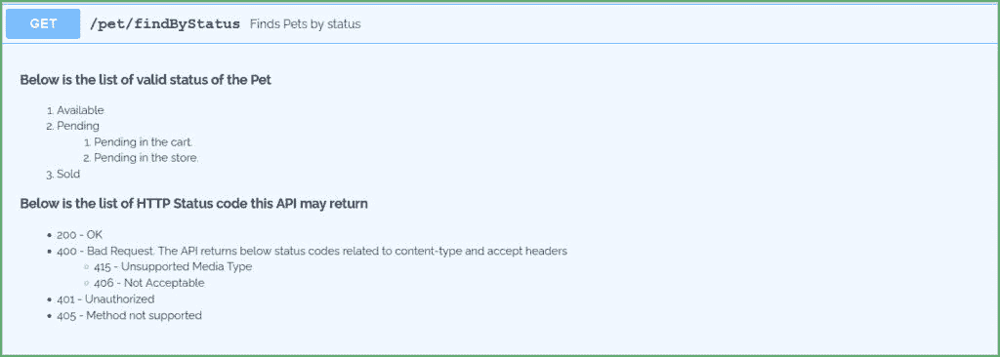
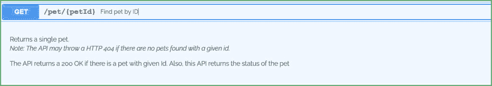
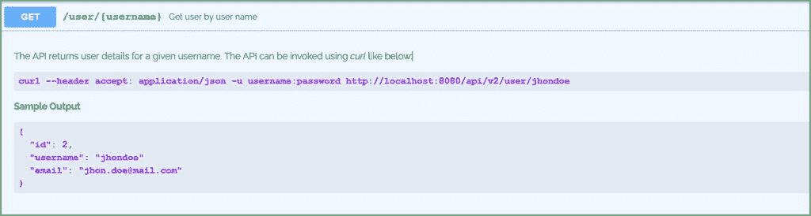

# 格式化醒目的文本描述

> 原文：<https://web.archive.org/web/20220930061024/https://www.baeldung.com/swagger-format-descriptions>

## 1.介绍

[OpenAPI 规范](https://web.archive.org/web/20221006204308/https://spec.openapis.org/oas/latest.html)(以前的 Swagger 规范)标准化了 REST API 文档语言，并且是平台不可知的。**我们可以创建****YAML 或 JSON 格式的 OpenAPI 文档**。

另一方面， [Swagger](https://web.archive.org/web/20221006204308/https://swagger.io/) 是一个实现和使用标准的工具集合。有些是免费的，有些是开源的，有些是商业的。这些工具帮助我们设计、记录和使用 REST APIs。

在本文中，我们将学习如何格式化 OpenAPI 文档中的文本描述。

## 2\. OpenAPI Editors

几个工具支持我们创建 OpenAPI 文档。一些流行的工具是:

*   [招摇编辑](https://web.archive.org/web/20221006204308/https://editor.swagger.io/)
*   [Visual Studio 代码 OpenAPI 插件](https://web.archive.org/web/20221006204308/https://marketplace.visualstudio.com/items?itemName=42Crunch.vscode-openapi)
*   [IntelliJ IDEA OpenApi 插件](https://web.archive.org/web/20221006204308/https://plugins.jetbrains.com/plugin/14837-openapi-swagger-editor)

其他几个编辑器为创建 OpenAPI 文档提供了支持。然而，最流行和最广泛使用的编辑器是 Swagger 编辑器。因此，我们将在 Swagger 编辑器的帮助下学习如何格式化我们的 OpenAPI 文档。

## 3.YAML vs. JSON 格式化

OpenAPI 文档以 JSON 或 YAML 格式表示。然而，在使用 YAML 时，格式化文档很简单。

例如，要将一个单词或一个句子标记为标题，我们使用下面的 YAML 片段:

[PRE0]

[YAML 表示法](/web/20221006204308/https://www.baeldung.com/yaml-multi-line)使用一个|(管道)来表示标量文字，它可以是多行的。

现在，让我们在 JSON 中定义同样的东西:

[PRE1]

相比之下，在 JSON 表示中，转义序列使得格式化不直观。此后，我们将只关注用 YAML 编写的 OpenAPI 规范文档的格式化技术。

最后，OpenAPI 规范允许格式化所有级别的`description` 字段。因此，根据规范，只要允许`description` 字段，我们就可以对其进行格式化，并且`description`字段符合 [CommonMark 格式化](https://web.archive.org/web/20221006204308/https://spec.commonmark.org/0.30/)样式。

现在，让我们通过格式化来增强我们的 API 文档。

## 4.标题

就像我们在 HTML 中使用`<h1>`到`<h6>` 标题一样，我们可以使用 markdown 标题来突出文本。一个`#`代表一个标题 `.` 我们可以使用多达六层的`#`来强调文本。`#`的数字越大，文本强调程度越小。

**跟有`#` 的文本比跟有`######`** 的文本更亮更大。

例如，以 YAML 为例:

[PRE2]

Swagger 将文本呈现为:

## 5.文本强调

为了增强文本的可读性，我们可以通过加粗或倾斜来强调它。

**将文本放置在`**`和`**`之间或者`__`和`__`之间，文本会变为粗体**。类似地，将文本放在*和*或 _ 和 _ 中会使文本变成斜体。例如，对于 YAML:

[PRE3]

斯瓦格把 YAML 描绘成:

## 6.桌子

接下来，让我们看看如何向 OpenAPI 文档添加表格。

呈现表格需要遵循一组规则。**首先，表格中的每一列都应该以一个`| (pipe)` 符号开始和结束。其次，用至少一个`– (hyphen)`符号**划分每个表头。然而，`– (hyphen)`的最大数量不受限制。

例如，让我们添加一个表来定义 POST API 的 HTTP 状态代码:

[PRE4]

Swagger 生成:

## 7.列表

现在，让我们看看如何格式化描述文本以包含列表。

### 7.1。有序列表

**描述文本项应以一个数字开头，后面跟着一个`. (period)`** 。然而，项目的编号顺序并不重要。也就是说，这些片段:

[PRE5]

[PRE6]

[PRE7]

生成相同的输出:

[PRE8]

**项目的编号取决于起始项目**。例如，如果我们以`10`开始项目编号，下面的项目将被编号为`11`、`12`、`13`等。下面是 YAML:

[PRE9]

生成:

[PRE10]

类似地，同样的规则也适用于有序子列表。将子列表缩进到其父项。以 YAML 为例:

[PRE11]

这会产生:

[PRE12]

### 7.2。无序列表

**使用`* (asterisks)` 或`+ (plus)`或`– (hyphen)` 创建一个无序列表**。也就是说，列表中的每个项目都应该以这些符号中的一个开始。例如:

[PRE13]

以上所有代码片段都生成了一个无序列表。

类似地，**要生成无序的子列表，用父条目缩进条目，并以`* (asterisks)` 或`+ (plus)`或`– (hyphen)`** `.` 开始，例如，YAML:

[PRE14]

生成一个带有子列表的无序列表。注意分隔符的混合和匹配。**可以混合使用分隔符，这将产生相同的结果**。

最后，让我们把所有这些放在一个 YAML 里:

[PRE15]

这个 YAML 产生:

## 8.多方面的

### 8.1。换行和段落

**Next, to insert a linebreak, type two spaces and the return key**. Note that just providing a return key does not align the text to the following line. **Similarly, to insert a paragraph, insert an empty line.**Now, let's add a few line breaks and paragraphs to our `description`:

[PRE16]

这个 YAML 产生:

### 8.2。代码

Next, let's add a bit of code to our OpenAPI document. **Code blocks start and end with `“``**`.` **For example, consider the YAML**:

[PRE17]
  curl --header accept: application/json -u username:password http://localhost:8080/api/v2/user/jhondoe
  [PRE18]
  {
    "id": 2,
    "username": "jhondoe"
    "email": "[[email protected]](/web/20221006204308/https://www.baeldung.com/cdn-cgi/l/email-protection)"
  }
  [PRE19]

The above YAML generates:

### 8.3。图像

Finally, **to add an image to the document, the image has to be added to description text in the format:****``**Swagger uses the `Alt Text` when the images fail to load or when we hover over the image. Also, the path to the image could be absolute or relative. Consider the YAML:

[PRE20]

Swagger generates:

## 9.结论

在本文中，我们已经看到了如何格式化 OpenAPI 文档中的`description` 字段。YAML 标量文本支持在整个文档中格式化`description` 。因此，OpenAPI 文档可以包含任何或所有受支持的结构，比如列表、表格和图像。

因此，记录 API 可以提高易用性。毕竟，良好记录和格式化的 API 是我们所有人都想要的易于集成和消费的东西。