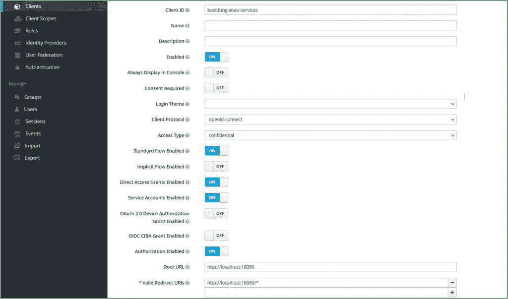
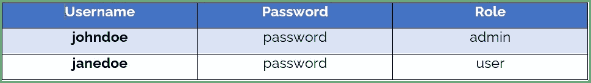
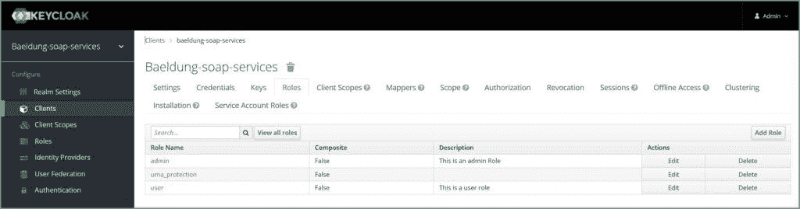
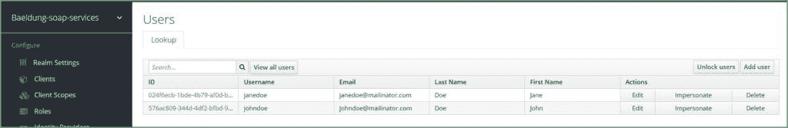
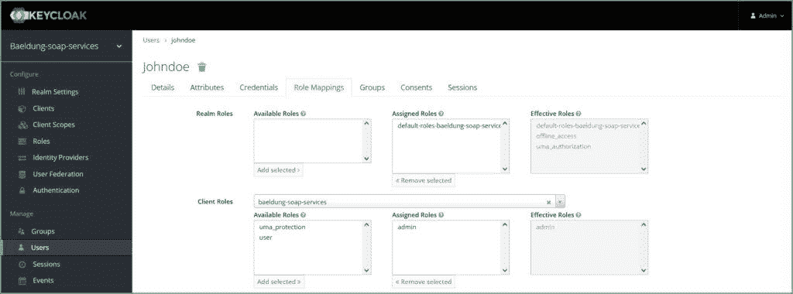
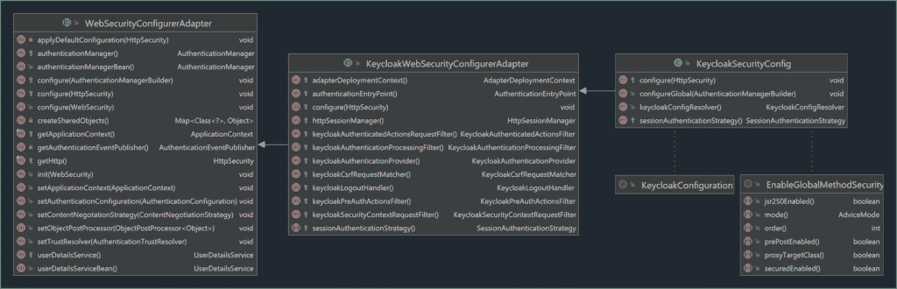
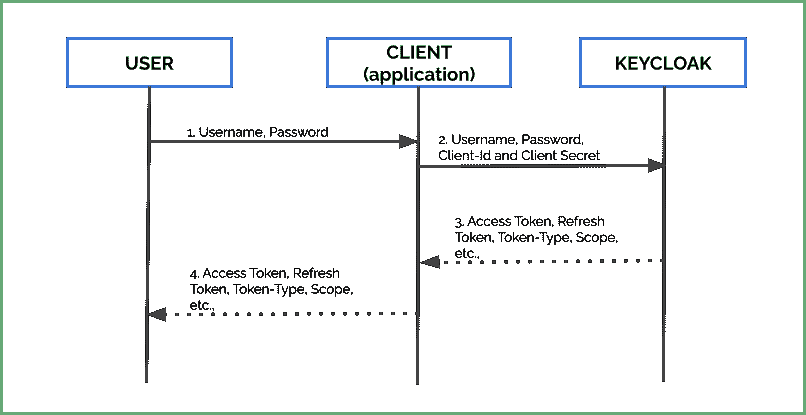

# 用 Keycloak 保护 SOAP Web 服务

> 原文：<https://web.archive.org/web/20220930061024/https://www.baeldung.com/soap-keycloak>

 

It’s just plain hard to get true, **real-time visibility into a running auth flow.**

Parts of the process can be completely hidden from us; if the complete authorization process requires a redirect from a remote OAuth production server, then every debugging effort must go through the production server.

It’s practically unfeasible to debug this locally. There’s no way to reproduce the exact state and no way to inspect what is actually happening under the hood. Not ideal.

Knowing these types of challenges, we built Lightrun - a real-time production debugging tool - to allow you to understand complicated flows with code-level information. Add logs, take snapshots (virtual breakpoints), and instrument metrics without a remote debugger, without stopping the running service, and, most importantly - **in real-time and without side effects**.

**Learn more with this 5-minute tutorial** focused on debugging these kinds of scenarios using Lightrun:

[>> Debugging Authentication and Authorization Using Lightrun](/web/20220525133211/https://www.baeldung.com/lightrun-n-security)

## 1.概观

Keycloak 是一款开源的身份和访问管理服务器，可以保护我们的现代应用(如 spa、移动应用、API 等)。). **Keycloak 支持行业标准协议，如安全声明标记语言(SAML) 2.0、单点登录(SSO)和 OpenID 连接(OIDC)** 。

此外，在本教程中，我们将学习如何使用 [OIDC](https://web.archive.org/web/20220525133211/https://openid.net/connect/) (OpenID Connect)利用 Keycloak 对 SOAP web 服务进行身份验证和授权。

## 2.开发一个 SOAP Web 服务

简而言之，让我们学习如何使用 Spring Boot 构建一个 [SOAP web 服务。](/web/20220525133211/https://www.baeldung.com/spring-boot-soap-web-service)

### 2.1.Web 服务操作

让我们直接定义操作:

*   **getProductDetails** :返回给定产品 ID 的产品详细信息。同样，让我们假设一个角色为`user` 的用户可以请求这个操作。
*   **deleteProduct** :删除给定产品 ID 的产品。此外，只有拥有`admin` 的用户才能请求此操作。

我们定义了两个操作和一个 RBAC(基于角色的访问控制)。

### 2.2.定义 XSD

首先，让我们定义一个`product.xsd`:

[PRE0]

同样，让我们添加 [wsdl4j](https://web.archive.org/web/20220525133211/https://search.maven.org/search?q=g:wsdl4j%20a:wsdl4j) 和 [Spring Boot 网络服务](https://web.archive.org/web/20220525133211/https://search.maven.org/search?q=g:org.springframework.boot%20a:spring-boot-starter-web-services)的依赖关系:

[PRE1]

### 2.3.网络服务

更进一步，让我们开发一个 SOAP web 服务。

[PRE2]

我们可以使用几个工具来测试这个 web 服务，比如 [cURL](https://web.archive.org/web/20220525133211/https://man7.org/linux/man-pages/man1/curl.1.html) 、 [Postman](https://web.archive.org/web/20220525133211/https://www.postman.com/) 、 [SOAPUI](https://web.archive.org/web/20220525133211/https://www.soapui.org/) 等。从今以后，让我们看看如何保护我们的 SOAP web 服务。

## 3.配置键盘锁

首先，让我们[使用 OpenId Connect 配置 Keycloak](/web/20220525133211/https://www.baeldung.com/spring-boot-keycloak) 来保护我们的 web 服务。

### 3.1.创建客户端

**通常，`Client`是一个需要 Keycloaks 认证服务**的应用程序。此外，在创建客户端时，选择:

*   应用程序 URL 为`Root URL`
*   `openid-connect`为`Client Protocol`
*   `Confidential` 为`Access Type`
*   打开`Authorization Enabled`和`Service Account Enabled`

此外，启用`Service Accounts` 允许我们的应用程序(客户端)使用 Keycloak 进行身份验证。随后，它向我们的认证流程提供了 [`Client Credentials Grant`](https://web.archive.org/web/20220525133211/https://oauth.net/2/grant-types/client-credentials/) 类型的流程:

最后，单击`Save`，然后单击`Credentials` 选项卡，记下`secret.`，因此，我们需要它作为 Spring Boot 配置的一部分。

### 3.2.用户和角色

接下来，让我们创建两个用户，并为他们分配角色和密码:

首先，让我们创建角色，`admin`和`user.` Keycloak 允许我们创建两种角色——[`Realm Roles`](https://web.archive.org/web/20220525133211/https://www.keycloak.org/docs/latest/server_admin/#realm-roles)和 [`Client Roles`](https://web.archive.org/web/20220525133211/https://www.keycloak.org/docs/latest/server_admin/#client-roles) 。然而，首先让我们创建`Client Roles`。

点击`Clients,` 选择客户端，然后点击`the Roles` 选项卡。然后，创建两个角色，`admin`和`user:`

**虽然 Keycloak 可以从 LDAP 或 AD (Active Directory)获取用户，**为了简单起见，让我们手动配置用户并为他们分配角色。

让我们创建两个用户。首先，我们点击`Users,` ，然后点击`Add User` :

现在，让我们给用户分配角色。

同样，点击`Users` 选择用户并点击`Edit,` ，然后点击`Role Mappings` 选项卡，从`Client Roles,` 中选择客户端并在`Available Roles.`上选择角色。让我们将`the admin`角色分配给一个用户，将`the user`角色分配给另一个用户:

## 4.Spring Boot 构型

类似地，让我们保护我们的 SOAP web 服务。

### 4.1.奇洛克-Spring Boot 集成

首先，让我们添加 Keycloak 依赖项。

**Keycloak 提供了一个利用 Spring Boot 自动配置的适配器，使集成变得容易**。现在，让我们更新我们的依赖项，以包括这个[键盘锁适配器](https://web.archive.org/web/20220525133211/https://search.maven.org/search?q=g:org.keycloak%20a:keycloak-spring-boot-starter):

[PRE3]

接下来，让我们将 Keycloak 配置添加到我们的`application.properties`:

[PRE4]

来自[钥匙锁文档](https://web.archive.org/web/20220525133211/https://www.keycloak.org/docs/latest/securing_apps/#_java_adapter_config):

*   **`keycloak.enabled`** :允许配置启用键盘锁 Spring Boot 适配器。默认值为`true.`
*   **`keycloak.realm`** :键盘锁领域名称，必填
*   **`keycloak.auth-server-url`** :基础 URL 是必填项，是 Keycloak 服务器的。通常，这是`http(s)://host:port/auth`的形式
*   **`keycloak.bearer-only`** :当默认值为`false,` 时，将其设置为`true` ，以便适配器验证令牌。
*   **`keycloak.credentials. secret`**:key cloak 中配置的强制客户端密码
*   **`keycloak.ssl-required`** :默认值为`external`。换句话说，所有的外部请求(除了`localhost`之外)都应该在`the https` 协议上。
*   **`keycloak.resource`** :申请的强制客户端标识
*   **`keycloak.use-resource-role-mappings`** :当缺省值为`false`时，将其设置为`true`，以便适配器在令牌内部查找用户的应用程序级角色映射。

### 4.2.启用全局方法安全性

除了前面的配置，我们需要指定安全约束来保护我们的 web 服务。这些约束允许我们限制未经授权的访问。例如，我们应该限制`admin`动作中的`user`。

有两种方法可以设置约束:

1.  在应用程序配置文件中声明`security-constraints`和`security-collections` 。
2.  方法级安全使用 [`@EnableGlobalMethodSecurity`](https://web.archive.org/web/20220525133211/https://docs.spring.io/spring-security/site/docs/current/api/org/springframework/security/config/annotation/method/configuration/EnableGlobalMethodSecurity.html) 。

对于 SOAP web 服务，`security-constraints` 在提供细粒度控制方面有所欠缺。此外，声明这些约束是冗长的。

**从今以后，让我们利用`@EnableGlobalMethodSecurity`的力量来保护我们的 SOAP web 服务操作。**

### 4.3.定义一个`KeycloakWebSecurityConfigurerAdapter`

**[`KeycloakWebSecurityConfigurerAdapter`](https://web.archive.org/web/20220525133211/https://www.javadoc.io/static/org.keycloak/keycloak-spring-security-adapter/15.0.2/org/keycloak/adapters/springsecurity/config/KeycloakWebSecurityConfigurerAdapter.html) 是一个可选的方便类，扩展了`WebSecurityConfigurerAdapter` ，简化了安全上下文配置**。此外，让我们定义一个类`KeycloakSecurityConfig` ，它扩展了这个适配器并利用了`@EnableGlobalMethodSecurity`。

描述此层次结构的类图:

现在，让我们配置`KeycloakSecurityConfig` 类:

[PRE5]

**[`@KeycloakConfiguration`](https://web.archive.org/web/20220525133211/https://www.javadoc.io/static/org.keycloak/keycloak-spring-security-adapter/15.0.2/org/keycloak/adapters/springsecurity/KeycloakConfiguration.html) 定义了 Keycloak 与 Spring Boot** 集成所需的所有注释:

### 4.4.添加授权

最后，让我们使用 [`@RolesAllowed`](https://web.archive.org/web/20220525133211/https://javaee.github.io/javaee-spec/javadocs/javax/annotation/security/RolesAllowed.html) 注释( [JSR-250](https://web.archive.org/web/20220525133211/https://download.oracle.com/otndocs/jcp/common_annotations-1_3-mrel3-eval-spec/) 的一部分)来授权我们的 SOAP web 服务操作。

**鉴于此，让我们用访问角色来配置我们的方法。为此，让我们使用`@RolesAllowed`注释**。回想一下，我们在 Keycloak 中定义了两个不同的角色，`user`和`admin,` 。让我们为每个 web 服务定义一个角色:

[PRE6]

至此，我们完成了配置。

## 5.测试应用程序

### 5.1.检查设置

现在应用程序已经准备好了，让我们开始使用`curl`测试我们的 SOAP web 服务:

[PRE7]

最终，如果所有配置都正确，我们将得到拒绝访问响应:

[PRE8]

不出所料，Keycloak 拒绝了请求，因为该请求不包含访问令牌。

### 5.2.获取访问令牌

现在，让我们从 Keycloak 获取一个访问令牌来访问我们的 SOAP web 服务。通常，该流程包括:

*   首先，用户向应用程序发送他的凭证
*   应用程序将`client-id`和`client-secret`以及这些凭证传递给 Keycloak 服务器。
*   最后，Keycloak 根据用户凭证和角色返回访问令牌、刷新令牌和其他元数据。

**Keycloak 公开了一个`token endpoint` 供客户端请求访问令牌**。通常，此端点的形式为:

**T2`<PROTOCOL>://<HOST>:<PORT>/auth/realms/<REALM_NAME>/protocol/openid-connect/token`**

例如:

`http://localhost:8080/auth/realms/baeldung/protocol/openid-connect/token`

现在，让我们获得访问令牌:

[PRE9]

实际上，我们获得了访问令牌和刷新令牌以及元数据:

[PRE10]

**此外，可配置的`expires_in`密钥定义了该令牌的生命周期。**例如，上述访问令牌在 5 分钟(300 秒)后到期。

### 5.3.使用访问令牌的 web 服务调用

在本例中，让我们使用在上一节中检索到的访问令牌。让我们使用访问令牌作为[承载令牌](https://web.archive.org/web/20220525133211/https://datatracker.ietf.org/doc/html/rfc6750) `.`来调用 SOAP web 服务

[PRE11]

使用正确的访问令牌，响应是:

[PRE12]

### 5.4.批准

回想一下，我们为角色为`a user` 的用户`janedoe` 生成了访问令牌。使用`user`访问令牌，让我们尝试执行`admin` 操作。也就是说，让我们试着调用`deleteProduct`:

[PRE13]

其中`request.xml` 的内容为:

[PRE14]

由于`user` 没有被授权访问`admin` 操作，我们得到一个访问被拒绝:

[PRE15]

## 6.结论

本教程展示了如何开发 SOAP web 服务、keycloak 配置，以及如何使用 Keycloak 保护我们的 web 服务。我们保护 REST web 服务的方式是，我们必须保护我们的 SOAP web 服务免受可疑用户和未授权访问。

和往常一样，完整的源代码可以在 GitHub 上找到[。](https://web.archive.org/web/20220525133211/https://github.com/eugenp/tutorials/tree/master/spring-boot-modules/spring-boot-keycloak)