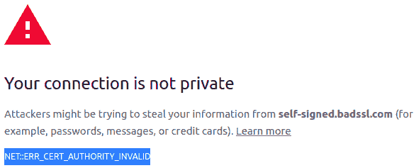
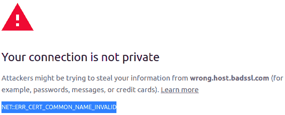
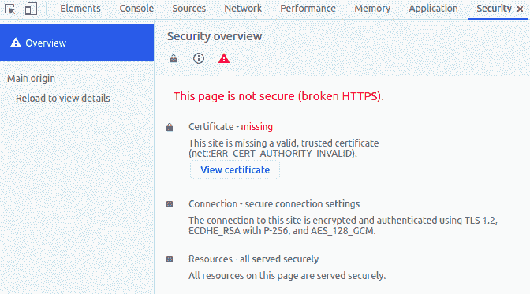
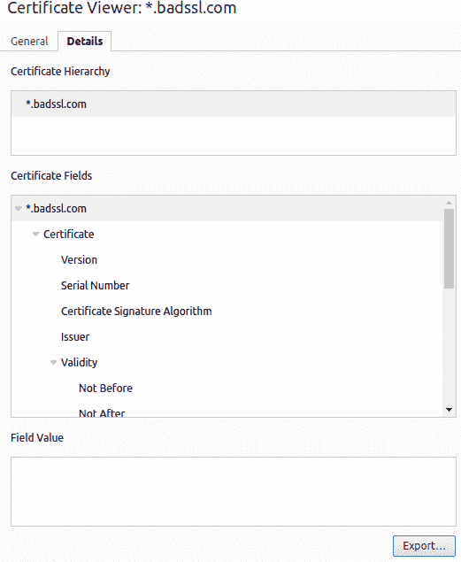

# 解决 JVM 中的证书存储错误

> 原文：<https://web.archive.org/web/20220930061024/https://www.baeldung.com/jvm-certificate-store-errors>

 

It’s just plain hard to get true, **real-time visibility into a running auth flow.**

Parts of the process can be completely hidden from us; if the complete authorization process requires a redirect from a remote OAuth production server, then every debugging effort must go through the production server.

It’s practically unfeasible to debug this locally. There’s no way to reproduce the exact state and no way to inspect what is actually happening under the hood. Not ideal.

Knowing these types of challenges, we built Lightrun - a real-time production debugging tool - to allow you to understand complicated flows with code-level information. Add logs, take snapshots (virtual breakpoints), and instrument metrics without a remote debugger, without stopping the running service, and, most importantly - **in real-time and without side effects**.

**Learn more with this 5-minute tutorial** focused on debugging these kinds of scenarios using Lightrun:

[>> Debugging Authentication and Authorization Using Lightrun](/web/20220525133009/https://www.baeldung.com/lightrun-n-security)

## 1.概观

在本教程中，我们将看看在发出 SSL 请求时可能会遇到的常见问题。

## 2.证书存储错误

每当 Java 应用程序打开与远程方的 SSL 连接时，它需要通过验证其[证书](/web/20220525133009/https://www.baeldung.com/java-security-overview#public_key_infrastructure)来检查服务器是否可信。**如果根证书没有包含在证书存储文件中，那么将会有一个安全异常:**

```
Untrusted: Exception in thread "main" javax.net.ssl.SSLHandshakeException: sun.security.validator.ValidatorException: PKIX path building failed: sun.security.provider.certpath.SunCertPathBuilderException: unable to find valid certification path to requested target
```

我们需要记住这个文件的默认位置是`$JAVA_HOME/lib/security/cacerts.`

## 3.自签名证书

在非生产环境中，通常会发现由不可信的颁发者签名的**证书，这被称为自签名证书**。

我们可以找到一些 https://wrong.host.badssl.com/或 https://self-signed.badssl.com/.下的不可信证书的例子，在任何浏览器中打开这两个 URL 都会导致安全异常。我们可以检查一下，看看证书的不同之处。

打开 https://self-signed.badssl.com/,后，我们可以看到浏览器返回了一个`“Cert Authority Invalid”`错误，因为证书是由浏览器未知的权威机构颁发的:

[](/web/20220525133009/https://www.baeldung.com/wp-content/uploads/2021/11/e1.png)

另一方面，打开 https://wrong.host.badssl.com/会导致一个`“Cert Common Name Invalid”`错误，这是另一种错误，表明证书是为不同于所提供的主机名颁发的:

[](/web/20220525133009/https://www.baeldung.com/wp-content/uploads/2021/11/e2.png)

对于在 JDK/JRE 中运行的应用程序来说，情况也是如此。这些安全例外将阻止我们向那些不受信任的方打开 SSL 连接。

## 4.管理证书存储以信任我们的证书

幸运的美国，**JDK/JRE 提供了一个与证书库交互的工具来管理它的内容**。这个工具就是`Keytool`，可以在`$JAVA_HOME/bin/keytool`中找到。

**重要提示** : `keytool`需要密码才能与之互动。**默认密码是`“changeit”.`**

### 4.1.列出证书

要获得 JVM 证书库中注册的所有证书的列表，我们需要发出以下命令:

```
keytool -list -keystore $JAVA_HOME/lib/security/cacerts
```

这将返回一个包含所有条目的列表，比如:

```
Your keystore contains 227 entries

Alias name: accvraiz1
Creation date: Apr 14, 2021
Entry type: trustedCertEntry

Owner: C=ES, O=ACCV, OU=PKIACCV, CN=ACCVRAIZ1
Issuer: C=ES, O=ACCV, OU=PKIACCV, CN=ACCVRAIZ1
....
```

### 4.2.添加证书

要手动将证书添加到该列表中，以便在我们发出 SSL 请求时对其进行验证，我们需要执行以下命令:

```
keytool -import -trustcacerts -file [certificate-file] -alias [alias] -keystore $JAVA_HOME/lib/security/cacerts
```

例如:

```
keytool -import -alias ss-badssl.com -keystore $JAVA_HOME/lib/security/cacerts -file ss-badssl.pem 
```

### 4.3.自定义证书存储路径

如果以上都不起作用，可能是我们的 Java 应用程序使用了不同的证书库。为了确保这一点，我们可以指定在运行 Java 应用程序时使用的证书存储:

```
java -Djavax.net.ssl.trustStore=CustomTrustStorePath ...
```

这样，我们可以确保它使用我们之前编辑的证书存储。如果这没有帮助，我们还可以通过应用 VM 选项来调试 SSL 连接:

```
-Djavax.net.debug=all
```

## 5.自动化脚本

最后，我们可以创建一个简单但方便的脚本来自动化整个过程:

```
#!/bin/sh
# cacerts.sh
/usr/bin/openssl s_client -showcerts -connect $1:443 </dev/null 2>/dev/null | /usr/bin/openssl x509 -outform PEM > /tmp/$1.pem
$JAVA_HOME/bin/keytool -import -trustcacerts -file /tmp/$1.pem -alias $1 -keystore $JAVA_HOME/lib/security/cacerts
rm /tmp/$1.pem
```

在脚本中，我们可以看到第一部分打开了一个到 DNS 的 SSL 连接，作为第一个参数传递，并请求它显示证书。之后，证书信息通过管道传输到`openssl`以对其进行摘要并将其存储为 PEM 文件。

最后，这个 PEM 文件是我们将使用的文件，它指示`keytool`将证书导入 cacerts 文件，并将 DNS 作为别名。

例如，我们可以尝试为 https://self-signed.badssl.com 添加证书:

```
cacerts.sh self-signed.badssl.com
```

运行之后，我们可以检查 cacerts 文件，它现在包含证书:

```
keytool -list -keystore $JAVA_HOME/lib/security/cacerts
```

最后，我们会看到新证书在那里:

```
#5: ObjectId: 2.5.29.32 Criticality=false
CertificatePolicies [
[CertificatePolicyId: [2.5.29.32.0]

Alias name: self-signed.badssl.com
Creation date: Oct 22, 2021
Entry type: trustedCertEntry

Owner: CN=*.badssl.com, O=BadSSL, L=San Francisco, ST=California, C=US
Issuer: CN=*.badssl.com, O=BadSSL, L=San Francisco, ST=California, C=US
Serial number: c9c0f0107cc53eb0
Valid from: Mon Oct 11 22:03:54 CEST 2021 until: Wed Oct 11 22:03:54 CEST 2023
Certificate fingerprints:
....
```

## 6.手动添加证书

如果出于某种原因，我们不想使用`openssl`，我们也可以使用浏览器提取证书并通过`keytool`添加它。

在基于 Chromium 的浏览器中，我们像 https://self-signed.badssl.com/一样打开网站，打开开发者工具(Windows 和 Linux 的 F12)。然后，让我们单击“安全”选项卡，最后单击“查看证书”。将显示证书信息:

[](/web/20220525133009/https://www.baeldung.com/wp-content/uploads/2021/11/e3.png)

让我们转到“详细信息”选项卡，单击“导出”按钮并保存它。这是我们的 PEM 文件:

[](/web/20220525133009/https://www.baeldung.com/wp-content/uploads/2021/11/e4.png)

最后，我们使用 keytool 导入它:

```
$JAVA_HOME/bin/keytool -import -trustcacerts -file CERTIFICATEFILE -alias ALIAS -keystore $JAVA_HOME/lib/security/cacerts
```

## 7.结论

在本文中，我们看到了如何将自签名证书添加到我们的 JDK/JRE 证书库中。现在，我们的 Java 应用程序可以信任服务器端，只要它们打开到包含这些证书的站点的 SSL 连接。