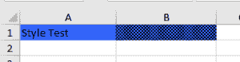

# 用 Apache POI 设置单元格的背景色

> 原文：<https://web.archive.org/web/20220930061024/https://www.baeldung.com/apache-poi-background-color>

## 1.概观

在 Excel 工作表中，当我们通过改变背景色来突出显示表格标题时，它看起来总是很优雅。本文描述了如何使用 [Apache POI](https://web.archive.org/web/20220524031430/https://poi.apache.org/) 来改变单元格的背景颜色。

此外，我们建议阅读我们的[在 Java 中使用 Microsoft Excel](/web/20220524031430/https://www.baeldung.com/java-microsoft-excel)教程，以了解在 Java 中使用 Excel 的一些基础知识。

## 2.Maven 依赖性

首先，我们需要在我们的`pom.xml`中添加`poi-ooxml`作为依赖项:

```
<dependency>
     <groupId>org.apache.poi</groupId>
     <artifactId>poi-ooxml</artifactId>
     <version>5.2.0</version>
 </dependency>
```

## 3.更改单元格背景颜色

### 3.1.关于单元格背景

在 excel 表中，我们可以通过填充颜色或图案来改变单元格的背景。在下图中，单元格`A1`填充了浅蓝色背景，而单元格`B1`填充了图案。这个图案有一个黑色的背景，上面有淡蓝色的斑点:

[](/web/20220524031430/https://www.baeldung.com/wp-content/uploads/2021/11/ExcelCellBackgroundColor-300x78-1.png)

### 3.2.更改背景颜色的代码

Apache POI 提供了三种更改背景颜色的方法。在`CellStyle`类中，我们可以为此使用`setFillForegroundColor`、`setFillPattern`和`setFillBackgroundColor`方法。在`IndexedColors`类中定义了一个颜色列表。类似地，在`FillPatternType`中定义了模式列表。

**有时候， `setFillBackgroundColor`这个名字可能会误导我们**。但是，该方法本身不足以改变细胞背景。为了通过填充纯色来改变单元格背景，我们使用了`setFillForegroundColor`和`setFillPattern`方法。第一个方法告诉我们要填充什么颜色，而第二个方法指定要使用的纯色填充模式。

以下代码片段是更改单元格背景的示例方法，如单元格`A1`所示:

```
public void changeCellBackgroundColor(Cell cell) {
    CellStyle cellStyle = cell.getCellStyle();
    if(cellStyle == null) {
        cellStyle = cell.getSheet().getWorkbook().createCellStyle();
    }
    cellStyle.setFillForegroundColor(IndexedColors.LIGHT_BLUE.getIndex());
    cellStyle.setFillPattern(FillPatternType.SOLID_FOREGROUND);
    cell.setCellStyle(cellStyle);
} 
```

**要用图案改变单元格背景，我们需要使用两种颜色**:一种颜色填充整个背景，另一种颜色填充第一种颜色上面的图案。在这里，我们需要使用所有这三种方法。

这里使用方法`setFillBackgroundColor`来指定背景颜色。仅用这种方法我们得不到任何效果。我们需要用`setFillForegroundColor`来选择第二种颜色，用`setFillPattern`来表示图案类型。

以下代码片段是更改单元格背景的示例方法，如单元格`B1`所示:

```
public void changeCellBackgroundColorWithPattern(Cell cell) {
    CellStyle cellStyle = cell.getCellStyle();
    if(cellStyle == null) {
        cellStyle = cell.getSheet().getWorkbook().createCellStyle();
    }
    cellStyle.setFillBackgroundColor(IndexedColors.BLACK.index);
    cellStyle.setFillPattern(FillPatternType.BIG_SPOTS);
    cellStyle.setFillForegroundColor(IndexedColors.LIGHT_BLUE.getIndex());
    cell.setCellStyle(cellStyle);
}
```

要了解更多代码细节，请查看整个 [Java 类](https://web.archive.org/web/20220524031430/https://github.com/eugenp/tutorials/blob/5e4e1e4af0917fc73e59860b77a20b4775c453e8/apache-poi/src/main/java/com/baeldung/poi/excel/cellstyle/CellStyleHandler.java)和相关的 [JUnit 测试用例](https://web.archive.org/web/20220524031430/https://github.com/eugenp/tutorials/blob/5e4e1e4af0917fc73e59860b77a20b4775c453e8/apache-poi/src/test/java/com/baeldung/poi/excel/cellstyle/CellStyleHandlerUnitTest.java)。

## 4.结论

在这个快速教程中，我们学习了如何使用 Apache POI 更改 Excel 表格中单元格的背景。

只使用三种方法——来自`CellStyle`类的`setFillForegroundColor`、`setFillPattern`和`setFillBackgroundColor`——我们可以很容易地改变单元格的背景颜色和填充图案。

GitHub 上的[提供了示例。](https://web.archive.org/web/20220524031430/https://github.com/eugenp/tutorials/tree/master/apache-poi)