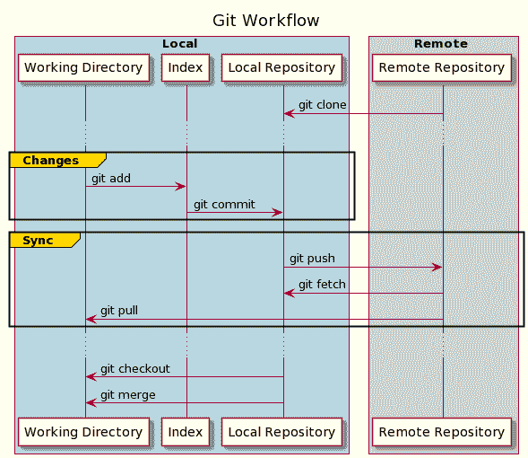

# 给初学者的 Git:权威实用指南

> 原文：<https://web.archive.org/web/20220930061024/https://www.baeldung.com/git-guide>

## 1.概观

在本教程中，我们将讨论使用 Git 时最常用的命令。

我们将从安装和配置开始，然后创建第一个本地存储库。接下来，我们将学习如何提交更改并与远程存储库同步。

此外，我们将讨论分支，并学习一些高级技术，如修改提交和操纵提交历史。

## 2.Git 是什么？

Git i **是一个版本控制系统(VCS ),允许保存和跟踪文件随时间的变化**而不覆盖以前的快照。它帮助开发人员在项目上合作。

与其主要竞争对手——[`SVN`](/web/20221123141012/https://www.baeldung.com/cs/git-vs-svn)不同，Git 还实现了分布式工作流系统。这意味着每个使用 Git 的开发人员都有整个存储库的本地副本。Git 还允许异步工作，而不需要与中央存储库的持续连接。

## 3.Git 安装

我们可以在 Windows、Mac 和 Linux 等最常见的操作系统上安装 Git。事实上，在大多数 Mac 和 Linux 机器上，Git 是默认安装的。

为了查看我们是否已经安装了 Git，让我们打开一个终端并执行:

```
$ git version
git version 2.24.3 (Apple Git-128)
```

而且，Git 自带了用于提交( [`git-gui`](https://web.archive.org/web/20221123141012/https://git-scm.com/docs/git-gui) )和浏览( [`gitk`](https://web.archive.org/web/20221123141012/https://git-scm.com/docs/gitk) )的内置 GUI 工具。还有大量的第三方工具或 IDE 插件来增强体验。

## 4.一本方便的手册

在我们创建第一个存储库之前，让我们运行 [`git` `help`](https://web.archive.org/web/20221123141012/https://git-scm.com/docs/git-help) 命令。**它显示关于 Git 本身的有用信息**:

```
$ git help
usage: git [--version] [--help] [-C <path>] [-c <name>=<value>]
           [--exec-path[=<path>]] [--html-path] [--man-path] [--info-path]
           [-p | --paginate | -P | --no-pager] [--no-replace-objects] [--bare]
           [--git-dir=<path>] [--work-tree=<path>] [--namespace=<name>]
           <command> [<args>]
...
```

我们还可以通过多种方式查看手册中的特定命令:

```
$ git --help init
$ git help init
$ git init --help
```

上述所有三个变量都返回相同的输出。

通过`-g` 选项`,` ,我们还可以访问内部指南列表来发展我们的技能:

```
$ git help -g
The common Git guides are:
   attributes          Defining attributes per path
   cli                 Git command-line interface and conventions
   core-tutorial       A Git core tutorial for developers
...
$ git help core-tutorial
```

要打印教程，我们需要提供它的名称作为参数。

## 5.`git``config`–配置 Git

一旦我们安装了 Git，我们可以很容易地用 [`git` `config`](https://web.archive.org/web/20221123141012/https://git-scm.com/docs/git-config) 命令来配置它，**允许管理选项**。

Git 支持不同级别的选项，如`system`、`global`、`local`、`worktree`或`file`。

虽然`system`设置是系统范围的，并且应用于系统上的每个用户及其所有存储库，但是`global`级别指的是特定于用户的设置。

`local`配置是特定于单个存储库的，当我们不向`git config`命令传递任何选项时，它是 Git 使用的默认级别。

`worktree`和`file`级别是更高级的配置级别，可以应用于存储库中的单个分支或文件。

此外， **Git 通过首先检查`local`级别来解析选项的有效值，如果选项没有设置**，则一直到`system`级别。

例如，让我们配置提交历史中使用的用户名:

```
$ git config --global user.name "Baeldung User"
```

我们刚刚在全球树立了我们的名字。

要覆盖单个存储库的选项，我们可以在其目录中使用`–local`标志。

要打印有效选项列表，我们使用:

```
$ git config -l
user.name=Baeldung User
```

我们可以执行`git –help config`命令来获得所有可用选项的详细信息。

## 6.创建存储库

接下来，我们需要创建一个存储库。为此，我们有两种选择—**可以在本地从头开始创建一个新的存储库，也可以克隆一个现有的存储库**。

### 6.1\. `git init` – Initialize a New Repository

如果我们决定初始化一个新的存储库，我们需要使用 [`git init`](https://web.archive.org/web/20221123141012/https://git-scm.com/docs/git-init) 命令。**它将当前目录转换为 Git 存储库**，并开始跟踪其内容:

```
$ mkdir simple-repo; cd simple-repo; git init
Initialized empty Git repository in /simple-repo/.git/
```

Git 还在其中创建了一个名为`.git`的隐藏目录。这个目录存储了 Git 创建的所有对象和[引用](https://web.archive.org/web/20221123141012/https://git-scm.com/book/en/v2/Git-Internals-Git-References),并作为我们项目历史的一部分使用。这些文件是在提交期间创建的，指向我们文件的特定修订。

之后，在大多数情况下，我们希望将已经创建的存储库与远程存储库连接起来。我们使用**[`git remote`](https://web.archive.org/web/20221123141012/https://git-scm.com/docs/git-remote)命令来管理当前存储库**的远程链接:

```
$ git remote add origin https://github.com/eugenp/tutorials.git
```

我们刚刚添加了一个名为`origin`的新遥控器，并将其连接到官方的 Baeldung GitHub 库。

### 6.2.`git clone`–克隆外部存储库

有时我们想要为一个现有的存储库做贡献。首先，我们需要在本地下载现有的存储库。

**[`git clone`](https://web.archive.org/web/20221123141012/https://git-scm.com/docs/git-clone)命令将存储库克隆到一个新目录中**:

```
$ git clone https://github.com/eugenp/tutorials.git
Cloning into 'repo'...
```

完成后，创建的新目录包含所有项目的文件、分支和历史。

此外，克隆的存储库已经配置并与外部源连接:

```
$ cd tutorials
$ git remote -v
origin	https://github.com/eugenp/tutorials.git (fetch)
origin	https://github.com/eugenp/tutorials.git (push)
```

Git 将使用这些原始链接来管理任何进一步的更改。

## 7.Git 工作流

在我们配置了我们的本地存储库之后，我们准备好应用第一个变更。但是在此之前，让我们检查一下 Git 是如何跟踪这些变化的。

我们的本地存储库由 Git 维护的三个不同的树组成。

第一个是保存文件实际版本的 **`Working Directory,` 。**

在对文件进行更改之后，我们可以将文件移动到`Index,`中，它充当一个临时区域。我们使用`git add` 命令来完成这项工作。**Git 开始跟踪`Index`中的文件。**

最后，**我们可以使用`git commit`命令将我们的更改应用并保存到`Local Repository` 中。**提交更改会更新存储库的头，它总是指向我们所做的最后一次提交。

这三个步骤用于维护本地更改。但是我们知道，这个储存库也可能包含一个外部来源。最后一步是同步两个存储库并发布我们的更改。

## [ ](/web/20221123141012/https://www.baeldung.com/wp-content/uploads/2021/11/git_workflow.png) 8。做出改变

现在我们知道了 Git 的跟踪系统是如何工作的，我们准备将我们的第一次更改应用到我们的存储库中。

### 8.1.`git status` –显示当前变化

让我们创建一个简单的文件，并将其添加到我们的存储库中。之后，我们执行 [`git status`](https://web.archive.org/web/20221123141012/https://git-scm.com/docs/git-status) 命令并分析其输出:

```
$ "Hello World" >> myfile.txt
$ git status
On branch master
Your branch is up to date with 'origin/master'.

Untracked files:
  (use "git add <file>..." to include in what will be committed)
	myfile.txt

nothing added to commit but untracked files present (use "git add" to track)
```

该命令打印我们的变更的当前详细状态。第一部分显示本地和远程分支是否同步。

接下来，输出显示了`working tree`的状态——当前修改的文件列表及其维护状态。正如我们看到的，`myfile.txt`文件目前在`Working Directory`区域，没有被 Git 跟踪。

### 8.2.`git add` –跟踪变化

为了开始跟踪变更，**我们需要通过使用 [`git add`](https://web.archive.org/web/20221123141012/https://git-scm.com/docs/git-add)** 命令将它们移动到`Index`:

```
$ git add myfile.txt
$ git stage *
```

我们可以通过用空格分隔来一次指定多个文件。我们还可以使用星号来指定所有文件。

或者，我们也可以使用 [`git stage`](https://web.archive.org/web/20221123141012/https://git-scm.com/docs/git-stage) 命令，它是`git add` 命令`.`的同义词

现在让我们来验证状态:

```
$ git status
On branch master
Your branch is up to date with 'origin/master'.

Changes to be committed:
  (use "git restore --staged <file>..." to unstage)
	new file:   myfile.txt
```

正如我们所看到的，Git 已经开始跟踪我们的文件。

### 8.3.`git restore` `&` `gitignore`——不跟踪变化

Git 允许从`Index`中删除文件。如果我们错误地将我们的变更移动到其中，并且**想要暂时禁止跟踪它们，我们使用`[git restore](https://web.archive.org/web/20221123141012/https://git-scm.com/docs/git-restore):`**

```
$ git restore -S myfile.txt
$ git status
On branch master
Your branch is up to date with 'origin/master'.

Untracked files:
  (use "git add <file>..." to include in what will be committed)
	myfile.txt
```

我们刚刚再次将我们的文件移动到`Working Area`中，并将其从进一步的提交中排除，直到我们再次存放它。`-S` ( `–staged`)标志告诉 Git 只恢复存储库的`Index`。

我们还可以永久排除文件并禁止跟踪它们。为此，我们需要创建一个 [`.gitignore`](https://web.archive.org/web/20221123141012/https://git-scm.com/docs/gitignore) 文件。该文件包含文件名模式，并应用于当前目录及其子目录中的所有文件。任何进一步的`add`操作将忽略匹配这些模式的文件。

### 8.4.`git commit `–保存更改

让我们恢复最后的更改，并将我们的文件再次移动到`Staging Area`:

`$ git add myfile.txt`

现在，是时候保存我们的工作了，所以我们需要提交。

提交是一个 Git 对象，它就像我们的存储库在特定时间的快照。

要提交更改，让我们使用 [`git commit`](https://web.archive.org/web/20221123141012/https://git-scm.com/docs/git-commit) 命令:

```
$ git commit -m "My first commit"
[master 8451901] My first commit
 1 file changed, 1 insertion(+)
 create mode 100644 myfile.txt
```

我们刚刚在本地创建了第一个提交。

`git commit`命令包含许多额外的选项来执行更复杂的操作，我们可以用`git commit –help` 命令来检查。

最有用的是`-m`标志，它指定一个提交消息，描述当前快照中所做的更改。

最后，让我们检查状态:

```
$ git status
On branch master
Your branch is ahead of 'origin/master' by 1 commit.
  (use "git push" to publish your local commits)

nothing to commit, working tree clean
```

现在，我们的工作树不包含任何额外的更改，但是本地存储库包含的提交比它的外部源更多。因此，要发布我们的更改，我们应该将本地更改与源同步。

### 8.5.`git log`&`git show` –检查提交

一旦我们创建了提交，我们就可以检查它的细节。提交包括许多额外的元数据，比如作者、时间戳等等。

为了**打印当前分支的提交列表，我们使用 [`git log`](https://web.archive.org/web/20221123141012/https://git-scm.com/docs/git-log)** 命令:

```
$ git log
commit 845190154ed7a491a6143669c4ce88058fb93f8a (HEAD -> master)
Author: ...
Date: ...

    My first commit

commit 9a1e11ec981b41e4b4b9c245a7a96cd6707f4705 (origin/master, origin/HEAD)
...
```

默认情况下，该列表按时间倒序显示当前分支的提交历史。

每个条目都包含一般的元数据，如提交的 id(唯一的 SHA-1 校验和)、作者、日期和给定的消息。

当我们想要更深入地了解一个提交时，我们使用 [`git show`](https://web.archive.org/web/20221123141012/https://git-scm.com/docs/git-show) 命令，后跟请求的提交 id，打印其详细信息:

```
$ git show 845190154ed7a491a6143669c4ce88058fb93f8a
commit 845190154ed7a491a6143669c4ce88058fb93f8a (HEAD -> master)
Author: ...
Date:...

    My first commit

diff --git a/myfile.txt b/myfile.txt
new file mode 100644
index 0000000..557db03
--- /dev/null
+++ b/myfile.txt
@@ -0,0 +1 @@
+Hello World
```

这一次，**输出还显示了使用 [`git diff`](https://web.archive.org/web/20221123141012/https://git-scm.com/docs/git-diff)** 命令提交的快照与之前快照的差异。

### 8.6.`git stash`–搁置变更

**[`git stash`](https://web.archive.org/web/20221123141012/https://git-scm.com/docs/git-stash)命令暂时搁置我们所做的**更改，恢复`Working Directory`以匹配`HEAD`提交。这允许我们快速切换上下文，开始做其他事情。

让我们创建另一个文件并将其添加到`Staging Area`中。之后，让我们执行`git stash`:

```
$ touch myfile-2.txt; git add *
$ git stash push
Saved working directory and index state WIP on master: 8451901 My first commit
```

现在，让我们尝试列出该文件:

`$ ls myfile-2.txt`

`ls: myfile-2.txt: No such file or directory`

我们可以看到现在文件不存在了。这是因为所有挂起的变更都已经从`Working Directory`中移除并保存在 stash 中。

我们可以使用`list`选项打印所有隐藏的修改:

```
$ git stash list
[[email protected]](/web/20221123141012/https://www.baeldung.com/cdn-cgi/l/email-protection){0}: WIP on master: 8451901 My first commit
```

由于我们没有提供它的描述，默认情况下 stash 被列为`WIP on… .` ,我们可以在命令行上使用`-m` 标志将默认值更改为更具描述性的消息。

为了检查其细节，我们使用`show`选项:

```
$ git stash show
 myfile-2.txt | 0
 1 file changed, 0 insertions(+), 0 deletions(-)
```

输出打印关于存储在最新存储中的更改的信息。

最后，如果我们想要恢复更改，我们使用`pop`选项:

```
$ git stash pop
...
$ ls myfile-2.txt 
myfile-2.txt 
```

我们刚刚从 stash 列表中删除了一个隐藏状态，并将其应用到当前状态之上。

## 9.操作提交历史

既然我们已经学习了如何在存储库中保存更改，那么让我们修改以前保存的提交。在接下来的部分中，我们将讨论最常见的用例。

### 9.1.`git commit –amend` –向提交中添加其他更改

假设我们在提交变更时忘记包含一个文件。当然，我们可以在上一个提交的基础上创建另一个提交，但是这可能会使更改历史变得混乱。

在这种情况下，**我们可能希望 Git 重写我们的最后一次提交，并包含我们使用`amend` 选项**忘记的文件。

让我们回顾一下上次提交:

```
$ git show --summary
commit 845190154ed7a491a6143669c4ce88058fb93f8a (HEAD -> master)
Author: ...
Date: ...

    My first commit

 create mode 100644 myfile.txt 
```

让我们的`my-file2.txt`从存储中弹出，让我们使用`amend`选项提交它:

```
$ git commit --amend
[master 0ed9f03] My first commit
 2 files changed, 1 insertion(+)
 create mode 100644 myfile-2.txt
 create mode 100644 myfile.txt
```

我们可以注意到，Git 将该文件添加到我们最后一次提交中，合并了这些更改。

### 9.2.`git rebase` –重新应用提交

修改提交的一个更高级的技术是通过 [git](https://web.archive.org/web/20221123141012/https://git-scm.com/docs/git-rebase) `[rebase](https://web.archive.org/web/20221123141012/https://git-scm.com/docs/git-rebase)` 命令`.` **在另一个库**的顶部重新应用来自历史的提交，允许我们动态地改变它们。

让我们在存储库中创建另一个提交:

```
$ touch myfile-3.txt
$ git add *
$ git commit -m "My second commit"
```

现在，我们应该有两个单独的提交——`My first commit`和`My second commit`。

让我们开始以交互模式重新调整这两个提交:

```
git rebase -i HEAD~2
```

这将打开一个编辑器，我们可以在其中使用命令操作历史:

```
pick 82d8635 My first commit
pick 6d58108 My second commit

# Rebase 9a1e11e..82d8635 onto 9a1e11e (2 commands)
#
# Commands:
# p, pick <commit> = use commit
# r, reword <commit> = use commit, but edit the commit message
# e, edit <commit> = use commit, but stop for amending
# s, squash <commit> = use commit, but meld into previous commit
# d, drop <commit> = remove commit 
...
```

在顶部，我们有一个重定提交的列表，后面是手册。我们有很多选择。我们可以通过交换行来改变顺序，或者`reword`提交消息，或者`squash`将它们合并成一个，`edit,` 或者甚至`drop` 单次提交。指令行将从上到下应用。

### 9.3.`git reset` –回滚到特定状态

有时，我们可能希望放弃当前状态，恢复到历史快照。为此，我们使用 [`git reset`](https://web.archive.org/web/20221123141012/https://git-scm.com/docs/git-reset) 选项`:`

```
$ git reset 82d8635
```

**在指定的提交**之后撤销所有的提交，本地保存更改并将它们移动到`Staging Area`。但是，如果我们想放弃所有的工作变更，我们可以使用`–hard`标志。

## 10.同步存储库

到目前为止，在本地对存储库进行工作之后，终于到了发布我们的更改的时候了。

在上传它们之前，我们应该始终将本地副本与远程副本同步，以避免发布过程中的冲突**。**

### 10.1.`git fetch`–更新参考资料

当我们实现我们的更改时，其他人可能已经发布了对同一分支的更改。所以我们应该检查它们，并与我们的本地存储库同步。

[`git fetch`](https://web.archive.org/web/20221123141012/https://git-scm.com/docs/git-fetch) 命令帮助我们这样做:

```
$ git fetch
```

**这将从原始存储库**下载对象和引用。

我们应该注意到**这个动作不会修改当前的工作树**。这是因为我们只能检查存储库的更新提交历史。如果我们发现任何悬而未决的变化，我们必须进一步。

### 10.2.`git merge`–应用引入的变更

在发布代码之前，我们必须合并同一个分支上的任何传入变更。如果我们不这样做，发布过程可能会失败。

让我们更新我们的分支:

```
$ git merge origin/master
```

[`git merge`](https://web.archive.org/web/20221123141012/https://git-scm.com/docs/git-merge) 命令是一个非常强大的工具。**它从给定的引用中下载所有新的变更，并将它们与当前工作树结合**选择正确的合并策略。许多更改将被自动应用，即使修改存在于相同的文件中。

但是有时候，没有简单的方法来合并变更。在这种情况下，我们有一个`merge conflict`，我们必须在继续之前手动解决它。我们需要编辑失败的文件，准备最终版本，并提交更改。

### 10.3.`git pull `–立即更新和应用

[`git pull`](https://web.archive.org/web/20221123141012/https://git-scm.com/docs/git-pull) 命令无非是把`git fetch`和`git merge`合二为一:

`$ git pull origin/master`

**它检查给定分支的最新变更，并将其与当前分支**合并，与`git fetch`和`git merge`的方式相同。这是更新当前分支的最常见方式。

此外，提取变更可能还需要额外的手动操作来解决`merge conflicts`。

### 10.4.`git push`–发布本地提交

一旦我们同步了我们的本地存储库并修复了待定的`merge conflicts`，我们终于准备好发布我们的提交了。我们需要选择远程目标和本地分支。

让我们执行 [`git push`](https://web.archive.org/web/20221123141012/https://git-scm.com/docs/git-push) 命令:

`$ git push origin master`

**这用所有本地提交更新了远程存储库的`master`分支**。

最后，我们检查历史:

```
$ git log
commit 6d5810884c3ce63ca08084959e3a21405a1187df (HEAD -> master, origin/master, origin/HEAD)
Author: ...
Date: ...
    My second commit
```

我们完了！我们刚刚将我们的更改发送到远程存储库。

## 11.Git 分支

现在，我们来谈谈分支。以前，我们有意跳过任何分支操作。所有的修改都是在**的`master`分支上完成的，这是每个 Git 库**的默认分支。

**分支被用来开发彼此隔离的**特性。我们使用其他分支进行开发，并在完成后将它们合并回`master`分支。

### 11.1.`git branch `–管理分行

**[`git branch`](https://web.archive.org/web/20221123141012/https://git-scm.com/docs/git-branch) 帮助我们管理分公司**。要创建一个新的，我们只需指定它的名称:

```
$ git branch new-branch
```

在我们将本地分支推送到远程存储库之前，它对其他人是不可用的。

我们现在可以通过列出所有分支来查看新创建的分支:

```
$ git branch --list --all
* master
  new-branch
  remotes/origin/HEAD -> origin/master
  remotes/origin/master
```

如果我们想删除一个本地分支，我们执行:

`$ git branch -d new-branch`

### 11.2.`git checkout` –改变当前分支

如果**我们想切换当前支路，我们使用 [`git checkout`](https://web.archive.org/web/20221123141012/https://git-scm.com/docs/git-checkout) 或** [`**git switch**`](https://web.archive.org/web/20221123141012/https://git-scm.com/docs/git-switch) 功能:

```
$ git switch new-branch
Switched to branch 'new-branch'
$ git checkout master
Switched to branch 'master'
```

我们刚刚使用这两个命令从`master`切换到 `new-branch` ，然后再次回到`master`。

虽然两者的工作方式相似，但`git` *开关*命令只允许切换分支。相比之下，`git checkout`是一个更复杂的命令，使我们能够额外管理工作树文件，重置分支，或将文件恢复到特定版本。

## 12.结论

在本文中，我们介绍了所有的 Git 基础知识，并讨论了每个开发人员在使用 Git 时应该知道的大多数常见操作。通过实际的例子，我们学习了如何使用这个版本控制系统。

我们从安装和配置 Git 开始，然后创建第一个存储库。之后，我们做了一些更改，并学习了如何修改提交历史。最后，我们通过同步两个存储库发布了变更，并学习了如何使用 Git 分支。