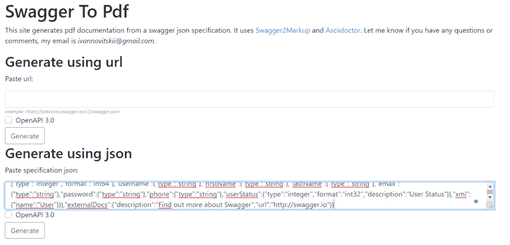
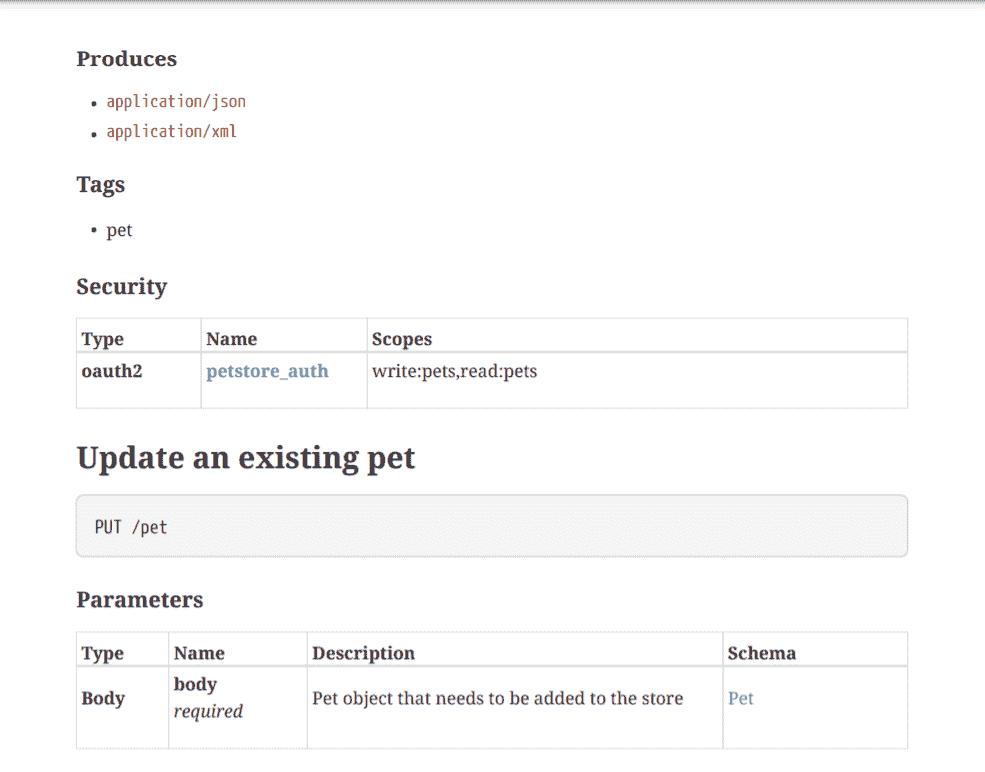

# 从 Swagger API 文档生成 PDF

> 原文：<https://web.archive.org/web/20220930061024/https://www.baeldung.com/swagger-generate-pdf>

## 1.概观

在本教程中，我们将了解从 Swagger API 文档生成 PDF 文件的不同方法。为了熟悉 Swagger，请参考我们的教程[用 Spring REST API](/web/20221125175536/https://www.baeldung.com/swagger-2-documentation-for-spring-rest-api) 设置 Swagger 2。

## 2.用 Maven 插件生成 PDF

从 Swagger API 文档生成 PDF 文件的第一个解决方案基于一组 Maven 插件。使用这种方法，我们将在构建 Java 项目时获得 PDF 文件。

**生成所需 PDF 文件的步骤包括在 Maven 构建过程中以特定顺序应用几个插件**。插件应该被配置为挑选资源，并将前一阶段的输出作为下一阶段的输入进行传播。那么，让我们来看看它们是如何工作的。

### 2.1.`swagger-maven-plugin` 插件

我们将使用的第一个插件是`[swagger-maven-plugin](https://web.archive.org/web/20221125175536/https://search.maven.org/artifact/com.github.kongchen/swagger-maven-plugin/3.1.8/maven-plugin)`。这个插件**为我们的 REST API** 生成`swagger.json`文件:

```
<plugin>
    <groupId>com.github.kongchen</groupId>
    <artifactId>swagger-maven-plugin</artifactId>
    <version>3.1.3</version>
    <configuration>
        <apiSources>
	    <apiSource>
        	<springmvc>false</springmvc>
		<locations>com.baeldung.swagger2pdf.controller.UserController</locations>
		<basePath>/api</basePath>
		<info>
	            <title>DEMO REST API</title>
		    <description>A simple DEMO project for REST API documentation</description>
		    <version>v1</version>
		</info>
		<swaggerDirectory>${project.build.directory}/api</swaggerDirectory>
	        <attachSwaggerArtifact>true</attachSwaggerArtifact>
            </apiSource>
        </apiSources>
    </configuration>
    <executions>
        <execution>
            <phase>package</phase>
            <goals>
		<goal>generate</goal>
            </goals>
        </execution>
    </executions>
</plugin>
```

我们需要指向 API 的位置，并定义构建过程中插件生成`swagger.json`文件的阶段。在这里，在`execution`标签中，我们已经指定它应该在`package`阶段这样做。

### 2.2.`swagger2markup-maven-plugin`插件

我们需要的第二个插件是`[swagger2markup-maven-plugin](https://web.archive.org/web/20221125175536/https://search.maven.org/artifact/io.github.robwin/swagger2markup-maven-plugin/0.9.3/jar)`。它**将前一个插件的`swagger.json`输出作为其输入，产生** **[Asciidoc](/web/20221125175536/https://www.baeldung.com/asciidoctor)** :

```
<plugin>
    <groupId>io.github.robwin</groupId>
    <artifactId>swagger2markup-maven-plugin</artifactId>
    <version>0.9.3</version>
    <configuration>
        <inputDirectory>${project.build.directory}/api</inputDirectory>
        <outputDirectory>${generated.asciidoc.directory}</outputDirectory>
        <markupLanguage>asciidoc</markupLanguage>
    </configuration>
    <executions>
        <execution>
	    <phase>package</phase>
            <goals>
                <goal>process-swagger</goal>
            </goals>
        </execution>
    </executions>
</plugin>
```

这里，我们指定了`inputDirectory`和 o `utputDirectory`标签。同样，我们将定义`package`为 REST API 生成 Asciidoc 的构建阶段。

### 2.3.`asciidoctor-maven-plugin`插件

我们将使用的第三个也是最后一个插件是`[asciidoctor-maven-plugin](https://web.archive.org/web/20221125175536/https://search.maven.org/artifact/org.asciidoctor/asciidoctor-maven-plugin/2.2.1/maven-plugin)`。作为三个插件中的最后一个，这个**从[Asciidoc](/web/20221125175536/https://www.baeldung.com/asciidoctor)T4 产生一个 PDF 文件:**

```
<plugin>
    <groupId>org.asciidoctor</groupId>
    <artifactId>asciidoctor-maven-plugin</artifactId>
    <version>2.2.1</version>
    <dependencies>
        <dependency>
	    <groupId>org.asciidoctor</groupId>
            <artifactId>asciidoctorj-pdf</artifactId>
            <version>1.6.0</version>
        </dependency>
    </dependencies>
    <configuration>
        <sourceDirectory>${project.build.outputDirectory}/../asciidoc</sourceDirectory>
        <sourceDocumentName>overview.adoc</sourceDocumentName>
        <attributes>
            <doctype>book</doctype>
            <toc>left</toc>
            <toclevels>2</toclevels>
            <generated>${generated.asciidoc.directory}</generated>
        </attributes>
    </configuration>
    <executions>
        <execution>
            <id>asciidoc-to-pdf</id>
            <phase>package</phase>
            <goals>
                <goal>process-asciidoc</goal>
            </goals>
            <configuration>
                <backend>pdf</backend>
                <outputDirectory>${project.build.outputDirectory}/api/pdf</outputDirectory>
            </configuration>
        </execution>
    </executions>
</plugin>
```

基本上，我们提供了在前一阶段生成 Asciidoc 的位置。然后，我们为它定义一个生成 PDF 文档的位置，并指定它应该生成 PDF 的阶段。我们再次使用了`package`阶段。

## 3.使用 SwDoc 生成 PDF

Swagger to PDF 是一个在线工具，可在 swdoc.org[的](https://web.archive.org/web/20221125175536/https://www.swdoc.org/)获得，它使用提供的`swagger.json`规范在 PDF 文件中生成 API 文档。它依赖于[摇摆 2 标记](https://web.archive.org/web/20221125175536/https://github.com/Swagger2Markup/swagger2markup-cli)转换器和[ascii doctor](https://web.archive.org/web/20221125175536/https://asciidoctor.org/)

这些原理与前面的解决方案相似。首先，Swagger2Markup 将`swagger.json`转换成 AsciiDoc 文件。然后，Asciidoctor 将这些文件解析为文档模型，并将其转换为 PDF 文件。

这个解决方案很容易使用，如果我们已经有了我们的 Swagger 2 API 文档，它是一个很好的选择。

我们可以通过两种方式生成 PDF:

*   提供我们的`swagger.json `文件的 URL
*   将`swagger.json`文件的内容粘贴到工具的文本框中

我们将在 Swagger 上使用公开可用的 PetStore API 文档[。](https://web.archive.org/web/20221125175536/https://petstore.swagger.io/)

出于我们的目的，我们将复制 JSON 文件并将其粘贴到文本框中:

[](/web/20221125175536/https://www.baeldung.com/wp-content/uploads/2021/12/swagger-to-pdf-1.png)

然后，在我们点击“生成”按钮后，我们将获得 PDF 格式的文档:

[](/web/20221125175536/https://www.baeldung.com/wp-content/uploads/2021/12/swagger-to-pdf-2.png)

## 4.结论

在这篇简短的教程中，我们讨论了从 Swagger API 文档生成 PDF 的两种方法。

第一种方法依赖于 Maven 插件。在构建应用程序时，我们可以使用三个插件并生成 REST API 文档。

第二个解决方案描述了如何使用 SwDoc online 工具生成 PDF 文档。我们可以从到我们的`swagger.json`的链接中生成文档，或者将 JSON 文件内容粘贴到工具中。

和往常一样，这些例子的代码可以在 GitHub 的[上找到。](https://web.archive.org/web/20221125175536/https://github.com/eugenp/tutorials/tree/master/spring-boot-modules/spring-boot-swagger)