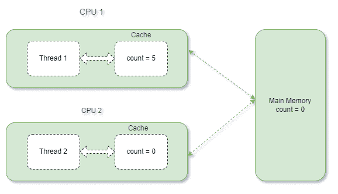

# 易变变量和线程安全

> 原文:[https://web . archive . org/web/20220930061024/https://www . bael dung . com/Java-volatile-variables-thread-safety](https://web.archive.org/web/20220930061024/https://www.baeldung.com/java-volatile-variables-thread-safety)

## 1.概观

虽然 Java 中的 [`volatile`](/web/20220907043631/https://www.baeldung.com/java-volatile) 关键字通常可以确保线程安全，但情况并非总是如此。

在本教程中，我们将看看共享的`volatile`变量会导致竞争的情况。

## 2.什么是`volatile`变量？

与其他变量不同，`volatile`变量被写入主存储器和从主存储器中读取。**CPU 不会缓存`volatile`变量的值。**

让我们看看如何声明一个`volatile`变量:

```
static volatile int count = 0;
```

## 3.`volatile`变量的属性

在这一节中，我们将看看`volatile`变量的一些重要特性。

### 3.1.能见度保证

假设我们有两个线程，运行在不同的 CPU 上，访问一个共享的非`volatile`变量。让我们进一步假设第一个线程正在写入一个变量，而第二个线程正在读取同一个变量。

出于性能原因，每个线程都将变量的值从主内存复制到各自的 CPU 缓存中。

**在非`volatile`变量的情况下，JVM 不保证值什么时候从缓存写回主内存。**

如果第一个线程的更新值没有立即刷新回主内存，第二个线程可能会读取旧值。

下图描述了上述场景:

[](/web/20220907043631/https://www.baeldung.com/wp-content/uploads/2021/12/Volatile_Variable.png)

这里，第一个线程已经将变量`count`的值更新为 5。但是，更新后的值不会立即刷新回主存储器。因此，第二个线程读取旧值。这可能会在多线程环境中导致错误的结果。

另一方面，**如果我们将`count`声明为`volatile`，那么每个线程都可以在主存中看到自己最新的更新值，而不会有任何延迟**。

这叫做`volatile`关键字的可见性保证。它有助于避免上述数据不一致的问题。

### 3.2.发生在保证之前

JVM 和 CPU 有时会重新排序独立的指令，并并行执行它们以提高性能。

例如，让我们看看两条独立且可以同时运行的指令:

```
a = b + c;
d = d + 1;
```

然而，**有些指令不能并行执行，因为后一条指令依赖于前一条指令的结果**:

```
a = b + c;
d = a + e;
```

此外，还可以对独立指令进行重新排序。这可能会在多线程应用程序中导致不正确的行为。

假设我们有两个线程访问两个不同的变量:

```
int num = 10;
boolean flag = false;
```

此外，让我们假设第一个线程递增`num`的值，然后将`flag `设置为`true`，而第二个线程等待，直到`flag `被设置为`true`。并且，一旦`flag `的值被设置为`true`，第二线程读取`num.`的值

因此，第一个线程应按以下顺序执行指令:

```
num = num + 10;
flag = true;
```

但是，让我们假设 CPU 将指令重新排序为:

```
flag = true;
num = num + 10;
```

在这种情况下，一旦标志被设置为`true`，第二个线程将开始执行。因为变量`num `还没有更新，所以第二个线程将读取`num`的旧值，即 10。这会导致不正确的结果。

然而，如果我们将`flag`声明为`volatile`，上述指令重新排序就不会发生。

**对变量应用`volatile`关键字通过提供先发生保证来防止指令重新排序。**

这确保了在写入`volatile`变量之前的所有指令都不会被重新排序以出现在其后。类似地，在读取`volatile`变量之后的指令不能被重新排序以出现在它之前。

## 4.`volatile`关键字什么时候提供线程安全？

`volatile`关键字在两种多线程场景中很有用:

*   当只有一个线程写入`volatile`变量而其他线程读取其值时。因此，读取线程会看到变量的最新值。
*   当多个线程写入共享变量时，操作是原子的。这意味着写入的新值不依赖于以前的值。

## 5.`volatile`什么时候不提供线程安全？

关键字`volatile`是一种轻量级的同步机制。

与`synchronized`方法或块不同，当一个线程正在处理一个临界区时，它不会让其他线程等待。因此，当对共享变量执行非原子操作或复合操作时，`volatile`关键字不提供线程安全**。**

像递增和递减这样的操作是复合操作。这些操作在内部包括三个步骤:读取变量的值，更新它，然后将更新后的值写回内存。

读取值和将新值写回内存之间的短暂时间间隔可能会造成争用情况。在这段时间间隔内，处理同一变量的其他线程可能会读取和操作旧值。

此外，如果多个线程对同一个共享变量执行非原子操作，它们可能会覆盖彼此的结果。

因此，在这种情况下**，线程需要首先读取共享变量的值来计算下一个值，将变量声明为`volatile`将不起作用**。

## 6.例子

现在，我们将借助一个例子来尝试理解当将一个变量声明为`volatile`不是线程安全时的上述场景。

为此，我们将声明一个名为`count`的共享`volatile`变量，并将其初始化为零。我们还将定义一个方法来递增这个变量:

```
static volatile int count = 0;

void increment() {
    count++;
}
```

接下来，我们将创建两个线程`t1` 和`t2. `,这些线程调用上面的增量操作一千次:

```
Thread t1 = new Thread(new Runnable() {
    @Override
    public void run() {
        for(int index=0; index<1000; index++) {
            increment();
        }
    }
});

Thread t2 = new Thread(new Runnable() {
    @Override
    public void run() {
        for(int index=0; index<1000; index++) {
            increment();
        }
    }
});

t1.start();
t2.start();

t1.join();
t2.join();
```

从上面的程序中，**我们可以预计，`count`变量的最终值将是 2000。但是，我们每次执行程序，结果都会不一样。**有时候，它会打印出“正确的”值(2000)，有时候不会。

让我们看看运行示例程序时得到的两个不同的输出:

```
value of counter variable: 2000 value of counter variable: 1652
```

上述不可预测的行为是因为**两个线程都在对共享的`count `变量**执行递增操作。如前所述，**增量操作不是原子的**。它执行三个操作——读取、更新，然后将变量的新值写入主内存。因此，当`t1`和`t2`同时运行时，很有可能会发生这些操作的交错。

假设`t1`和`t2 `同时运行，`t1 `对`count` 变量进行增量运算。但是，在将更新后的值写回主内存之前，线程`t2` 从主内存中读取变量`count` 的值。**在这种情况下，`t2` 将读取一个旧值，并对其执行递增操作。** **这可能导致`count` 变量的错误值被更新到主存储器**。因此，结果将不同于 2000 年的预期。

## 7.结论

在本文中，我们看到将共享变量声明为`volatile`并不总是线程安全的。

我们了解到，为了提供线程安全并避免非原子操作的竞争情况，使用`synchronized`方法、块或原子变量都是可行的解决方案。

和往常一样，上面例子的完整源代码可以在 GitHub 上的[处获得。](https://web.archive.org/web/20220907043631/https://github.com/eugenp/tutorials/tree/master/core-java-modules/core-java-concurrency-advanced-4)