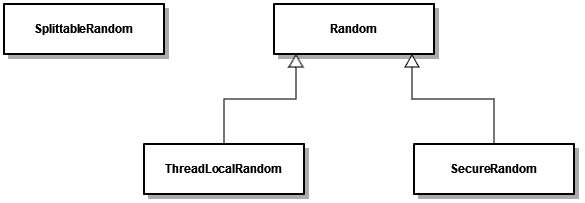
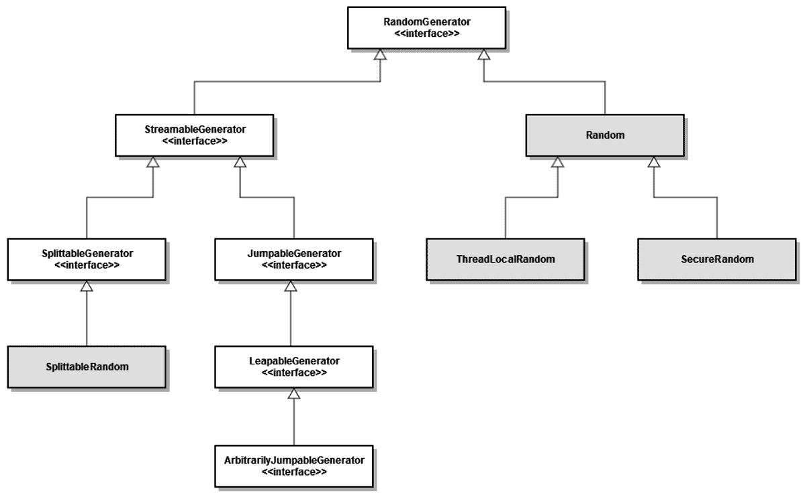

# Java 17 中的随机数生成器

> 原文：<https://web.archive.org/web/20220930061024/https://www.baeldung.com/java-17-random-number-generators>

## 1.概观

`Java SE 17`的发布引入了随机数生成 API 的更新——[JEP 356](https://web.archive.org/web/20220821171529/https://openjdk.java.net/jeps/356)。

在这次 API 更新中，**引入了新的接口类型，以及轻松列出、查找和实例化生成器工厂的方法**。此外，现在可以使用一组新的随机数生成器实现。

在本教程中，我们将比较新的`RandomGenerator` API 和旧的`Random` API。我们将列出所有可用的生成器工厂，并根据其名称或属性选择一个生成器。

我们还将探索新 API 的线程安全和性能。

## 2.旧的随机 API

首先，我们来看看 Java 基于 *Random* 类生成随机数的老 API。

### 2.1.API 设计

最初的 API 由四个没有接口的类组成:

### 2.2.随意

最常用的随机数生成器是`java.util`包中的`Random`。

为了生成一个随机数流，我们需要**创建一个随机数生成器类的实例——`Random`**:

[PRE0]

这里，默认构造函数将随机数生成器的种子设置为一个很可能与其他调用不同的值。

### 2.3.可供选择的事物

除了`java.util.Random`、**之外，还有三个替代的生成器可以用来处理线程安全和安全问题**。

默认情况下，`Random`的所有实例都是线程安全的。但是，跨线程并发使用同一个实例可能会导致性能下降。因此， `java.util.concurren` t 包中的`ThreadLocalRandom`类是多线程系统的首选。

由于`Random`实例在加密方面并不安全，因此`SecureRandom`类使我们能够创建在安全敏感的上下文中使用的生成器。

最后，`java.util`包中的`SplittableRandom`类针对并行流和 fork/join 风格的计算进行了优化。

## 3.新随机生成器 API

现在，让我们看看基于`RandomGenerator`接口的新 API。

### 3.1.API 设计

新的 API 提供了更好的整体设计，包括**新的接口类型和生成器实现**:

在上图中，我们可以看到旧的 API 类如何适应新的设计。在这些类型之上，还添加了几个随机数生成器实现类:

*   佐罗四郎集团
    *   `Xoroshiro128PlusPlus`
*   俊郎集团
    *   `Xoshiro256PlusPlus`
*   LXM 集团
    *   `L128X1024MixRandom`
    *   `L128X128MixRandom`
    *   `L128X256MixRandom`
    *   `L32X64MixRandom`
    *   `L64X1024MixRandom`
    *   `L64X128MixRandom`
    *   `L64X128StarStarRandom`
    *   `L64X256MixRandom`

### 3.2.改进领域

旧 API 中缺少接口使得在不同的生成器实现之间切换更加困难。因此，第三方很难提供自己的实现。

例如，`SplittableRandom`与 API 的其余部分完全分离，尽管它的一些代码与`Random`完全相同。

因此，新的`RandomGenerator` API 的主要目标是:

*   确保不同算法更容易互换
*   更好地支持基于流的编程
*   消除现有类中的代码重复
*   保留旧的`Random` API 的现有行为

### 3.3.新界面

新的根接口 **`RandomGenerator`为所有现有的和新的生成器**提供了统一的 API。

它定义了返回不同类型的随机选择值的方法，以及随机选择值的流。

新的 API 提供了另外四个新的专用生成器接口:

*   `SplitableGenerator`允许创建一个新的生成器作为当前生成器的后代
*   `JumpableGenerator`允许向前跳一个中等数量的抽牌
*   `LeapableGenerator`允许提前跳开大量抽牌
*   `ArbitrarilyJumpableGenerator` 增加跳跃距离到`LeapableGenerator`

## 4.`RandomGeneratorFactory`

新 API 中提供了一个工厂类，用于生成特定算法的多个随机数生成器。

### 4.1.查找全部

`RandomGeneratorFactory` 方法`all`产生所有可用生成器工厂的非空流。

我们可以用它来**打印所有注册的生成器工厂，并检查它们的算法**的属性:

[PRE1]

工厂的可用性通过服务提供者 API 定位`RandomGenerator`接口的实现来确定。

### 4.2.按属性查找

我们还可以利用`all`方法通过随机数生成器算法的属性**查询工厂:**

[PRE2]

因此，使用 Stream API，我们可以找到一个满足我们需求的工厂，然后使用它来创建一个生成器。

## 5.`RandomGenerator`选择

除了更新的 API 设计之外，还实现了几个新算法，并且将来可能会添加更多算法。

### 5.1.选择默认值

在大多数情况下，我们没有特定的发电机要求。因此，我们可以**直接从`RandomGenerator`接口获取默认生成器。**

这是 Java 17 中新推荐的方法，作为创建`Random`实例的替代方法:

[PRE3]

`getDefault`方法当前选择`L32X64MixRandom`发生器。

然而，算法会随着时间而改变。因此，不能保证这个方法会在未来的版本中继续返回这个算法。

### 5.2.选择特定

另一方面，当我们有特定的生成器需求时，我们可以使用`of`方法来**检索特定的生成器:**

[PRE4]

此方法要求将随机数生成器的名称作为参数传递。

如果没有找到指定的算法，它将抛出一个`IllegalArgumentException`。

## 6.线程安全

大多数****的新生成器实现都不是线程安全的**。然而，`Random`和`SecureRandom` 依然如此。**

 **因此，在多线程环境中，我们可以选择:

*   共享线程安全生成器的实例
*   在启动新线程之前，从本地源拆分一个新实例

我们可以使用`SplittableGenerator`实现第二种情况:

[PRE5]

通过这种方式，我们可以确保我们的生成器实例在初始化时不会产生相同的数字流。

## 7.表演

让我们对 Java 17 中所有可用的生成器实现进行一个简单的性能测试。

我们将使用相同的方法测试生成器，生成四种不同类型的随机数:

[PRE6]

让我们来看看基准测试结果:

| 算法 | 方式 | 得分 | 错误 | 单位 |
| l1128 x 1024 混合随机 | avgt | Ninety-five thousand six hundred and thirty-seven |  ±3,274 | ns/上 |
| l1128 x 128 混合随机 | avgt | Fifty-seven thousand eight hundred and ninety-nine |  ±2,162 | ns/上 |
| l1128 x 256 混合随机 | avgt | Sixty-six thousand and ninety-five | ±3,260 | ns/上 |
| 32x 64 混合随机 | avgt | Thirty-five thousand seven hundred and seventeen |  ±1,737 | ns/上 |
| l64x 1024 混合随机 | avgt | Seventy-three thousand six hundred and ninety |  ±4,967 | ns/上 |
| l64x 128 混合随机 | avgt | Thirty-five thousand two hundred and sixty-one |  ±1,985 | ns/上 |
| L64X128StarStarRandom | avgt | Thirty-four thousand and fifty-four |  ±0,314 | ns/上 |
| l64x 256 混合随机 | avgt | Thirty-six thousand two hundred and thirty-eight |  ±0,090 | ns/上 |
| 随意 | avgt | One hundred and eleven thousand three hundred and sixty-nine |  ±0,329 | ns/上 |
| 安全世界 | avgt | Nine million four hundred and fifty-seven thousand eight hundred and eighty-one |  ±45,574 | ns/上 |
| 可分裂随机 | avgt | Twenty-seven thousand seven hundred and fifty-three |  ±0,526 | ns/上 |
| Xoroshiro128PlusPlus | avgt | Thirty-one thousand eight hundred and twenty-five |  ±1,863 | ns/上 |
| Xoshiro256PlusPlus | avgt | Thirty-three thousand three hundred and twenty-seven |  ±0,555 | ns/上 |

是最慢的生成器，但这是因为它是唯一一个加密性强的生成器。

由于它们不一定是线程安全的，**新的生成器实现比`Random`的**执行得更快。

## 8.结论

在本文中，我们探索了 API 中随机数生成的更新，这是`Java SE 17`中的一个新特性。

我们了解了新旧 API 之间的差异。包括引入的新 API 设计、接口和实现。

在示例中，我们看到了如何使用`RandomGeneratorFactory`找到合适的生成器算法。我们还看到了如何根据算法的名称或属性来选择算法。

最后，我们研究了新旧生成器实现的线程安全性和性能。

和往常一样，完整的源代码可以在 GitHub 上找到[。](https://web.archive.org/web/20220821171529/https://github.com/eugenp/tutorials/tree/master/core-java-modules/core-java-17)**