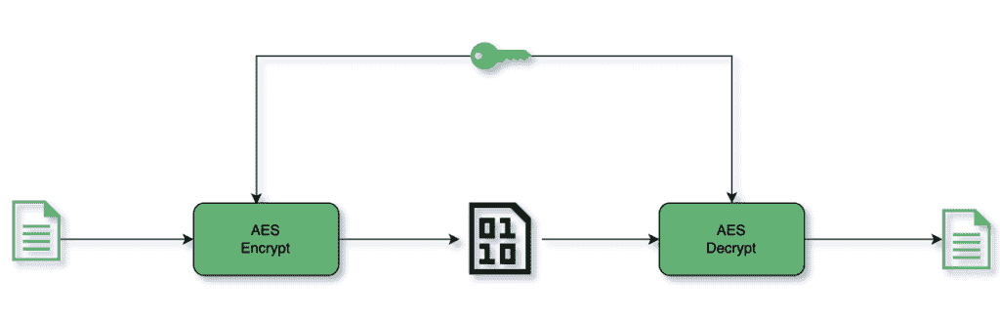

# 用 Java 生成安全的 AES 密钥

> 原文:[https://web . archive . org/web/20220930061024/https://www . bael dung . com/Java-secure-AES-key](https://web.archive.org/web/20220930061024/https://www.baeldung.com/java-secure-aes-key)

## 1.概观

在本文中，我们将深入探讨 AES 或一般密码中密钥的用途。我们将回顾生成最佳实践时要记住的最佳实践。

最后，我们将看看生成一个的各种方法，并根据指导原则对它们进行权衡。

## 2.俄歇电子能谱

[高级加密标准(AES)](https://web.archive.org/web/20221129191503/https://nvlpubs.nist.gov/nistpubs/FIPS/NIST.FIPS.197.pdf) 是数据加密标准(DES)的继承者，由美国国家标准与技术研究所(NIST)于 2001 年发布。它被归类为对称分组密码。

对称密码使用相同的密钥进行加密和解密。分组密码意味着它对输入明文的 128 位分组起作用:

[](/web/20221129191503/https://www.baeldung.com/wp-content/uploads/2022/01/AES-Key.png)

### 2.1.AES 变体

**根据密钥大小，AES 支持三种变体:AES-128 (128 位)、AES-192 (192 位)和 AES-256 (256 位)**。增加密钥大小会增加加密的强度，因为更大的密钥大小意味着可能的密钥数量更大。因此，在算法执行期间要进行的循环次数也增加了，因此计算需要:

| 密钥大小 | 块大小 | 回合数 |
| One hundred and twenty-eight | One hundred and twenty-eight | Ten |
| One hundred and ninety-two | One hundred and twenty-eight | Twelve |
| Two hundred and fifty-six | One hundred and twenty-eight | Fourteen |

### 2.2.AES 有多安全？

AES 算法是公开信息——AES 密钥是一个秘密，必须知道它才能成功解密。所以，归结起来就是破解 AES 密钥。假设密钥被安全地保存，攻击者将不得不尝试猜测密钥。

让我们看看强力方法在猜测密钥方面的表现。

**AES-128 密钥为 128 位，这意味着有** **个 2^128 可能值**。这将需要[巨大而不可行的时间和金钱](https://web.archive.org/web/20221129191503/https://www.reddit.com/r/theydidthemath/comments/1x50xl/time_and_energy_required_to_bruteforce_a_aes256/)来搜索这个。因此，AES 实际上是无法通过暴力破解的。

已经有一些非暴力方法，但是这些方法只能将可能的密钥查找空间减少几个比特。

这意味着**对密钥一无所知，AES 几乎不可能破解**。

## 3.好密钥的属性

现在让我们来看看生成 AES 密钥时要遵循的一些重要准则。

### 3.1.密钥大小

由于 AES 支持三种密钥大小，我们应该为用例选择正确的密钥大小。AES-128 是商业应用中最常见的选择。它提供了安全性和速度之间的平衡。[国家政府](https://web.archive.org/web/20221129191503/https://web.archive.org/web/20101106122007/http://csrc.nist.gov/groups/ST/toolkit/documents/aes/CNSS15FS.pdf)通常利用 AES-192 和 AES-256 来实现最高的安全性。如果我们想有一个额外的安全级别，我们可以使用 AES-256。

量子计算机确实对减少大型密钥空间所需的计算量构成了威胁。因此，拥有一个 AES-256 密钥将更加经得起未来的考验，尽管到目前为止，它们还不在商业应用程序的任何威胁因素的范围之内。

### 3.2.熵

熵指的是密钥中的随机性。例如，如果生成的密钥不够随机，并且与依赖于时间、依赖于机器或字典中的单词有某种关联，那么它就变得容易受到攻击。攻击者将能够缩小密钥搜索空间，从而削弱 AES 的实力。因此，**最重要的是密钥是真正随机的**。

## 4.生成 AES 密钥

现在，有了生成 AES 密钥的指南，让我们看看生成它们的各种方法。

对于所有代码片段，我们将密码定义为:

```
private static final String CIPHER = "AES"; 
```

### 4.1.`Random`

让我们使用 Java 中的`Random`类来生成密钥:

```
private static Key getRandomKey(String cipher, int keySize) {
    byte[] randomKeyBytes = new byte[keySize / 8];
    Random random = new Random();
    random.nextBytes(randomKeyBytes);
    return new SecretKeySpec(randomKeyBytes, cipher);
}
```

我们创建一个所需密钥大小的字节数组，并用从`random.nextBytes()`获得的随机字节填充它。随机字节数组随后用于创建一个`SecretKeySpec`。

Java `Random` 类是一个 **[伪随机数生成器](https://web.archive.org/web/20221129191503/https://en.wikipedia.org/wiki/Pseudorandom_number_generator)** (PRNG)，也称为**确定性随机数生成器** (DRNG)。这意味着它不是真正随机的。PRNG 中的随机数序列完全可以根据其种子来确定。 [Java 不建议对加密应用使用`Random`](https://web.archive.org/web/20221129191503/https://docs.oracle.com/en/java/javase/16/docs/api/java.base/java/util/Random.html) 。

也就是说，**永远不要使用`Random`来生成密钥**。

### 4.2.`SecureRandom`

我们现在将使用 Java 中的`SecureRandom`类来生成密钥:

```
private static Key getSecureRandomKey(String cipher, int keySize) {
    byte[] secureRandomKeyBytes = new byte[keySize / 8];
    SecureRandom secureRandom = new SecureRandom();
    secureRandom.nextBytes(secureRandomKeyBytes);
    return new SecretKeySpec(secureRandomKeyBytes, cipher);
}
```

与前面的例子类似，我们实例化一个所需密钥大小的字节数组。现在，我们不使用`Random,` 而是使用`SecureRandom `来为我们的字节数组生成随机字节。 [`SecureRandom`由 Java](https://web.archive.org/web/20221129191503/https://docs.oracle.com/en/java/javase/16/docs/api/java.base/java/security/SecureRandom.html) 推荐，用于为加密应用生成随机数。最低限度符合 [*FIPS 140-2，加密模块*](https://web.archive.org/web/20221129191503/http://nvlpubs.nist.gov/nistpubs/FIPS/NIST.FIPS.140-2.pdf) 的安全要求。

显然，在 Java 中， **`SecureRandom` 是获得随机性**的事实上的标准。但是这是生成密钥的最好方法吗？让我们继续下一个方法。

### 4.3.`KeyGenerator`

接下来，让我们使用`KeyGenerator` 类生成一个密钥:

```
private static Key getKeyFromKeyGenerator(String cipher, int keySize) throws NoSuchAlgorithmException {
    KeyGenerator keyGenerator = KeyGenerator.getInstance(cipher);
    keyGenerator.init(keySize);
    return keyGenerator.generateKey();
}
```

我们得到了正在使用的密码的一个实例`KeyGenerator`。然后我们用期望的`keySize.`初始化`keyGenerator`对象。最后，我们调用`generateKey`方法来生成我们的密钥。那么，它与`Random` 和`SecureRandom` 方法有什么不同呢？

有两个重要的区别值得强调。

首先，`Random`和`SecureRandom`方法都无法判断我们是否按照密码规范生成了正确大小的密钥。只有当我们进行加密时，如果密钥的大小不受支持，我们才会遇到异常。

当我们初始化加密的密码时，将`SecureRandom`与无效的`keySize` 一起使用会引发异常:

```
encrypt(plainText, getSecureRandomKey(CIPHER, 111)); 
```

```
java.security.InvalidKeyException: Invalid AES key length: 13 bytes
  at java.base/com.sun.crypto.provider.AESCrypt.init(AESCrypt.java:90)
  at java.base/com.sun.crypto.provider.GaloisCounterMode.init(GaloisCounterMode.java:321)
  at java.base/com.sun.crypto.provider.CipherCore.init(CipherCore.java:592)
  at java.base/com.sun.crypto.provider.CipherCore.init(CipherCore.java:470)
  at java.base/com.sun.crypto.provider.AESCipher.engineInit(AESCipher.java:322)
  at java.base/javax.crypto.Cipher.implInit(Cipher.java:867)
  at java.base/javax.crypto.Cipher.chooseProvider(Cipher.java:929)
  at java.base/javax.crypto.Cipher.init(Cipher.java:1299)
  at java.base/javax.crypto.Cipher.init(Cipher.java:1236)
  at com.baeldung.secretkey.Main.encrypt(Main.java:59)
  at com.baeldung.secretkey.Main.main(Main.java:51)
```

另一方面，使用`KeyGenerator`会在密钥生成过程中失败，这允许我们更恰当地处理它:

```
encrypt(plainText, getKeyFromKeyGenerator(CIPHER, 111));
```

```
java.security.InvalidParameterException: Wrong keysize: must be equal to 128, 192 or 256
  at java.base/com.sun.crypto.provider.AESKeyGenerator.engineInit(AESKeyGenerator.java:93)
  at java.base/javax.crypto.KeyGenerator.init(KeyGenerator.java:539)
  at java.base/javax.crypto.KeyGenerator.init(KeyGenerator.java:516)
  at com.baeldung.secretkey.Main.getKeyFromKeyGenerator(Main.java:89)
  at com.baeldung.secretkey.Main.main(Main.java:58)
```

另一个关键区别是默认使用`SecureRandom`。`KeyGenerator` 类是 Java 的加密包`javax.crypto`的一部分，它确保了`SecureRandom`的随机性。我们可以在`KeyGenerator`类中看到`init` 方法的定义:

```
public final void init(int keysize) {
    init(keysize, JCAUtil.getSecureRandom());
}
```

因此，使用`KeyGenerator `作为一种实践确保了我们永远不会使用`Random` 类对象来生成密钥。

### 4.4.基于密码的密钥

到目前为止，我们一直在从随机的、不太友好的字节数组中生成密钥。基于密码的密钥(PBK)使我们能够根据人类可读的密码生成`SecretKey `:

```
private static Key getPasswordBasedKey(String cipher, int keySize, char[] password) throws NoSuchAlgorithmException, InvalidKeySpecException {
    byte[] salt = new byte[100];
    SecureRandom random = new SecureRandom();
    random.nextBytes(salt);
    PBEKeySpec pbeKeySpec = new PBEKeySpec(password, salt, 1000, keySize);
    SecretKey pbeKey = SecretKeyFactory.getInstance("PBKDF2WithHmacSHA256").generateSecret(pbeKeySpec);
    return new SecretKeySpec(pbeKey.getEncoded(), cipher);
}
```

我们这里发生了很多事情。我们来分解一下。

我们从人类可读的密码开始。这是一个秘密，必须加以保护。必须遵循密码准则，例如最小长度为 8 个字符、使用特殊字符、大小写字母组合、数字等。此外， [OWASP 指南](https://web.archive.org/web/20221129191503/https://cheatsheetseries.owasp.org/cheatsheets/Authentication_Cheat_Sheet.html#implement-proper-password-strength-controls)建议检查已经暴露的密码。

一个用户友好的密码没有足够的熵。因此，**我们添加了额外的随机生成的字节，称为`salt`，使其更难猜测。** [最小盐长应为 128 位](https://web.archive.org/web/20221129191503/https://nvlpubs.nist.gov/nistpubs/Legacy/SP/nistspecialpublication800-132.pdf)。我们使用`SecureRandom` 来生成我们的盐。salt 不是秘密，是以明文形式存储的。我们应该成对地为每个密码生成 salt，而不是在全局范围内使用相同的 salt。这将防止[彩虹表](https://web.archive.org/web/20221129191503/https://en.wikipedia.org/wiki/Rainbow_table)攻击，这种攻击使用从预先计算的哈希表中查找来破解密码。

迭代计数是密码生成算法应用转换函数的次数。它应该尽可能大。[最小推荐迭代次数为 1000 次](https://web.archive.org/web/20221129191503/https://nvlpubs.nist.gov/nistpubs/Legacy/SP/nistspecialpublication800-132.pdf)。在对所有可能的密码执行强力检查时，较高的迭代次数增加了攻击者的复杂性。

密钥大小与我们之前讨论的相同，对于 AES，可以是 128、192 或 256。

我们已经将上面讨论的所有四个元素包装到一个`PBEKeySpec `对象中。接下来，使用`SecretKeyFactory`，我们得到一个`PBKDF2WithHmacSHA256`算法的实例来生成密钥。

最后，用`PBEKeySpec`调用`generateSecret`，我们基于人类可读的密码生成一个`SecretKey`。

## 5.结论

生成密钥有两个主要基础。它可以是随机密钥，也可以是基于人类可读密码的密钥。我们已经讨论了三种生成随机密钥的方法。其中，`KeyGenerator`提供了真随机性，也提供了制衡。因此，**T1 是更好的选择**。

对于基于人类可读密码的密钥，我们可以使用`SecretKeyFactory`以及使用`SecureRandom`和高迭代计数生成的 salt。

和往常一样，完整的代码可以在 GitHub 上找到[。](https://web.archive.org/web/20221129191503/https://github.com/eugenp/tutorials/tree/master/core-java-modules/core-java-security-3)