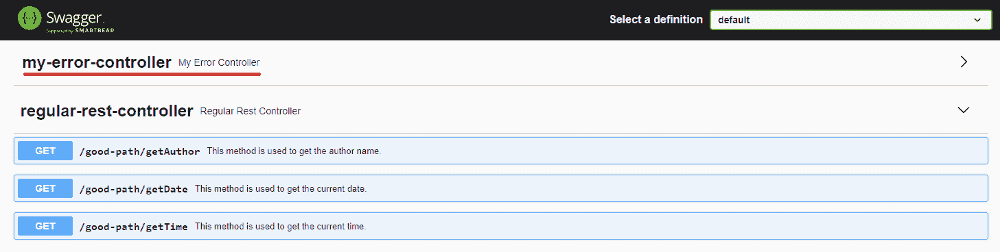

# 移除 SpringFox Swagger-UI 中的基本错误控制器

> 原文：<https://web.archive.org/web/20220930061024/https://www.baeldung.com/spring-swagger-remove-error-controller>

## 1.概观

在本教程中，我们将学习在 [Spring Boot](/web/20220707143857/https://www.baeldung.com/spring-boot) 应用程序中配置[斯瓦格](/web/20220707143857/https://www.baeldung.com/swagger-2-documentation-for-spring-rest-api)的多种方法，以隐藏`BasicErrorController`暴露的路径。

## **2。目标项目**

在本文中，我们不会讨论从 Spring Boot 和 Swagger-UI 开始创建基本配置。我们既可以使用一个已经配置好的项目，也可以按照 Spring REST API 指南中的[设置 Swagger 2 来创建基本配置。](/web/20220707143857/https://www.baeldung.com/swagger-2-documentation-for-spring-rest-api)

## 3.问题是

**如果我们的代码包含一个`BasicErrorController,` Swagger，默认情况下，将在生成的文档中包含它的所有端点。**我们需要提供一个自定义配置来删除不需要的控制器。

例如，假设我们想要提供一个标准`RestController`的 API 文档:

```
@RestController
@RequestMapping("good-path")
public class RegularRestController {

   @ApiOperation(value = "This method is used to get the author name.")
   @GetMapping("/getAuthor")
   public String getAuthor() {
       return "Name Surname";
   }

   // Other similar methods
}
```

同样，让我们假设我们的代码包含一个扩展了`BasicErrorController`的类:

```
@Component
@RequestMapping("my-error-controller")
public class MyErrorController extends BasicErrorController {
    // basic constructor
}
```

我们可以看到`my-error-controller` 包含在生成的文档中:

[](/web/20220707143857/https://www.baeldung.com/wp-content/uploads/2022/02/swagger.png)

## 4.解决方案

在这一节中，我们将研究从 Swagger 文档中排除资源的四种不同的解决方案。

### 4.1.用`basePackage()`排除

通过指定我们想要记录的控制器的基础包，我们可以排除我们不需要的资源。

只有当误差控制器包不同于标准控制器包时，这种方法才有效。有了 Spring Boot，如果我们提供一个 [`Docket`](https://web.archive.org/web/20220707143857/https://springfox.github.io/springfox/javadoc/2.7.0/index.html?springfox/documentation/spring/web/plugins/Docket.html) 就够了比恩:

```
@Configuration
public class SwaggerConfiguration {

   @Bean
   public Docket api() {
      return new Docket(DocumentationType.SWAGGER_2).apiInfo(apiInfo())
        .select()
        .apis(RequestHandlerSelectors.basePackage("com.baeldung.swaggerconf.controller"))
        .build();
   }
} 
```

有了这个定制配置，Swagger 将只在指定的包中检查 [REST](/web/20220707143857/https://www.baeldung.com/rest-with-spring-series) 控制器方法。所以比如我们的`BasicErrorController `在包`com.baeldung.swaggerconf.error`里定义了，就不考虑了。

### 4.2.带注释排除

另外，我们也可以指出 Swagger 只需要生成用特定 Java 注释修饰的类的文档。

在本例中，我们将它设置为`RestController.class:`

```
@Bean
public Docket api() {
   return new Docket(DocumentationType.SWAGGER_2).apiInfo(apiInfo())
     .select()
     .apis(RequestHandlerSelectors.withClassAnnotation(RestController.class))
     .build();
}
```

在这种情况下，`BasicErrorController` 将被排除在 Swagger 文档之外，因为它没有用`@RestController` 注释来修饰。这个注释出现在我们想要记录的`RegularRestController`上。

### 4.3.用路径上的正则表达式排除

另一种方法是**在自定义路径上指定一个正则表达式。**在这种情况下，只记录映射到“/ `good-path” `前缀的资源:

```
@Bean
public Docket api() {
   return new Docket(DocumentationType.SWAGGER_2).apiInfo(apiInfo())
     .select()
     .paths(regex("/good-path/.*"))
     .build();
} 
```

### 4.4.用`@ApiIgnore`排除

**最后，我们可以使用注释 `[@ApiIgnore](https://web.archive.org/web/20220707143857/https://springfox.github.io/springfox/javadoc/2.9.2/index.html?springfox/documentation/annotations/ApiIgnore.html):`** 从 Swagger 中排除一个特定的类

```
@Component
@RequestMapping("my-error-controller")
@ApiIgnore 
public class MyErrorController extends BasicErrorController {
   // basic constructor
}
```

## 5.结论

在本文中，我们介绍了在 Spring Boot 应用程序中配置 Swagger 来隐藏`BasicErrorController`资源的四种不同方法。

和往常一样，完整的代码可以在 GitHub 上找到[。](https://web.archive.org/web/20220707143857/https://github.com/eugenp/tutorials/tree/master/spring-boot-modules/spring-boot-swagger)