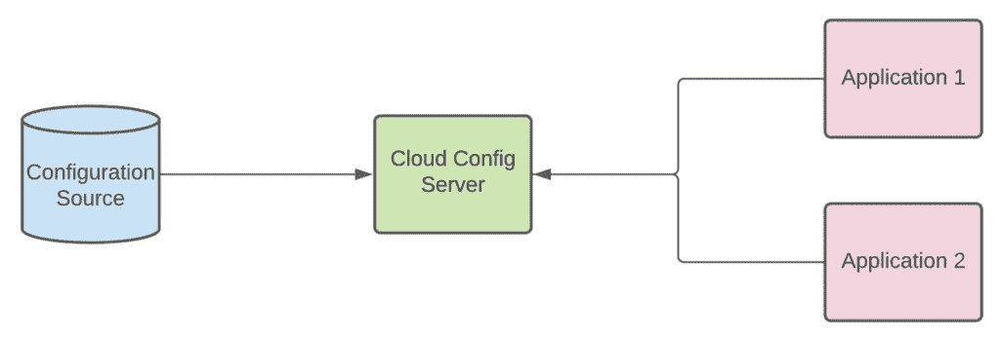

# 使用不带 Git 的 Spring Cloud 配置

> 原文：<https://web.archive.org/web/20220930061024/https://www.baeldung.com/spring-cloud-config-without-git>

## 1.介绍

[Spring Cloud Config](/web/20220727020730/https://www.baeldung.com/spring-cloud-configuration) 是一个库，它使 Spring 应用程序的配置外部化变得容易。它允许我们将配置数据作为服务公开，使得从任何其他具有 HTTP 客户端的应用程序获取配置数据变得容易。

在本教程中，我们将了解如何在没有 git 的情况下使用 Spring Cloud Config。

## 2.Spring Cloud 配置概述

**Spring Cloud 配置库是典型的客户端-服务器模型**。一个(或多个)集中式服务器从一些外部数据源读入配置数据。这些服务器公开了各种 HTTP 端点，允许任何其他应用程序查询配置数据。

[](/web/20220727020730/https://www.baeldung.com/wp-content/uploads/2022/02/spring-cloud-config-overview.jpg)

Spring Cloud 配置概述

Spring Cloud Config 还使得从 Spring Boot 应用程序自动连接到配置服务器变得非常容易。**服务器提供的配置数据可以像客户端应用程序**中的任何其他属性源一样使用。

## 3.Git 提供者

**Spring Cloud Config 最常见的用例是将配置数据存储在 git 存储库中**。这种类型的设置有几个优点:

*   灵活性:git 存储库可以保存各种文件类型，包括二进制文件。
*   安全性:易于在粒度级别控制读写访问。
*   审计:强大的历史跟踪功能可以轻松审计配置更改。
*   标准化:Git 操作是标准的，与提供商无关，这意味着我们可以自托管或使用任何数量的第三方提供商。
*   分布式:Git 从一开始就被设计成分布式的，所以它非常适合云原生和微服务架构。

尽管上面列出了所有的好处，然而， **git 可能并不总是存储配置数据**的最佳选择。例如，我们的组织可能已经将配置数据放在另一个数据存储中，如关系数据库。在这种情况下，将它迁移到 git 可能不值得。

在下一节中，我们将仔细研究在没有 git 的情况下使用 Spring Cloud Config。

## 4.使用不带 Git 的 Spring Cloud 配置

当我们谈到在 Spring Cloud Config 中使用 git 之外的东西时，我们实际上指的是服务器组件。我们对数据存储的选择不会影响客户端组件。只有服务器受到影响。

在 Spring Cloud 配置服务器库中，有一个名为`EnvironmentRepository`的接口定义了配置源。所有的配置源，不管是 git 还是其他，都必须实现这个接口。

让我们看看一些提供的实现。

### 3.1.文件系统

Spring Cloud Config 支持使用文件系统作为配置源。要启用此功能，我们必须在配置服务器的`application.properties`文件中指定以下值:

```
spring.cloud.config.server.native.search-locations=resources/other.properties
```

默认情况下，搜索位置采用类路径资源。如果我们想使用任意文件，我们只需包括一个文件资源前缀:

```
spring.cloud.config.server.native.search-locations=file:///external/path/other.properties
```

除了这个属性之外，配置服务器需要在启用本地配置文件的情况下运行:

```
-Dspring.profiles.active=native
```

重要的是要记住，当使用文件系统配置源时，**我们需要确保文件系统在配置服务器运行的任何地方都是可用的**。这可能意味着使用分布式文件系统，如 NFS。

### 3.2.JDBC

Spring Cloud Config 还可以使用关系数据库来加载配置数据，使用 [JDBC](/web/20220727020730/https://www.baeldung.com/java-jdbc) 。这是通过`JdbcEnvironmentRepository`类完成的。要启用这个类，我们必须遵循几个步骤。

首先， [`spring-jdbc`](https://web.archive.org/web/20220727020730/https://search.maven.org/artifact/org.springframework/spring-jdbc) 库必须存在于类路径中。如果我们已经在使用 [Spring Data JDBC](https://web.archive.org/web/20220727020730/https://search.maven.org/artifact/org.springframework.data/spring-data-jdbc) 或另一个依赖库，它就已经存在了。否则，我们总是可以手动指定它:

```
<dependency>
    <groupId>org.springframework</groupId>
    <artifactId>spring-jdbc</artifactId>
</dependency>
```

其次，我们需要指定如何连接到数据库:

```
spring.datasource.url=jdbc:mysql://dbhost:3306/springconfig
spring.datasource.username=dbuser
spring.datasource.password=dbpassword
spring.datasource.driver-class-name=com.mysql.jdbc.Driver
```

在这种情况下，我们使用 MySQL，**但是任何 JDBC 兼容的驱动程序都可以工作。**

接下来，数据库必须包含一个名为`PROPERTIES`的表，该表包含以下列:

*   应用
*   轮廓
*   标签
*   键
*   价值

最后，我们需要为配置服务器指定 JDBC 配置文件:

```
-Dspring.profiles.active=jdbc
```

### 3.3.雷迪斯

Spring Cloud Config 还支持将 [Redis](/web/20220727020730/https://www.baeldung.com/java-redis-mongodb) 作为配置源。这是使用`RedisEnvironmentRepository`类完成的。与 JDBC 源类似，我们需要遵循一些步骤来启用它。

首先，我们需要向 [Spring 数据 Redis](https://web.archive.org/web/20220727020730/https://search.maven.org/artifact/org.springframework.data/spring-data-redis) 添加一个依赖项:

```
<dependency>
    <groupId>org.springframework.data</groupId>
    <artifactId>spring-data-redis</artifactId>
</dependency>
```

其次，我们需要为如何连接 Redis 设置一些属性:

```
spring.redis.host=localhost
spring.redis.port=6379
```

接下来，我们必须确保我们的属性正确存储在 Redis 中。我们可以使用`HMSET`命令来存储一些样本属性:

```
HMSET application sample.property.name1 "somevalue" sample.property.name2 "anothervalue"
```

如果我们回显这些属性，我们应该会看到以下数据:

```
HGETALL application
{
    "sample.property.name1": "somevalue",
    "sample.property.name2": "anothervalue"
}
```

最后，我们必须为 Spring Cloud 配置服务器启用 Redis 配置文件:

```
-Dspring.profiles.active=redis
```

使用 Redis 作为配置源也支持不同的概要文件。为此，我们只需将配置文件名添加到应用程序的末尾:

```
HMSET application-dev sample.property.name1 "somevalue" sample.property.name2 "anothervalue"
```

在这个例子中，我们在名为`dev`的概要文件下创建一组新的属性。

### 3.4.秘密

许多云提供商的一个流行特征是`secrets`。[机密](/web/20220727020730/https://www.baeldung.com/spring-cloud-kubernetes#secrets_springcloudk8)允许我们安全地存储敏感数据，作为我们云基础设施的一部分。对于用户名、主机名和密码等我们希望包含在应用程序配置中的内容来说，这是非常完美的。

Spring Cloud Config 为许多不同的云秘密提供者提供支持。下面，我们将看看 AWS，它使用`AwsSecretsManagerEnvironmentRepository`类将 AWS 秘密加载到属性源中。

这个类依赖于`AWSSecretsManager`类来完成与 AWS 通信的重任。虽然我们可以自己手动创建它，但更直接的解决方案是使用一个[弹簧启动器](https://web.archive.org/web/20220727020730/https://search.maven.org/artifact/org.springframework.cloud/spring-cloud-starter-aws-secrets-manager-config):

```
<dependency>
    <groupId>org.springframework.cloud</groupId>
    <artifactId>spring-cloud-starter-aws-secrets-manager-config</artifactId>
    <version>2.2.6.RELEASE</version>
</dependency>
```

这个模块包括一个自动配置，它将为我们创建一个`AWSSecretsManager `的实例。我们所要做的就是在我们的`bootstrap.yml`文件中指定一组属性:

```
aws:
  secretsmanager:
    default-context: application
    prefix: /config
    profile-separator: _
    fail-fast: true
    name: ConfigServerApplication
    enabled: true
```

现在，让我们假设我们想要将我们的数据库凭证存储在一个秘密中，并使它们对配置服务器可用。我们将简单地在路径`/config/application/database_credentials`创建一个新的秘密。在内部，我们将存储连接到数据库所需的键/值对。

这个构造也支持不同的概要文件。例如，如果我们有一个开发数据库服务器，我们也可以为它创建一个单独的秘密。我们将它命名为`/config/application/database_credentials_dev.`

### 3.5.S3

存储配置的另一种便捷方式是使用云文件服务。让我们看看如何使用 AWS S3 作为配置源。

首先，我们需要将 [AWS SDK](https://web.archive.org/web/20220727020730/https://search.maven.org/artifact/com.amazonaws/aws-java-sdk-s3outposts) 添加到我们的项目中:

```
<dependency>
    <groupId>com.amazonaws</groupId>
    <artifactId>aws-java-sdk-s3outposts</artifactId>
    <version>1.12.150</version>
</dependency>
```

然后，我们需要提供一些值来配置到包含我们的属性文件的 S3 存储桶的连接:

```
amazon.s3.access-key=key
amazon.s3.secret-key=secret
```

而且，我们需要为 AWS S3 配置提供程序提供特定的属性:

```
spring:
  cloud:
    config:
      server:
        awss3:
          region: us-east-1
          bucket: config-bucket
```

我们还需要设置一个概要文件，以确保加载了 AWS S3 配置源:

```
-Dspring.profiles.active=awss3
```

剩下的工作就是在 bucket 中创建我们想要的属性文件，包括任何特定于概要文件的文件。请注意，当应用程序没有配置文件时，配置服务器会假定`default`。因此，**我们应该包括一个带有这个后缀的文件，以及任何其他包含特定概要文件名**的文件。

### 3.6.自定义配置源

如果任何提供的配置源不能满足我们的需求，我们总是可以选择实现我们自己的配置源。一般来说，这涉及到创建一个新的类来实现 [`EnvironmentRepository`](https://web.archive.org/web/20220727020730/https://www.javadoc.io/doc/org.springframework.cloud/spring-cloud-config-server/latest/org/springframework/cloud/config/server/environment/EnvironmentRepository.html) 和 [`Ordered`](https://web.archive.org/web/20220727020730/https://docs.spring.io/spring-framework/docs/current/javadoc-api/org/springframework/core/Ordered.html) :

```
public class CustomConfigurationRepository implements EnvironmentRepository, Ordered {
    @Override
    public Environment findOne(String application, String profile, String label) {
        // Return a new Environment that is populated from
        // our desired source (DB, NoSQL store, etc)
    }

    @Override
    public int getOrder() {
        // Define our order relative to other configuration repositories
        return 0;
    }
}
```

然后，我们简单地将这个类实例化为一个新的 Spring bean:

```
@Bean
public CustomConfigurationRepository customConfigurationRepository() {
    return new CustomConfigurationRepository();
}
```

## 4.多个配置源

在某些情况下，可能有必要使用多个配置源运行 Spring Cloud Config。在这种情况下，我们必须指定一些数据。

假设我们希望同时运行 JDBC 和 Redis 作为配置源。我们需要做的第一件事是在我们的`bootstrap.yml`文件中定义每个源的顺序:

```
spring:
  cloud:
    config:
      server:
        redis:
          order: 2
        jdbc:
          order: 1
```

这允许我们指定配置源应该在其他配置源之前使用的优先级。因为排序遵循正常的 Spring `Ordered`注释处理，**编号较低的源将首先被检查**。

此外，我们需要为服务器定义两个配置文件:

```
-Dspring.profiles.active=jdbc,redis
```

注意，我们也可以在 YAML 中指定活动的概要文件。**并且，同样的模式可以用来定义任意数量的配置源**。

## 5.结论

在本文中，我们已经介绍了可用于 Spring Cloud Config 的各种配置源。虽然 git 对于许多项目来说是一个很好的默认源代码，但它可能并不总是最好的选择。我们已经看到 Spring Cloud Config 提供了多种选择，以及创建定制提供者的能力。