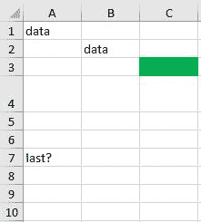

# 从 Java 中查找 Excel 电子表格的最后一行

> 原文：<https://web.archive.org/web/20220930061024/https://www.baeldung.com/java-excel-find-last-row>

## **1。概述**

在本教程中，我们将讨论如何使用 Java 和 Apache POI 找到 Excel 电子表格中的最后一行。

首先，我们将看到如何使用 Apache POI 从文件中获取一行。然后，我们将看看计算工作表中所有行的方法。最后，我们将组合它们来获取给定工作表的最后一行。

## **2。获取单行**

我们已经知道，****Apache POI****在 Java 中提供了一个抽象层来表示微软文档**、[包括 Excel](/web/20221208143832/https://www.baeldung.com/java-microsoft-excel) 。我们可以访问文件中的工作表，甚至可以读取和修改每个单元格。**

 **让我们从从Excel 文件中获取一行开始。在我们继续之前，我们需要从文件中获取 *工作表*

```
Workbook workbook = new XSSFWorkbook(fileLocation);
Sheet sheet = workbook.getSheetAt(0);
```

***工作簿*** **是 Excel 文件的 Java 表示，而** ***工作表*是** ***工作簿**内的主要结构。**工作表* 是 *工作表* 最常见的子类型，代表一个单元格网格。

当我们在 Java 中打开工作表时，我们可以访问它包含的数据，即行数据。要获取单个行，我们可以使用[*【getRow(int)*](https://web.archive.org/web/20221208143832/https://poi.apache.org/apidocs/dev/org/apache/poi/ss/usermodel/Sheet.html#getRow-int-)方法:

```
Row row = sheet.getRow(2);
```

该方法返回*****行*** **对象 Excel 文件**中单个行的高级表示，如果该行不存在，则返回 null。**

 **如我们所见，我们需要提供一个参数，即被请求行的索引(从 0 开始)。不幸的是，没有 API 可以直接获取最后一行。

## **3。查找行数**

我们刚刚学习了如何使用 Java 从 Excel 文件中获取单个行。现在，让我们找到给定`Sheet.` 上最后一行的索引

Apache POI 提供了两种帮助计算行数的方法:`getLastRowNum()`和`getPhysicalNumberOfRows()`。让我们来看看每一个。

### **3.1。使用`getLastRowNum()`**

根据文档， [`getLastRowNum()`](https://web.archive.org/web/20221208143832/https://poi.apache.org/apidocs/dev/org/apache/poi/ss/usermodel/Sheet.html#getLastRowNum--) 方法返回工作表上最后一个初始化的行的编号(从 0 开始)，如果不存在行，则返回-1:

```
int lastRowNum = sheet.getLastRowNum();
```

一旦我们获取了 *lastRowNum* ，我们现在应该可以使用`getRow()`方法轻松地访问最后一行。

我们应该注意，之前有内容但后来被设置为空的**行可能仍然被算作行**。所以，结果未必如预期。为了理解这一点，我们需要了解更多关于物理行的知识。

### **3.2。使用`getPhysicalNumberOfRows()`**

检查 Apache POI 文档，我们可以找到一个与行相关的特殊术语——物理行。

每当一行包含任何数据时，它总是被解释为物理的。**行不仅在该行中的任何单元格包含文本或公式时被初始化，而且在它们有一些关于格式化**的数据时也被初始化，例如，背景颜色、行高或使用的非默认字体。换句话说，**每个被初始化的行也是物理的**。

为了获得物理行数，Apache POI 提供了 [`getPhysicalNumberOfRows()`](https://web.archive.org/web/20221208143832/https://poi.apache.org/apidocs/dev/org/apache/poi/ss/usermodel/Sheet.html#getPhysicalNumberOfRows--) 方法:

`int physicalRows = sheet.getPhysicalNumberOfRows();`

根据`physical` 行的解释，结果可能与用`getLastRowNum()`方法获得的数字不同。

## **4。获取最后一行**

现在，让我们在一个更复杂的 Excel 网格中测试这两种方法:

[](/web/20221208143832/https://www.baeldung.com/wp-content/uploads/2022/03/baeldung-lastrow.jpg)

这里，前导行包含文本数据、由公式(`=A1`)计算的值以及相应更改的背景颜色。然后，第 4 行修改了高度，而第 5 和第 6 行保持不变。第 7 行再次包含文本。在第 8 行，文本先前已格式化，但后来被清除。第 9 行及后续行未被编辑。

让我们检查计数方法的结果:

```
assertEquals(7, sheet.getLastRowNum());
assertEquals(6, sheet.getPhysicalNumberOfRows());
```

正如我们之前提到的，**最后的行数和物理行数在某些情况下是不同的**。

现在，让我们根据索引获取行:

```
assertNotNull(sheet.getRow(0)); // data
assertNotNull(sheet.getRow(1)); // formula
assertNotNull(sheet.getRow(2)); // green
assertNotNull(sheet.getRow(3)); // height
assertNull(sheet.getRow(4));
assertNull(sheet.getRow(5));
assertNotNull(sheet.getRow(6)); // last?
assertNotNull(sheet.getRow(7)); // cleared later
assertNull(sheet.getRow(8));
...
```

我们可以看到， **`getPhysicalNumberOfRows() `返回工作表中非空(即初始化)`Rows`** 的总数。 **`getLastRowNum()`值是最后一个非空`Row`** 的索引。

因此，我们可以获取工作表中的最后一行:

```
Row lastRow = null;
int lastRowNum = sheet.getLastRowNum();
if (lastRowNum >= 0) {
    lastRow = sheet.getRow(lastRowNum);
}
```

然而，我们必须记住，Apache POI 返回的最后一行**并不总是显示文本或公式的那一行**，尤其是在一些 UI 编辑器中，如 Microsoft Excel。

## **5。结论**

在本文中，我们检查了 Apache POI API，并从给定的 Excel 文件中提取了最后一行。

我们首先回顾了用 Java 打开电子表格的一些基本方法。然后我们引入了`getRow(int)`方法来检索单个`Row`。之后，我们检查了`getLastRowNum()`和`getPhysicalNumberOfRows()` 的值，并解释了它们的差异。最后，我们对照 Excel 网格检查了所有方法，以获取最后一行。

和往常一样，GitHub 上有完整版本的代码[。](https://web.archive.org/web/20221208143832/https://github.com/eugenp/tutorials/tree/master/apache-poi-2)****