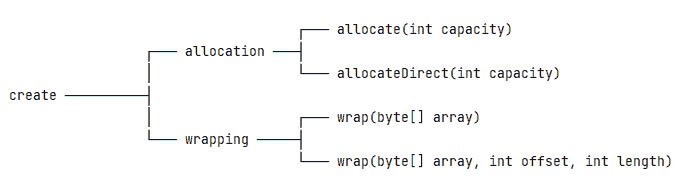
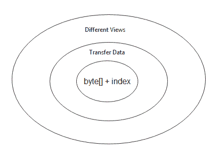
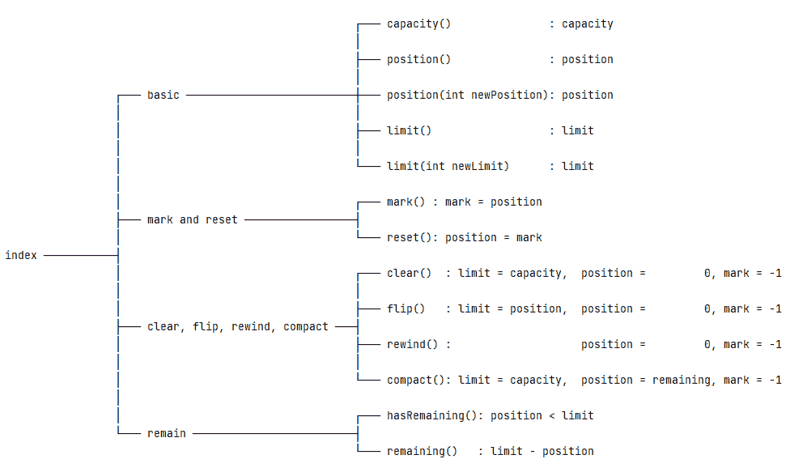
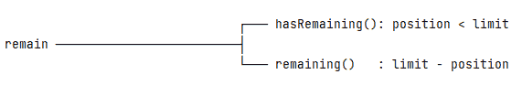
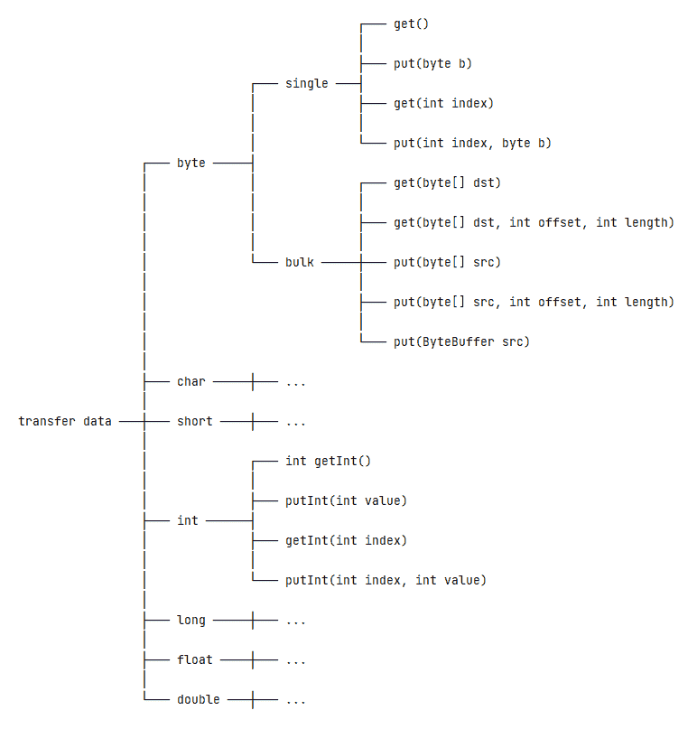
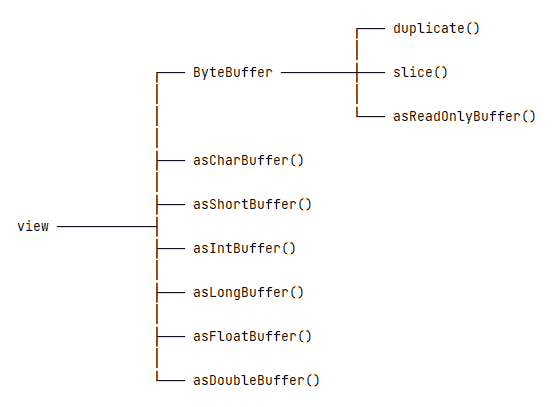
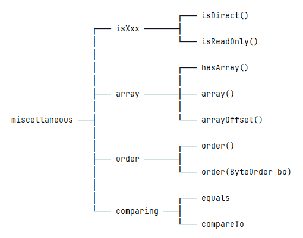

# ByteBuffer 指南

> 原文:[https://web . archive . org/web/20220930061024/https://www . bael dung . com/Java-byte buffer](https://web.archive.org/web/20220930061024/https://www.baeldung.com/java-bytebuffer)

## 1.概观

`Buffer`类是构建 Java NIO 的基础。然而，在这些类中，`ByteBuffer`类是最优选的。那是因为`byte`型是最通用的一种。例如，我们可以在 JVM 中使用字节组成其他非布尔原语类型。此外，我们可以使用字节在 JVM 和外部 I/O 设备之间传输数据。

在本教程中，我们将考察`ByteBuffer`类的不同方面。

## 2.`ByteBuffer`创作

`ByteBuffer`是一个抽象类，所以我们不能直接构造一个`new`实例。但是，它提供了静态工厂方法来简化实例创建。简而言之，有两种方法可以创建一个`ByteBuffer`实例，要么通过分配，要么通过包装:

[](/web/20220622160706/https://www.baeldung.com/wp-content/uploads/2022/03/ByteBuffer-Creation-1.png)

### 2.1.分配

分配将创建一个实例，并使用特定的`capacity`分配私有空间。准确的说，`ByteBuffer`类有两种分配方式:`allocate`和`allocateDirect`。

使用`allocate`方法，我们将得到一个非直接缓冲区——即一个带有底层`byte`数组的缓冲区实例:

```
ByteBuffer buffer = ByteBuffer.allocate(10);
```

当我们使用`allocateDirect`方法时，它会生成一个直接缓冲区:

```
ByteBuffer buffer = ByteBuffer.allocateDirect(10);
```

为了简单起见，让我们把重点放在非直接缓冲区上，而把直接缓冲区的讨论留到以后。

### 2.2.包装材料

包装允许实例重用现有的`byte`数组:

```
byte[] bytes = new byte[10];
ByteBuffer buffer = ByteBuffer.wrap(bytes);
```

上面的代码相当于:

```
ByteBuffer buffer = ByteBuffer.wrap(bytes, 0, bytes.length);
```

对现有`byte`数组中数据元素的任何更改都将反映在缓冲区实例中，反之亦然。

### 2.3.洋葱模型

现在，我们知道如何获得一个`ByteBuffer`实例。接下来，我们把`ByteBuffer`类当做一个三层洋葱模型，从里到外一层一层的理解:

*   数据和索引层
*   传输数据层
*   视图层

[](/web/20220622160706/https://www.baeldung.com/wp-content/uploads/2022/03/ByteBuffer-Onion.png)

在最内层，我们将`ByteBuffer`类视为一个包含额外索引的`byte`数组的容器。在中间层，我们关注于使用一个`ByteBuffer`实例从/向其他数据类型传输数据。我们在最外层用不同的基于缓冲区的视图检查相同的底层数据。

## 3.`ByteBuffer`索引

从概念上讲，`ByteBuffer`类是一个包装在对象内部的`byte`数组。它提供了许多方便的方法来促进对底层数据的读写操作。而且，这些方法高度依赖于维护的索引。

现在，让我们有意地将`ByteBuffer`类简化成一个带有额外索引的`byte`数组的容器:

```
ByteBuffer = byte array + index
```

记住这个概念，我们可以将与索引相关的方法分为四类:

*   基础
*   标记并重置
*   清除、翻转、倒带和压缩
*   保持

[](/web/20220622160706/https://www.baeldung.com/wp-content/uploads/2022/03/ByteBuffer-Indices-2.png)

### 3.1.四个基本指数

在`Buffer`类中定义了四个索引。这些索引记录了底层数据元素的状态:

*   容量:缓冲区可以容纳的数据元素的最大数量
*   Limit:停止读取或写入的索引
*   位置:要读取或写入的当前索引
*   马克:记忆中的位置

此外，这些指数之间存在不变的关系:

```
0 <= mark <= position <= limit <= capacity
```

并且，我们应该注意到**所有与指数相关的方法都围绕着这四个指数**。

当我们创建一个新的`ByteBuffer`实例时，`mark`未定义，`position`为 0，`limit`等于`capacity`。例如，让我们分配一个有 10 个数据元素的`ByteBuffer`:

```
ByteBuffer buffer = ByteBuffer.allocate(10);
```

或者，让我们用 10 个数据元素包装一个现有的字节数组:

```
byte[] bytes = new byte[10];
ByteBuffer buffer = ByteBuffer.wrap(bytes);
```

因此，`mark`将为-1，位置将为 0，`limit`和`capacity`都将为 10:

```
int position = buffer.position(); // 0
int limit = buffer.limit();       // 10
int capacity = buffer.capacity(); // 10
```

`capacity`是只读的，不能更改。但是，我们可以使用`position(int)`和`limit(int)`方法来改变相应的`position`和`limit`:

```
buffer.position(2);
buffer.limit(5);
```

那么，`position`将是 2，`limit`将是 5。

### 3.2.标记并重置

`mark()`和`reset()`方法允许我们记住一个特定的位置并在以后返回。

当我们第一次创建一个`ByteBuffer`实例时，`mark`是未定义的。然后，我们可以调用`mark()`方法，将`mark`设置为当前位置。在一些操作之后，调用`reset()`方法会将`position`变回`mark`。

```
ByteBuffer buffer = ByteBuffer.allocate(10); // mark = -1, position = 0
buffer.position(2);                          // mark = -1, position = 2
buffer.mark();                               // mark = 2,  position = 2
buffer.position(5);                          // mark = 2,  position = 5
buffer.reset();                              // mark = 2,  position = 2
```

有一点需要注意:如果`mark`未定义，调用`reset()`方法会导致`InvalidMarkException`。

### 3.3.清除、翻转、倒带和压缩

`clear()`、`flip()`、`rewind()`和`compact()`方法有一些共同的部分和细微的区别:

[](/web/20220622160706/https://www.baeldung.com/wp-content/uploads/2022/03/ByteBuffer-clear-clip-rewind-compact-1.png) 
为了比较这些方法，让我们准备一段代码片段:

```
ByteBuffer buffer = ByteBuffer.allocate(10); // mark = -1, position = 0, limit = 10
buffer.position(2);                          // mark = -1, position = 2, limit = 10
buffer.mark();                               // mark = 2,  position = 2, limit = 10
buffer.position(5);                          // mark = 2,  position = 5, limit = 10
buffer.limit(8);                             // mark = 2,  position = 5, limit = 8
```

`clear()`方法会将`limit`更改为`capacity`，将`position`更改为 0，将`mark`更改为-1:

```
buffer.clear();                              // mark = -1, position = 0, limit = 10
```

`flip()`方法会将`limit`更改为`position`，将`position`更改为 0，将`mark`更改为-1:

```
buffer.flip();                               // mark = -1, position = 0, limit = 5
```

`rewind()`方法保持`limit`不变，并将`position`更改为 0，将`mark`更改为-1:

```
buffer.rewind();                             // mark = -1, position = 0, limit = 8
```

`compact()`方法会将`limit`更改为`capacity`，将`position`更改为剩余值(`limit – position`，将`mark`更改为-1:

```
buffer.compact();                            // mark = -1, position = 3, limit = 10
```

以上四种方法都有各自的用例:

*   要重用一个缓冲区，`clear()`方法很方便。它会将索引设置为初始状态，并为新的写操作做好准备。
*   在调用了`flip()`方法之后，缓冲区实例从写模式切换到读模式。但是，我们应该避免两次调用`flip()`方法。这是因为第二次调用会将`limit`设置为 0，并且不能读取任何数据元素。
*   如果我们想多次读取底层数据，`rewind()`方法就派上了用场。
*   `compact()`方法适用于缓冲区的部分重用。例如，假设我们想读取一些底层数据，但不是全部，然后我们想将数据写入缓冲区。`compact()`方法会将未读数据复制到缓冲区的开头，并更改缓冲区索引，为写操作做好准备。

### 3.4.保持

`hasRemaining()`和`remaining()`方法计算`limit`和`position`的关系:

[](/web/20220622160706/https://www.baeldung.com/wp-content/uploads/2022/03/ByteBuffer-remain.png)

当`limit`大于`position`时，`hasRemaining()`将返回`true`。同样，`remaining()`方法返回`limit`和`position`之间的差值。

例如，如果一个缓冲区的位置为 2，限制为 8，那么其剩余部分将为 6:

```
ByteBuffer buffer = ByteBuffer.allocate(10); // mark = -1, position = 0, limit = 10
buffer.position(2);                          // mark = -1, position = 2, limit = 10
buffer.limit(8);                             // mark = -1, position = 2, limit = 8
boolean flag = buffer.hasRemaining();        // true
int remaining = buffer.remaining();          // 6
```

## 4.传输数据

洋葱模型的第二层与数据传输有关。具体来说，**`ByteBuffer`类提供了从/向其他数据类型** ( `byte`、`char`、`short`、`int`、`long`、`float`和`double`)传输数据的方法:

[](/web/20220622160706/https://www.baeldung.com/wp-content/uploads/2022/03/ByteBuffer-transfer-data.png)

### 4.1.传输`byte`数据

为了传输`byte`数据，`ByteBuffer`类提供了单次和批量操作。

我们可以在单次操作中从/向缓冲区的底层数据读取或写入单个字节。这些操作包括:

```
public abstract byte get();
public abstract ByteBuffer put(byte b);
public abstract byte get(int index);
public abstract ByteBuffer put(int index, byte b);
```

我们可能会从上面的方法中注意到`get()` / `put()`方法的两个版本:一个没有参数，另一个接受一个`index`。那么，有什么区别呢？

没有索引的操作是相对操作，它对当前位置的数据元素进行操作，然后将位置递增 1。但是，带有`index`的操作是一个完整的操作，它在`index`操作数据元素，不会改变`position`。

**相反，批量操作可以从缓冲区的底层数据中读取或向其写入多个字节。**这些操作包括:

```
public ByteBuffer get(byte[] dst);
public ByteBuffer get(byte[] dst, int offset, int length);
public ByteBuffer put(byte[] src);
public ByteBuffer put(byte[] src, int offset, int length);
```

以上方法都属于相对运算。也就是说，它们将分别从/向当前`position`读取或写入，并改变`position`值。

还有另一个`put()`方法，它接受一个`ByteBuffer`参数:

```
public ByteBuffer put(ByteBuffer src);
```

### 4.2.传输`int`数据

除了读写`byte`数据之外，`ByteBuffer`类还支持除了`boolean`类型之外的其他原始类型。我们以`int`型为例。相关方法包括:

```
public abstract int getInt();
public abstract ByteBuffer putInt(int value);
public abstract int getInt(int index);
public abstract ByteBuffer putInt(int index, int value);
```

同样，带有`index`参数的`getInt()`和`putInt()`方法是绝对操作，否则是相对操作。

## 5.不同的观点

洋葱模型的第三层是关于**以不同的视角**读取相同的底层数据。

[](/web/20220622160706/https://www.baeldung.com/wp-content/uploads/2022/03/ByteBuffer-view.png) 
上图中的每一个方法都会生成一个新的视图，与原来的缓冲区共享相同的底层数据。要理解一个新的观点，我们应该关心两个问题:

*   新视图将如何解析底层数据？
*   新视图将如何记录其索引？

### 5.1.`ByteBuffer`查看

将一个`ByteBuffer`实例读取为另一个`ByteBuffer`视图，它有三种方法:`duplicate()`、`slice()`和`asReadOnlyBuffer()`。

让我们来看看这些差异的图示:

```
ByteBuffer buffer = ByteBuffer.allocate(10); // mark = -1, position = 0, limit = 10, capacity = 10
buffer.position(2);                          // mark = -1, position = 2, limit = 10, capacity = 10
buffer.mark();                               // mark = 2,  position = 2, limit = 10, capacity = 10
buffer.position(5);                          // mark = 2,  position = 5, limit = 10, capacity = 10
buffer.limit(8);                             // mark = 2,  position = 5, limit = 8,  capacity = 10
```

`duplicate()`方法创建一个新的`ByteBuffer`实例，就像原来的实例一样。但是，两个缓冲器中的每一个都有其独立的`limit`、`position`和`mark`:

```
ByteBuffer view = buffer.duplicate();        // mark = 2,  position = 5, limit = 8,  capacity = 10
```

`slice()`方法创建底层数据的共享子视图。视图的`position`将为 0，其`limit`和`capacity`将为原始缓冲区的剩余部分:

```
ByteBuffer view = buffer.slice();            // mark = -1, position = 0, limit = 3,  capacity = 3
```

与`duplicate()`方法相比，`asReadOnlyBuffer()`方法的工作方式类似，但会产生一个只读缓冲区。这意味着我们不能使用这个只读视图来更改底层数据:

```
ByteBuffer view = buffer.asReadOnlyBuffer(); // mark = 2,  position = 5, limit = 8,  capacity = 10
```

### 5.2.其他视图

`ByteBuffer`还提供了其他视图:`asCharBuffer()`、`asShortBuffer()`、`asIntBuffer()`、`asLongBuffer()`、`asFloatBuffer()`和`asDoubleBuffer()`。这些方法类似于`slice()`方法，即它们提供了对应于底层数据当前`position`和`limit`的切片视图。它们之间的主要区别是将底层数据解释为其他基本类型值。

我们应该关心的问题是:

*   如何解读底层数据
*   从哪里开始解释
*   在新生成的视图中会出现多少元素

新视图将把多个字节组成目标原语类型，并从原始缓冲区的当前位置开始解释。新视图的容量等于原始缓冲区中剩余元素的数量除以组成视图原始类型的字节数。末尾的任何剩余字节在视图中不可见。

现在，让我们以`asIntBuffer()`为例:

```
byte[] bytes = new byte[]{
  (byte) 0xCA, (byte) 0xFE, (byte) 0xBA, (byte) 0xBE, // CAFEBABE ---> cafebabe
  (byte) 0xF0, (byte) 0x07, (byte) 0xBA, (byte) 0x11, // F007BA11 ---> football
  (byte) 0x0F, (byte) 0xF1, (byte) 0xCE               // 0FF1CE   ---> office
};
ByteBuffer buffer = ByteBuffer.wrap(bytes);
IntBuffer intBuffer = buffer.asIntBuffer();
int capacity = intBuffer.capacity();                         // 2
```

在上面的代码片段中，`buffer`有 11 个数据元素，`int`类型占用 4 个字节。因此，`intBuffer`将有 2 个数据元素(11 / 4 = 2)并省去额外的 3 个字节(11 % 4 = 3)。

## 6.直接缓冲器

什么是直接缓冲？直接缓冲区是指分配在内存区域上的缓冲区底层数据，操作系统功能可以直接访问这些数据。非直接缓冲区(non-direct buffer)是指底层数据是一个`byte`数组的缓冲区，该数组被分配在 Java 堆区域中。

那么，如何才能创建一个直接的缓冲区呢？通过调用具有所需容量的`allocateDirect()`方法创建一个直接`ByteBuffer`:

```
ByteBuffer buffer = ByteBuffer.allocateDirect(10);
```

**为什么我们需要直接缓冲器？**答案很简单:非直接缓冲区总是会导致不必要的复制操作。当向 I/O 设备发送非直接缓冲区的数据时，本机代码必须“锁定”底层的`byte`数组，将其复制到 Java 堆之外，然后调用 OS 函数来刷新数据。但是，本机代码可以直接访问底层数据，并通过使用直接缓冲区调用 OS 函数来刷新数据，而不会产生任何额外的开销。

鉴于上述情况，直接缓冲区是完美的吗？不。主要问题是分配和释放直接缓冲区的开销很大。那么，在现实中，直接缓冲区总是比非直接缓冲区运行得快吗？不一定。这是因为许多因素在起作用。此外，性能权衡会因 JVM、操作系统和代码设计的不同而有很大差异。

最后，有一个实用的软件格言可以遵循:**首先，让它工作，然后，让它快**。这意味着，让我们首先关注代码的正确性。如果代码运行速度不够快，那我们就做相应的优化。

## 7.多方面的

`ByteBuffer`类还提供了一些辅助方法:

[](/web/20220622160706/https://www.baeldung.com/wp-content/uploads/2022/03/ByteBuffer-miscellaneous.png)

### 7.1.与信息系统相关的方法

`isDirect()`方法可以告诉我们一个缓冲区是直接缓冲区还是非直接缓冲区。注意，包装缓冲区——那些用`wrap()`方法创建的缓冲区——总是非直接的。

所有的缓冲区都是可读的，但不是所有的都是可写的。`isReadOnly()`方法表明我们是否可以写入底层数据。

为了比较这两种方法，**`isDirect()`方法关心底层数据存在于 Java 堆还是内存区域**。然而，**`isReadOnly()`方法关心底层数据元素是否可以被改变**。

如果原始缓冲区是直接的或只读的，新生成的视图将继承这些属性。

### 7.2.数组相关方法

如果一个`ByteBuffer`实例是直接的或者只读的，我们就不能得到它的底层字节数组。但是，如果一个缓冲区是非直接的并且不是只读的，这并不一定意味着它的底层数据是可访问的。

准确地说，**`hasArray()`方法可以告诉我们一个缓冲区是否有一个可访问的后备数组**。如果`hasArray()`方法返回`true`，那么我们可以使用`array()`和`arrayOffset()`方法获得更多相关信息。

### 7.3.字节顺序

默认情况下，`ByteBuffer`类的字节顺序总是`ByteOrder.BIG_ENDIAN`。并且，我们可以使用`order()`和`order(ByteOrder)`方法分别获取和设置当前的字节顺序。

字节顺序影响如何解释底层数据。例如，假设我们有一个`buffer`实例:

```
byte[] bytes = new byte[]{(byte) 0xCA, (byte) 0xFE, (byte) 0xBA, (byte) 0xBE};
ByteBuffer buffer = ByteBuffer.wrap(bytes);
```

使用`ByteOrder.BIG_ENDIAN`，`val`将会是-889275714 (0xCAFEBABE):

```
buffer.order(ByteOrder.BIG_ENDIAN);
int val = buffer.getInt();
```

但是，使用`ByteOrder.LITTLE_ENDIAN`，`val`将会是-1095041334 (0xBEBAFECA):

```
buffer.order(ByteOrder.LITTLE_ENDIAN);
int val = buffer.getInt();
```

### 7.4.比较

`ByteBuffer`类提供了`equals()`和`compareTo()`方法来比较两个缓冲区实例。这两种方法都基于剩余的数据元素进行比较，这些数据元素在`[position, limit)`的范围内。

例如，具有不同基础数据和索引的两个缓冲区实例可以相等:

```
byte[] bytes1 = "World".getBytes(StandardCharsets.UTF_8);
byte[] bytes2 = "HelloWorld".getBytes(StandardCharsets.UTF_8);

ByteBuffer buffer1 = ByteBuffer.wrap(bytes1);
ByteBuffer buffer2 = ByteBuffer.wrap(bytes2);
buffer2.position(5);

boolean equal = buffer1.equals(buffer2); // true
int result = buffer1.compareTo(buffer2); // 0
```

## 8.结论

在本文中，我们试图将`ByteBuffer`类视为一个洋葱模型。起初，我们将其简化为一个带有额外索引的`byte`数组的容器。然后，我们讨论了如何使用`ByteBuffer`类从/向其他数据类型传输数据。

接下来，我们用不同的视图查看相同的底层数据。最后，我们讨论了直接缓冲区和一些不同的方法。

像往常一样，本教程的源代码可以在 GitHub 上找到[。](https://web.archive.org/web/20220622160706/https://github.com/eugenp/tutorials/tree/master/core-java-modules/core-java-nio-2)