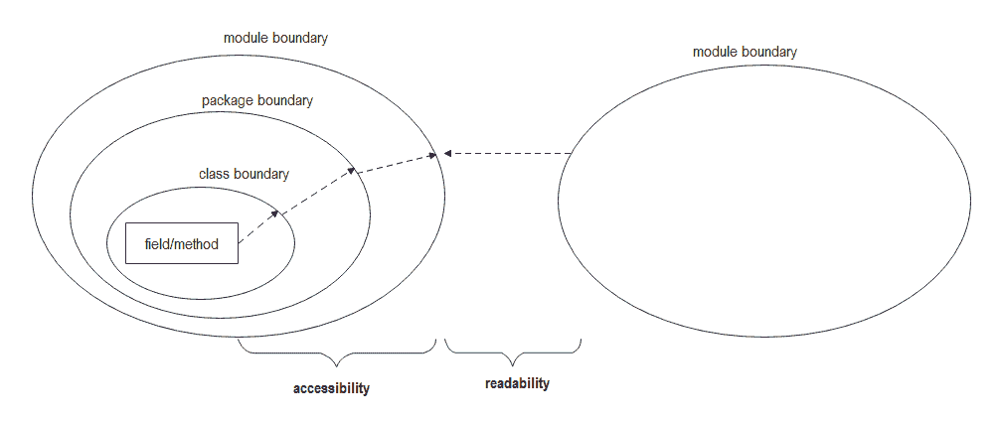
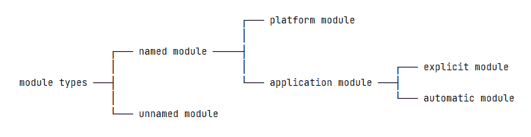
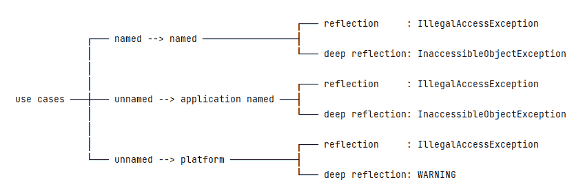

# Java 9 非法反射访问警告

> 原文：<https://web.archive.org/web/20220930061024/https://www.baeldung.com/java-illegal-reflective-access>

## 1.概观

在 Java 9 之前，Java 反射 API 有一个强大的功能:它可以无限制地访问非公共类成员。Java 9 之后，[模块化系统](/web/20220922235942/https://www.baeldung.com/java-9-modularity)想把反射 API 限制在一个合理的范围内。

在本教程中，我们将检查模块系统和反射之间的关系。

## 2.模块化系统和反射

即使反射和模块系统在 Java 历史的不同时期出现，它们也需要一起工作来构建一个可靠的平台。

### 2.1.基本模型

Java 模块系统的目标之一是强封装。**强封装主要由可读性和可访问性组成**:

*   模块的可读性是一个粗略的概念，涉及一个模块是否依赖于另一个模块。
*   模块的可访问性是一个更好的概念，它关心一个类是否可以访问另一个类的字段或方法。它由类边界、包边界和模块边界提供。

这两个规则之间的关系是可读性第一，可访问性建立在可读性之上。例如，如果一个类是`public`但没有导出，可读性将阻止进一步的使用。而且，如果一个非公共类在导出的包中，可读性将允许它通过，但是可访问性将拒绝它。

为了增加可读性，我们可以在模块声明中使用“`requires`”指令，在命令行中指定“`–add-reads`”选项，或者调用`Module.addReads`方法。同样，为了打破边界封装，我们可以在模块声明中使用“`opens`”指令，在命令行中指定“`–add-opens`”选项，或者调用`Module.addOpens`方法。

即使反射也不能打破可读性和可访问性规则；否则会导致相应的错误或警告。需要注意的一点:**使用反射时，运行时会自动在两个模块之间设置一个可读性边。**这也意味着，如果出了问题，那是因为可及性。

### 2.2.不同的反射用例

在 Java 模块系统中，有不同的模块类型，例如，命名模块、未命名模块、平台/系统模块、应用程序模块等等:

需要明确的是，“模块系统”和“系统模块”这两个概念听起来可能会混淆。所以，让我们使用“平台模块”的概念，而不是“系统模块”。

考虑到上述模块类型，不同模块类型之间存在相当多的组合。一般来说，除了自动模块，未命名的模块不能被命名的模块读取。让我们只检查非法反射访问发生的三个典型场景:

在上图中，深度反射意味着使用反射 API 通过调用`setAccessible(flag)`方法来访问一个类的非公共成员。当使用反射从一个命名模块访问另一个命名模块时，我们将得到一个`IllegalAccessException`或`InaccessibleObjectException`。类似地，当使用反射从未命名的模块访问命名为模块的应用程序时，我们会得到相同的错误。

然而，当使用反射从一个未命名的模块访问平台模块时，我们会得到一个`IllegalAccessException`或一个警告。警告信息有助于我们找到问题发生的位置，并采取进一步的补救措施:

[PRE0]

在上面的警告信息表中，`$PERPETRATOR`表示反映的类别信息，`$VICTIM`表示反映的类别信息。并且，这条消息被归功于[轻松强大的封装](https://web.archive.org/web/20220922235942/https://openjdk.java.net/jeps/261#Relaxed-strong-encapsulation)。

### 2.3.松弛强封装

在 Java 9 之前，许多第三方库利用反射 API 来完成他们神奇的工作。然而，模块系统的强大封装规则会使大部分代码无效，尤其是那些使用深度反射来访问 JDK 内部 API 的代码。这是不可取的。为了平稳地从 Java 8 移植到 Java 9 的模块化系统，我们做出了一个妥协:宽松的强封装。

松散的强封装提供了一个启动器选项`–illegal-access`来控制运行时行为。我们应该注意到，`–illegal-access`选项只有在我们使用反射从未命名模块访问平台模块时才有效。否则，该选项无效。

`–illegal-access`选项有四个具体值:

*   `permit`:打开每个未命名模块的平台模块包，只显示一次警告信息
*   `warn`:与`permit`相同，但显示每个非法反射访问操作的警告信息
*   `debug`:与`warn`相同，也打印相应的堆栈跟踪
*   `deny`:禁用所有非法反射访问操作

在 Java 9 中，`–illegal-access=permit`是默认模式。要使用其他模式，我们可以在命令行上指定该选项:

[PRE1]

在 Java 16 中，`–illegal-access=deny`成为默认模式。[从 Java 17 开始，`–illegal-access`选项被完全移除](https://web.archive.org/web/20220922235942/https://openjdk.java.net/jeps/403#Description)。

## 3.如何修复反射非法访问

在 Java 模块系统中，需要打开一个包来允许深度反射。

### 3.1.在模块声明中

如果我们是代码作者，我们可以在`module-info.java`中打开包:

[PRE2]

为了更加谨慎，我们可以使用限定的`opens`:

[PRE3]

当把我们现有的代码移植到模块化系统时，为了方便起见，我们可以打开整个模块:

[PRE4]

我们应该注意到**一个开放的模块不允许内部`opens`指令**。

### 3.2.在命令行上

如果我们不是代码作者，我们可以在命令行上使用`–add-opens`选项:

[PRE5]

并且，要添加对所有未命名模块的打开，我们可以使用`ALL-UNNAMED`:

[PRE6]

### 3.3.运行时

要在运行时添加 opens，我们可以使用`Module.addOpens`方法:

[PRE7]

在上面的代码片段中，`srcModule`打开`com.baeldung.reflected.internal`包给`targetModule`。

有一点需要注意:**`Module.addOpens`方法是调用者敏感的**。只有当我们从被修改的模块、从它被授予开放访问权限的模块或者从未命名的模块调用它时，这个方法才会成功。否则会导致一个`IllegalCallerException`。

向目标模块添加 opens 的另一种方法是使用 [Java 代理](/web/20220922235942/https://www.baeldung.com/java-instrumentation)。在`java.instrument`模块中，从 Java 9 开始，`Instrumentation`类增加了一个新的`redefineModule`方法。此方法可用于添加额外的读取、导出、打开、使用和提供:

[PRE8]

在上面的代码中，我们首先利用`target`模块来构造`extraReads`、`extraExports`和`extraOpens`变量。然后，我们调用`Instrumentation.redefineModule`方法。因此，`src`模块将可被`target`模块访问。

## 4.结论

在本教程中，我们首先介绍了模块系统的可读性和可访问性。然后，我们看了不同的非法反射访问用例，以及松散的强封装如何帮助我们从 Java 8 迁移到 Java 9 模块系统。最后，我们给出了解决非法反射访问的不同方法。

像往常一样，本教程的源代码可以在 GitHub 上找到[。](https://web.archive.org/web/20220922235942/https://github.com/eugenp/tutorials/tree/master/core-java-modules/core-java-9-jigsaw)