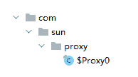
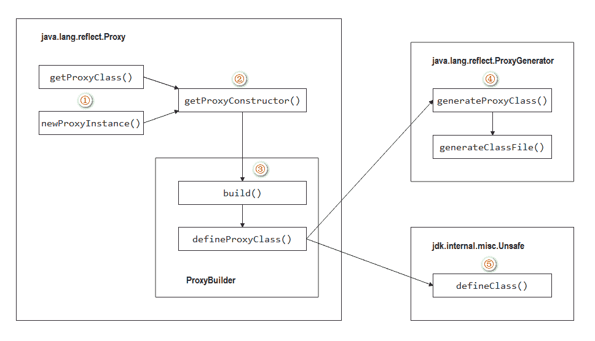
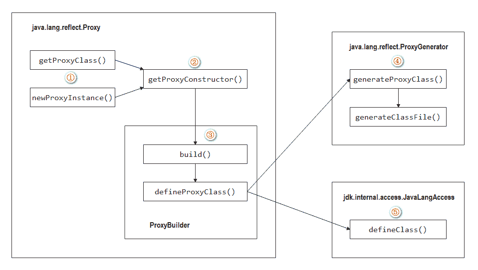

# 什么是 JDK com.sun.proxy.$Proxy 类？

> 原文：<https://web.archive.org/web/20220930061024/https://www.baeldung.com/jdk-com-sun-proxy>

## 1.概观

当我们使用[动态代理](/web/20220810235425/https://www.baeldung.com/java-dynamic-proxies)时，JDK 将动态生成一个`$Proxy`类。通常，这个`$Proxy`类的全限定类名有点类似于`com.sun.proxy.$Proxy0`。正如 Java 文档所说，“$Proxy”是代理类的保留名称前缀。

在本教程中，我们将探索这个`$Proxy`类。

## 2.`$Proxy`类

在入门之前，我们先来区分一下`java.lang.reflect.Proxy`类和`$Proxy`类。`java.lang.reflect.Proxy`是一个 JDK 内置类。相反，**`$Proxy`类是在运行时动态生成的**。从类层次的角度来看，`$Proxy`类继承了`java.lang.reflect.Proxy`类。

### 2.1.动态代理示例

为了有讨论的基础，我们先定义两个接口:`BasicOperation`和`AdvancedOperation`。`BasicOperation`接口包含了`add`和`subtract`方法:

```
public interface BasicOperation {
    int add(int a, int b);

    int subtract(int a, int b);
}
```

并且，`AdvancedOperation`接口有`multiply`和`divide`方法:

```
public interface AdvancedOperation {
    int multiply(int a, int b);

    int divide(int a, int b);
}
```

为了获得新生成的代理类——`$Proxy`类——我们可以调用`Proxy::getProxyClass`方法:

```
ClassLoader classLoader = ClassLoader.getSystemClassLoader();
Class<?>[] interfaces = {BasicOperation.class, AdvancedOperation.class};
Class<?> proxyClass = Proxy.getProxyClass(classLoader, interfaces);
```

然而，**上面的`proxyClass`只存在于一个正在运行的 JVM 中，我们无法直接查看它的类成员**。

### 2.2.转储`$Proxy`类

为了仔细检查这个`$Proxy`类，我们最好把它转储到磁盘上。使用 Java 8 时，我们可以在命令行上指定“`sun.misc.ProxyGenerator.saveGeneratedFiles`”选项:

```
-Dsun.misc.ProxyGenerator.saveGeneratedFiles=true
```

或者我们可以通过调用`System::setProperty`方法来设置这个选项:

```
System.setProperty("sun.misc.ProxyGenerator.saveGeneratedFiles", "true");
```

在 Java 9 及以后的版本中，我们应该改用“`jdk.proxy.ProxyGenerator.saveGeneratedFiles`”选项。为什么会有这样的差别？因为 Java 模块系统的原因，`ProxyGenerator`类的包发生了变化。在 Java 8 中，`ProxyGenerator`在“`sun.misc`包中；然而，[从 Java 9 开始，`ProxyGenerator`已经移入了“`java.lang.reflect`”包](https://web.archive.org/web/20220810235425/https://bugs.openjdk.java.net/browse/JDK-8145416)。

如果我们仍然不知道哪个选项合适，我们可以查找`ProxyGenerator`类的`saveGeneratedFiles`字段来确定正确的选项。

这里要小心:**`ProxyGenerator`类只读取这个属性一次**。并且，这意味着在 JVM 已经显式或隐式地产生了任何`$Proxy`类之后，`System::setProperty`方法将不起作用。具体来说，调用`Proxy::getProxyClass`或`Proxy::newProxyInstance`方法将显式生成`$Proxy`类。另一方面，当我们读取注释时，尤其是在单元测试框架中，JVM 将隐式或自动生成`$Proxy`类来表示注释实例。

**被转储的类文件的确切位置与其完全限定的类名**直接相关。例如，如果新生成的类名是“`com.sun.proxy.$Proxy0`”，那么转储的类文件在当前目录下将是“`com/sun/proxy/$Proxy0.class`”:

[](/web/20220810235425/https://www.baeldung.com/wp-content/uploads/2022/05/p1.png)

### 2.3.`$Proxy`班的成员

现在，该检查这个生成的`$Proxy`类的类成员了。

让我们首先检查一下类的层次结构。**`$Proxy0`类将`java.lang.reflect.Proxy`作为其超类，这隐含地解释了为什么动态代理只支持接口**。另外，`$Proxy0`类实现了我们之前定义的`BasicOperation`和`AdvancedOperation`接口:

```
public final class $Proxy0 extends Proxy implements BasicOperation, AdvancedOperation
```

为了可读性，我们将`$Proxy0`类的字段名称改成了更有意义的名称。`hashCodeMethod`、`equalsMethod`和`toStringMethod`字段追溯到`Object`类；`addMethod`和`subtractMethod`字段与`BasicOperation`接口相关；`multiplyMethod`和`divideMethod`字段映射到`AdvanceOperation`接口:

```
private static Method hashCodeMethod;
private static Method equalsMethod;
private static Method toStringMethod;
private static Method addMethod;
private static Method subtractMethod;
private static Method multiplyMethod;
private static Method divideMethod;
```

最后，`$Proxy0`类中定义的方法遵循相同的逻辑:**它们的所有实现都委托给了`InvocationHandler::invoke`方法**。并且，`$Proxy0`类将从它的构造函数中获得一个`InvocationHandler`实例:

```
public $Proxy0(InvocationHandler handler) {
    super(handler);
}

public final int hashCode() {
    try {
        return (Integer) super.h.invoke(this, hashCodeMethod, (Object[]) null);
    }
    catch (RuntimeException | Error ex1) {
        throw ex1;
    }
    catch (Throwable ex2) {
        throw new UndeclaredThrowableException(ex2);
    }
}
```

## 3.代理如何工作

在我们检查了`$Proxy`类本身之后，是时候更进一步了:如何生成`$Proxy`类以及如何加载`$Proxy`类？关键的逻辑在于`java.lang.reflect.Proxy`和`ProxyGenerator`类。

随着新 Java 版本的发布，`Proxy`和`ProxyGenerator`类的实现细节也在不断发展。大致来说，**`ProxyGenerator`负责生成`$Proxy`类的字节数组，`Proxy`类负责将这个字节数组加载到 JVM** 中。

现在，让我们使用 Java 8、Java 11 和 Java 17 进行讨论，因为它们是 LTS(长期支持)版本。

### 3.1.Java 8

在 Java 8 中，我们可以用五个步骤来描述`$Proxy`类的生成过程:

[](/web/20220810235425/https://www.baeldung.com/wp-content/uploads/2022/05/p8.png)
`Proxy::getProxyClass`或`Proxy::newProxyInstance`方法是我们的起点——两者都将调用`Proxy::getProxyClass0`方法。并且，`Proxy::getProxyClass0`方法是一个`private`方法，并将进一步调用`ProxyClassFactory::apply`方法。

`ProxyClassFactory`是在`Proxy`类中定义的静态嵌套类。并且，它的`apply`方法计算出即将到来的类的包名、类名和访问标志。然后，`apply`方法将调用`ProxyGenerator::generateProxyClass`方法。

在 Java 8 中，`ProxyGenerator`类是在“`sun.misc`”包中定义的`public`类。从 Java 9 开始已经迁移到了“`java.lang.reflect`”包中。并且，`generateProxyClass`方法将创建一个`ProxyGenerator`实例，调用其负责字节码生成的`generateClassFile`方法，可选地转储类文件，并返回结果字节数组。

字节码生成成功后，`Proxy::defineClass0`方法负责将字节数组加载到正在运行的 JVM 中。最后，我们得到一个动态生成的`$Proxy`类。

### 3.2.Java 11

与 Java 8 版本相比，Java 11 引入了**三大变化**:

*   `Proxy`类添加了一个新的`getProxyConstructor`方法和一个静态嵌套的`ProxyBuilder`类
*   对于 Java 模块系统，`ProxyGenerator`已经迁移到了“`java.lang.reflect`”包中，成为了包私有类
*   为了将生成的字节数组加载到 JVM 中，`Unsafe::defineClass`开始发挥作用

[](/web/20220810235425/https://www.baeldung.com/wp-content/uploads/2022/05/p11.png)

### 3.3.Java 17

与 Java 11 版本相比，Java 17 有**两大变化**:

*   从实现的角度来看，`ProxyGenerator`类利用 JDK 内置的 ASM 来生成字节码
*   `JavaLangAccess::defineClass`方法负责将生成的字节码装入 JVM

[](/web/20220810235425/https://www.baeldung.com/wp-content/uploads/2022/05/p17.png)

## 4.使用代理的注释

在 Java 中，注释类型是一种特殊的接口类型。但是，我们可能想知道如何创建一个注释实例。事实上，我们不需要。**当我们使用 Java 反射 API 读取注释时，JVM 会动态生成一个`$Proxy`类作为注释类型的实现**:

```
FunctionalInterface instance = Consumer.class.getDeclaredAnnotation(FunctionalInterface.class);
Class<?> clazz = instance.getClass();

boolean isProxyClass = Proxy.isProxyClass(clazz);
assertTrue(isProxyClass);
```

在上面的代码片段中，我们使用`Consumer`类获取其`FunctionalInterface`实例，然后获取实例的类，最后使用`Proxy::isProxyClass`方法检查该类是否为`$Proxy`类。

## 5.结论

在本教程中，我们首先介绍了一个动态代理示例，然后转储生成的`$Proxy`类并检查其成员。为了更进一步，我们解释了在不同的 Java 版本中，`Proxy`和`ProxyGenerator`类如何协同工作来生成和加载`$Proxy`类。最后，我们提到一个注释类型也是通过使用`$Proxy`类实现的。

像往常一样，本教程的源代码可以在 GitHub 上找到[。](https://web.archive.org/web/20220810235425/https://github.com/eugenp/tutorials/tree/master/core-java-modules/core-java-reflection-2)