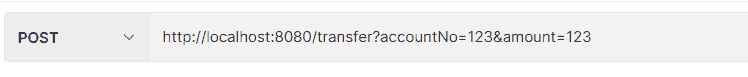
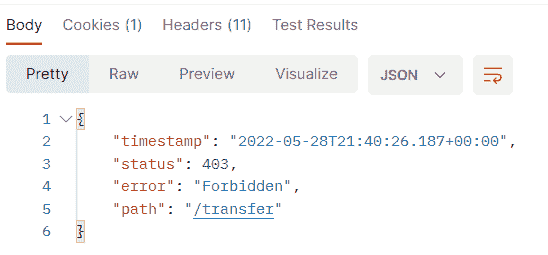
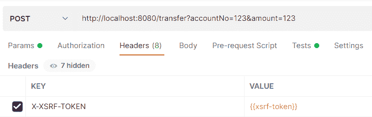
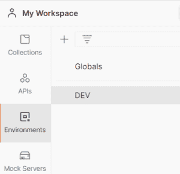
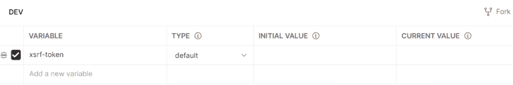
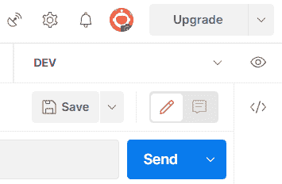
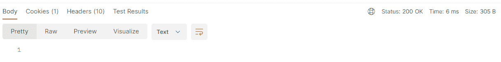

# 从邮递员 REST 客户端发送 CSRF 令牌

> 原文:[https://web . archive . org/web/20220930061024/https://www . bael dung . com/postman-send-csrf-token](https://web.archive.org/web/20220930061024/https://www.baeldung.com/postman-send-csrf-token)

## 1.概观

每次我们测试启用了 CSRF 保护的端点时，我们都必须手动从 cookies 中获取 CSRF 令牌，并将其设置在`X-XSRF-TOKEN`请求头中。如果我们不发送 CSRF 令牌，我们会得到一个`403 Forbidden`错误。

在本教程中，我们将了解如何在使用 Postman 时自动向服务器发送 CSRF 令牌。

## 2.应用程序设置

我们不会讨论如何在 Spring 应用程序中启用 CSRF 保护，我们已经在之前的文章中[讨论过了。](/web/20221006032131/https://www.baeldung.com/spring-security-csrf)

**我们知道，我们可以在客户端的 cookies 中找到 CSRF 令牌，默认情况下，对`POST`、`PUT`和`DELETE` HTTP 动词实施 CSRF 保护。**

此外，为了测试，我们将使用[上一篇](/web/20221006032131/https://www.baeldung.com/spring-security-csrf)文章中的一个端点，一个`POST` 请求，它允许用户向一个账户转账:

`POST http://localhost:8080/transfer?accountNo=1234&amount;=100`

## 3.邮递员

首先，我们将在不考虑 CSRF 令牌的情况下对 Postman 客户机进行测试。之后，我们将运行另一个测试，发送 CSRF 令牌并设置 Postman 自动发送它。

### 3.1.无 CSRF 令牌测试

让我们打开 Postman 并添加一个新请求:

现在，我们在不发送 CSRF 令牌的情况下执行请求，我们得到了`403 Forbidden`错误:

接下来，我们将看看如何解决这个问题。

### 3.2.`X-XSRF-TOKEN`表头属性

在`Headers`选项卡中，让我们添加一个名为`X-XSRF-TOKEN` 的新参数，设置为`xsrf-token.` `X-XSRF-TOKEN`的值是 CSRF 的标题，`xsrf-token` 是一个环境变量，我们将在下面定义:

### 3.3.环境变量`xsrf-token`

现在让我们转到左侧的`Environments`并创建一个名为 DEV 的新环境:

在右侧，让我们定义上面提到的环境变量，名为`xsrf-token.` ,我们将其余字段留空:

让我们回到请求，从右上角选择 DEV 环境，这样我们就可以使用我们定义的环境属性:

### 3.4.脚本

现在让我们点击`Tests`选项卡。我们将在此添加以下脚本:

该脚本检索`XSRF-TOKEN` cookie 的值，并将其分配给环境变量`xsrf-token.`。现在，无论`XSRF-TOKEN`的值来自服务器，都将被传输到`X-XSRF-TOKEN` header 属性。

### 2.5.测试

当我们执行请求时，我们现在得到了`200 OK` 响应:

## 3.结论

在本文中，我们看到了如何测试启用了 CSRF 保护的应用程序的端点。

每次在同一个端点上执行新请求时，我们都使用 Postman 客户端来自动发送 CSRF 令牌。这样效率更高，因为我们不必手动获取 CSRF 令牌并在请求头中设置它。