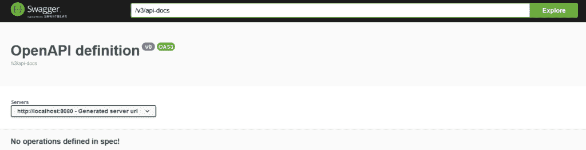
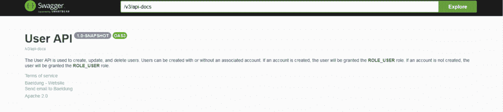
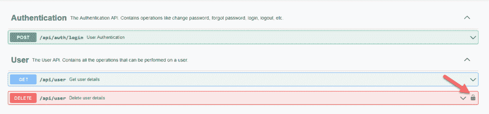
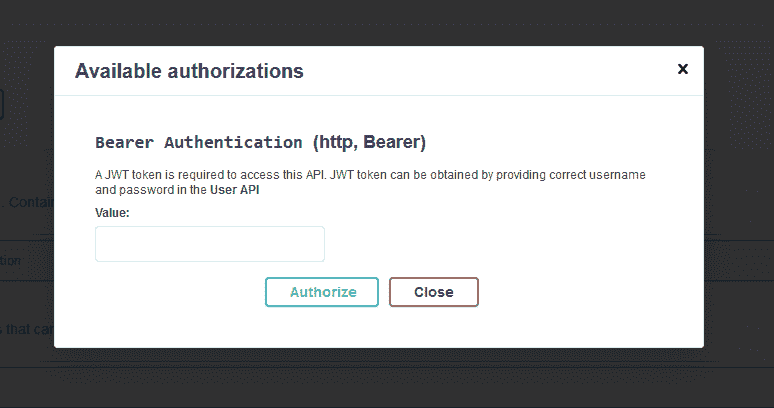
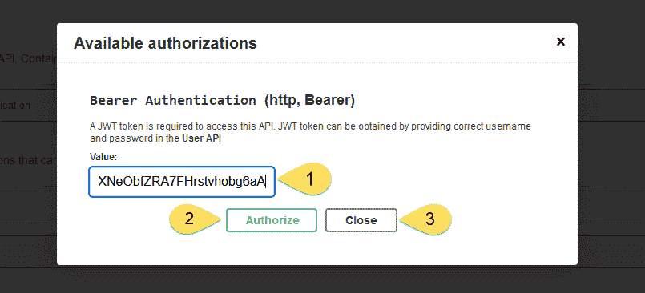
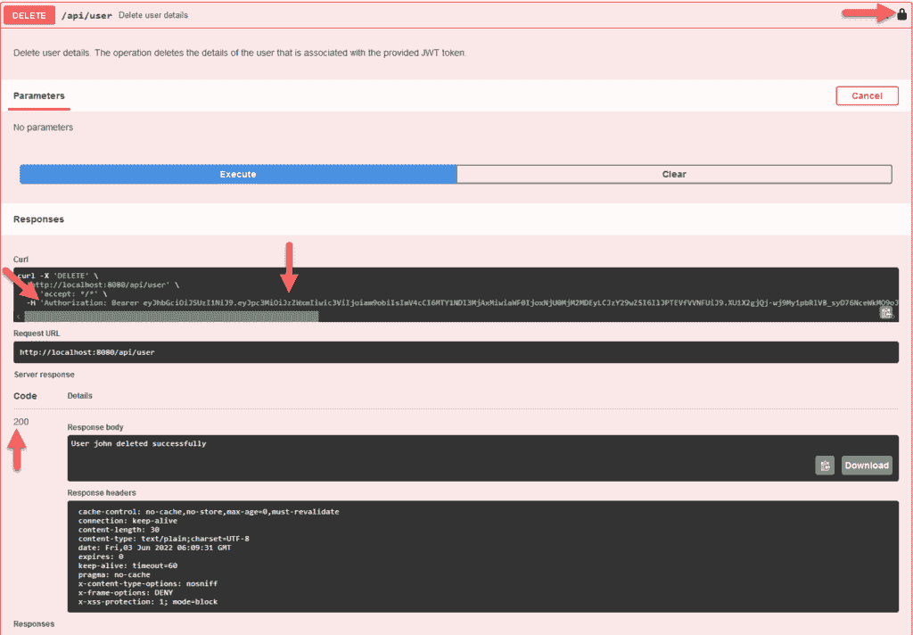
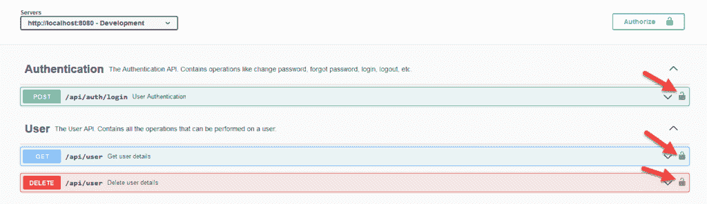
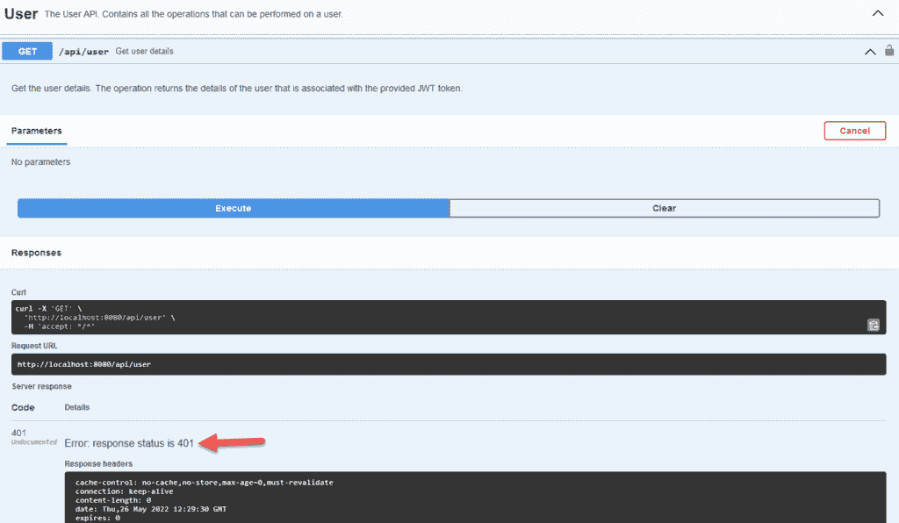
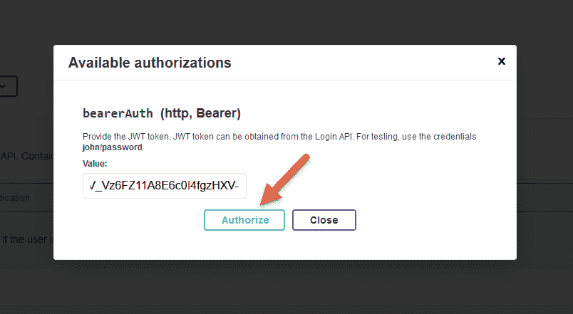
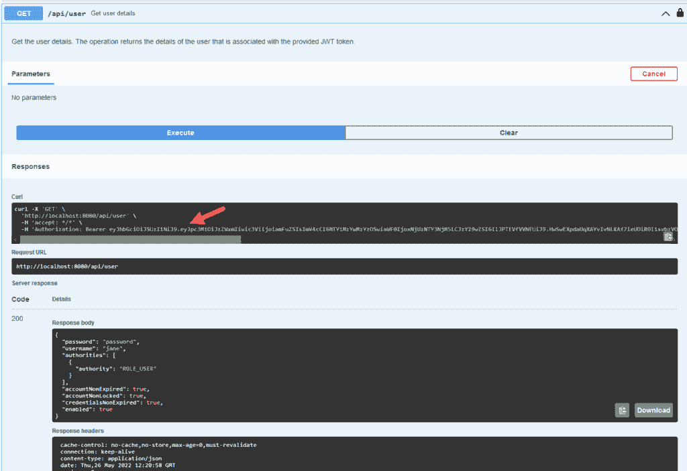

# 为 OpenAPI 配置 JWT 身份验证

> 原文：<https://web.archive.org/web/20220930061024/https://www.baeldung.com/openapi-jwt-authentication>

## 1.概观

OpenAPI 是一个独立于语言和平台的规范，它标准化了 REST APIs。OpenAPI 让用户无需深究代码就能轻松理解 API。 [Swagger-UI](https://web.archive.org/web/20220813175644/https://swagger.io/tools/swagger-ui/) 从这个 OpenAPI 规范中生成一个可视化文档，帮助可视化和测试 REST APIs。

在本教程中，让我们学习如何使用 [Springdoc-OpenAPI](https://web.archive.org/web/20220813175644/https://springdoc.org/) 在 [Spring Boot](/web/20220813175644/https://www.baeldung.com/spring-boot) 应用程序中生成 OpenAPI 文档，测试 REST APIs，并为我们的 OpenAPI 配置 [JWT](https://web.archive.org/web/20220813175644/https://jwt.io/) 认证。

## 2.斯瓦格-UI

Swagger-UI 是 HTML、Javascript 和 CSS 文件的集合，它基于 OpenAPI 规范生成用户界面。**让我们使用 Springdoc-OpenAPI 库来自动生成 REST APIs 的 OpenAPI 文档**，并使用 Swagger-UI 来可视化这些 API。

当应用程序中的 API 数量不断增加时，编写 OpenAPI 文档规范可能会很有挑战性。Springdoc-OpenAPI 帮助我们自动生成 OpenAPI 文档。进一步，让我们尝试使用这个库并生成 OpenAPI 文档。

### 2.1.属国

让我们直接从添加 [Springdoc-OpenAPI](https://web.archive.org/web/20220813175644/https://search.maven.org/search?q=springdoc-openapi-ui) 依赖关系开始:

```
<dependency>
    <groupId>org.springdoc</groupId>
    <artifactId>springdoc-openapi-ui</artifactId>
    <version>1.6.9</version>
</dependency>
```

这种依赖性也将 Swagger-UI web-jars 添加到我们的 Spring Boot 应用程序中。

### 2.2.配置

接下来，让我们启动应用程序并在浏览器中点击 URL `http://localhost:8080/swagger-ui.html` 。

结果，我们得到了 Swagger-UI 页面:

### [](/web/20220813175644/https://www.baeldung.com/wp-content/uploads/2022/06/swagger-1-1.png)

**同样，`OpenAPI v3.0`文档将在`http://localhost:8080/v3/api-docs`可用。**

此外，让我们使用 [`@OpenAPIDefinition`](https://web.archive.org/web/20220813175644/https://docs.swagger.io/swagger-core/v2.2.0/apidocs/io/swagger/v3/oas/annotations/OpenAPIDefinition.html) 为我们的`User`API 添加描述、服务条款和其他元信息:

```
@Configuration
@OpenAPIDefinition(
  info [[email protected]](/web/20220813175644/https://www.baeldung.com/cdn-cgi/l/email-protection)(
    title = "User API",
    version = "${api.version}",
    contact = @Contact(
      name = "Baeldung", email = "[[email protected]](/web/20220813175644/https://www.baeldung.com/cdn-cgi/l/email-protection)", url = "https://www.baeldung.com"
    ),
    license = @License(
      name = "Apache 2.0", url = "https://www.apache.org/licenses/LICENSE-2.0"
    ),
    termsOfService = "${tos.uri}",
    description = "${api.description}"
  ),
  servers = @Server(
    url = "${api.server.url}",
    description = "Production"
  )
)
public class OpenAPISecurityConfiguration {}
```

同样，我们可以[具体化](/web/20220813175644/https://www.baeldung.com/properties-with-spring)配置和元信息。例如在`application.properties`或`application.yaml`文件中定义`api.version`、`tos.uri`、`api.description`。

### 2.3.试验

最后，让我们测试 Swagger-UI 并检查 OpenAPI 文档。

为此，启动应用程序并打开 Swagger-UI 的 URL `http://localhost:8080/swagger-ui/index.html`:

[](/web/20220813175644/https://www.baeldung.com/wp-content/uploads/2022/06/swagger-config.png)

类似地，OpenAPI 文档将在`http://localhost:8080/v3/api-docs`发布:

```
{
    "openapi": "3.0.1",
    "info": {
      "title": "User API",
      "termsOfService": "terms-of-service",
     ...
     ...
} 
```

## 3.JWT 认证

Springdoc-OpenAPI 基于我们的应用程序 REST APIs 生成文档。此外，该文档可以使用 [Springdoc-OpenAPI 注释](/web/20220813175644/https://www.baeldung.com/spring-rest-openapi-documentation)进行定制。

在本节中，让我们学习为 OpenAPIs 配置基于 JWT 的认证。

我们可以为每个操作、类或全局级别的 OpenAPI 配置 JWT 认证。

### 3.1.每个操作的配置

首先，让我们声明 JWT 认证只用于特定的操作。让我们来定义这种配置:

```
@Configuration
@SecurityScheme(
  name = "Bearer Authentication",
  type = SecuritySchemeType.HTTP,
  bearerFormat = "JWT",
  scheme = "bearer"
)
public class OpenAPI30Configuration {}
```

[`@SecurityScheme`](https://web.archive.org/web/20220813175644/https://docs.swagger.io/swagger-core/v2.2.0/apidocs/io/swagger/v3/oas/annotations/security/SecurityScheme.html) 注释将 [`securitySchemes`](https://web.archive.org/web/20220813175644/https://swagger.io/docs/specification/authentication/) 添加到 OneAPI 规范的 [`components`](https://web.archive.org/web/20220813175644/https://swagger.io/docs/specification/components/) 部分。`@SecurityScheme` 定义了我们的 API 可以使用的安全机制。**支持的安全方案有`APIKey`、`HTTP Authentication (Basic and Bearer)`、`OAuth2`和`OpenID Connect`、**。在这种情况下，让我们使用 [`HTTP Bearer Authentication`](https://web.archive.org/web/20220813175644/https://swagger.io/docs/specification/authentication/bearer-authentication/) 作为我们的安全方案。

**对于 HTTP 承载令牌认证，我们需要选择安全方案为`bearerAuth`，承载格式为** `**JWT.**`

因为我们喜欢只保护特定的操作，所以我们需要指定需要认证的操作。对于操作级认证，我们应该使用 [`@SecurityRequirement`](https://web.archive.org/web/20220813175644/https://docs.swagger.io/swagger-core/v2.1.1/apidocs/io/swagger/v3/oas/annotations/security/SecurityRequirement.html) 对操作进行标注:

```
@Operation(summary = "Delete user", description = "Delete user")
@SecurityRequirement(name = "Bearer Authentication")
@DeleteMapping
description = "A JWT token is required to access this API...",
public String deleteUser(Authentication authentication) {}
```

有了这些配置，让我们重新部署应用程序并点击 URL `http://localhost:8080/swagger-ui.html`:

[](/web/20220813175644/https://www.baeldung.com/wp-content/uploads/2022/06/operation.png)

点击 [](/web/20220813175644/https://www.baeldung.com/wp-content/uploads/2022/06/lock.png) 图标，为用户打开一个登录对话框，以提供一个访问令牌来调用操作:

[](/web/20220813175644/https://www.baeldung.com/wp-content/uploads/2022/06/auth-modal.png)

对于这个例子，可以通过向`authentication` API `.` 提供`john/password`或`jane/password` 来获得 JWT 令牌。一旦我们获得 JWT 令牌，我们可以在`value` 文本框中传递它，然后单击`Authorize` 按钮，然后单击`Close`按钮:

[](/web/20220813175644/https://www.baeldung.com/wp-content/uploads/2022/06/Authenticate.png)

有了 JWT 令牌，让我们调用`deleteUser` API:

[](/web/20220813175644/https://www.baeldung.com/wp-content/uploads/2022/06/Delete.png)

结果，我们看到操作将被提供一个 JWT 令牌，如 [](/web/20220813175644/https://www.baeldung.com/wp-content/uploads/2022/06/locked.png) 图标所示，Swagger-UI 在`Authorization`头中提供这个令牌作为 HTTP 承载。最后，有了这个配置，我们可以成功地调用受保护的`deleteUser` API。

到目前为止，我们已经配置了一个操作级安全配置。同样，让我们检查一下 OpenAPI JWT 安全类和全局配置。

### 3.2.类别级配置

类似地，我们可以为一个类中的所有操作提供 OpenAPI 认证。在包含所有 API 的类上声明`@SecurityRequirement` 注释。这样做将为该特定类中的所有 API 提供身份验证:

```
@RequestMapping("/api/user")
@RestController
@SecurityRequirement(name = "bearerAuth")
@Tag(name = "User", description = "The User API. Contains all the operations that can be performed on a user.")
public class UserApi {}
```

因此，该配置实现了类`UserApi`中所有操作的安全性。因此，假设该类有两个操作，Swagger-UI 如下所示:

[](/web/20220813175644/https://www.baeldung.com/wp-content/uploads/2022/06/Per-Class.png)

### 3.3.全局配置

通常，我们更喜欢对应用程序中的所有 API 进行 OpenAPI 认证。**对于这些情况，我们可以使用 Spring `@Bean` 注释**在全局级别声明安全性:

```
@Configuration
public class OpenAPI30Configuration {
@Bean
public OpenAPI customizeOpenAPI() {
    final String securitySchemeName = "bearerAuth";
    return new OpenAPI()
      .addSecurityItem(new SecurityRequirement()
        .addList(securitySchemeName))
      .components(new Components()
        .addSecuritySchemes(securitySchemeName, new SecurityScheme()
          .name(securitySchemeName)
          .type(SecurityScheme.Type.HTTP)
          .scheme("bearer")
          .bearerFormat("JWT")));
    }
}
```

通过这种全局配置，Springdoc-OpenAPI 为应用程序中的所有 OpenAPI 配置 JWT 认证:

[](/web/20220813175644/https://www.baeldung.com/wp-content/uploads/2022/06/Global.png)

让我们试着调用 GET API:

[](/web/20220813175644/https://www.baeldung.com/wp-content/uploads/2022/06/401.png)

最终，我们得到`HTTP 401 Unauthorized.`API 是安全的，我们没有提供 JWT 令牌。接下来，让我们提供 JWT 令牌并检查行为。

点击`Authorize` 按钮并提供 JWT 令牌来调用操作。我们可以从 swagger 控制台中可用的身份验证 API 获得不记名令牌:

[](/web/20220813175644/https://www.baeldung.com/wp-content/uploads/2022/06/Authentication-Token.png)

最后，配置好 JWT 令牌后，让我们重新调用 API:

[](/web/20220813175644/https://www.baeldung.com/wp-content/uploads/2022/06/Authentication-Success.png)

此时，使用正确的 JWT 令牌，我们可以成功地调用我们的安全 API。

## 4.结论

在本教程中，我们学习了如何为我们的 OpenAPIs 配置 JWT 认证。Swagger-UI 提供了一个工具来记录和测试基于 OneAPI 规范的 REST APIs。Swaggerdoc-OpenAPI 工具帮助我们基于 REST APIss 生成这个规范，REST API 是我们的 Spring Boot 应用程序的一部分。

和往常一样，完整的源代码可以在 GitHub 上找到[。](https://web.archive.org/web/20220813175644/https://github.com/eugenp/tutorials/tree/master/spring-boot-modules/spring-boot-springdoc)