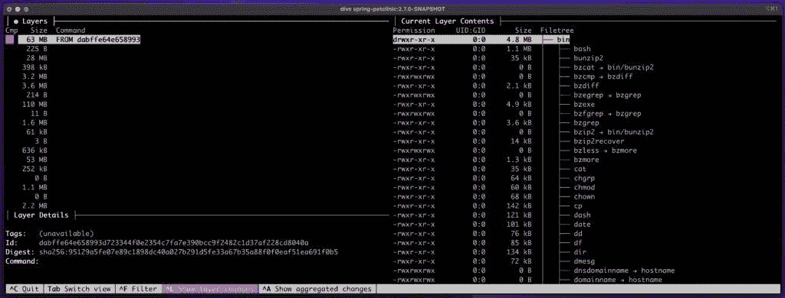
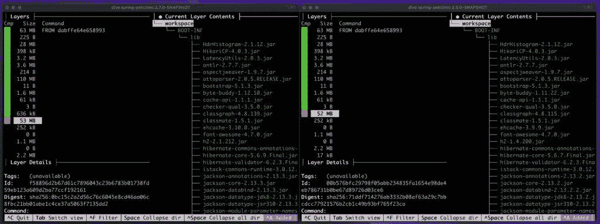

# 显示两个 Docker 图像之间的差异

> 原文：<https://web.archive.org/web/20220930061024/https://www.baeldung.com/ops/docker-differences-between-images>

## 1.概观

随着越来越多的应用程序使用 [Docker](/web/20220810171619/https://www.baeldung.com/ops/docker-guide) 部署，我们有必要了解其生态系统的一些基本原则。虽然可用的工具使得打包和部署应用程序变得很容易，**在某些时候，我们可能需要对我们部署的某些方面进行故障排除**。

调试部署最常见的任务之一是检查和比较映像。在本教程中，我们将看看 Docker 图像的结构，以及如何看到两个图像之间的差异。

## 2.关于 Docker 图像

作为一些背景， **Docker 图片是如何创建容器**的说明。我们可以把它们看作是在容器中运行应用程序所需的一整套文件和目录。这包括操作系统、第三方库和我们的应用程序代码。

在幕后，这些[图像](/web/20220810171619/https://www.baeldung.com/ops/docker-images-vs-containers)本质上只是 tar 文件。当构建图像时，我们在其中创建不同的层。每一层都是文件和目录的集合。

典型地，我们从一个现有的图像开始，然后添加到它上面。例如，要构建一个作为映像的 [Spring Boot 应用程序](/web/20220810171619/https://www.baeldung.com/spring-boot)，我们将从一个现有的 [OpenJDK Docker 映像](https://web.archive.org/web/20220810171619/https://hub.docker.com/_/eclipse-temurin/)开始。这包含运行任何 Java 应用程序所需的操作系统和 JDK 文件。从那里，我们将添加我们自己的 Java 文件，通常是应用程序的 fat jar，以及任何需要的第三方库。

在构建结束时，我们有一个包含运行应用程序所需的所有文件的单一映像。接下来，我们将看看如何检查一个单一的图像。

## 3.检查 Docker 图像

有几种不同的方法来检查图像。让我们从找到本地回购中的所有图像开始:

[PRE0]

有了可用图像的列表，我们现在可以查看一个特定的图像。

我们可以做的第一件事是运行`inspect`命令:

[PRE1]

这个命令为我们提供了关于图像的许多细节，包括它是何时创建的，它内部的不同层等等。

然而，它并没有告诉我们太多关于里面的内容。为此，我们必须首先将映像保存到文件系统:

[PRE2]

该命令将图像保存为 tar 文件。现在我们可以使用熟悉的 [`tar`命令](/web/20220810171619/https://www.baeldung.com/linux/tar-command)来检查它:

[PRE3]

根据我们要寻找的信息,`tar`命令可以从图像中列出并提取特定的文件。

## 4.显示两个 Docker 图像之间的差异

到目前为止，我们已经了解了图像的结构以及如何检查它。**接下来，让我们看看如何比较两幅图像并找出它们的差异**。

根据我们想要比较的信息，有不同的工具可以提供帮助。正如我们在上面看到的，内置的`image`命令可以给我们尺寸和日期信息。

**但是如果要比较两张图片的内容，就需要使用第三方工具**。下面，我们来看看其中的几个。

### 4.1.集装箱差异

谷歌的 container-diff 就是这样一个工具。尽管它的名字，它可以比较两个图像的各个方面，并提供一个格式良好的报告。

例如，让我们比较前面示例中的两张 Spring pet clinic 图像:

[PRE4]

这给了我们每个图像的文件的差异。

输出通常分为三个部分。首先，它告诉我们哪些文件存在于第一个映像中，而不存在于第二个映像中:

[PRE5]

接下来，它告诉我们哪些文件存在于第二个映像中，而不存在于第一个映像中:

[PRE6]

在这种情况下，这两个部分结合起来可以非常快速地告诉我们应用程序的每个版本之间的依赖关系是如何变化的。

最后，最后一部分说明了两者中存在哪些文件，但它们是不同的:

[PRE7]

这一部分使得识别在两个版本之间发生变化的任何特定的类和属性文件变得非常容易。

### 4.2.跳水

另一个检查 Docker 图片的开源工具是 [dive](https://web.archive.org/web/20220810171619/https://github.com/wagoodman/dive) 。用`dive`检查图像给了我们一个更传统的内容视图，因为**知道如何检查图像**内部的每一层。这允许它使用传统的文件系统树来呈现每个映像:

使用键盘，我们可以浏览图像的每一层，并准确地看到它添加、修改或删除了哪些文件。

虽然`dive`工具本身不支持比较图像，但我们可以通过在两个终端上并排运行它来手动完成这项工作:

通过这种方式，我们可以看到哪些层是相同的(基于大小)，对于不同的层，我们可以看到哪些文件是不同的。

## 5.结论

在本文中，我们研究了 Docker 图像的结构，并看到了检查它们的各种方法。虽然 Docker 客户端包含一些用于检查单幅图像的工具，**比较两幅图像需要使用第三方工具**。

谷歌的`container-diff`是一个专门用于比较图像的选项。虽然`dive`实用程序对于检查单个图像的图层非常有用，但是它也可以通过简单地同时对两个图像运行它来识别差异。