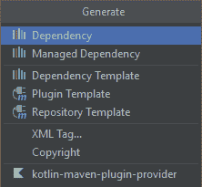
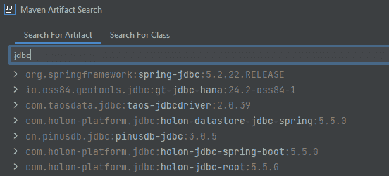
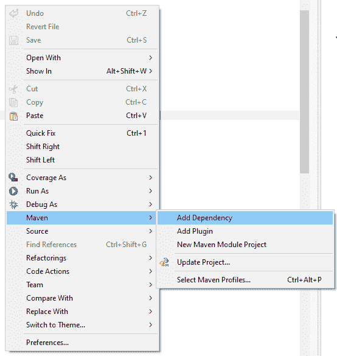
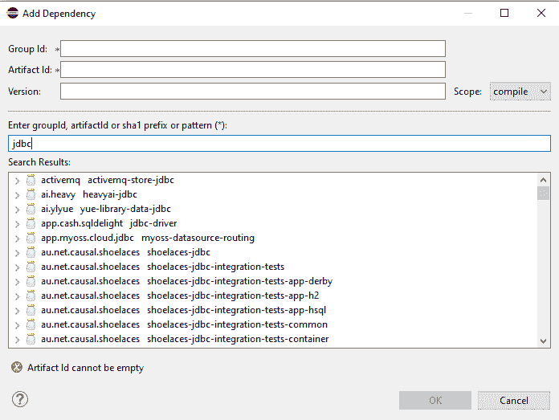
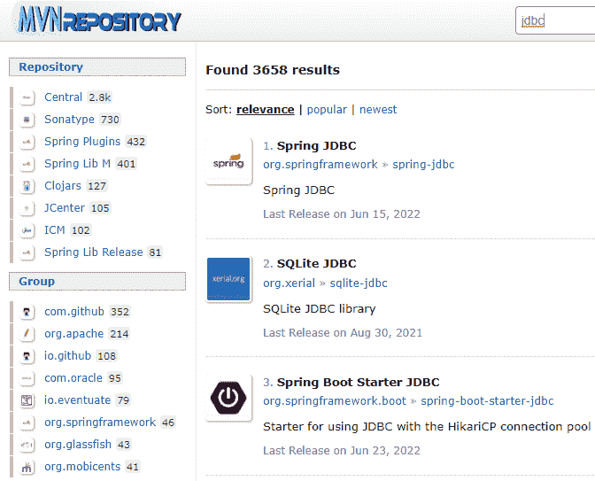

# 如何找到 Maven 依赖项

> 原文：<https://web.archive.org/web/20220930061024/https://www.baeldung.com/java-find-maven-dependencies>

## 1.介绍

[Maven](/web/20220821093918/https://www.baeldung.com/maven) 是一个项目管理和理解工具。它基于项目对象模型的概念，也称为 POM。使用 POM 作为中心信息，Maven 可以管理项目的构建、报告和文档。

Maven 的很大一部分是依赖管理。大多数开发人员在开发应用程序时都会使用 Maven 的这一特性。

Maven 卓越的依赖性管理提供了自动更新和依赖性关闭。公司使用 Maven 进行依赖管理的另一种方式是使用定制的中央存储库。通过这样做，开发人员可以使用他们自己对公司内其他项目的依赖。

在本教程中，我们将学习如何找到 Maven 依赖项。

## 2.什么是 Maven 依赖

在 Maven 的上下文中，依赖关系只是一个 Java 应用程序使用的 JAR 文件。基于 POM 文件，Maven 将下载 JAR 文件并将其添加到我们的 Java 路径中。然后 Java 将能够找到并使用 JAR 文件中的类。

**还需要注意的是， [Maven 有一个本地存储库，它在那里下载所有的依赖项](/web/20220821093918/https://www.baeldung.com/maven-local-repository)** 。默认情况下，这位于`{user home folder}/.m2/repository`中。

## 3.POM 文件

POM 文件使用 XML 语法，所有内容都在标记之间。

默认情况下，POM 文件只包含我们的项目信息。为了添加我们的项目将使用的依赖项，我们需要添加`dependencies`部分:

[PRE0]

**这仅在我们手动编辑 POM 文件**时需要。

## 4.寻找 Maven 依赖项的方法

当处理一个新项目或者添加一个新特性时，我们可能会意识到我们需要向我们的项目添加一个新的依赖项。让我们举一个简单的例子，我们需要添加 JDBC 依赖。

根据我们的 IDE 和设置，有不同的方法可以找到 JDBC 依赖项所需的细节。

### 4.1\. IntelliJ

如果我们使用 IntelliJ IDEA，我们可以通过几个步骤向项目的 POM 添加一个新的依赖项。

首先，我们打开 POM 文件，然后按 ALT+INSERT，然后点击依赖选项: 

然后，我们可以搜索需要的依赖项，并点击添加: 

### 4.2.黯然失色

Eclipse IDE 使用与 IntelliJ 相似的方法来添加新的依赖项。

我们需要在包资源管理器中或者打开文件后右键单击 POM 文件，然后我们转到 Maven -> Add dependency 选项:

Then, we can search for the needed dependency and click OK:

### 4.3.互联网搜索

**如果我们同意手动编辑 POM 文件，那么我们可以简单地在[search.maven.org](https://web.archive.org/web/20220821093918/https://search.maven.org/)或谷歌上搜索以找到依赖关系**的所有细节。

当进入**[【search.maven.org】](https://web.archive.org/web/20220821093918/https://search.maven.org/)**时，我们可以简单地在搜索栏中输入依赖项，我们会找到大量依赖项的版本。除非我们的项目中有其他限制，否则我们应该使用最新的稳定版本:

在我们的 POM 文件中，在 dependency 部分，简单地粘贴找到的依赖细节。

[PRE1]

还有很多类似于**[【search.maven.org】](https://web.archive.org/web/20220821093918/https://search.maven.org/)**的其他网站可供我们使用和探索。

## 5.结论

在本教程中，我们看到了向我们的项目添加 Maven 依赖项的不同方法。

我们还学习了如何编辑 POM 文件，以便让 Maven 下载并使用添加的依赖项。